# Spec Kit walkthrough: building five-in-a-row from seeds to tested code

> Software-engineering module, companion to Lecture 03 and to this demo folder's
> [`README.md`](../README.md). A tutorial for students who have not used GitHub Spec Kit
> before: how Spec Kit is implemented, what `specify init` puts into a project, how its
> greenfield workflow runs, and a step-by-step reading of one recorded session in which
> Spec Kit and Claude Code took the five-in-a-row game from three seed documents to a
> working, tested program. Self-contained; every file it discusses is in this folder and
> linked.

**What you need.** Nothing, to read. To run what is described: Claude Code, Python 3.12
or later, and [`uv`](https://docs.astral.sh/uv/). To replay the session: Spec Kit itself
(Section 2.1).

**Version note.** The session used Spec Kit **1.1.1**, initialized for Claude Code in
*skills* mode with *Python* helper scripts and with no git extension installed. Those
three facts shape several details below (the command names are `/speckit-…` with a hyphen,
no git branch is created per feature, the helpers are `.py` files). Later Spec Kit
releases add commands and may change defaults; where this tutorial describes a mechanism,
it describes the one installed in this folder, which you can read for yourself.

**How to read this tutorial.** Sections 1 to 3 explain the tool. Sections 4 to 10 walk
through the nine recorded steps in order, each with the same skeleton: the seed material
the developer supplied (when there was one), the exact prompt, the agent's end-of-step
report quoted in full, the artifacts the step produced, and a walkthrough of what matters
in them. Sections 11 to 16 look at the result, at what was not used, and at how the
session relates to the rest of the course. The appendices are reference tables.

Conventions used throughout:

- **Developer** and **Agent** blocks reproduce the session transcript
  ([`session-transcript.md`](../specs/001-five-in-a-row/transcript/session-transcript.md))
  word for word. The developer's prompt is shown in a fenced `text` block; the agent's
  report is shown as a block quote. The only change made to quoted agent text is that
  Markdown headings inside a report (the two analysis reports have them) are shown as
  bold lines, so that the tutorial's own heading structure stays readable.
- The transcript records what the developer typed and the agent's final message for each
  request. It omits the skill text the agent was following, the agent's tool calls (file
  reads and writes, shell commands, test runs), and intermediate progress notes. Where
  this tutorial shows something the transcript omits, such as the JSON a helper script
  prints, it is reconstructed from the script's source and labelled as such.
- Commit hashes in the quoted agent text are those of the private repository where the
  session ran. The body of this tutorial uses the public hashes of this repository;
  Appendix B maps one to the other, as does the demo README.
- Paths are relative to the demo folder unless they start with `../`, which from the
  tutorial's own location means the demo folder. Links to Markdown files use heading
  anchors; links to code use line ranges.

The transcript's own statement of scope (lines 5 to 7) is worth keeping in mind:

> **What is shown:** everything the developer typed, the agent's questions and the developer's answers, and the agent's final message for each request — for each Spec Kit command, the report it produced at the end.
>
> **What is omitted:** the text of each Spec Kit command (the skill instructions the agent receives), the agent's tool calls and their output (file reads, edits, shell commands, test runs), intermediate progress notes, and session metadata. The seed documents the developer referenced (`ASE-seed-development-rules.md`, `ASE-seed-conops.md`) are not reproduced in the transcript; they are in this demo's `demo-seeds/` folder, and the artifacts produced from them are in this feature folder.

This tutorial fills in exactly the two omissions a newcomer needs most: the skill text,
and the seed documents.

## Contents

- [1. What Spec Kit is and how it is implemented](#1-what-spec-kit-is-and-how-it-is-implemented)
  - [1.1 Spec-driven development in one paragraph](#11-spec-driven-development-in-one-paragraph)
  - [1.2 A CLI that installs files; an agent that reads them](#12-a-cli-that-installs-files-an-agent-that-reads-them)
  - [1.3 The layers: skills, scripts, templates, memory, metadata](#13-the-layers-skills-scripts-templates-memory-metadata)
  - [1.4 Anatomy of one skill run](#14-anatomy-of-one-skill-run)
  - [1.5 Where state lives](#15-where-state-lives)
  - [1.6 How the templates constrain the agent](#16-how-the-templates-constrain-the-agent)
- [2. Installing Spec Kit and what `specify init` produced](#2-installing-spec-kit-and-what-specify-init-produced)
  - [2.1 Installing and initializing](#21-installing-and-initializing)
  - [2.2 The 36 files, by group](#22-the-36-files-by-group)
  - [2.3 Template tour](#23-template-tour)
  - [2.4 Script tour](#24-script-tour)
  - [2.5 What was not there yet](#25-what-was-not-there-yet)
- [3. The greenfield workflow](#3-the-greenfield-workflow)
  - [3.1 Seven steps used, three not used](#31-seven-steps-used-three-not-used)
  - [3.2 What each step reads and writes](#32-what-each-step-reads-and-writes)
  - [3.3 The document hierarchy, and why edit order matters](#33-the-document-hierarchy-and-why-edit-order-matters)
  - [3.4 Who commits](#34-who-commits)
  - [3.5 The session at a glance](#35-the-session-at-a-glance)
- [4. Steps 1 and 2: `/speckit-constitution`](#4-steps-1-and-2-speckit-constitution)
  - [4.1 The seed: development rules](#41-the-seed-development-rules)
  - [4.3 Run 2: amending to version 1.0.1](#43-run-2-amending-to-version-101)
  - [4.4 The constitution, section by section](#44-the-constitution-section-by-section)
  - [4.5 Reading the constitution as the course reads it](#45-reading-the-constitution-as-the-course-reads-it)
- [5. Step 3: `/speckit-specify`](#5-step-3-speckit-specify)
  - [5.1 The seed: a concept-of-operations sketch](#51-the-seed-a-concept-of-operations-sketch)
  - [5.2 Prompt and reports](#52-prompt-and-reports)
  - [5.3 Artifacts produced, and what the skill did without a script](#53-artifacts-produced-and-what-the-skill-did-without-a-script)
  - [5.4 Walkthrough of `spec.md`](#54-walkthrough-of-specmd)
  - [5.5 The quality gate](#55-the-quality-gate)
  - [5.6 The CHANGELOG as the constitution's record](#56-the-changelog-as-the-constitutions-record)
- [6. Step 4: `/speckit-clarify`](#6-step-4-speckit-clarify)
  - [6.1 Prompt and the three exchanges](#61-prompt-and-the-three-exchanges)
  - [6.2 Artifacts produced](#62-artifacts-produced)
  - [6.3 How the skill works](#63-how-the-skill-works)
  - [6.4 Division of labor in this step](#64-division-of-labor-in-this-step)
- [7. Step 5: `/speckit-plan`](#7-step-5-speckit-plan)
  - [7.1 The seed: a direction for the plan](#71-the-seed-a-direction-for-the-plan)
  - [7.2 Prompt and reports](#72-prompt-and-reports)
  - [7.3 Artifacts produced, and the mechanism](#73-artifacts-produced-and-the-mechanism)
  - [7.4 Walkthrough of `plan.md`](#74-walkthrough-of-planmd)
  - [7.5 Walkthrough of `research.md`](#75-walkthrough-of-researchmd)
  - [7.6 Proposal P1, or Principle IV in action](#76-proposal-p1-or-principle-iv-in-action)
  - [7.7 The data model and the contracts](#77-the-data-model-and-the-contracts)
  - [7.8 The quickstart](#78-the-quickstart)
  - [7.9 Aside: the Python cache and the project `.gitignore`](#79-aside-the-python-cache-and-the-project-gitignore)
- [8. Step 6: `/speckit-tasks`](#8-step-6-speckit-tasks)
  - [8.1 Prompt and report](#81-prompt-and-report)
  - [8.2 The artifact and the mechanism](#82-the-artifact-and-the-mechanism)
  - [8.3 Where the constitution overrode the template](#83-where-the-constitution-overrode-the-template)
  - [8.4 Departures the agent reported](#84-departures-the-agent-reported)
  - [8.5 Fixed positions as fixtures](#85-fixed-positions-as-fixtures)
- [9. Steps 7 and 8: `/speckit-analyze`](#9-steps-7-and-8-speckit-analyze)
  - [9.1 Run 1: prompt and report](#91-run-1-prompt-and-report)
  - [9.2 The report file and the edits](#92-the-report-file-and-the-edits)
  - [9.3 Run 2](#93-run-2)
  - [9.4 What analyze is, and is not](#94-what-analyze-is-and-is-not)
- [10. Step 9: `/speckit-implement`](#10-step-9-speckit-implement)
  - [10.1 Prompt, the commit question, and the final report](#101-prompt-the-commit-question-and-the-final-report)
  - [10.2 What the skill does](#102-what-the-skill-does)
  - [10.3 The seven commits](#103-the-seven-commits)
  - [10.4 What still needed a person, and what the documents had not said](#104-what-still-needed-a-person-and-what-the-documents-had-not-said)
- [11. The result: code and evidence](#11-the-result-code-and-evidence)
  - [11.1 The package](#111-the-package)
  - [11.2 The dependency rule and its test](#112-the-dependency-rule-and-its-test)
  - [11.3 Tagged tests and the conformance report](#113-tagged-tests-and-the-conformance-report)
  - [11.4 Running it](#114-running-it)
  - [11.5 What the evidence does and does not establish](#115-what-the-evidence-does-and-does-not-establish)
- [12. Commands installed but not used](#12-commands-installed-but-not-used)
  - [12.1 `/speckit-checklist`](#121-speckit-checklist)
  - [12.2 `/speckit-converge`](#122-speckit-converge)
  - [12.3 `/speckit-taskstoissues`](#123-speckit-taskstoissues)
  - [12.4 Also installed, also unused](#124-also-installed-also-unused)
- [13. Relation to Lecture 03 and to the catalog of specification kinds](#13-relation-to-lecture-03-and-to-the-catalog-of-specification-kinds)
  - [13.1 Same game, two routes](#131-same-game-two-routes)
  - [13.2 The Spec Kit artifacts in the course's catalog](#132-the-spec-kit-artifacts-in-the-courses-catalog)
  - [13.3 What differs in method](#133-what-differs-in-method)
- [14. Division of labor: who decided what](#14-division-of-labor-who-decided-what)
  - [14.1 Every decision in the session](#141-every-decision-in-the-session)
  - [14.2 Principles III and IV in action](#142-principles-iii-and-iv-in-action)
  - [14.3 Agent-written reasons recorded as developer decisions](#143-agent-written-reasons-recorded-as-developer-decisions)
  - [14.4 Commits as the developer's act](#144-commits-as-the-developers-act)
- [15. Pitfalls and variations](#15-pitfalls-and-variations)
  - [15.1 Pitfalls to expect](#151-pitfalls-to-expect)
  - [15.2 Variations](#152-variations)
- [16. Try it yourself](#16-try-it-yourself)
  - [16.1 Read the history](#161-read-the-history)
  - [16.2 Run the helper scripts by hand](#162-run-the-helper-scripts-by-hand)
  - [16.3 Run the evidence and the game](#163-run-the-evidence-and-the-game)
  - [16.4 Replay the session from scratch](#164-replay-the-session-from-scratch)
  - [16.5 Exercises](#165-exercises)
- [Questions to think about](#questions-to-think-about)
- [Appendix A. Command → skill → script → template → artifacts](#appendix-a-command--skill--script--template--artifacts)
- [Appendix B. Commit map](#appendix-b-commit-map)
- [Appendix C. Transcript index](#appendix-c-transcript-index)
- [Appendix D. Spec Kit vocabulary](#appendix-d-spec-kit-vocabulary)
- [Appendix E. Sources and licenses](#appendix-e-sources-and-licenses)

## 1. What Spec Kit is and how it is implemented

### 1.1 Spec-driven development in one paragraph

[GitHub Spec Kit](https://github.com/github/spec-kit) is a toolkit for what its authors
call spec-driven development: a feature is first written down as a specification of what
it must do and why, then as a plan of how it will be built, then as a list of tasks, and
only then as code. Each of those documents is produced by an agent command and is read by
the next command in the chain. A project-wide *constitution*, written once, states the
rules every later document must obey. The developer's job is to supply the inputs, answer
the questions the commands raise, and decide at each gate whether the document just
produced is right before the next command runs. In the vocabulary of this course, the
specification and the plan are governing documents, the code is the realization, and the
tests are evidence of conformance; Spec Kit adds a fixed sequence of commands and a fixed
set of document templates to that picture.

### 1.2 A CLI that installs files; an agent that reads them

The most useful thing to understand about Spec Kit is how little of it is a program. The
`specify` command-line tool (a Python package, `specify-cli`) does one job: it copies a
set of files into your project. After that, the CLI is not in the loop. Every Spec Kit
command you run afterwards, such as `/speckit-plan`, is a Markdown file that your coding
agent reads and follows. The agent does the work: it runs a small helper script to find
the right folders, reads the templates and the documents produced so far, and writes the
next document.



This design has consequences you can check directly in this folder:

- The procedure for each command is readable. Open
  [`.claude/skills/speckit-plan/SKILL.md`](../.claude/skills/speckit-plan/SKILL.md) and you
  are reading the whole of what the agent is told to do when you type `/speckit-plan`.
- The executable part is small. Six Python scripts under
  [`.specify/scripts/python/`](../.specify/scripts/python/) locate the feature folder,
  copy templates, and print JSON. They contain no knowledge of the game and no calls to a
  language model.
- The documents are constrained by templates. The agent fills
  [`.specify/templates/spec-template.md`](../.specify/templates/spec-template.md) rather
  than inventing a structure, so every Spec Kit specification has the same sections.
- Everything is version-pinned and editable. The installed files are recorded with
  checksums in manifests (Section 1.5), and a project may override any template.

### 1.3 The layers: skills, scripts, templates, memory, metadata

| Layer | Where | Count | What it is |
|---|---|---:|---|
| Skills | [`.claude/skills/speckit-*/SKILL.md`](../.claude/skills/) | 10 | One Markdown file per command. The procedure the agent follows, with the developer's text substituted for `$ARGUMENTS`. |
| Scripts | [`.specify/scripts/python/`](../.specify/scripts/python/) (and bash twins in [`scripts/bash/`](../.specify/scripts/bash/)) | 6 + 6 | Deterministic helpers: find the project root and the feature folder, resolve a template, print one line of JSON for the agent to parse. |
| Templates | [`.specify/templates/`](../.specify/templates/) | 5 | Skeletons for the constitution, the specification, the plan, the task list, and custom checklists, with instructions to the agent embedded as comments and placeholders. |
| Memory | [`.specify/memory/constitution.md`](../.specify/memory/constitution.md) | 1 | The project constitution. Installed as a copy of the template; filled in by `/speckit-constitution`. |
| Metadata | [`.specify/init-options.json`](../.specify/init-options.json), [`integration.json`](../.specify/integration.json), [`integrations/`](../.specify/integrations/), [`workflows/`](../.specify/workflows/) | 7 | What was installed, with which options, with checksums; plus one bundled workflow definition. |

**Skills.** A skill is a folder containing a `SKILL.md` file with YAML front matter and a
body of instructions; Claude Code discovers skills under `.claude/skills/` and exposes
each as a slash command named after the folder. (Lecture 06 covers what a skill is and
how the harness runs one; see
[`lecture-06-agent-skills-packaging-a-method.md`](../../../lecture-notes/lecture-06-agent-skills-packaging-a-method.md).)
The front matter of the plan skill reads:

```yaml
---
name: "speckit-plan"
description: "Execute the implementation planning workflow using the plan template to generate design artifacts."
argument-hint: "Optional guidance for the planning phase"
compatibility: "Requires spec-kit project structure with .specify/ directory"
metadata:
  author: "github-spec-kit"
  source: "templates/commands/plan.md"
user-invocable: true
disable-model-invocation: false
---
```

Two fields matter for understanding the install. `metadata.source` says the skill was
generated from a *command template* in the Spec Kit repository; the same template is what
older installs placed under `.claude/commands/` as a slash command. `user-invocable: true`
is why the command appears in Claude Code's command list.

Every skill body starts the same way:

````markdown
## User Input

```text
$ARGUMENTS
```

You **MUST** consider the user input before proceeding (if not empty).
````

Whatever the developer types after the command name replaces `$ARGUMENTS`. In this
session that was a file reference (`@../ASE-seed-conops.md`), a sentence, or nothing.

**Scripts.** The six Python scripts and their roles:

| Script | Called by | What it does |
|---|---|---|
| [`common.py`](../.specify/scripts/python/common.py) | the other five | Finds the project root (the nearest ancestor containing `.specify/`), resolves the feature folder, resolves templates through the override stack, reads the invoke separator. |
| [`resolve_template.py`](../.specify/scripts/python/resolve_template.py) | `/speckit-constitution` | Prints a named template's content, as JSON with `--json`. |
| [`setup_plan.py`](../.specify/scripts/python/setup_plan.py) | `/speckit-plan` | Copies `plan-template.md` to `plan.md` if it does not exist; prints the feature paths. |
| [`setup_tasks.py`](../.specify/scripts/python/setup_tasks.py) | `/speckit-tasks` | Checks `plan.md` and `spec.md` exist; lists which optional design documents are present; prints the tasks template content. |
| [`check_prerequisites.py`](../.specify/scripts/python/check_prerequisites.py) | `/speckit-clarify`, `/speckit-analyze`, `/speckit-implement`, `/speckit-checklist`, `/speckit-converge`, `/speckit-taskstoissues` | Validates which documents exist (flags choose which are required) and prints the feature paths and the list of available documents. |
| [`create_new_feature.py`](../.specify/scripts/python/create_new_feature.py) | no skill in this install | Creates the next `specs/NNN-name/` folder from a description. In 1.1.1 the specify skill does this itself (Section 5.3), and branch creation belongs to an optional git extension. |

The bash twins under `scripts/bash/` are functionally identical and were installed because
Spec Kit ships both; `init-options.json` records `"script": "py"`, so every skill in this
folder calls the Python version.

**Templates.** Section 2.3 walks through the five templates. For now, note that a template
is also a prompt: its HTML comments and bracketed placeholders are instructions to the
agent, and its headings fix what the finished document must contain.

### 1.4 Anatomy of one skill run

Take `/speckit-plan`, the fifth step of the session, as the worked example. The sequence
below is what the skill text instructs; the transcript records only the first and last
messages.


1. **Argument substitution.** The developer typed `/speckit-plan The plan should address
   the engine module, …`. Claude Code loads the skill file and the sentence becomes
   `$ARGUMENTS`.
2. **Hook check.** Every skill carries a pre-execution block (lines 22 to 56 of the plan
   skill) that looks for `.specify/extensions.yml` and runs any hooks registered there.
   That file does not exist in this project, so the block ends with "skip silently". The
   same check runs again after the main work. This is the extension mechanism that, with
   the git extension installed, would create a branch per feature; here it does nothing.
3. **Setup script.** The skill's outline (lines 58 to 70) begins:

   > 1. **Setup**: Run `python3 .specify/scripts/python/setup_plan.py --json` from repo root and parse JSON for FEATURE_SPEC, IMPL_PLAN, FEATURE_DIR, BRANCH. […]
   >
   > 2. **Load context**: Read FEATURE_SPEC and `.specify/memory/constitution.md`. Load IMPL_PLAN template (already copied).
   >
   > 3. **Execute plan workflow**: Follow the structure in IMPL_PLAN template to:
   >    - Fill Technical Context (mark unknowns as "NEEDS CLARIFICATION")
   >    - Fill Constitution Check section from constitution
   >    - Evaluate gates (ERROR if violations unjustified)
   >    - Phase 0: Generate research.md (resolve all NEEDS CLARIFICATION)
   >    - Phase 1: Generate data-model.md, contracts/, quickstart.md
   >    - Re-evaluate Constitution Check post-design

   The script ([`setup_plan.py`](../.specify/scripts/python/setup_plan.py#L49-L89))
   resolves the feature paths, creates the feature folder if needed, copies the plan
   template to `plan.md` *only if no `plan.md` exists*, and prints one line of JSON.
   Reconstructed from the source, with the paths this project would produce, the line is:

   ```json
   {"FEATURE_SPEC":"…/specs/001-five-in-a-row/spec.md","IMPL_PLAN":"…/specs/001-five-in-a-row/plan.md","FEATURE_DIR":"…/specs/001-five-in-a-row","BRANCH":"001-five-in-a-row"}
   ```

   The `BRANCH` value deserves a note. The scripts do not ask git for the current branch;
   [`get_current_branch()`](../.specify/scripts/python/common.py#L79-L80) returns the
   `SPECIFY_FEATURE` environment variable or an empty string, and
   [`get_feature_paths()`](../.specify/scripts/python/common.py#L176-L177) then falls back
   to the feature folder's name. That is why `spec.md` and `plan.md` both carry a
   "Branch: `001-five-in-a-row`" header for a branch that never existed, a point the
   analysis step later flagged as finding I6 (Section 9).
4. **Reading.** The agent reads the specification, the constitution, and the copied
   template. Nothing else is prescribed; the agent may read whatever else it judges
   relevant, and in this session it also read the clarify session's coverage table and
   the earlier prototypes' conventions.
5. **Writing.** The skill's "Phases" section (lines 111 to 158) defines Phase 0
   (`research.md`, one Decision / Rationale / Alternatives entry per unknown) and Phase 1
   (`data-model.md`, `contracts/`, `quickstart.md`), and says the command "ends after
   Phase 1 design". Tasks are explicitly not this command's job.
6. **Completion report.** "Report branch, IMPL_PLAN path, and generated artifacts" (line
   109). The agent's report in Section 7.2 is its reading of that instruction.

The other skills follow the same shape with a different script and different reading and
writing lists; Appendix A tabulates them.

### 1.5 Where state lives

Spec Kit keeps very little state, and it helps to know where each piece is.

**`.specify/feature.json`** is the pointer to the current feature folder. The specify
skill writes it (`{"feature_directory": "specs/001-five-in-a-row"}`) and every later
script reads it through
[`get_feature_paths()`](../.specify/scripts/python/common.py#L137-L190), unless the
`SPECIFY_FEATURE_DIRECTORY` environment variable overrides it. It is listed in
[`.specify/.gitignore`](../.specify/.gitignore), whose header explains why: "Machine-local
Spec Kit state — not meant to be shared." A consequence for anyone cloning this folder:
`feature.json` is absent, so `/speckit-plan` and the rest will report "Feature directory
not found" until you either re-run `/speckit-specify` or set the environment variable
(Section 16.2 shows the command).

**`.specify/init-options.json`** records how the project was initialized:

```json
{
  "ai": "claude",
  "ai_skills": true,
  "feature_numbering": "sequential",
  "here": false,
  "integration": "claude",
  "script": "py",
  "speckit_version": "1.1.1"
}
```

The specify skill reads `feature_numbering` to decide whether new feature folders are
prefixed `001`, `002`, … or with a timestamp.

**`.specify/integration.json`** records which agent integration is installed and, under
`integration_settings.claude`, two settings: `"script": "py"` and
`"invoke_separator": "-"`. The separator is read by
[`get_invoke_separator()`](../.specify/scripts/python/common.py#L685-L710) and used by
[`format_speckit_command()`](../.specify/scripts/python/common.py#L713-L721) whenever a
script prints a hint such as "Run /speckit-plan first". It is the reason this project's
commands are spelled `/speckit-plan` while Spec Kit's own documentation and its bundled
workflow file spell them `speckit.plan`: Claude Code skills are named by folder, and a
folder name with a dot is awkward, so the Claude integration uses a hyphen.

**`.specify/integrations/*.manifest.json`** list every installed file with a SHA-256
checksum. [`claude.manifest.json`](../.specify/integrations/claude.manifest.json) covers the
ten skills; [`speckit.manifest.json`](../.specify/integrations/speckit.manifest.json) covers
the scripts, templates, and `.specify/.gitignore`. The CLI uses these to tell its own files
from the user's edits when upgrading. **`.specify/memory/.constitution-template.json`**
holds the checksum of the template the constitution started from, which lets the CLI
recognise an untouched constitution.

**`.specify/memory/constitution.md`** is the only installed file the session changed
(Section 4).

### 1.6 How the templates constrain the agent

Spec Kit's authors describe the templates as the mechanism that turns a general-purpose
model into a disciplined writer of specifications. Four devices do most of the work, and
each shows up in the session:

- **Mandatory sections.** `spec-template.md` marks three sections `*(mandatory)*` (User
  Scenarios & Testing, Requirements, Success Criteria). The specify skill's quality
  checklist (Section 5.5) includes "All mandatory sections completed".
- **Clarification markers with a cap.** The specify skill (lines 124 to 131) says:

  > - Only mark with [NEEDS CLARIFICATION: specific question] if:
  >   - The choice significantly impacts feature scope or user experience
  >   - Multiple reasonable interpretations exist with different implications
  >   - No reasonable default exists
  > - **LIMIT: Maximum 3 [NEEDS CLARIFICATION] markers total**
  > - Prioritize clarifications by impact: scope > security/privacy > user experience > technical details

  The session's specify step produced two markers (Section 5.2). The clarify skill has its
  own cap of five questions (Section 6.3).
- **Gates.** `plan-template.md` contains the line "*GATE: Must pass before Phase 0
  research. Re-check after Phase 1 design.*" under *Constitution Check*, and a
  *Complexity Tracking* table to be filled "ONLY if Constitution Check has violations that
  must be justified". The plan skill adds "ERROR on gate failures or unresolved
  clarifications".
- **Defaults that the constitution can override.** `tasks-template.md` says "Tests are
  OPTIONAL - only include them if explicitly requested in the feature specification". In
  this session the tasks step included tests anyway, because the constitution's Principle
  I requires evidence of conformance (Section 8.3). This is the clearest example in the
  session of the constitution doing work: a project rule changed what a Spec Kit command
  produced.

*Provenance.* The skill and template text quoted in this tutorial is from GitHub's
spec-kit repository, released under the MIT License (Appendix E). Each skill's
`metadata.source` field names the file it was generated from.

## 2. Installing Spec Kit and what `specify init` produced

### 2.1 Installing and initializing

Spec Kit's CLI is a Python package. The upstream documentation recommends installing it
as a tool with `uv`, pinned to a release:

```sh
uv tool install specify-cli --from git+https://github.com/github/spec-kit.git@v1.1.1
specify version
```

(Unpinned, `uv tool install specify-cli` takes the latest release; `pipx install
specify-cli` works too.) Initializing a project creates a folder, or with `--here` uses
the current one, and asks which coding agent to set up unless told:

```sh
specify init TicTacToe --ai claude --ai-skills --script py
```

That is the command line this tutorial reconstructs for the demo. It is not recorded
anywhere in the folder; it is inferred from
[`.specify/init-options.json`](../.specify/init-options.json), which records `ai: claude`,
`ai_skills: true`, `script: py`, `feature_numbering: sequential`, and `here: false` (a new
directory was created rather than the current one used). The 1.x documentation lists
`--ai-skills` as the flag that installs the commands as agent skills rather than as
`.claude/commands/` files; current upstream documentation has since renamed `--ai` to
`--integration`, so check `specify init --help` for the version you install.

What `specify init` does, in order: it checks that git is available (unless `--no-git`),
downloads the release's template archive from GitHub, unpacks it into the project, writes
the agent-specific files (here, the ten skill folders), makes the scripts executable,
copies the constitution template to `.specify/memory/constitution.md`, writes the
manifests and option files, and, in a new directory, initializes a git repository with a
first commit. The developer of this demo made the first commit by hand instead
(`578f523`, "SPECKIT tic tac toe initialization"), which is convenient for us: that commit
is exactly the set of files `specify init` produced.

### 2.2 The 36 files, by group

```sh
git show --stat 578f523
```

shows 36 files and 7,030 lines added, nothing else. By group:

**Skills** (10), each a folder under `.claude/skills/` containing one `SKILL.md`. The
description in each file's front matter is the one-line summary Claude Code shows:

| Skill | Description (from the front matter) | Lines |
|---|---|---:|
| [`speckit-constitution`](../.claude/skills/speckit-constitution/SKILL.md) | Create or update the project constitution from interactive or provided principle inputs. | 182 |
| [`speckit-specify`](../.claude/skills/speckit-specify/SKILL.md) | Create or update the feature specification from a natural language feature description. | 348 |
| [`speckit-clarify`](../.claude/skills/speckit-clarify/SKILL.md) | Identify underspecified areas in the current feature spec by asking up to 5 highly targeted clarification questions and encoding answers back into the spec. | 294 |
| [`speckit-plan`](../.claude/skills/speckit-plan/SKILL.md) | Execute the implementation planning workflow using the plan template to generate design artifacts. | 169 |
| [`speckit-tasks`](../.claude/skills/speckit-tasks/SKILL.md) | Generate an actionable, dependency-ordered tasks.md for the feature based on available design artifacts. | 218 |
| [`speckit-analyze`](../.claude/skills/speckit-analyze/SKILL.md) | Perform a non-destructive cross-artifact consistency and quality analysis across spec.md, plan.md, and tasks.md after task generation. | 262 |
| [`speckit-checklist`](../.claude/skills/speckit-checklist/SKILL.md) | Generate a custom checklist for the current feature based on user requirements. | 386 |
| [`speckit-implement`](../.claude/skills/speckit-implement/SKILL.md) | Execute the implementation plan by processing and executing all tasks defined in tasks.md | 229 |
| [`speckit-converge`](../.claude/skills/speckit-converge/SKILL.md) | Assess the current codebase against the feature's spec, plan, and tasks, then append any remaining unbuilt work as new tasks to tasks.md so implement can complete it. | 285 |
| [`speckit-taskstoissues`](../.claude/skills/speckit-taskstoissues/SKILL.md) | Convert existing tasks into actionable, dependency-ordered GitHub issues for the feature based on available design artifacts. | 112 |

The session used the first six and `speckit-implement`; the other three are discussed in
Section 12.

**Templates** (5), under `.specify/templates/`:
[`constitution-template.md`](../.specify/templates/constitution-template.md),
[`spec-template.md`](../.specify/templates/spec-template.md),
[`plan-template.md`](../.specify/templates/plan-template.md),
[`tasks-template.md`](../.specify/templates/tasks-template.md),
[`checklist-template.md`](../.specify/templates/checklist-template.md). Section 2.3 reads
them.

**Scripts** (6 Python under [`.specify/scripts/python/`](../.specify/scripts/python/), 6
bash under [`.specify/scripts/bash/`](../.specify/scripts/bash/)). Section 2.4 tabulates
them.

**Memory** (2): [`.specify/memory/constitution.md`](../.specify/memory/constitution.md),
at this commit a byte-for-byte copy of the constitution template (50 lines in each, the
same checksum), and `.specify/memory/.constitution-template.json`, which records that
checksum.

**Metadata** (5): [`.specify/.gitignore`](../.specify/.gitignore),
[`init-options.json`](../.specify/init-options.json),
[`integration.json`](../.specify/integration.json),
[`integrations/claude.manifest.json`](../.specify/integrations/claude.manifest.json),
[`integrations/speckit.manifest.json`](../.specify/integrations/speckit.manifest.json).
The manifests are the identity of the install; a few rows of the Spec Kit one:

```json
"files": {
  ".specify/scripts/python/check_prerequisites.py": "368e364d1e08e67ae7c19b46b4e41a35596d6a9468ca7cb391c23e7bf0ae1b88",
  ".specify/scripts/python/setup_tasks.py": "9133333ba0971723d165d5575493404b43ec8d227e96ddbd3a9f63ad2cf174fe",
  ...
  ".specify/templates/spec-template.md": "3945437fc35cd30a5b2bf7beea680337c3516826d3efa5a6b92c4a7eca1ba28e",
```

You can confirm that none of the scripts or templates has been edited since the install
with `shasum -a 256` on any of them and a comparison with the manifest.

**Workflows** (2): [`.specify/workflows/speckit/workflow.yml`](../.specify/workflows/speckit/workflow.yml)
and [`.specify/workflows/workflow-registry.json`](../.specify/workflows/workflow-registry.json).
A workflow is a YAML definition the CLI can run end to end with review gates between
steps. The bundled one, "Full SDD Cycle", declares four command steps and two gates:

```yaml
steps:
  - id: specify
    command: speckit.specify
    integration: "{{ inputs.integration }}"
    input:
      args: "{{ inputs.spec }}"

  - id: review-spec
    type: gate
    message: "Review the generated spec before planning."
    options: [approve, reject]
    on_reject: abort

  - id: plan
    command: speckit.plan
    ...
  - id: review-plan
    type: gate
    message: "Review the plan before generating tasks."
    ...
  - id: tasks
    command: speckit.tasks
    ...
  - id: implement
    command: speckit.implement
```

Two things to notice: the command ids use the dot form (`speckit.specify`), which the
CLI maps to the integration's separator; and the workflow contains neither `clarify` nor
`analyze`. The session did not use the workflow runner; the developer typed each command
and reviewed each result, which is the same sequence with more gates.

### 2.3 Template tour

The templates are short, and reading them before the session makes the generated
documents much easier to read, because you can see which parts the agent was told to
write and which parts it chose.

#### `spec-template.md` (131 lines)

Header fields: `# Feature Specification: [FEATURE NAME]`, `**Feature Branch**:
`[###-feature-name]``, `**Created**`, `**Status**: Draft`, and `**Input**: User
description: "$ARGUMENTS"`. The body has three mandatory sections and one optional one.
*User Scenarios & Testing* holds prioritized user stories; the template's comment tells
the agent what a story is for:

> IMPORTANT: User stories should be PRIORITIZED as user journeys ordered by importance. Each user story/journey must be INDEPENDENTLY TESTABLE - meaning if you implement just ONE of them, you should still have a viable MVP (Minimum Viable Product) that delivers value.

Each story has a plain-language paragraph, *Why this priority*, *Independent Test*, and
numbered *Acceptance Scenarios* in Given / When / Then form (lines 26 to 37). An *Edge
Cases* list follows. *Requirements* holds `FR-001`, `FR-002`, … "System MUST …" lines,
with the template's own example of how to mark a gap:

```markdown
- **FR-006**: System MUST authenticate users via [NEEDS CLARIFICATION: auth method not specified - email/password, SSO, OAuth?]
```

Then *Key Entities* (optional), *Success Criteria* with `SC-001`, … lines that "must be
technology-agnostic and measurable", and *Assumptions*. Compare the skeleton with the
finished [`spec.md`](../specs/001-five-in-a-row/spec.md): every heading is the
template's, the IDs are the template's scheme, and the content is the session's.

#### `plan-template.md` (113 lines)

Header: Branch, Date, Spec link, and the note "This template is filled in by the
`/speckit-plan` command; its definition describes the execution workflow." Sections:
*Summary*; *Technical Context* with nine fields (Language/Version, Primary Dependencies,
Storage, Testing, Target Platform, Project Type, Performance Goals, Constraints,
Scale/Scope), each defaulting to "… or NEEDS CLARIFICATION"; *Constitution Check* with
the GATE line; *Project Structure* with a documentation tree whose last line is

```text
└── tasks.md             # Phase 2 output (/speckit-tasks command - NOT created by /speckit-plan)
```

and a source tree offering three layouts marked `[REMOVE IF UNUSED]`; and *Complexity
Tracking*, a table of Violation / Why Needed / Simpler Alternative Rejected Because.

#### `tasks-template.md` (252 lines)

The format line and the rule that tests are optional are at the top:

```markdown
**Tests**: The examples below include test tasks. Tests are OPTIONAL - only include them if explicitly requested in the feature specification.

**Organization**: Tasks are grouped by user story to enable independent implementation and testing of each story.

## Format: `[ID] [P?] [Story] Description`

- **[P]**: Can run in parallel (different files, no dependencies)
- **[Story]**: Which user story this task belongs to (e.g., US1, US2, US3)
- Include exact file paths in descriptions
```

A long comment (lines 29 to 46) says the sample tasks "MUST" be replaced. The phases are
fixed: Setup; Foundational ("No user story work can begin until this phase is
complete"); one phase per user story in priority order, each with optional "write these
tests FIRST, ensure they FAIL" test tasks, implementation tasks, and a **Checkpoint**
line; and Polish. The tail has *Dependencies & Execution Order*, *Parallel Example*,
*Implementation Strategy* (MVP first, then incremental), and *Notes*.

#### `checklist-template.md` (45 lines)

For custom checklists made by `/speckit-checklist`, not for the built-in spec-quality
checklist. Its notes fix two rules that matter even though the command was not used
here:

```markdown
- `/speckit-implement` reads checklist checkbox state as a gate and must not modify markers
- `checklists/requirements.md` has a separate built-in lifecycle maintained by `/speckit-specify` and `/speckit-clarify`
```

#### `constitution-template.md` (50 lines)

Placeholders in brackets: `[PROJECT_NAME]`, five `[PRINCIPLE_n_NAME]` /
`[PRINCIPLE_n_DESCRIPTION]` pairs, two free sections `[SECTION_2_NAME]` and
`[SECTION_3_NAME]`, `[GOVERNANCE_RULES]`, and the version line `**Version**:
[CONSTITUTION_VERSION] | **Ratified**: [RATIFICATION_DATE] | **Last Amended**:
[LAST_AMENDED_DATE]`. Each placeholder has an example in an HTML comment ("I.
Library-First", "III. Test-First (NON-NEGOTIABLE)"), which tells you what kind of rule
Spec Kit's authors expect; the session's constitution is nothing like those examples,
which is itself instructive (Section 4).

### 2.4 Script tour

| Script | Flags | Reads | Prints (JSON) |
|---|---|---|---|
| `resolve_template.py NAME [--json]` | | the template stack | `TEMPLATE_NAME`, `TEMPLATE_CONTENT` |
| `setup_plan.py [--json]` | | `feature.json`; copies `plan-template.md` if `plan.md` is absent | `FEATURE_SPEC`, `IMPL_PLAN`, `FEATURE_DIR`, `BRANCH` |
| `setup_tasks.py [--json]` | | requires `plan.md` and `spec.md`; looks for `research.md`, `data-model.md`, `contracts/`, `quickstart.md` | `FEATURE_DIR`, `AVAILABLE_DOCS`, `TASKS_TEMPLATE`, `TASKS_TEMPLATE_CONTENT` |
| `check_prerequisites.py` | `--json`, `--require-spec`, `--require-tasks`, `--include-tasks`, `--paths-only`, `--template NAME` | requires the feature folder and `plan.md`; `spec.md` and `tasks.md` on request | `FEATURE_DIR`, `AVAILABLE_DOCS` (+ `TEMPLATE_CONTENT`); with `--paths-only` the six path variables and no validation |
| `create_new_feature.py [--json] … DESCRIPTION` | `--short-name`, `--number`, `--timestamp`, `--dry-run` | existing `specs/` folders | `BRANCH_NAME`, `SPEC_FILE`, `FEATURE_NUM` |
| `common.py` | | | (library) |

Two mechanisms in `common.py` are worth knowing. **Feature-folder resolution**
([`get_feature_paths()`](../.specify/scripts/python/common.py#L137-L190)) tries, in order,
the `SPECIFY_FEATURE_DIRECTORY` environment variable (and persists it to `feature.json`
unless told not to), then `feature.json`, then fails with "Feature directory not found.
Set SPECIFY_FEATURE_DIRECTORY or run the specify command to create
.specify/feature.json." **Template resolution**
([`resolve_template()`](../.specify/scripts/python/common.py#L315-L323)) looks in
`.specify/templates/overrides/`, then installed presets, then installed extensions, then
the core `.specify/templates/`. None of the first three exist in this project, so the core
templates are always used; the mechanism is how a team would customise Spec Kit's
documents without editing the installed files.

### 2.5 What was not there yet

After `specify init` the project had no `specs/` folder, no `feature.json`, no project
`.gitignore`, no `CLAUDE.md`, no `.specify/extensions.yml` (so no hooks, so no branch per
feature), no source, and no tests. Everything else in the folder today came from the nine
steps that follow, plus the publication commits that added the seeds, the transcript, and
the README.

## 3. The greenfield workflow

### 3.1 Seven steps used, three not used


For a new project the sequence is:

1. `/speckit-constitution` once per project: the standing rules.
2. `/speckit-specify` per feature: the specification, from a description or a document.
3. `/speckit-clarify` (optional, recommended): up to five questions, answers written back
   into the specification.
4. `/speckit-plan`: the technical plan and its design documents.
5. `/speckit-tasks`: the ordered task list.
6. `/speckit-analyze` (optional): a read-only consistency check across specification,
   plan, and tasks.
7. `/speckit-implement`: the tasks carried out, phase by phase.

Then, optionally, `/speckit-converge` to compare the code with the documents and append
any remaining work as tasks, `/speckit-checklist` before planning to generate a
requirements-quality checklist for a chosen domain, and `/speckit-taskstoissues` to mirror
the task list as GitHub issues. The session ran steps 1 to 7, running the constitution and
analyze commands twice each, and did not use the three optional commands.

### 3.2 What each step reads and writes

| Step | Script it runs | Reads | Writes | In the demo |
|---|---|---|---|---|
| constitution | `resolve_template.py constitution-template --json` | the existing constitution, repo context | `.specify/memory/constitution.md` | twice (v1.0.0, v1.0.1) |
| specify | none | `spec-template.md`, constitution | `specs/001-five-in-a-row/spec.md`, `checklists/requirements.md`, `.specify/feature.json` (and here `CHANGELOG.md`, because the constitution requires it) | once, with two inline questions |
| clarify | `check_prerequisites.py --json --paths-only` | `spec.md`, constitution, `checklists/requirements.md` | `spec.md` (new *Clarifications* section and edits), `checklists/requirements.md` (and here `CHANGELOG.md`) | once, three questions |
| plan | `setup_plan.py --json` | `spec.md`, constitution, `plan-template.md` | `plan.md`, `research.md`, `data-model.md`, `contracts/*.md`, `quickstart.md` | once, plus proposal P1 accepted into `spec.md` |
| tasks | `setup_tasks.py --json` | `plan.md`, `spec.md`, the optional design documents, constitution, `tasks-template.md` | `tasks.md` | once, 40 tasks |
| analyze | `check_prerequisites.py --json --require-spec --require-tasks --include-tasks` | `spec.md`, `plan.md`, `tasks.md`, constitution | nothing (report in chat; here saved as `analysis-report.md` on request) | twice |
| implement | `check_prerequisites.py --json --require-tasks --include-tasks` | `tasks.md`, `plan.md`, the design documents, constitution, `checklists/` | `src/`, `tests/`, `pyproject.toml`, `uv.lock`, `README.md`; `tasks.md` boxes ticked; commits | once, 7 commits |

### 3.3 The document hierarchy, and why edit order matters

The constitution the session wrote (Section 4) contains a *Document Hierarchy* that ranks
the documents, and the analysis step later used that ranking to say in which order
findings should be fixed.


The rule is simple: when two documents disagree, the higher one wins and the lower one is
corrected; and when a lower document is found wrong, a change to a higher document is
proposed, not improvised. That is why the first analysis run's remediation list
(Section 9.2) says "Apply in this order: spec (governs everything) → plan and contracts →
tasks", and why a specification edit always comes with a `CHANGELOG.md` entry while a
plan edit does not.

### 3.4 Who commits

Spec Kit never commits. In the transcript every commit is a developer instruction: "remove
the sync report and commit and with the suggested commit message", "commit the spec
files", "commit with message "SPECKIT tic tac toe - initial result of speckit-plan"", and
so on. The agent suggests commit messages when a skill tells it to (the constitution skill
does) and composed messages of its own when the developer gave none (the specify,
clarify, and second-analysis commits). The one place
the agent raised the question itself was `/speckit-implement`, whose task list said to
commit after each task or logical group; the agent asked whether to commit per phase, per
task, or not at all, and the developer chose per phase (Section 10.1). Section 14 returns
to this division of labor.

### 3.5 The session at a glance



The folder's history has 23 commits: 1 for the install, 10 for the document steps
(constitution ×2, specify, clarify, plan ×2, `.gitignore`, tasks, analyze fixes ×2),
7 for implementation, and 5 for publication (seeds, transcript, rewording, README).
Appendix B lists them. To watch the pipeline run, read them in order:

```sh
git log --reverse --stat -- module-software-engineering/demos/lecture-speckit-intro-tic-tac-toe
```

## 4. Steps 1 and 2: `/speckit-constitution`

### 4.1 The seed: development rules

The constitution is written once per project, before any feature. The developer supplied
it as a file of development rules written in the vocabulary of this module. It is
[`demo-seeds/ASE-seed-development-rules.md`](../demo-seeds/ASE-seed-development-rules.md),
46 lines, reproduced in full:

```markdown
### Specification and Realization

Development MUST recognize the distinction between specifications and
realizations (implementations).  Specifications express developer
intent and indicate constraints on development.  The development 
process should emphasis providing evidence that realizations conform
to the specifications, e.g., via testing or manual reviews.

### Specification before realization

A realization changes for one of three reasons, and the history MUST show which.

(a) **Repair.** The realization did not conform and is changed so that it does.

(b) **Conformance-preserving change.** The realization conformed before and
conforms after; what changed lies in what the specification deliberately leaves
open — the algorithm, its efficiency, the structure or naming of the code. No
specification change is needed. The change MUST be verified, and its
commit message MUST state that no specified behavior changed.

(c) **Change of specified behavior.**  A specification has been
updated, and the realization would no longer conform to
the current specification unless changes are made to the realization.

### In a verification failure, a person decides whether the specification or realization gets changed

When a specification and a realization disagree, the finding is a fact about the
pair; which side changes is the developer's decision. The decision and its reason
MUST be recorded — in the changelog when the specification moves, in the commit
message when the realization moves.

### Derived documents follow governing ones

A document derived from a governing specification MUST NOT contradict it. When
it is wrong or incomplete, the agent proposes a correction to it rather than
improvising; when it and the governing document disagree, the governing document
wins and the derived document is corrected. 

### Reports

Development should produce reports that
  - help explain specifications with examples
  - help the developer easily ascertain the current state of the
    desired conformance relationship between realizations and
    specifications
    
    ```

Five sections, each a rule the module's process documents already state in another form:
keep specifications and realizations distinct and produce evidence of conformance; a
realization changes for one of three reasons and the history must say which; a person,
not the agent, decides which side changes when they disagree; derived documents follow
governing ones; development produces reports. Two features of the text matter for what
happened next. The rules mix "MUST" with "should", and the agent preserved that
distinction rather than upgrading everything to MUST. And the text is not in Spec Kit's
format: there is no project name, no rationale lines, no governance section, and no
version, all of which the template demands. (There is also a typo, "should emphasis",
which the agent corrected and reported.)

### 4.2 Run 1: ratifying version 1.0.0

**Developer**

```text
/speckit-constitution @../ASE-seed-development-rules.md
```

**Agent**

> I wrote the TicTacToe constitution from your seed rules to `.specify/memory/constitution.md` as **version 1.0.0**, ratified 2026-10-08. It's 1.0.0 because this is the first ratification: until now the file was only the empty template. No placeholder tokens are left, and there are no extension hooks to run because `.specify/extensions.yml` doesn't exist.
>
> **How your seed maps onto the template:**
> - **Principles I–V** follow your five sections in order: Specification and Realization; Specification Before Realization; A Person Decides Which Side Changes; Derived Documents Follow Governing Ones; Reports.
> - **Rewording:** I tidied the wording ("should emphasis" became "SHOULD emphasize") and added a one-line rationale to each principle. Each "MUST" and "should" keeps the strength you gave it.
> - **The template's two extra sections:**
>   - **Document Hierarchy** isn't in your seed; I worked it out from Spec Kit's own file chain. It ranks the constitution, then `spec.md`, then the files derived from it (`plan.md`, research, contracts, `tasks.md`), then the code. Principle IV needs this ranking to say which document governs which. It also says tests count as evidence and get corrected when they contradict the spec. **Please review it.**
>   - **Records of Change** puts in one place the record-keeping that Principles II and III already require. It adds nothing new except a slot for where the changelog lives.
> - **Governance:** the constitution overrides other practices, and amendments follow semantic versioning. Every plan must also pass the plan template's existing "Constitution Check" and justify any deviation under "Complexity Tracking".
>
> **Open decisions for you:**
> - **Changelog location:** your seed requires a changelog entry when a spec changes but doesn't say where the changelog is. I left this as `TODO(CHANGELOG_LOCATION)`.
> - **Principles I and V:** these keep your "should" wording, so they set an expectation, not a requirement. If you want the Constitution Check to enforce evidence and reports, they would need to become MUST, which is a MINOR bump to 1.1.0.
> - **Sync Impact Report:** the HTML comment at the top of the file is meant for your review. Remove it before committing.
>
> Suggested commit message:
> ```
> docs: ratify constitution v1.0.0 (spec/realization principles from ASE seed rules)
> ```

**Artifacts produced.** One file, [`.specify/memory/constitution.md`](../.specify/memory/constitution.md),
overwritten in place: the template's placeholders replaced, and a 32-line HTML comment,
the *Sync Impact Report*, prepended. The developer committed it as `fe0a03f` ("SPECKIT tic
tac toe - initial draft of constitution") with the report still in it, so you can see
what the agent wrote for review:

```sh
git show fe0a03f:module-software-engineering/demos/lecture-speckit-intro-tic-tac-toe/.specify/memory/constitution.md | head -32
```

```text
<!--
Sync Impact Report
==================
Version change: (unratified template) → 1.0.0
Source: ../ASE-seed-development-rules.md (seed development rules)

Modified principles (template placeholder → new title):
  - [PRINCIPLE_1_NAME] → I. Specification and Realization
  - [PRINCIPLE_2_NAME] → II. Specification Before Realization
  - [PRINCIPLE_3_NAME] → III. A Person Decides Which Side Changes
  - [PRINCIPLE_4_NAME] → IV. Derived Documents Follow Governing Ones
  - [PRINCIPLE_5_NAME] → V. Reports

Added sections:
  - Document Hierarchy (template SECTION_2) — inferred from Spec Kit's artifact chain,
    not stated in the seed; review it.
  - Records of Change (template SECTION_3) — collects the recording obligations that
    Principles II and III impose, in one place; adds no new obligation except the
    changelog location TODO below.
  - Governance

Removed sections: none

Templates (not modified by this command; they read the constitution at runtime):
  - .specify/templates/plan-template.md — "Constitution Check" gate will pick up I–V.
  - .specify/templates/spec-template.md, tasks-template.md — no edits required.

Follow-up TODOs:
  - TODO(CHANGELOG_LOCATION): the seed requires a changelog entry when a specification
    moves but does not say where the changelog lives.
-->
```

**Walkthrough.** The constitution skill is the simplest of the ten to follow, so it is a
good place to see the skill text and the result side by side.

- *The script.* The skill's only command is `python3
  .specify/scripts/python/resolve_template.py constitution-template --json`, which returns
  the template through the override stack (Section 2.4). The rest is instruction.
- *Placeholders.* "Identify every placeholder token of the form `[ALL_CAPS_IDENTIFIER]`"
  (skill line 95), then fill each from the user's input or from repository context. The
  seed's five sections map onto the five `[PRINCIPLE_n_*]` slots in order, which the
  Sync Impact Report lists.
- *The two sections the agent had to invent.* The template's `[SECTION_2_NAME]` and
  `[SECTION_3_NAME]` have no counterpart in the seed. The agent filled them with
  *Document Hierarchy* and *Records of Change* and flagged both for review, giving a
  reason for each: Principle IV needs a ranking of documents to be applicable at all, and
  the recording duties scattered across Principles II and III are easier to check in one
  list. This is the agent adding content under a template's pressure and saying so,
  which is the behavior to want.
- *What it would not decide.* The seed requires a changelog entry but names no file. The
  skill says: "If critical info missing […], insert `TODO(<FIELD_NAME>): explanation`
  and include in the Sync Impact Report under deferred items" (line 146). Hence
  `TODO(CHANGELOG_LOCATION)`, resolved in the second run.
- *"should" versus SHOULD.* The skill's validation step asks for principles "free of
  vague language ("should" → replace with MUST/SHOULD rationale where appropriate)" (line
  127). The agent kept the developer's strength for each rule and pointed out the
  consequence: Principles I and V set an expectation that the plan's Constitution Check
  cannot enforce, and strengthening them would be a MINOR bump.
- *Versioning.* The skill's rule (lines 102 to 105):

  > - `CONSTITUTION_VERSION` must increment according to semantic versioning rules:
  >   - MAJOR: Backward incompatible governance/principle removals or redefinitions.
  >   - MINOR: New principle/section added or materially expanded guidance.
  >   - PATCH: Clarifications, wording, typo fixes, non-semantic refinements.

  A first ratification is 1.0.0.
- *The Sync Impact Report* is "temporary scratch material for human review of the
  amendment, not governance content; it is expected to be removed before the amended
  constitution file is committed" (lines 114 to 116). The developer committed it anyway,
  then removed it in the next run. Both choices are reasonable; the first keeps a record
  of what the agent inferred.

### 4.3 Run 2: amending to version 1.0.1

**Developer**

```text
/speckit-constitution The change log for specifications should live with the specifications.
```

**Agent**

> I amended the constitution to **version 1.0.1**: each spec's changelog now lives next to it, at `specs/<feature>/CHANGELOG.md` beside `spec.md`.
>
> **What changed in `.specify/memory/constitution.md`:**
> - **Records of Change:** the `TODO(CHANGELOG_LOCATION)` placeholder is replaced by that location.
> - **Document Hierarchy:** it now says the changelog is a record of the spec's history, not a document derived from it. Without that, Principle IV ("Derived Documents Follow Governing Ones") could be read as covering the changelog.
> - **Sync Impact Report:** rewritten for this amendment. As before, remove it before committing.
>
> **Why this is a patch bump (1.0.0 → 1.0.1):** Principle III already required a changelog entry whenever a spec changes. This amendment only fixes where that file lives, and no principle was added, removed or redefined. If you count a new file location as materially expanded guidance, make it 1.1.0 instead.
>
> **Something I left out:** I considered also requiring that a spec change and its changelog entry go in the same commit. You didn't ask for that, so it isn't in the constitution. It's worth adding if you want the history to stay easy to audit.
>
> There are no open TODOs left.
>
> Suggested commit message:
> ```
> docs: amend constitution to v1.0.1 (spec changelog lives at specs/<feature>/CHANGELOG.md)
> ```

**Developer**

```text
remove the sync report and commit and with the suggested commit message
```

**Agent**

> I removed the Sync Impact Report and committed the constitution with the suggested message as `d58d650`. The constitution file was the only thing in the commit, and the file now starts directly with `# TicTacToe Constitution`.
>
> The diff is mostly deletions because the earlier commit, `89a8043`, included the 1.0.0 Sync Impact Report, which is now gone along with the 1.0.1 one.

**Artifacts produced.** The same file, amended and committed as `572a959` with the
agent's suggested message. The diffstat of that commit is 5 insertions and 35 deletions:
the 32-line report went out, the TODO became one sentence, and one sentence was added to
*Document Hierarchy*.

**Walkthrough.**

- *Why PATCH.* The agent's reasoning follows the skill's rule: no principle was added,
  removed, or redefined; a file location was fixed. It also offered the alternative
  reading ("If you count a new file location as materially expanded guidance, make it
  1.1.0 instead"), which is the skill's "If version bump type ambiguous, propose reasoning
  before finalizing" (line 106).
- *The sentence that keeps Principle IV honest.* Putting the changelog beside the
  specification invites a reading in which the changelog is a document "derived from" the
  specification and therefore must not contradict it. The agent added "Each
  specification's changelog […] is a record of its history, not a derived document" so
  that an entry recording a past wording cannot be read as contradicting the present one.
  Small, and the kind of thing a careful reader of their own rules does.
- *What it declined to add.* "I considered also requiring that a spec change and its
  changelog entry go in the same commit. You didn't ask for that, so it isn't in the
  constitution." The skill's *Scope Guard* (lines 22 to 39) forbids the command from doing
  non-governance work; this is the same restraint applied inside governance.

### 4.4 The constitution, section by section

The file the rest of the session ran under, as it stands today (107 lines):

```markdown
# TicTacToe Constitution

## Core Principles

### I. Specification and Realization

Development MUST recognize the distinction between specifications and realizations
(implementations). Specifications express developer intent and constrain development;
realizations are the artifacts that are meant to conform to them.

The development process SHOULD emphasize producing evidence that realizations conform
to their specifications — for example, tests or recorded manual reviews.

**Rationale**: Conformance is a relationship between two distinct things. Keeping them
distinct is what makes it possible to ask, and to show, whether one satisfies the other.

### II. Specification Before Realization

A realization changes for exactly one of three reasons, and the history MUST show which:

- **(a) Repair.** The realization did not conform and is changed so that it does.
- **(b) Conformance-preserving change.** The realization conformed before and conforms
  after; what changed lies in what the specification deliberately leaves open — the
  algorithm, its efficiency, the structure or naming of the code. No specification
  change is needed. The change MUST be verified, and its commit message MUST state that
  no specified behavior changed.
- **(c) Change of specified behavior.** A specification has been updated, and the
  realization would no longer conform to the current specification unless it is changed.

**Rationale**: Every change to a realization is either restoring, preserving, or
following conformance. Recording which one makes the history auditable.

### III. A Person Decides Which Side Changes

When a specification and a realization disagree, the finding is a fact about the pair;
which side changes is the developer's decision, not the agent's. The decision and its
reason MUST be recorded — in the changelog when the specification moves, in the commit
message when the realization moves.

**Rationale**: A verification failure does not by itself say whether the intent or the
implementation is wrong. Only the person who owns the intent can settle that.

### IV. Derived Documents Follow Governing Ones

A document derived from a governing specification MUST NOT contradict it. When a derived
document is wrong or incomplete, the agent MUST propose a correction to it rather than
improvising around it. When a derived document and its governing document disagree, the
governing document wins and the derived document is corrected.

**Rationale**: Derived documents are useful only as faithful elaborations; silent
divergence turns them into competing specifications.

### V. Reports

Development SHOULD produce reports that:

- help explain specifications with examples; and
- let the developer easily ascertain the current state of conformance between
  realizations and specifications.

**Rationale**: Evidence of conformance (Principle I) is only useful if the developer can
read it and see where things stand.

## Document Hierarchy

For the purposes of Principle IV, documents govern in this order, each governing those
below it:

1. This constitution.
2. Feature specifications (`specs/<feature>/spec.md`). Each specification's changelog
   (`specs/<feature>/CHANGELOG.md`) is a record of its history, not a derived document.
3. Documents derived from a specification: implementation plans (`plan.md`), research,
   data models, contracts, quickstarts, and task lists (`tasks.md`).
4. Realizations: source code and the configuration that builds it.

Tests serve as evidence of conformance (Principle I); a test that contradicts its
specification is corrected under Principle IV.

## Records of Change

The principles above require the following records:

- Every commit that changes a realization MUST identify which of II(a), II(b), or II(c)
  applies.
- A II(b) commit message MUST state that no specified behavior changed, and the change
  MUST be verified before it is committed.
- When a specification/realization disagreement is resolved, the decision and its reason
  MUST be recorded: in the changelog if the specification changed, in the commit message
  if the realization changed.
- The specification changelog lives with the specification it records: each feature's
  changelog is `specs/<feature>/CHANGELOG.md`, beside its `spec.md`.

## Governance

This constitution supersedes other development practices for this project. Where a
plan, task list, or agent instruction conflicts with it, the constitution wins.

- **Amendments** are made by the developer, through `/speckit-constitution` or a direct
  edit, and recorded in the commit that makes them.
- **Versioning** follows semantic versioning: MAJOR for removing or redefining a
  principle; MINOR for adding a principle or section or materially expanding guidance;
  PATCH for clarifications and wording.
- **Compliance review**: every implementation plan MUST pass its Constitution Check
  against Principles I–V before work begins, and any deviation MUST be justified in the
  plan's Complexity Tracking section.

**Version**: 1.0.1 | **Ratified**: 2026-10-08 | **Last Amended**: 2026-10-08
```

What each part does for the later steps:

- **Principle I** is why `tasks.md` includes test tasks although Spec Kit's template makes
  them optional (Section 8.3), and why the plan designs a conformance report (Section 7.5).
- **Principle II** supplies the three change types II(a), II(b), II(c) that every
  implementation commit message cites (Section 10.3). The analysis step's one CRITICAL
  finding was that `tasks.md` had weakened this principle's MUST to "should" (Section 9.1).
- **Principle III** is written into `tasks.md` as a stop rule: a failing test is reported
  to the developer, not fixed by editing the test or the specification. In this session
  no test failed after its code was written, so the rule was never exercised at
  implementation time; it operated instead at analysis time, where every edit to the
  specification was proposed and approved rather than applied.
- **Principle IV** is why planning raised the end-of-input question as *proposal P1*
  rather than deciding it in the plan (Section 7.6), and why the analysis report orders
  its edits specification first.
- **Principle V** is the conformance report (Section 11.3).
- **Document Hierarchy** is the ranking the analysis step cites (Section 3.3).
- **Records of Change** is the source of the `Change type:` line in commit messages and
  of `CHANGELOG.md`'s location.
- **Governance** requires every plan to pass its Constitution Check, which
  [`plan.md`](../specs/001-five-in-a-row/plan.md#constitution-check) does as a table with
  pre-research and post-design columns.

### 4.5 Reading the constitution as the course reads it

Nothing in this constitution is specific to games or to Python. It is the module's own
framing, stated so that an agent must follow it: specification and realization are
distinct things with a conformance relationship between them (Lecture 01); a realization
changes to restore, preserve, or follow conformance (the DEV rules of the process
documents); a verification failure is a fact about the pair and a person settles it;
derived documents follow governing ones. Spec Kit's example constitution is about
library-first design and test-first discipline; this one is about who may decide what.
That difference is the point of the demo: the same tool, driven by a different set of
standing rules, produced documents and commits in this module's style.

## 5. Step 3: `/speckit-specify`

### 5.1 The seed: a concept-of-operations sketch

The developer did not describe the feature in a sentence. They pointed the command at a
document: a short concept of operations (ConOps) in the same style as the Lecture 03
sketch, but shorter. It is
[`demo-seeds/ASE-seed-conops.md`](../demo-seeds/ASE-seed-conops.md), reproduced here in
full:

```markdown
# Concept of Operations — Five-in-a-Row Tic-Tac-Toe (sketch)

## 1. Scope

### 1.1 Identification

A text-based tic-tac-toe variant on a bigger board, playable alone or with a
friend.

### 1.2 System Overview

The general idea: tic-tac-toe, but on a 9-by-9 grid, and you need five in a row to
win instead of three. You play at a keyboard in a terminal. You can play against
the computer, or two people can play at the same keyboard, taking turns. The
program draws the grid, asks whose turn it is, and tells you when someone has won.

You pick a square by typing where you want to go — its row and column.

## 2. Concept for the Proposed System

### 2.1 Objectives

- Quick to start; easy to learn by watching one game.
- Games that are actually contested.
- The program does the bookkeeping: draws the board, keeps track of turns, spots
  the winner.

### 2.2 Operational Policies and Constraints

Rules a player would see:

- Two marks, X and O. X goes first.
- Players take turns, one mark per turn, on an empty square.
- Five in a row wins — across, down, or on a diagonal.
- If the board fills up and nobody has five in a row, it is a draw.

Not decided yet: against the computer, who goes first — always me? And does that
change if we play again?

### 2.3 Modes of Operation

- A start menu: play the computer, play a friend, or quit.
- Playing: the board is drawn, someone moves, repeat until the game ends.
- When the game ends: show the result, then let you play again or go back to the
  start menu.

### 2.4 User Classes and Actors

- Me, playing alone against the computer.
- Me and a friend at one keyboard.
- The computer opponent. For now it just picks a random empty square — I want to
  play the game before I make it clever.

### 2.5 Operational Environment

A terminal window and a keyboard. It runs on my laptop.

## 3. Operational Scenarios

### 3.1 Playing the computer

I start the program and pick "play the computer." I get an empty grid. I type a
square, my X appears, the computer puts an O somewhere, and we go back and forth
until one of us gets five in a row. The program tells me I won and asks whether I
want to play again or quit.

(Probably need a two-player walkthrough too. And a draw? Not sure a draw is even
realistic on a board this big.)

## 4. Future Operational Capabilities

- A smarter computer opponent.
- Maybe a running score if you play several games in a row.

## 5. Glossary

TBD. Words I keep using and should pin down: square / cell, mark, line, draw /
tie, rematch.
```

Read it as the specify command would. It fixes a good deal: the board size, the winning
line, the two marks and who starts, the two modes, a start menu with three choices, a
result followed by "play again or back to the start menu", a random computer opponent,
and a terminal on one laptop. It also leaves things open, and the places where it says so
are the places the session's questions came from:

- §2.2 asks outright who goes first against the computer and whether that changes on a
  rematch. This became the specify step's Question 2.
- §2.2 says "five in a row wins" without saying whether six counts. This became Question
  1, which the ConOps author had not noticed was open.
- §3.1 wonders whether a draw is realistic. The specification keeps the draw rule and
  records the doubt as an assumption.
- §5 leaves the glossary "TBD" and lists the pairs it wavers between (square / cell,
  draw / tie, rematch). The specification settles each pair in its *Assumptions*.
- §2.1's "games that are actually contested" is an objective, not a rule; the
  specification records that it is not a requirement on this feature because §2.4 makes
  the opponent random for now.
- Nothing is said about leaving a game early, about how a move is typed, or about what
  happens when input ends. The first two surfaced in `/speckit-clarify`; the third in
  `/speckit-plan`.

The longer original this sketch was cut from is the Lecture 03 demo's
[`starter/CONOPS-sketch.md`](../../lecture-03-game-demo/starter/CONOPS-sketch.md); Lecture
03 turns it into a family of specifications by hand, which makes the two routes
comparable (Section 13).

### 5.2 Prompt and reports

The `@` prefix is Claude Code's way of attaching a file to a message: the agent receives
the file's content along with the command. Because the seed sat one folder above the
project in the private repository, the path is `../`. The specification's *Input* line
records the reference, and a later publication commit added the seed's present location
beside it.

**Developer**

```text
/speckit-specify @../ASE-seed-conops.md
```

**Agent**

> I drafted the spec for the five-in-a-row game in `specs/001-five-in-a-row/spec.md`, but it has two open questions that need your answers before it's ready for planning.
>
> The spec has three user stories:
> - **P1, two players at one keyboard:** the board, turns, legal moves, win and draw. This is playable on its own.
> - **P2, play against the computer:** the computer picks a random empty square.
> - **P3, menus:** the start menu, "play again" and "quit".
>
> Beyond the stories, the spec has 17 functional requirements, edge cases for bad input, and 6 success criteria. The glossary terms your ConOps left open are fixed in the Assumptions section: "square" not "cell", "draw" not "tie", and "play again" for rematch.
>
> Two other things happened alongside the spec:
> - **Changelog:** I created `specs/001-five-in-a-row/CHANGELOG.md` next to the spec, as the constitution now requires, with an initial-draft entry.
> - **Feature pointer:** `.specify/feature.json` now points at this feature directory, so the later Spec Kit commands can find it.
>
> No git branch was created, because there is no branch hook installed; you're still on `main`.
>
> The quality checklist (`checklists/requirements.md`) passes every item except "No [NEEDS CLARIFICATION] markers remain". On the first pass I also rewrote one success criterion that wasn't measurable: the check that the computer's random moves cover every empty square now has a fixed number of trials.
>
> **Question 1: Exactly five, or five or more?**
>
> **Context**: FR-008 — "A player MUST win when their move makes [exactly five, or five or more?] of their marks consecutive in one line…"
>
> **What we need to know**: Does a line of six or more marks count as a win?
>
> | Option | Answer | Implications |
> |--------|--------|--------------|
> | A | Five or more wins | Simplest rule and the most intuitive for new players. |
> | B | Exactly five; six or more does not win | Classic Gomoku rule. Players must be told this, since it's surprising, and the spec needs an extra acceptance scenario for it. |
> | Custom | Your own rule | For example, a different rule for X and O. |
>
> **Question 2: Who moves first against the computer?**
>
> **Context**: FR-013. Your ConOps §2.2 says: "against the computer, who goes first — always me? And does that change if we play again?"
>
> **What we need to know**: Does the human always play X (and so always move first), and does that change on "play again"?
>
> | Option | Answer | Implications |
> |--------|--------|--------------|
> | A | The human is always X and moves first | Simplest. The human always has the first-move advantage. |
> | B | The human is X in the first game; sides swap on each "play again" | Fairer over a series of games. "Play again" has to track whose turn it is to start. |
> | C | The human picks X or O before each game | Gives the player control, at the cost of one more prompt per game. |
> | Custom | Your own rule | For example, a random choice each game. |
>
> Reply with something like "Q1: A, Q2: B". I'll then update the spec, add a changelog entry, and re-run the checklist.

The skill instructed the agent to present up to three questions together, each as a
table of options with their implications, and then wait (Section 1.6). The developer
answered in the suggested form:

**Developer**

```text
Q1: A, Q2: B
```

**Agent**

> I updated the spec with both answers, and the quality checklist now passes every item. The spec is ready for `/speckit-plan`, or for `/speckit-clarify` first if you want another round of questions.
>
> **Q1, five or more wins (FR-008):**
> - The rule now reads "five or more" consecutive marks in a row, a column or either diagonal.
> - I added a test case to User Story 1 where X fills the gap in row 7 to make six in a row, and that counts as a win.
> - The "more than five in a row" edge case now says this is a win.
>
> **Q2, sides swap on "play again" (FR-013):**
> - The human plays X in the first game started from the start menu. Each "play again" swaps marks, so after the human plays X the computer is X and moves first.
> - I added three test cases to User Story 2: the swap from X to O, the swap back from O to X, and going back to the start menu resetting the human to X.
> - The `Game` entity now records which mark each player holds.
> - I added two assumptions you should check because I filled them in myself:
>   - **Start menu resets the swap:** going back to the start menu ends the series against the computer, so the next game starts again with the human as X.
>   - **No swap in two-player mode:** the two people decide between themselves who plays X, and the program doesn't swap them on "play again".
>
> **Records:**
> - **Changelog:** `CHANGELOG.md` has an entry for each decision with its reason, as Principle III requires.
> - **Where the reasons came from:** the reasons recorded are the trade-offs from my option table: "simplest and most intuitive" and "fairer across a series". If your own reasons differ, edit those lines.
> - **Checklist notes:** the checklist notes record that both open questions were resolved.
>
> Nothing is committed yet. The new files are `spec.md`, `CHANGELOG.md` and `checklists/requirements.md` in `specs/001-five-in-a-row/`, plus `.specify/feature.json`.

**Developer**

```text
commit the spec files
```

**Agent**

> I committed the spec as `a978fb2` on `main`. The commit has the three files in `specs/001-five-in-a-row/`: `spec.md`, `CHANGELOG.md` and `checklists/requirements.md`. The commit message names both clarification decisions.
>
> Two things were left out on purpose:
> - **`.specify/feature.json`**: Spec Kit's own gitignore excludes it as machine-local state.
> - **`.specify/scripts/python/__pycache__/`**: this is Python's compiled-file cache, created when the helper scripts ran; it's still untracked. Add it to a `.gitignore` if you want it out of `git status`.

### 5.3 Artifacts produced, and what the skill did without a script

| Artifact | Status |
|---|---|
| [`specs/001-five-in-a-row/spec.md`](../specs/001-five-in-a-row/spec.md) | created; committed in `595788a` |
| [`specs/001-five-in-a-row/checklists/requirements.md`](../specs/001-five-in-a-row/checklists/requirements.md) | created by the skill's quality gate; committed |
| [`specs/001-five-in-a-row/CHANGELOG.md`](../specs/001-five-in-a-row/CHANGELOG.md) | created because the constitution requires it; committed |
| `.specify/feature.json` | created; git-ignored, so not committed |

`/speckit-specify` is the one command that runs no helper script. The skill itself
(lines 64 to 113) tells the agent to make a two-to-four-word short name from the
description, read `feature_numbering` from `init-options.json`, scan `specs/` for the
next free number, and then:

> - `mkdir -p SPECIFY_FEATURE_DIRECTORY`
> - Resolve the active `spec-template` through the Spec Kit preset/template resolution stack (equivalent to `specify preset resolve spec-template`)
> - Copy the resolved `spec-template` file to `SPECIFY_FEATURE_DIRECTORY/spec.md` as the starting point
> - Set `SPEC_FILE` to `SPECIFY_FEATURE_DIRECTORY/spec.md`
> - Persist the resolved path to `.specify/feature.json`:
>   ```json
>   {
>     "feature_directory": "<resolved feature dir>"
>   }
>   ```

Hence `specs/001-five-in-a-row/`: `001` because the folder was empty and numbering is
sequential, `five-in-a-row` as the agent's short name for the ConOps. Branch creation is
delegated to a `before_specify` hook that a git extension would register; none is
installed, so the skill's own note applies: "The spec directory and file are always
created by this command, never by the hook." The agent said as much in its report ("No
git branch was created, because there is no branch hook installed; you're still on
`main`").

### 5.4 Walkthrough of `spec.md`

The specification is 260 lines. Read it with the template beside it (Section 2.3) and
these points in mind.

**The header** (lines 1 to 12) is the template's. Two fields are stale and remain so
today: *Feature Branch* names a branch that does not exist, and *Status* is still
"Draft". Both were flagged as the low-severity finding I6 in Section 9 and left open.

**Three user stories, in priority order.** The template demands that each story be
independently testable, and the agent's stories are: two players at one keyboard (P1),
play against the computer (P2), menus and play again (P3). Each carries a *Why this
priority* and an *Independent Test*, and the Independent Test is what `tasks.md` later
uses as each phase's acceptance check. Scenario 1 of User Story 1 shows the Given / When
/ Then form:

```markdown
1. **Given** the start menu, **When** the player chooses "play a friend", **Then** an empty
   9-by-9 board is drawn and the program says it is X's turn.
2. **Given** it is X's turn and the square at row 5, column 5 is empty, **When** the player
   enters row 5, column 5, **Then** an X appears in that square and the program says it is
   O's turn.
```

Scenario 6 of the same story was added when the developer answered Question 1, and is
the kind of concrete case a tester wants:

```markdown
6. **Given** X has marks on row 7 at columns 1, 2, 4, 5, 6 and column 3 is empty, and it is
   X's turn, **When** X enters row 7, column 3, **Then** the program announces that X has
   won (six in a row counts).
```

**Twenty functional requirements**, grouped under bold labels (Board and moves; End of
game; Opponents and modes; Menus) and numbered `FR-001` to `FR-020`. The numbering is
stable: later steps added FR-018 to FR-020 at the end rather than renumbering. Four
examples show the style, and how each developer decision landed in a requirement:

```markdown
- **FR-004**: A player MUST choose a square by entering, on one line, its row and then its
  column, each a number from 1 to 9, separated by a space or a comma (e.g. `4 7` or `4,7`
  is row 4, column 7). Row 1 is the top row and column 1 the leftmost column.
- **FR-008**: A player MUST win when their move makes five or more of their marks
  consecutive in one line — a row, a column, or either diagonal direction.
- **FR-012**: On its turn the computer opponent MUST place its mark on an empty square
  chosen at random from all empty squares, each equally likely, without player input.
- **FR-013**: In a game against the computer, the human MUST play X (and so move first) in
  the first game started from the start menu. Each time "play again" is chosen, the human
  and the computer MUST swap marks, so the side that moved second in the previous game
  moves first in the next.
```

FR-004 is the clarify step's answer to "how does a player type a square"; FR-008's "five
or more" is specify's Question 1; FR-013 is Question 2 and the acceptance scenarios US2-5
to US2-7 that came with it. The CHANGELOG records each with its reason.

**Key entities** (lines 213 to 221): Board, Square, Mark, Player, Line, Game. These are
the names the data model later refines; the analysis step noticed that *Player* and
*Game.mode* have no single home in the design (finding I4, left open).

**Six success criteria** (lines 227 to 239), each with a number in it: 15 seconds to a
first move (SC-001); a watcher can play unaided (SC-002); results match the rules
(SC-003); 1,000 computer moves all legal, and each of 10 empty squares chosen at least
once in 1,000 trials (SC-004); a redraw within 1 second (SC-005); 100% of invalid entries
rejected (SC-006). The skill's validation loop rewrote SC-004 before the developer saw
it; the checklist notes (next subsection) record the original wording as "not
measurable".

**Eight edge cases** (lines 136 to 152), each a bold name followed by a rule. The bold
names matter later: the test tooling turns them into IDs (`EDGE-occupied-square`,
`EDGE-win-on-the-last-square`, …) so that each edge case can be claimed by a test, which
is how unnumbered prose became traceable (Section 11.3).

**Assumptions as glossary** (lines 243 to 260). The last bullet is the ConOps glossary
the seed left "TBD", now settled:

```markdown
- The ConOps glossary is TBD. This spec uses: **board** (not grid), **square** (not cell),
  **mark**, **line**, **draw** (not tie) for the result. "Draw the board" means display it.
  "Play again" in this spec is what the ConOps calls a rematch.
```

"Board (not grid)" is a later edit: the first draft used both words, the analysis step
flagged the drift (I3), and the fix touched eleven lines. The file you are reading is the
post-session version; the CHANGELOG lists every change since the draft.

### 5.5 The quality gate

[`checklists/requirements.md`](../specs/001-five-in-a-row/checklists/requirements.md) was
not produced by `/speckit-checklist`. It is the specify skill's own validation step
(lines 146 to 236 of the skill): after writing the draft, the agent creates the checklist
from a fixed list of sixteen items, evaluates the draft against each, fixes what it can,
and turns the remaining `[NEEDS CLARIFICATION]` markers into questions for the developer.
The three groups are *Content Quality* (no implementation details; user value; written
for non-technical readers; mandatory sections complete), *Requirement Completeness* (no
clarification markers; testable; measurable, technology-agnostic success criteria;
scenarios; edge cases; bounded scope; assumptions), and *Feature Readiness*. All sixteen
are checked today. The notes at the bottom record how it got there:

```markdown
## Notes

- Iteration 1: SC-004 originally said "when that position is repeated enough" — not
  measurable. Rewritten with a fixed trial count (10 empty squares, 1,000 trials).
- Iteration 2: both [NEEDS CLARIFICATION] markers resolved by the developer (2026-10-08):
  FR-008 → five or more wins; FR-013 → human is X in the first game from the menu, sides
  swap on each "play again". Acceptance scenarios added for both. All items pass.
- Items marked incomplete require spec updates before `/speckit-clarify` or `/speckit-plan`
```

Two iterations: one the agent did alone (SC-004), one that needed the developer. The
clarify step re-evaluates this same file after its edits (Section 6.3), and the implement
step reads it as a gate (Section 10.2).

### 5.6 The CHANGELOG as the constitution's record

Nothing in Spec Kit creates a changelog. The agent created
[`CHANGELOG.md`](../specs/001-five-in-a-row/CHANGELOG.md) because the constitution's
*Records of Change* says each feature's changelog lives beside its `spec.md` and Principle
III says a decision about the specification "MUST be recorded". Its first entries:

```markdown
# Changelog — 001-five-in-a-row specification

Records changes to `spec.md` and the reason for each, as required by the constitution
(Principle III; Records of Change).

## 2026-10-08

- Initial draft from `ASE-seed-conops.md` via `/speckit-specify`.
- Clarifications decided by the developer:
  - FR-008: five **or more** consecutive marks win (six in a row counts). Reason: the
    simplest rule and the most intuitive for new players. Added User Story 1 scenario 6.
  - FR-013: against the computer, the human is X in the first game from the start menu;
    marks swap on each "play again". Reason: fairer across a series of games. Answers the
    question left open in ConOps §2.2. Added User Story 2 scenarios 5–7 and two assumptions.
```

One provenance point to keep in mind when reading "decided by the developer" lines
anywhere in this folder. The developer chose A and B; the *reasons* ("the simplest rule
and the most intuitive", "fairer across a series of games") are the agent's own
implications column from its question tables, recorded as the developer's rationale. The
agent said so in its report ("If your own reasons differ, edit those lines"), and the
developer did not edit them. Section 14.3 returns to this.

## 6. Step 4: `/speckit-clarify`

### 6.1 Prompt and the three exchanges

No argument this time. The clarify skill scans the specification against a fixed
taxonomy of things a specification should settle, queues the questions whose answers
would change the plan or the tests, and asks them one at a time with a recommended
answer. The developer took the recommendation twice and chose differently once.

**Developer**

```text
/speckit-clarify
```

**Agent**

> **Question:** Should a player be able to leave a game partway through and go back to the start menu, without closing the terminal?
>
> **Why it matters:** A game on a 9-by-9 board can run up to 81 moves. Right now the spec says leaving mid-game is out of scope; I made that assumption myself, and the ConOps doesn't mention it. Without a way out, the only escape from an unwanted game is killing the program, and the acceptance tests will check for exactly that.
>
> **Recommended:** Option B. Typing a word such as "quit" at any move prompt returns to the start menu with no result recorded. That's the smallest addition that gives an escape, and it fits the existing menu flow.
>
> | Option | Description |
> |--------|-------------|
> | A | No. Leaving mid-game stays out of scope; the player can close the terminal (as the spec says now). |
> | B | Yes. A command typed at any move prompt abandons the game and returns to the start menu. |
> | C | Yes. A command typed at any move prompt ends the program entirely. |
> | D | Yes, both: one command returns to the start menu and another quits the program. |
> | Short | Provide a different short answer (<=5 words) |
>
> You can reply with the option letter (e.g., "A"), accept the recommendation by saying "yes" or "recommended", or provide your own short answer.

**Developer**

```text
B
```

Option A was the specification's current state (the agent had written "out of scope" as
an assumption in the specify step); B was recommended; C and D would have changed what
"quit" means. The developer's B is the smallest change that gives a player a way out.

**Agent**

> I added your answer to the spec as a new requirement, FR-018: a leave-game command works at every move prompt, the prompt says how to enter it, and entering it returns to the start menu with no result. I also added a test case to User Story 3 and replaced the old "out of scope" assumption.
>
> **Question:** After the computer moves, should the program also say in words which square it took (for example, "Computer plays row 4, column 7")?
>
> **Why it matters:** On an 81-square grid, a single new O is easy to miss when the whole board is redrawn. A player who can't see where the computer went can't follow the game, which works against your goal that people learn by watching one game.
>
> **Recommended:** Option A: name the square in words and also redraw the board. It costs one line of output and makes every computer move unmistakable.
>
> | Option | Description |
> |--------|-------------|
> | A | The program names the computer's square in words and redraws the board. |
> | B | The program only redraws the board; the player finds the new mark. |
> | C | The program redraws the board with the computer's latest mark highlighted, without naming it in words. |
> | Short | Provide a different short answer (<=5 words) |
>
> You can reply with the option letter (e.g., "A"), accept the recommendation by saying "yes" or "recommended", or provide your own short answer.

**Developer**

```text
A
```

Here the agent's "why it matters" is the argument: on an 81-square board a single new O
is easy to miss, and the ConOps objective "easy to learn by watching one game" turns that
from a nicety into a requirement.

**Agent**

> I added FR-019: after each computer move, the program says the row and column it took and also redraws the board. User Story 2, scenario 2 now checks for this.
>
> **Question:** How should a player type a square: both numbers on one line, or one number at a time?
>
> **Why it matters:** The acceptance tests have to type moves in some exact form, and the "unreadable input" edge case depends on what counts as readable. The spec currently leaves this to planning, which means the planner, not you, would decide what players type.
>
> **Recommended:** Option A: row then column on one line, separated by a space or a comma (`4 7` or `4,7`). One entry per move keeps a long game quick, and accepting either separator forgives the most common habit.
>
> | Option | Description |
> |--------|-------------|
> | A | Row then column on one line, separated by a space or a comma (e.g. `4 7` or `4,7`). |
> | B | Row then column on one line, separated by a space only (e.g. `4 7`). |
> | C | Two prompts: the program asks for the row, then asks for the column. |
> | D | Leave it to planning (as the spec says now). |
> | Short | Provide a different short answer (<=5 words) |
>
> You can reply with the option letter (e.g., "A"), accept the recommendation by saying "yes" or "recommended", or provide your own short answer.

**Developer**

```text
A
```

Option D was, again, the current state: the first draft had left the input format "to
planning". The question makes explicit who would otherwise decide what players type.

**Agent**

> The clarify session is done after three questions, and I stopped early because what's left wouldn't change the plan or the tests. Nothing is committed yet: `spec.md` and `CHANGELOG.md` in `specs/001-five-in-a-row/` have uncommitted changes.
>
> | # | Question | Your answer | Where it landed |
> |---|----------|-------------|-----------------|
> | 1 | Can a player leave a game partway through? | B: a leave-game command returns to the start menu with no result | New FR-018; FR-005; User Story 3 scenario 5; unreadable-input edge case; the "out of scope" assumption replaced |
> | 2 | Does the program name the computer's square in words? | A: name it and redraw the board | New FR-019; User Story 2 scenario 2 |
> | 3 | How does a player type a square? | A: row then column on one line, space or comma (`4 7` or `4,7`) | FR-004; unreadable-input edge case; the "left to planning" assumption removed |
>
> **Sections touched:** a new Clarifications section with today's session, User Stories 2 and 3, Edge Cases, Functional Requirements, and Assumptions. Following the constitution, I added one entry per change to `CHANGELOG.md`.
>
> **Checklist:** the quality checklist stays at 16/16 passing; no items changed state.
>
> | Area | Status |
> |------|--------|
> | Scope, users, out-of-scope | Clear |
> | Data model and game states | Clear |
> | User journeys and error states | Resolved (questions 1 and 3) |
> | Learnability / UX feedback | Resolved (question 2) |
> | Performance | Clear (SC-001, SC-005) |
> | Security, compliance, integrations | Clear (none apply: local, offline, no accounts) |
> | Edge cases | Clear |
> | Terminology | Clear (glossary terms fixed in Assumptions) |
> | Acceptance testability | Clear |
> | End of input (the terminal input stream closing, e.g. Ctrl-D) | Outstanding, low impact; planning can choose a sensible behaviour |
>
> **Choices I made that you didn't ask for:**
> - **Leave-game command:** FR-018 doesn't name the command, only that the move prompt must say how to enter it. Planning will pick it unless you want to name it now (e.g. `q`).
> - **Abandoned game and swapping sides:** after leaving mid-game, the next game against the computer starts with the human as X again. That follows from it returning to the start menu (FR-013).
>
> Next step: `/speckit-plan`. Commit these changes first if you want this session kept separate in the history.

**Developer**

```text
commit the spec changes
```

**Agent**

> I committed the clarified spec and its changelog as `db93179` on `main`; the commit message lists the three decisions (FR-018, FR-019, FR-004).
>
> The Python cache folder `.specify/scripts/python/__pycache__/` is still untracked and was left out. The next step is `/speckit-plan`.

### 6.2 Artifacts produced

| Artifact | What changed |
|---|---|
| [`spec.md`](../specs/001-five-in-a-row/spec.md) | a new *Clarifications* section; FR-018 and FR-019 added; FR-004 and FR-005 rewritten; US2-2 rewritten; US3-5 added; the unreadable-input edge case updated; two assumptions replaced |
| [`CHANGELOG.md`](../specs/001-five-in-a-row/CHANGELOG.md) | one entry per decision |
| [`checklists/requirements.md`](../specs/001-five-in-a-row/checklists/requirements.md) | re-evaluated; unchanged at 16/16 |

Committed as `13792df`.

The *Clarifications* section is the skill's required record, placed "just after the
highest-level contextual/overview section" with one bullet per accepted answer:

```markdown
## Clarifications

### Session 2026-10-08

- Q: Should a player be able to leave a game partway through and go back to the start menu,
  without closing the terminal? → A: Yes — a command typed at any move prompt abandons the
  game and returns to the start menu (FR-018).
- Q: After the computer moves, should the program also say in words which square it took?
  → A: Yes — it names the square (row and column) and redraws the board (FR-019).
- Q: How should a player type a square: both numbers on one line, or one number at a time?
  → A: Row then column on one line, separated by a space or a comma, e.g. `4 7` or `4,7`
  (FR-004).
```

The agent's own table in the final report says where each answer landed. Follow one
through: Question 1 produced FR-018, changed FR-005 to exempt the leave-game command from
rejection, added scenario 5 to User Story 3, changed the unreadable-input edge case to
mention the command, and replaced an assumption. That is five places for one answer, and
the skill's integration rules (next subsection) are what require the agent to find all of
them rather than append a line.

### 6.3 How the skill works

The clarify skill runs `check_prerequisites.py --json --paths-only` once (which, with
`--paths-only`, does not persist `feature.json` and performs no validation), loads the
constitution, and then scans the specification against a taxonomy of ten areas
(lines 75 to 129 of the skill): functional scope, domain and data model, interaction and
UX flow, non-functional attributes, integrations, edge cases and failure handling,
constraints and trade-offs, terminology, completion signals, and placeholders. Each area
is rated Clear, Partial, or Missing. The coverage table at the end of the agent's report
is the output of that scan after the answers were applied.

The questioning rules are strict and worth quoting (lines 131 to 149):

> 4. Generate (internally) a prioritized queue of candidate clarification questions (maximum 5). Do NOT output them all at once. Apply these constraints:
>     - Maximum of 5 total questions across the whole session.
>     - Each question must be answerable with EITHER:
>        - A short multiple‑choice selection (2–5 distinct, mutually exclusive options), OR
>        - A one-word / short‑phrase answer (explicitly constrain: "Answer in <=5 words").
>     - Only include questions whose answers materially impact architecture, data modeling, task decomposition, test design, UX behavior, operational readiness, or compliance validation.
>     […]
> 5. Sequential questioning loop (interactive):
>     - Present EXACTLY ONE question at a time.

and the recommendation format: "`**Recommended:** Option [X] - <reasoning>`" followed by
a table of options and the line "You can reply with the option letter (e.g., "A"), accept
the recommendation by saying "yes" or "recommended", or provide your own short answer."
Every exchange above has exactly that shape.

After each accepted answer the skill applies it immediately (lines 184 to 200): add the
Clarifications bullet, then edit the matching sections ("Functional ambiguity → Update or
add a bullet in Functional Requirements", "Edge case / negative flow → Add a new bullet
under Edge Cases", "Terminology conflict → Normalize term across spec"), remove any
earlier statement the answer invalidates, and save. Finally it re-evaluates
`checklists/requirements.md`, toggling only the checkboxes whose state changed, and
reports before and after counts; here, 16/16 both times.

Two features of this run are specific to this project. The agent stopped after three
questions, as the rules allow when "what's left wouldn't change the plan or the tests".
And it wrote a CHANGELOG entry for each answer, which the skill does not ask for and the
constitution does.

### 6.4 Division of labor in this step

The developer typed three letters. The agent chose which questions to ask and in what
order, wrote the options and the arguments for them, recommended one, and wrote all of
the requirement text. The report's last section, "Choices I made that you didn't ask
for", is the honest residue: the leave-game command's name was left to planning (it
became `m`, Section 7.5), and leaving mid-game resets the human to X because the game
returns to the start menu, a consequence of FR-013 the developer had not been asked
about. The coverage table's one "Outstanding" row, end of input, is also worth
remembering: planning found it could not leave that open (Section 7.6).

## 7. Step 5: `/speckit-plan`

### 7.1 The seed: a direction for the plan

The third seed is two sentences. It is
[`demo-seeds/ASE-seed-plan.md`](../demo-seeds/ASE-seed-plan.md):

```markdown
The plan should address the engine module, the computer opponent, and
the command-line interface.  Consider the future enhancements may
evolve each of these independently.

```

Unlike the other two seeds, this one was not attached with `@`; the developer typed its
text after the command (with one word changed: "Consider that future enhancements" for
"Consider the future enhancements"). It names the three modules the plan must address
and the one quality the design must have, independent evolution, and says nothing about
language, libraries, or structure. Lecture 03's plan prompt for the same game begins the
same way ("Propose a plan for the engine module, the computer opponent, and the
command-line interface", notes line 320), so the two routes can be compared on the plans
they produced.

A small episode in the transcript shows how literally an agent reads its instructions.
The seed file sat untracked in the project folder when the plan was committed; the agent
noticed it, said "I took it to be yours and didn't open it", and offered to check the plan
against it. It had already followed the same text, typed into the prompt.

### 7.2 Prompt and reports

**Developer**

```text
/speckit-plan The plan should address the engine module, the computer opponent, and
the command-line interface.  Consider that future enhancements may
evolve each of these independently.
```

**Agent**

> The plan is written, but one item needs your decision before `/speckit-tasks`. The spec doesn't say what happens if input ends (Ctrl-D) or the player presses Ctrl-C. Following the constitution's Principle IV, I wrote that up as a proposed spec change rather than deciding it in the plan.
>
> The proposed rule, **P1**: "If input ends or the player interrupts the program at any prompt, the program MUST end promptly with a short goodbye message and without an error trace." The CLI contract includes this as rule C-17, marked as pending until you accept it. If you accept it, it goes into `spec.md` with a `CHANGELOG.md` entry; if you change or reject it, only C-17 and its tests are affected.
>
> **How the three modules stay independent:**
> - **Engine:** rules only, no input or output. The game state can't be changed in place; each move produces a new state. That is so a smarter opponent can try moves ahead on copies safely.
> - **Opponent:** a small interface, `choose_move(state)`, with one implementation that picks uniformly among empty squares. Its random number generator can be seeded, so the 1,000-trial success criterion SC-004 gives the same result every run.
> - **CLI:** the only module that reads input or prints, and the only one that remembers the mode and which mark the human holds.
> - **Dependency rule:** the CLI uses the opponent and the engine, the opponent uses the engine, and nothing points back. A test will check this.
> - The plan includes a table showing which single module changes for each likely enhancement: a smarter opponent, a running score, another front end, or different rules.
>
> **Decisions I made that you may want to override:**
> - **Language:** Python 3.12 or later with only the standard library at run time, and pytest run through `uv` for tests. You hadn't named a language; I chose Python because earlier prototypes of this game used Python and pytest.
> - **Leave-game command:** `m`. I avoided `q` because "quit" at the start menu ends the program.
> - **Menus:** numbered, so the player types `1`, `2` or `3`.
> - **Move entry:** a space or a comma separates row and column, and spaces around the comma are allowed (`4 , 7`).
> - **Conformance report:** each test is tagged with the spec IDs it checks. A generated `reports/conformance.md`, not committed, lists every spec ID with its tests and flags any ID with no test.
>   - Acceptance scenario IDs follow the form `US1-6`, derived from the spec's own numbering.
>   - Edge cases aren't numbered in the spec, so their tests are tagged `EDGE-<name>` and listed separately.
>
> The constitution check passes on all five principles both before and after the design.
>
> All files are in `specs/001-five-in-a-row/`; no branch hook is installed, so you're still on `main`, and nothing is committed yet:
> - `plan.md`
> - `research.md`
> - `data-model.md`
> - `contracts/engine.md`
> - `contracts/opponent.md`
> - `contracts/cli.md`
> - `quickstart.md`
>
> Next: decide P1, then `/speckit-tasks`.

**Developer**

```text
commit with message "SPECKIT tic tac toe - initial result of speckit-plan"
```

**Agent**

> I committed the plan as `fac840c` with your message. The commit has the seven plan files: `plan.md`, `research.md`, `data-model.md`, `quickstart.md`, and the three contracts under `contracts/`.
>
> Two untracked items were left out:
> - **`ASE-seed-plan.md`**: it's now in the TicTacToe folder and I didn't create it. I took it to be yours and didn't open it. If it's meant to shape the plan, tell me and I'll check the plan against it.
> - **`.specify/scripts/python/__pycache__/`**: Python's cache folder, still untracked as before.
>
> Proposal P1, how to handle end of input and Ctrl-C, still needs your decision before `/speckit-tasks`.

The plan's one open item, proposal P1, is taken up in Section 7.6. The developer accepted
it next:

**Developer**

```text
Accept proposal P1.
```

**Agent**

> P1 is now part of the spec as **FR-020**: if input ends or the player interrupts at any prompt, the program ends promptly with a short goodbye and no error trace.
>
> **Spec changes** (in `spec.md`):
> - the new requirement, FR-020;
> - User Story 3, scenario 6: Ctrl-D or Ctrl-C at any menu or move prompt ends the program with a goodbye;
> - an "End of input or interrupt" edge case.
>
> **Changelog:** `CHANGELOG.md` has an entry recording that you accepted P1 and why the rule was needed: planning found the spec silent on this.
>
> **Plan documents brought into line:**
> - `contracts/cli.md`: C-17 is no longer marked pending; it now cites FR-020, and its evidence row points to FR-020 and scenario 6.
> - `research.md`: P1 is marked accepted, with a pointer to FR-020.
> - `plan.md`: the summary now runs to FR-020, the constitution check says P1 was accepted, and there are no open items left for you.
> - `data-model.md` and `quickstart.md`: their references to "proposal P1" now point to FR-020.
>
> Nothing is committed yet. Next step: `/speckit-tasks`.

**Developer**

```text
commit the spec and plan changes with the message "SPECKIT tic tac toe - finalize plan"
```

**Agent**

> I committed the spec and plan changes as `6d5fbbe` with your message. The commit has the seven files changed when you accepted P1: `spec.md`, `CHANGELOG.md`, `plan.md`, `research.md`, `data-model.md`, `quickstart.md` and `contracts/cli.md`.
>
> Only the Python cache folder is still untracked. `ASE-seed-plan.md` no longer shows as untracked, so it seems you've moved or committed it yourself. The next step is `/speckit-tasks`.

### 7.3 Artifacts produced, and the mechanism

| Artifact | Role |
|---|---|
| [`plan.md`](../specs/001-five-in-a-row/plan.md) | the plan: summary, technical context, constitution check, project structure |
| [`research.md`](../specs/001-five-in-a-row/research.md) | Phase 0: eight decisions R1 to R8 and proposal P1 |
| [`data-model.md`](../specs/001-five-in-a-row/data-model.md) | Phase 1: entities, validation rules, state transitions |
| [`contracts/engine.md`](../specs/001-five-in-a-row/contracts/engine.md), [`contracts/opponent.md`](../specs/001-five-in-a-row/contracts/opponent.md), [`contracts/cli.md`](../specs/001-five-in-a-row/contracts/cli.md) | Phase 1: one interface contract per module |
| [`quickstart.md`](../specs/001-five-in-a-row/quickstart.md) | Phase 1: how to validate the feature once built |

Committed as `ba62775`. Accepting P1 then changed `spec.md`, `CHANGELOG.md`, `plan.md`,
`research.md`, `data-model.md`, `quickstart.md`, and `contracts/cli.md`, committed as
`6047d29`.

Section 1.4 traced the mechanism: `setup_plan.py` copies the template to `plan.md` and
prints the paths; the agent reads the specification and the constitution; Phase 0 writes
`research.md` with one Decision / Rationale / Alternatives entry per technical choice;
Phase 1 writes the data model, the contracts ("Identify what interfaces the project
exposes to users or other systems […] Examples: public APIs for libraries, command schemas
for CLI tools", skill lines 145 to 149), and the quickstart ("a validation/run guide;
implementation details belong in `tasks.md`", lines 151 to 156). The skill's "Done When"
is "Plan workflow executed and design artifacts generated". It does not say how many
contracts, or what a contract contains; those are the agent's reading of this project.

### 7.4 Walkthrough of `plan.md`

**Summary** (lines 9 to 25) states the design in one paragraph: three modules with a
one-way dependency rule, an immutable `GameState`, an `Opponent` protocol, and a CLI that
is the only module doing input and output; and names the evidence design, tests tagged
with spec IDs plus a generated report.

**Technical Context** (lines 27 to 50) fills the template's nine fields. Every field cites
its source, either the specification or a research entry:

```markdown
**Language/Version**: Python ≥ 3.12 (developed on 3.14) — research.md R1

**Primary Dependencies**: none at run time (standard library only); pytest for tests

**Storage**: N/A — nothing is saved between runs (spec Assumptions)

**Testing**: pytest, run through `uv` — research.md R2; requirement tagging and report — R7
```

The agent chose Python without being told to; the transcript's report flags that choice
first under "Decisions I made that you may want to override", with its reason (earlier
prototypes of the game used Python and pytest). *Constraints* says "offline"; the analysis
step pointed out that the first `uv sync` needs the network (finding U5, left open).

**Constitution Check** (lines 52 to 68) is the gate the constitution's *Governance*
section requires. It is a table with one row per principle and per supporting section,
each with a *Pre-research* and a *Post-design* column, all PASS:

```markdown
| Principle | How this plan complies | Pre-research | Post-design |
|-----------|------------------------|:---:|:---:|
| **I. Specification and Realization** | Spec (`spec.md`) and realization (`src/`) are kept separate. Each contract lists the evidence it expects; tests are tagged with the spec IDs they evidence (R7). | PASS | PASS |
| **II. Specification Before Realization** | All realization work in this feature is case (c): it follows the spec. Design choices the spec leaves open are recorded as such (research.md R3–R8), so later changes to them are case (b) and need no spec change. | PASS | PASS |
| **III. A Person Decides Which Side Changes** | When a test fails, the plan does not say whether spec or code moves; tasks must stop and ask. Spec changes go in `specs/001-five-in-a-row/CHANGELOG.md`; code changes record the decision in the commit message. | PASS | PASS |
| **IV. Derived Documents Follow Governing Ones** | This plan and its artifacts are derived from `spec.md` and do not contradict it. One gap found during design (end of input / interrupt) was raised as **proposal P1** in research.md rather than decided by the plan; the developer accepted it and it is now spec FR-020, implemented by `contracts/cli.md` C-17. | PASS | PASS |
```

The row for Principle IV is the plan's own account of proposal P1. The table ends "No
violations; Complexity Tracking is not needed", and the *Complexity Tracking* section at
the bottom of the file says the same, which is the template's "Fill ONLY if Constitution
Check has violations" being honored.

**Project Structure** (lines 70 to 129) replaces the template's three generic layouts
with the real tree: a documentation tree listing every file in the feature folder, and a
source tree listing every file the implementation would create, each with a one-line
purpose. The source tree you see today is the version after analysis edit E5 added eight
files the task list created but the plan had not listed (`tests/conformance.py`,
`tests/positions.py`, `uv.lock`, …): the plan governs the tasks, so the plan had to
describe what the tasks build.

**Structure Decision** (lines 131 to 136) states the dependency rule and names the test
that enforces it. **How each module can evolve independently** (lines 138 to 145) is the
direct answer to the seed:

```markdown
| Future change (ConOps §4, spec Assumptions) | Module that changes | Untouched |
|---------------------------------------------|---------------------|-----------|
| Smarter computer opponent | `opponent`: add a class satisfying `Opponent`; CLI picks it via `opponent_factory` | engine; CLI apart from one line choosing the strategy |
| Running score across games | `cli`: session gains a tally | engine, opponent |
| A different front end (e.g. curses, GUI) | new front-end package beside `cli` | engine, opponent |
| Rule variant (board size, run length) | `engine`: `SIZE` / `WIN_LENGTH` | opponent (uses `empty_squares()`); CLI drawing reads `SIZE` |
```

**Open Items for the Developer** (lines 147 to 150) now reads "None", with a note that P1
was accepted; in the first commit it held the proposal.

### 7.5 Walkthrough of `research.md`

The research file is where the plan records decisions in the space the specification
leaves open. Its opening paragraph is precise about that:

```markdown
Each entry records a decision the plan makes in the space the specification deliberately
leaves open. None of them changes specified behavior. Where planning found something the
specification does not settle and that is not merely a design choice, it is listed under
[Proposed specification corrections](#proposed-specification-corrections) instead of being
decided here (constitution, Principle IV).
```

In the constitution's terms, R1 to R8 are the II(b) space: later changes to any of them
need no specification change. Each entry has the skill's three parts. R3 is the structural
decision:

````markdown
## R3. Separating engine, opponent, and CLI so each can evolve independently

- **Decision**: Three subpackages of one distribution package, with a one-way dependency
  rule:

  ```text
  cli  ──▶  opponent  ──▶  engine
   └──────────────────────▶  engine
  ```

  - `engine` imports nothing from the other two and does no I/O.
  - `opponent` imports only `engine`'s public API.
  - `cli` imports both public APIs and is the only place with terminal I/O.
  - Each subpackage exposes its public API from its `__init__.py`; other subpackages
    import only from there. The rule is checked by a test (`tests/test_architecture.py`)
    that inspects imports.
- **Rationale**: The three foreseeable evolutions (spec §Assumptions, ConOps §4) land in
  different places: a smarter computer replaces the opponent only; a running score or a
  different front end changes the CLI only; rule variants (board size, run length) change
  the engine only. A one-way rule means a change in one never forces a change in a module
  that sits "below" it, and the contracts in `contracts/` are the only coupling.
- **Alternatives considered**: three separately versioned distributions (overkill for one
  program; can be split later because the boundaries already exist); a single module
  (fastest to write, but the opponent and CLI would reach into board internals).
````

R4 (immutable engine state), R5 (win detection through the last move), and R6 (an
injectable random generator, so SC-004's 1,000-trial check is deterministic in tests)
are design choices with the reasons a reviewer would ask for. R7 is the decision the
whole evidence story rests on:

```markdown
## R7. Conformance evidence and reports (constitution Principles I and V)

- **Decision**: Each test that provides evidence for a requirement is tagged with a pytest
  marker naming it, e.g. `@pytest.mark.req("FR-008", "US1-6")`. A small pytest plugin in
  `tests/conftest.py` writes `reports/conformance.md` after each run: one row per
  requirement / acceptance scenario / success criterion in the spec, listing the tests
  tagged with it and whether they passed. Requirement IDs with no tagged test are listed
  as **no evidence**. IDs are `FR-nnn` and `SC-nnn` as written in the spec, and
  `US<story>-<n>` for acceptance scenario *n* of User Story *story* (the spec numbers them
  but does not label them). Edge cases are unnumbered in the spec; their tests are tagged
  `EDGE-<short-name>` and listed in a separate section of the report.
- **Rationale**: Principle V asks for reports that let the developer see at a glance where
  conformance stands. Reading the IDs from `spec.md` (the governing document), not from a
  hand-kept list, means a new requirement shows up as "no evidence" automatically.
  `reports/` is generated output and is git-ignored.
- **Alternatives considered**: a hand-maintained traceability table (goes stale);
  third-party plugins such as pytest-html (adds a dependency, and still needs the ID
  mapping).
```

Reading the IDs out of `spec.md` rather than a hand-kept list is the detail that makes
the report trustworthy: a requirement added to the specification shows up as "no
evidence" until someone writes a tagged test. R8 collects the presentation details the
specification left to planning, and is where the leave-game command became `m`:

```markdown
- **Menu entry**: menus are numbered; the player types the number (`1`, `2`, `3`).
  Rationale: one keystroke, no spelling to get wrong (FR-017 handles anything else).
- **Leave-game command** (FR-018 leaves the command to planning): `m` (for "menu"),
  case-insensitive, surrounding spaces ignored. Every move prompt names it.
  `q` was rejected because "quit" at the start menu means *end the program*, and the
  leave-game command must not.
```

### 7.6 Proposal P1, or Principle IV in action

Planning found one thing the specification did not settle and that, in the agent's
judgment, was not a mere design choice: what happens when input ends (Ctrl-D) or the
player presses Ctrl-C. The clarify step had rated it "Outstanding, low impact; planning
can choose a sensible behaviour". The plan did not choose. Following the constitution's
Principle IV, it proposed a specification change and wrote the plan on the assumption
that the proposal would be accepted:

```markdown
## Proposed specification corrections

Planning found one behavior the specification did not settle and that a design choice
should not settle on its own:

- **P1 — End of input / interrupt.** If the terminal's input ends (Ctrl-D) or the player
  presses Ctrl-C, at any prompt, the spec says nothing (it was listed as *Outstanding, low
  impact* at the end of `/speckit-clarify`). **Proposed addition** to the spec: "If input
  ends or the player interrupts the program at any prompt, the program MUST end promptly
  with a short goodbye message and without an error trace." The plan and contracts are
  written assuming this proposal is accepted; if the developer rejects or changes it, only
  `contracts/cli.md` §5 and its tests change.
  **Status: accepted by the developer (2026-10-08); now spec FR-020 and US3-6.** Wording
  since tightened (single goodbye line, within 1 second); see FR-020 and the spec
  CHANGELOG.
```

Follow the chain through the files: the proposal in `research.md`; the plan's report
("one item needs your decision before `/speckit-tasks`"); the CLI contract's rule C-17,
"marked as pending until you accept it"; the developer's "Accept proposal P1."; then
FR-020, User Story 3 scenario 6, and an edge case in
[`spec.md`](../specs/001-five-in-a-row/spec.md#functional-requirements); the
[`CHANGELOG.md`](../specs/001-five-in-a-row/CHANGELOG.md) entry that records the
acceptance and why the rule was needed; C-17 no longer pending; and commit `6047d29`.
The wording was tightened once more by the analysis step (E6, "a single goodbye line
[…] within 1 second"), and P1's status line in `research.md` says so, which is the
derived document being kept honest about its own history.

### 7.7 The data model and the contracts

[`data-model.md`](../specs/001-five-in-a-row/data-model.md) refines the specification's
*Key Entities* into fields and rules, grouped by the module that owns each. The engine's
`GameState` carries a validation table and a state-transition diagram:

````markdown
**Validation of `play(square)`** — rejected, with the state unchanged (FR-005), when:

| Reason | Condition |
|--------|-----------|
| `GAME_OVER` | `result` is not `IN_PROGRESS`. |
| `OUT_OF_RANGE` | row or col outside 1–9. |
| `OCCUPIED` | the square already holds a mark. |

**State transitions**:

```text
          play(sq) accepted, no win, board not full
        ┌───────────────────────────────┐
        ▼                               │
  ┌─────────────┐  play wins   ┌──────────────┐
  │ IN_PROGRESS │─────────────▶│ X_WON / O_WON│   (terminal)
  └─────────────┘              └──────────────┘
        │ play fills last square, no win
        ▼
  ┌─────────────┐
  │    DRAW     │   (terminal)
  └─────────────┘
```

A win is checked before fullness, so a win on the last square is a win, not a draw
(spec Edge Cases). A terminal state accepts no further moves.
````

The CLI's `Session` has its own transition diagram (lines 117 to 131): start menu, playing,
game over, with "leave (m)", "play again" (which flips the human's mark against the
computer), and "back to start menu" (which resets it). The analysis step noted that the
specification's *Player* and *Game.mode* are split between `GameState` and `Session`
without a sentence saying so (I4, left open).

The three contracts are the plan's most reusable product. Each has the same shape: the
module's dependencies, its public interface as type signatures, its behavior as pre- and
post-conditions, and an *Evidence expected* table that maps each contract clause to the
spec IDs a test of it would carry. In this course's catalog of specification kinds, the
contract is an *interface contract* and the evidence table is a set of *verification
obligations*. [`contracts/engine.md`](../specs/001-five-in-a-row/contracts/engine.md)
specifies `GameState.play` down to the order in which rejection reasons are checked:

```markdown
### `GameState.play(square)`

**Pre**: none (all checking is done here).

**On rejection** raises `IllegalMove` with the first matching reason, in this order, and
leaves `self` unchanged (it is immutable) — FR-005:

1. `GAME_OVER` — `self.result != IN_PROGRESS`.
2. `OUT_OF_RANGE` — `square.row` or `square.col` not in `1..SIZE`.
3. `OCCUPIED` — `self.board.at(square) is not None`.

**On acceptance** returns a new state `s` where:

- `s.board` equals `self.board` with `self.turn` placed at `square`; every other square
  is unchanged.
- `s.last_move == square`.
- `s.result` is
  - `X_WON`/`O_WON` (for `self.turn`) if `square` now lies on a line of `WIN_LENGTH` or
    more consecutive `self.turn` marks in any of the four directions (FR-008);
  - otherwise `DRAW` if `s.board.is_full()` (FR-010);
  - otherwise `IN_PROGRESS`.
- `s.turn == self.turn.other()` (FR-003). (After a terminal result, `turn` is not
  meaningful; callers use `result`.)
```

[`contracts/cli.md`](../specs/001-five-in-a-row/contracts/cli.md) opens with a distinction
that decides what the tests may assert:

```markdown
**Normative vs. illustrative.** The numbered rules (**C-n**) are binding and are what the
tests check. The sample screens are illustrative: tests match the facts a rule requires
(e.g. "names the square"), not exact spacing or wording.
```

The sample screens are therefore illustrations; the seventeen numbered rules C-1 to C-17
are the contract. This is a deliberate difference from Lecture 03, whose display format
is byte-exact. It also defines the test seam the whole CLI suite uses: `run(stdin,
stdout, opponent_factory)` with text streams passed in. The paragraph at lines 28 to 30,
saying that the factory is called once per series of games against the computer, was
added by analysis edit E4; the contract had not said when the opponent is created, and a
scripted fake opponent behaves differently under each answer.
[`contracts/opponent.md`](../specs/001-five-in-a-row/contracts/opponent.md) is the shortest:
one protocol with one method, pre- and post-conditions, and two evidence rows marked
"(contract only)" because no spec ID covers them.

### 7.8 The quickstart

[`quickstart.md`](../specs/001-five-in-a-row/quickstart.md) is the validation guide the
skill asked for: the test commands, then eight manual walkthroughs M1 to M8, each tied to
a user story's Independent Test or a requirement:

```markdown
| # | Walkthrough | Expected | Spec |
|---|-------------|----------|------|
| M1 | Choose `2`. Play X at `5 1`,`5 2`,`5 3`,`5 4`,`5 5`, and O anywhere not on row 5 between them. | Board redrawn after each move; prompt names the mark; after X's fifth: "X wins!" and the play-again menu. | US1 |
| M2 | At the play-again menu choose `1`, then type `0 3`, `abc`, `5`, then a used square. | Each rejected with the right reason; board unchanged; same mark asked again. | FR-005, Edge Cases |
| M3 | In the same game type `m`. | No result shown; start menu appears. | FR-018, US3-5 |
| M4 | Choose `1`. Play until the game ends. | You are X and move first; after each computer move a line names its row and column and the board is redrawn; result names you or the computer. | US2 |
| M5 | Choose `1` (play again). | You are now O; the computer moves first without input. Play again once more: you are X. | FR-013, US2-5, US2-6 |
| M6 | Choose `2` (back to start menu), then `1`. | You are X again. | US2-7 |
| M7 | From the start menu type `7`, then `3`. | `7` rejected and the menu redrawn; `3` ends the program. | FR-016, FR-017 |
| M8 | Start the game and press Ctrl-D at the menu; start again and press Ctrl-C mid-game. | One-line goodbye, no traceback. | FR-020, US3-6 |
```

This is the course's distinction between verification by tests and validation by a
person, written into the plan. Note the end of the session: the agent ran M1 to M5, M7,
and M8 with scripted input, M6 is covered only by tests, and SC-002 (a watcher can play
unaided) was never done by a person (Section 10.4).

### 7.9 Aside: the Python cache and the project `.gitignore`

Between the two plan commits the developer asked a housekeeping question. The exchange is
short and worth reading as a model of how an agent should answer one: it explains what
the folder is, why it should not be committed, where the rule belongs and why, and what
else the same file should cover, and then asks before acting.

**Developer**

```text
What should be done with Python cache folder?  Is it best to add that to .gitignore?
```

**Agent**

> Yes, add it to `.gitignore`. `__pycache__/` holds Python's compiled bytecode. It's generated automatically, differs between machines and Python versions, and is rebuilt whenever it's missing, so committing it only adds noise. It appeared when the Spec Kit helper scripts ran, and nothing ignores it yet: the repo-root `.gitignore` covers only `.DS_Store` and one Obsidian folder.
>
> I'd put it in a new `SpecKit/TicTacToe/.gitignore` rather than the repo-root one. That keeps the rules with this experiment and leaves the other experiments alone. The same file can also cover what the plan will generate once implementation starts:
>
> ```gitignore
> # Python bytecode
> __pycache__/
> *.py[cod]
>
> # Environments and tool caches (uv / pytest)
> .venv/
> .pytest_cache/
>
> # Generated conformance report (plan research.md R7)
> reports/
> ```
>
> Two of these come straight from the plan rather than being general habit:
> - **`reports/`**: the plan already says the conformance report is generated and not committed (`research.md` R7). The rule just makes that happen.
> - **`.venv/` and `.pytest_cache/`**: `uv run pytest` will create both.
>
> If you want it repo-wide instead, add `__pycache__/` and `*.py[cod]` to the root `.gitignore`. That would also cover the earlier Python prototypes in the same repository.
>
> Should I create the project-level file and commit it?

**Developer**

```text
Yes, create project-level file and commit.
```

**Agent**

> I created `SpecKit/TicTacToe/.gitignore` and committed it as `d7cfec1`. `git status` is now clean for the TicTacToe folder; the Python cache folder no longer shows up.
>
> The file ignores Python bytecode (`__pycache__/`, `*.pyc`), the `.venv/` and `.pytest_cache/` folders that `uv run pytest` will create, and the generated `reports/` folder.

The file is [`.gitignore`](../.gitignore) at the project root, committed as `fcc0c15`.
Two of its entries come from the plan rather than habit: `reports/` because research R7
says the conformance report is generated, and `.venv/` and `.pytest_cache/` because `uv
run pytest` will create them. The implement skill has its own ignore-file step (Section
10.2); when it ran, the file already existed and it added build-output patterns.

## 8. Step 6: `/speckit-tasks`

### 8.1 Prompt and report

**Developer**

```text
/speckit-tasks
```

**Agent**

> I wrote `specs/001-five-in-a-row/tasks.md` with 40 tasks. All 40 have the required checkbox, a sequential ID (T001–T040) and a file path; I checked the format with a script. Nothing is committed yet.
>
> **I included test tasks** even though the template treats them as optional. The constitution's Principle I requires evidence of conformance, and each contract lists the evidence it expects. Tests are written first and must fail before the code they cover is written.
>
> | Phase | Tasks | What it delivers |
> |-------|------:|------------------|
> | 1 Setup | 3 | `pyproject.toml`, the package skeleton, a working `uv` environment |
> | 2 Foundational | 14 | The conformance report tooling, the dependency-rule test, the whole engine, and the start menu with a clean exit on Ctrl-D/Ctrl-C |
> | 3 US1 (P1, the minimum playable version) | 7 | A two-player game played through to a win or draw |
> | 4 US2 (P2) | 5 | The random opponent and games against the computer |
> | 5 US3 (P3) | 6 | The game-over menu, "play again" with sides swapping, and leaving a game with `m` |
> | 6 Polish | 5 | Timing and manual-check tests, a README, the quickstart walkthroughs |
>
> **How each story is checked on its own:**
> - **US1:** choose `2` and play scripted games where X wins, O wins, and the board fills for a draw.
> - **US2:** choose `1` with a scripted fake opponent. The computer moves without reading input and names its square, and a result is announced.
> - **US3:** a full session: finish a game, play again, go back to the start menu, quit. Leaving with `m` is tested separately.
>
> **Where I departed from the template:**
> - **Engine in the foundational phase:** every story plays through the engine, so I built and tested it there. The CLI start menu and the clean exit on Ctrl-D/Ctrl-C (FR-020) are there too, because every scripted CLI test starts at the menu and ends when its input runs out.
> - **US2 scenarios 5–7 are finished in the US3 phase:** they test sides swapping on "play again", and "play again" arrives with US3. The tasks and the dependency section say so.
> - **US1 ends at the start menu for now:** until US3 adds the game-over menu, a finished game goes straight back to the start menu. The US1 tests stop at the result line so they won't break when that changes.
>
> **About half the tasks can run in parallel** (22 are marked). The biggest group is in the foundational phase, where seven tasks touch separate files. The opponent module can also be built alongside US1, since it depends only on the engine.
>
> **So that an agent can carry out each task without extra context:**
> - **Fixed test positions:** the tasks include ready-made move sequences for an X win, an O win, and a full-board draw. I checked by script that the draw board has no line longer than two.
> - **Requirement tags:** every test task lists the spec IDs its tests must carry.
> - **SC-002 is the one manual check:** it needs a person, so a test tagged with it skips with a "manual" reason, and the conformance report shows it as manual rather than missing.
>
> **Constitution rules written into the tasks:**
> - A failing test is reported to you, not "fixed" by editing the test or the spec (Principle III).
> - Implementation commits say they are change type II(c).
> - A spec gap is raised as a proposal, not improvised (Principle IV).
>
> The suggested minimum to build first is Phases 1–3. Stop there and run quickstart walkthroughs M1 and M2 before continuing. The next command is `/speckit-implement`, or `/speckit-analyze` first if you want a consistency check across the spec, plan and tasks.

**Developer**

```text
commit with message "SPECKIT tic tac toe - initial result of speckit-tasks"
```

**Agent**

> I committed `tasks.md` as `df82f4c` with your message; nothing else was pending in the TicTacToe folder. The next step is `/speckit-implement`, or `/speckit-analyze` first if you want a consistency check.

### 8.2 The artifact and the mechanism

One file, [`tasks.md`](../specs/001-five-in-a-row/tasks.md), 288 lines, committed as
`932aea7`. The script `setup_tasks.py` checked that `plan.md` and `spec.md` exist,
reported which optional design documents were present (all four: `research.md`,
`data-model.md`, `contracts/`, `quickstart.md`), and handed the agent the tasks template
as `TASKS_TEMPLATE_CONTENT`. The skill then asked for tasks "organized by user story",
each "specific enough that an LLM can complete it without additional context", in a
strict line format:

> ```text
> - [ ] [TaskID] [P?] [Story?] Description with file path
> ```

with a checkbox, a sequential ID, `[P]` only when the task can run in parallel, a story
label only inside user-story phases, and a file path in every description. The agent
reports having checked the format with a script. Here is what a task looks like in this
file; T018 is the first test task of User Story 1:

```markdown
- [X] T018 [P] [US1] Write `tests/cli/test_render.py` for `render_board(board) -> str` in `five_in_a_row.cli.render`: the output has column numbers 1–9 across the top, row numbers 1–9 down the left with row 1 first, `.` for every empty square, and `X`/`O` at the squares holding them, checked on a board with marks at (1,1), (5,5), (9,9) (`FR-006`, `FR-004`)
```

and T022, after the analysis edits, carries the separate II(b) commit:

```markdown
- [X] T022 [P] [US1] Implement `src/five_in_a_row/cli/parse.py`: `parse_move(text) -> Square | None` per C-7 (regex: optional spaces, signed integer, then one or more spaces or a comma with optional spaces, signed integer, optional spaces; `None` means unreadable) and `parse_menu(text, choices: int) -> int | None` per C-1/C-2 (surrounding spaces ignored; `None` for anything not in `1..choices`); then, as a separate II(b) commit (see Notes), refactor T016's start menu to use `parse_menu` — run `uv run pytest` before committing; T014 must still pass unchanged
```

The file's structure follows the template: a header; a *Conventions every task follows*
section the template does not have (lines 26 to 53); six phases (Setup, T001 to T003;
Foundational, T004 to T017; User Story 1, T018 to T024; User Story 2, T025 to T029; User
Story 3, T030 to T035; Polish, T036 to T040); then *Dependencies & Execution Order*,
*Parallel Example* blocks, *Implementation Strategy*, and *Notes*. Every task is now
checked `[X]`; the implement step ticks them as it goes.

### 8.3 Where the constitution overrode the template

Spec Kit's template says tests are optional unless the specification asks for them. The
task list's header says otherwise, and gives the reason:

```markdown
**Tests**: Included. The constitution (Principle I) requires evidence that the realization
conforms to the specification, and each contract lists the evidence it expects. Tests are
written first and must fail before the code they cover exists.
```

That one decision accounts for roughly half the tasks. The *Conventions* section goes
further, writing two constitutional principles into the task list as rules the
implementing agent must follow:

```markdown
- **Requirement tags.** Every test function carries `@pytest.mark.req(...)` naming the
  spec IDs it is evidence for. IDs: `FR-nnn`, `SC-nnn` as in `spec.md`; `US<s>-<n>` for
  acceptance scenario *n* of User Story *s*; `EDGE-<slug>` for an edge case, where the
  slug is the edge case's bold name lower-cased with spaces as hyphens (e.g.
  `EDGE-occupied-square`, `EDGE-end-of-input-or-interrupt`). Each task below lists the
  IDs its tests must carry.
- **When a test fails after the code is written**, do not change the test or the spec to
  make it pass: stop and report the disagreement to the developer, who decides which side
  changes (constitution Principle III).
```

The first is the tagging scheme from research R7 made operational: each test task below
lists the IDs its tests must carry. The second is Principle III as a stop rule. The
*Notes* section (lines 274 to 282) holds the commit-message rule, which the analysis step
had to repair: the first version said each commit "should" state its change type, the
constitution says MUST, and the difference was the one CRITICAL finding (Section 9.1).
The text you see today is edit E1's replacement, which also explains when a commit is
II(a), II(b), or II(c).

### 8.4 Departures the agent reported

The template puts "models/entities that all stories depend on" in the Foundational
phase; the agent put the whole engine there, with its tests, because every story plays
through it, and it added the start menu and the clean exit on end of input for the same
reason: every scripted CLI test starts at the menu and ends when its input runs out. Two
other departures have consequences you can trace. User Story 2's scenarios 5 to 7
(sides swapping on "play again") are delivered in the User Story 3 phase, because "play
again" is a User Story 3 feature; the task list says so in both places. And until User
Story 3 adds the game-over menu, a finished game returns straight to the start menu, so
the User Story 1 tests "stop at the result line so they won't break when that changes".
The analysis step noted the second as finding I5: between phases 3 and 5 the conformance
report would show FR-015 (the game-over menu) as having no evidence, which is correct and
temporary.

### 8.5 Fixed positions as fixtures

So that an implementing agent need not invent board positions, the *Conventions* section
defines four of them in prose (lines 41 to 50): a full-board draw pattern with no line
longer than two, the 81-move sequence that reaches it legally, and nine- and ten-move
sequences in which X and O win. T008 turns them into
[`tests/positions.py`](../tests/positions.py). The agent reports having checked the draw
pattern by script before writing the task. In the course's catalog these are *fixtures*,
stored as Python tuples rather than JSON files.

## 9. Steps 7 and 8: `/speckit-analyze`

### 9.1 Run 1: prompt and report

Analyze is the step most people skip and the one that paid off most in this session. It
reads the specification, the plan, the task list, and the constitution, and reports
inconsistencies between them without changing anything.

**Developer**

```text
/speckit-analyze
```

**Agent**

> **Specification Analysis Report**
>
> The spec, plan and tasks are mostly consistent, and every requirement has at least one task. I found one critical issue and one high issue; both are one-line fixes to `tasks.md`. No files were changed, and no extension hooks are installed.
>
> | ID | Category | Severity | Location(s) | Summary | Recommendation |
> |----|----------|----------|-------------|---------|----------------|
> | C1 | Constitution | CRITICAL | tasks.md, Notes ("Commit messages") | The constitution says every commit that changes the realization **MUST** identify its change type (II(a), (b) or (c)). The tasks soften this to "should say so". | Change "should" to "MUST", citing Records of Change. |
> | I1 | Inconsistency | HIGH | tasks.md T015, T016, T017 | T015's "input ends mid-game after `2`" case needs two-player mode. T016 lets choice `2` raise `NotImplementedError` until US1. T017 then requires all tests to pass, so it can't succeed. | Move the mid-game end-of-input case into T020 (US1), or skip it until T023. Keep only the menu-level cases in T015. |
> | C2 | Constitution | MEDIUM | tasks.md T022, Notes | T022 includes "refactor T016's start menu to use `parse_menu`". That is a change of type II(b) (structure only, behavior unchanged): Principle II requires it to be verified and its commit to state that no specified behavior changed. The Notes call every commit II(c). | Say that refactoring steps are II(b), and need a test run plus the "no specified behavior changed" statement. |
> | U1 | Underspecification | MEDIUM | contracts/cli.md §1; tasks.md T020, T031 | The contract doesn't say when `opponent_factory` is called: once per session, or once per game. A scripted fake opponent used across "play again" (T031) behaves differently in each case. | Fix it in the contract, e.g. "called once per new vs-computer game", and size each scripted opponent's move list to match. |
> | I2 | Inconsistency | MEDIUM | plan.md Project Structure; tasks.md T004, T008, T020, T036, T037, T039 | The tasks create files the plan's source layout doesn't list: `tests/conformance.py`, `tests/positions.py`, `tests/cli/conftest.py`, `tests/test_conformance.py`, `tests/test_manual_checks.py`, `tests/cli/test_timing.py`, `README.md`, `uv.lock`. T004 also moves the spec-ID parser out of `tests/conftest.py`, which the plan named as the plugin. This doesn't contradict the plan, but the plan no longer describes the tree. | Add these files to the layout in plan.md. Principle IV keeps the plan as the governing document for the tasks. |
> | A1 | Ambiguity | MEDIUM | spec.md FR-020, Edge Cases (line 148) | "End promptly" and "short goodbye message" have no measure, so a test can't fail on either. | Give a measure, e.g. "within 1 second; a single line", or drop "promptly". |
> | I3 | Terminology | MEDIUM | spec.md US1, FR-001, FR-006 ("grid") vs. Key Entities, contracts ("board") | "Grid" and "board" are used for the same thing. The glossary in Assumptions fixes square, mark, line and draw, but not this pair. | Use "board" throughout the spec, and add it to the glossary line. |
> | I4 | Inconsistency | LOW | spec.md Key Entities (Player, Game) vs. data-model.md | The spec's `Player` entity and `Game.mode` field don't appear in the data model. They are split between the engine's `GameState` and the CLI's `Session`. That is a sound design, but the mapping isn't written down. | Add a two-line mapping note to data-model.md. |
> | I5 | Inconsistency | LOW | tasks.md T023 | Between US1 and US3, a finished game returns straight to the start menu, which doesn't match FR-015. The tasks acknowledge this, and the conformance report will show FR-015 as having no evidence until T034. | Leave as is; mention it in the T023 commit message. |
> | G1 | Coverage | LOW | tasks.md T014, T030 | SC-006 includes "bad menu choice", but the menu-rejection tests aren't tagged SC-006. | Add `SC-006` to those tags. |
> | U2 | Underspecification | LOW | spec.md FR-012 vs. tasks.md T025 | "Each equally likely" is stronger than what T025 measures (each square chosen at least once, per SC-004). Uniformity rests on the use of `rng.choice`, which only a code review can confirm. | Note in T025 that uniformity is shown by review and coverage by the test. |
> | I6 | Inconsistency | LOW | spec.md lines 3, 7; plan.md header | Both name a branch `001-five-in-a-row` that doesn't exist; all work is on `main`. The spec's Status is still "Draft". | Write "n/a (work on `main`)" and set Status to "Approved", or create the branch. |
> | U3 | Underspecification | LOW | tasks.md T006 | A partial run (e.g. `pytest tests/engine`) will report every other ID as "no evidence", which is misleading. | Have the report header say "partial run" when not all tests were collected. |
> | U4 | Underspecification | LOW | spec.md SC-001; tasks.md T036 | SC-001 measures a person's time to first move. T036 measures only the program's start-up time, so it is a partial stand-in. | Note in T036 that the human part is checked in quickstart M4. |
> | U5 | Constraint | LOW | plan.md Constraints ("offline"); tasks.md T001 | The first `uv sync` downloads `hatchling` and `pytest`. Only running the game is offline. | Change the constraint to "offline at run time". |
> | D1 | Duplication | LOW | spec.md FR-005/SC-006, FR-017/edge case "Invalid menu choice", US2-3/SC-004 | Overlapping statements, each pairing a rule with its measure. They don't conflict. | No change needed. |
> | S1 | Style | LOW | spec.md line 139 | One line is over 100 characters, left over from the clarify edit. | Re-wrap it. |
>
> **Coverage Summary**
>
> | Requirement | Has task? | Task IDs | Notes |
> |---|---|---|---|
> | FR-001 | ✓ | T009, T010, T011 | |
> | FR-002 | ✓ | T009, T010, T020 | |
> | FR-003 | ✓ | T010, T012, T020 | |
> | FR-004 | ✓ | T009, T018, T019, T022 | |
> | FR-005 | ✓ | T010, T020, T021 | |
> | FR-006 | ✓ | T018, T020, T021 | |
> | FR-007 | ✓ | T020, T021, T032 | |
> | FR-008 | ✓ | T010, T012 | |
> | FR-009 | ✓ | T010, T020, T026 | |
> | FR-010 | ✓ | T010, T020 | |
> | FR-011 | ✓ | T020, T028 | |
> | FR-012 | ✓ | T025, T026, T027 | U2 |
> | FR-013 | ✓ | T026, T031, T032, T034 | U1 |
> | FR-014 | ✓ | T014, T016 | |
> | FR-015 | ✓ | T030, T034 | I5 |
> | FR-016 | ✓ | T014, T030 | |
> | FR-017 | ✓ | T014, T030 | |
> | FR-018 | ✓ | T032, T033, T034 | |
> | FR-019 | ✓ | T026, T028 | |
> | FR-020 | ✓ | T015, T016 | I1, A1 |
> | SC-001 | ✓ | T036 | U4 |
> | SC-002 | ✓ (manual) | T037, T040 | |
> | SC-003 | ✓ | T010, T020 | |
> | SC-004 | ✓ | T025 | |
> | SC-005 | ✓ | T026 | |
> | SC-006 | ✓ | T010, T020 | G1 |
>
> All 20 acceptance scenarios and 8 edge cases also have tagged tests.
>
> **Constitution Alignment**
>
> - **C1:** the tasks weaken a MUST in Principle II / Records of Change to "should".
> - **C2:** a II(b) step is mislabelled as II(c).
> - **Principles III, IV and V:** reflected correctly. A failing test goes to you to decide; spec gaps are raised as proposals; the conformance report is generated by the tests.
>
> **Tasks not tied to a spec requirement**
>
> None of these is a problem:
> - **T001–T003:** setup.
> - **T004–T008:** evidence tooling, the dependency-rule test, and shared test positions. They trace to the constitution and plan.md R3/R7 rather than to the spec.
> - **T039:** the README.
>
> **Metrics**
>
> - **Requirements:** 26 (20 FR, 6 SC).
> - **Tasks:** 40.
> - **Coverage:** 100% of requirements have at least one task.
> - **Ambiguities:** 1. **Duplications:** 1, grouping three overlaps.
> - **Critical issues:** 1.
>
> **Next Actions**
>
> - **Fix C1 before `/speckit-implement`.** It's a one-word change in tasks.md.
> - **Fix I1 too.** Otherwise the foundational checkpoint (T017) cannot pass as written.
> - **Change the documents in this order:**
>   - **Spec** (A1, I3, I6, S1): each change needs a `CHANGELOG.md` entry.
>   - **Plan and contracts** (U1, I2, U5).
>   - **Tasks** (C1, C2, I1, G1, U2, U3, U4).
> - **The LOW items can wait,** or be fixed in one cleanup pass.
>
> Would you like me to suggest concrete edits for the top 7 issues (C1, I1, C2, U1, I2, A1, I3)?

**The mechanism.** The skill runs `check_prerequisites.py --json --require-spec
--require-tasks --include-tasks`, which fails unless all three documents exist, then
loads them "progressively" (only the sections it needs), builds an inventory of
requirement keys and a mapping from tasks to requirements, and runs six detection passes
(skill lines 121 to 157): duplication, ambiguity ("vague adjectives (fast, scalable,
secure, intuitive, robust) lacking measurable criteria"), underspecification,
constitution alignment, coverage gaps, and inconsistency (terminology drift, entities in
one document but not another, task-ordering contradictions). Two constraints govern the
whole command:

> **STRICTLY READ-ONLY**: Do **not** modify any files. Output a structured analysis report. Offer an optional remediation plan (user must explicitly approve before any follow-up editing commands would be invoked manually).
>
> **Constitution Authority**: The project constitution (`.specify/memory/constitution.md`) is **non-negotiable** within this analysis scope. Constitution conflicts are automatically CRITICAL and require adjustment of the spec, plan, or tasks—not dilution, reinterpretation, or silent ignoring of the principle.

and the severity ladder is fixed (lines 159 to 166): CRITICAL for a constitution MUST
violated, a missing core artifact, or a requirement with no coverage; HIGH for duplicate
or conflicting requirements and untestable acceptance criteria; MEDIUM for terminology
drift and underspecified edge cases; LOW for style. The report format (findings table,
coverage table, constitution alignment, unmapped tasks, metrics, next actions) is
prescribed too, which is why both runs look alike.

**Reading the findings.** Seventeen findings, of which the top ones are instructive:

- **C1 (CRITICAL)** is a one-word difference: the task list said commit messages "should"
  state their change type; the constitution says MUST. By the skill's rule a weakened
  MUST is CRITICAL regardless of how small the fix is. The remedy is to restore the MUST,
  "not dilution".
- **I1 (HIGH)** is a real ordering bug in the task list. T015 asked for a test of
  end-of-input *during a two-player game*; T016 allowed two-player mode to raise
  `NotImplementedError` until a later phase; T017 required all tests to pass. As
  written, the Foundational checkpoint could never be reached. Nothing but a cross-read of
  three tasks finds this.
- **C2, U1, I2, A1, I3 (MEDIUM)** are each a document saying less or something different
  from another: a refactor labelled with the wrong change type; a contract silent on
  when the opponent is created; a plan whose source tree no longer listed what the tasks
  build; a requirement ("end promptly", "short goodbye") a test could not fail; two words
  ("grid", "board") for one thing.
- **I6 (LOW)** is the phantom branch of Section 1.4.

The coverage table shows every FR and SC with at least one task, and the metrics line
gives the counts (26 requirements, 40 tasks, 100% coverage, 1 critical). The *Next
Actions* block orders the work by the document hierarchy and ends by offering, not
applying, concrete edits.

### 9.2 The report file and the edits

The skill writes no file. The developer asked for one:

**Developer**

```text
Create a markdown report reflecting the results of this analysis.  Then, follow your suggestion.  Tell me what to do in detail: suggest concrete edits for what should be done before proceeding with implementation.
```

**Agent**

> I saved the analysis as `specs/001-five-in-a-row/analysis-report.md`. Part 1 has the findings, the coverage table and the metrics. Part 2 has eight edits, E1–E8, each with exact before-and-after text. I checked that each "replace this" passage in `tasks.md` matches the current file exactly. Nothing else was changed, and the report itself isn't committed.
>
> **Changes that need your decision (to `spec.md` and the CLI contract):**
>
> 1. **E6, FR-020 needs a measure.** "End promptly with a short goodbye message" can't fail a test. The proposed wording is "MUST print a single goodbye line and end within 1 second, without an error trace". The edge case and contract rule C-17 change to match. Choose a different limit if 1 second isn't what you want.
> 2. **E7, use "board" everywhere.** The spec says "grid" in 11 places, while the contracts say "board". The edit changes them all, rewrites FR-001 and the Board entity line, and adds "board (not grid)" to the glossary. The glossary would also say "draw the board" means display it, since "draw" already names the result.
> 3. **E4, when the computer opponent is created.** The contract doesn't say how often the program creates the computer opponent. The proposal: once each time "Play the computer" is chosen, kept for every "play again" in that series. That matches how the plan already tracks a series of games. Creating a fresh opponent for every game also satisfies the spec; pick it if you prefer.
>
> E6 and E7 change the spec, so they need a `CHANGELOG.md` entry; the report includes suggested text.
>
> **Mechanical fixes (to `tasks.md` and `plan.md`):**
>
> 4. **E1 (the critical finding):** the commit-message note says "should"; change it to "MUST". The replacement text also explains when a commit is II(a), II(b) or II(c).
> 5. **E2 (the high finding):** T015's "input ends mid-game" test can't pass before two-player mode exists. The edit moves that case into T020 and keeps only the start-menu cases in T015.
> 6. **E3:** label T022's start-menu refactor as a separate II(b) commit, verified by a full test run.
> 7. **E5:** update the plan's source layout to list the eight files the tasks create, such as `tests/conformance.py`, `tests/positions.py` and `uv.lock`.
> 8. **E8:** add the `SC-006` tag to the two invalid-menu-choice tests (T014, T030).
>
> **Order to apply them:**
> 1. The spec and changelog (E6, E7).
> 2. The CLI contract and plan (E4, E5).
> 3. `tasks.md` (E1, E2, E3, E8).
> 4. Re-run `/speckit-analyze`. Only low-severity items should remain.
> 5. Then `/speckit-implement`.
>
> The other low-severity items have one-line fixes in a table at the end of the report; they can wait until before T038.
>
> Should I apply E1–E8 as written, or with changes to the three decisions above?

[`analysis-report.md`](../specs/001-five-in-a-row/analysis-report.md) is therefore a
developer-requested artifact: Part 1 is the findings, coverage, and metrics of the first
run; Part 2 is eight edits with exact before-and-after text, in the order the document
hierarchy requires:

```markdown
## Part 2 — Edits recommended before `/speckit-implement`

Apply in this order: **spec** (governs everything) → **plan and contracts** → **tasks**
(constitution, *Document Hierarchy*). E1–E7 are recommended before implementation; E8 is a
small coverage fix worth doing at the same time. Line numbers refer to commit `df82f4c`.
```

E1 is the critical fix. Its replacement text does more than change one word; it defines
the three change types in the task list's own terms:

````markdown
### E1 — tasks.md, Notes: restore the MUST (fixes C1)

Replace:

```markdown
- **Commit messages** (constitution Principle II, Records of Change): every commit made
  while carrying out these tasks is case **II(c)** — the realization is being brought into
  conformance with the current specification — and its message should say so (e.g. end
  with `Change type: II(c) — implements FR-008, US1-6`).
```

with (this also carries E3's Notes change):

```markdown
- **Commit messages** (constitution Principle II, Records of Change): every commit that
  changes the realization MUST identify which of II(a), II(b), or II(c) applies, e.g. by
  ending with a line `Change type: II(c) — implements FR-008, US1-6`.
  - Building a task's behavior for the first time is **II(c)**.
  - Restructuring code already written without changing behavior (e.g. T022's refactor of
    the start menu) is **II(b)**: run the full test suite before committing, and the
    message MUST state that no specified behavior changed.
  - Fixing code that a test showed to be non-conforming is **II(a)** — after the
    developer has decided that the code, not the spec, changes (Principle III).
```
````

E4 is the kind of edit where the agent had to make a choice and offered the alternative:

````markdown
### E4 — contracts/cli.md §1: say when the opponent is created (fixes U1)

After the *Entry point for tests* paragraph (ending "calls it with the real terminal
streams."), add:

```markdown
`run()` calls `opponent_factory()` once each time "Play the computer" is chosen from the
start menu, and uses that opponent for every game of the series ("play again"), until the
player returns to the start menu. It is never called in two-player games.
```

Then in **tasks.md T020**, extend the `ScriptedOpponent` description with: "one instance
serves a whole vs-computer series, so its move list covers every game the test plays
before returning to the start menu (contracts/cli.md §1)".

*Why this choice*: it matches the CLI's *Session* (data-model.md) — the opponent lives as
long as the series — and lets one scripted list drive T031. The alternative, once per game,
also satisfies the spec; pick it instead if you would rather each game get a fresh opponent.
````

Three of the eight edits (E4, E6, E7) were decisions the developer had to make, and the
agent said which; the other five were mechanical. The developer accepted all eight as
written:

**Developer**

```text
Apply the changes as written, then commit with message "SPECKIT tic tac toe - updates to specs, plan, tasks after first speckit-analyze"
```

**Agent**

> I applied edits E1–E8 as written and committed them as `ba48fd3` with your message. I also included `analysis-report.md` in the commit, since it wasn't committed before.
>
> - **`spec.md`:**
>   - **FR-020 and its edge case:** now "a single goodbye line, within 1 second" (E6).
>   - **"Board" for "grid":** used in every place, FR-001 and the Board entity line rewritten, and the glossary extended (E7). No "grid" remains except in "(not grid)".
>   - **Long line:** the one over 100 characters is re-wrapped (S1).
> - **`CHANGELOG.md`:** an entry for both spec changes, with their reasons.
> - **`contracts/cli.md`:** says when the computer opponent is created, once per series of "play again" games (E4), and C-17 now includes the 1-second limit (E6).
> - **`plan.md`:** the source layout lists the eight files the tasks create (E5).
> - **`tasks.md`:**
>   - **Commit-message note:** now says MUST and explains II(a), (b) and (c) (E1).
>   - **End-of-input tests:** the mid-game case moved from T015 to T020, so the foundational checkpoint can pass (E2).
>   - **T022 refactor:** marked as a separate II(b) commit (E3).
>   - **Scripted fake opponent:** T020 says one instance covers a whole series (E4).
>   - **1-second limit:** T015 checks it (E6).
>   - **`SC-006` tag:** added to T014 and T030 (E8).
>
> The next step is to re-run `/speckit-analyze`, which should find only the low-severity items left, then `/speckit-implement`.

Commit `6a014cf`. The two specification edits (E6, E7) got their CHANGELOG entry, as the
report's own suggested text provided; the plan and contract edits did not need one.

### 9.3 Run 2

**Developer**

```text
/speckit-analyze
```

**Agent**

> **Specification Analysis Report (second run)**
>
> The edits from the first run worked. The critical, high and medium findings from that run are all resolved, and every requirement still has a task. This run found one new medium issue, which the first round of edits missed, plus some low items. Nothing blocks `/speckit-implement`. No files were changed, and no extension hooks are installed.
>
> **Status of the first run's findings**
>
> | ID | First run | Now | Evidence |
> |----|-----------|-----|----------|
> | C1 | CRITICAL | **Resolved** | The tasks.md commit-message note says MUST and defines II(a), (b) and (c). |
> | I1 | HIGH | **Resolved** | T015 tests only the start menu; the mid-game case is in T020, so T017's "all pass" checkpoint is now reachable. |
> | C2 | MEDIUM | **Resolved** | T022's refactor is a separate II(b) commit, with the full test suite run before it. |
> | U1 | MEDIUM | **Resolved** | contracts/cli.md §1 says when `opponent_factory` is called; T020's fake opponent matches. |
> | I2 | MEDIUM | **Resolved** | The plan's source layout lists every file the tasks create. |
> | A1 | MEDIUM | **Resolved, with one place missed** | FR-020, the edge case and C-17 now say "single goodbye line, within 1 second". See I7. |
> | I3 | MEDIUM | **Resolved in the spec** | No "grid" left in spec.md except the glossary's "(not grid)". See I9. |
> | G1 | LOW | **Resolved** | T014 and T030 are tagged `SC-006`. |
> | S1 | LOW | **Resolved** | No line in spec.md is over 100 characters. |
> | I4, I5, U2, U3, U4, U5, I6, D1 | LOW | **Open** (not part of the edits) | Unchanged; see below. |
>
> **Findings**
>
> | ID | Category | Severity | Location(s) | Summary | Recommendation |
> |----|----------|----------|-------------|---------|----------------|
> | I7 | Inconsistency | MEDIUM | spec.md L127–129 (US3 scenario 6) | The acceptance scenario still says "prints a **short** goodbye", while FR-020 and the edge case now say "a single goodbye line … within 1 second". The first-round edits (E6) missed this line. | Change it to "prints a single goodbye line and ends within 1 second, without an error trace", with a matching CHANGELOG line. |
> | I8 | Inconsistency | LOW | research.md L146–147 (P1) | Quotes P1's original wording ("end promptly with a short goodbye message"). It is a record of the proposal, but it no longer matches the spec. | Add to P1's status line: "Wording since tightened; see FR-020 and CHANGELOG." |
> | I9 | Terminology | LOW | data-model.md L35 | The Board's `cells` field is described as a "9×9 grid". The spec now uses "board" only. | Change to "9×9 arrangement of squares, each a `Mark` or empty". |
> | I4 | Inconsistency | LOW | spec.md Key Entities (Player, Game) vs. data-model.md | Open from the first run: the spec's `Player` and `Game.mode` are split between `GameState` and `Session`, and the mapping isn't written down. | Add the mapping note (analysis-report.md, LOW table). |
> | I5 | Inconsistency | LOW | tasks.md T023 | Open from the first run: until US3, a finished game returns straight to the start menu. This is acknowledged in the task. | Mention it in T023's commit message. |
> | U2 | Underspecified | LOW | spec.md FR-012; tasks.md T025 | Open from the first run: "each equally likely" is shown by code review, not by the test. | Add a note to T025. |
> | U3 | Underspecified | LOW | tasks.md T006 | Open from the first run: a partial test run reports every other ID as "no evidence". | Add a "partial run" header. |
> | U4 | Underspecified | LOW | spec.md SC-001; tasks.md T036 | Open from the first run: T036 measures only the program's start-up part of SC-001. | Point to quickstart M4 for the human part. |
> | U5 | Constraint | LOW | plan.md L47 | Open from the first run: "offline" holds only at run time, not for the first `uv sync`. | Reword. |
> | I6 | Inconsistency | LOW | spec.md L3, L7; plan.md L3 | Open from the first run: both name branch `001-five-in-a-row`, which doesn't exist; spec Status is still "Draft". | Write "n/a (work on `main`)"; set Status when you approve the spec. |
> | D1 | Duplication | LOW | spec.md FR-005/SC-006; FR-017/edge case; US2-3/SC-004 | Overlapping rule-and-measure pairs; they don't conflict. | No change. |
>
> **Coverage**
>
> This is unchanged from the first run's table in analysis-report.md, apart from the new tags:
> - **Requirements:** all 20 FRs and 6 SCs have at least one task. SC-006 now also has T014 and T030; FR-020 now has T015, T016 and T020.
> - **Scenarios and edge cases:** all 20 acceptance scenarios and 8 edge cases have tagged tests.
> - **Spec-ID check:** the edge-case names are unchanged, so T005's fixed list of expected IDs still matches the spec.
>
> **Constitution alignment**
>
> No issues. Principle II and the Records of Change are now stated correctly in tasks.md. Principles I, III, IV and V are reflected as before. Both spec changes from the first round have CHANGELOG entries.
>
> **Tasks not tied to a spec requirement**
>
> As before, all expected: T001–T008 (setup and evidence tooling) and T039 (the README).
>
> **Metrics**
>
> | Metric | First run | Now |
> |--------|----------:|----:|
> | Requirements (FR + SC) | 26 | 26 |
> | Tasks | 40 | 40 |
> | Coverage | 100 % | 100 % |
> | Ambiguities | 1 | 0 |
> | Duplications | 1 | 1 |
> | Critical / High | 1 / 1 | 0 / 0 |
> | Medium | 5 | 1 |
> | Low | 10 | 10 |
>
> **Next Actions**
>
> - **You can go ahead with `/speckit-implement`:** nothing is critical or high.
> - **Fix I7 first anyway.** It is a two-line spec change plus a CHANGELOG line. Otherwise the US3 scenario 6 test would rest on the vaguer wording.
> - **I8 and I9 are one-line touch-ups** to `research.md` and `data-model.md`, so they need no changelog entry.
> - **The remaining low items can wait until T038**, the final conformance check. The one-line fixes are already in `analysis-report.md` Part 2, under "LOW items".
>
> Would you like me to suggest concrete edits for I7, I8 and I9?

The status table at the top is the useful part of a second run: every finding of the
first run with its present state. The one new MEDIUM finding, I7, is an edit that missed
a line: E6 changed FR-020 and the edge case but not acceptance scenario US3-6, which
still said "a short goodbye". A second run exists to catch exactly that. I8 and I9 are
touch-ups to derived documents and need no changelog entry.

**Developer**

```text
Apply edits for I7, I8, I9 and commit
```

**Agent**

> I applied the three edits and committed them as `951832b`. You didn't give a message this time, so I wrote one: "SPECKIT tic tac toe - fixes from second speckit-analyze (I7, I8, I9)".
>
> - **I7, `spec.md`:** User Story 3 scenario 6 now says "prints a single goodbye line and ends within 1 second, without an error trace", matching FR-020. Because this changes the spec, I added a `CHANGELOG.md` entry noting that the first round of edits missed it.
> - **I8, `research.md`:** proposal P1's status line now says the wording was later tightened, pointing to FR-020 and the changelog.
> - **I9, `data-model.md`:** the Board's `cells` field is now a "9×9 arrangement of squares, each a `Mark` or empty", not a "grid".
>
> Only low-severity items remain, and none of them blocks `/speckit-implement`. Their one-line fixes are in `analysis-report.md` if you want them before the final conformance check (T038).

Commit `639e20b`. After it, nothing of severity above LOW remains, and the eight LOW items
(I4, I5, U2, U3, U4, U5, I6, D1) are still open today. You can see several of them in the
files: `spec.md` still says "Feature Branch: `001-five-in-a-row`" and "Status: Draft"
(I6); `plan.md` still says "offline" (U5); `data-model.md` has no sentence mapping the
specification's *Player* and *Game.mode* to `GameState` and `Session` (I4). The report's
last table gives a one-line fix for each. This tutorial leaves them as they are: the demo
is a record of a session, and these are its loose ends.

### 9.4 What analyze is, and is not

Analyze is text analysis across three documents and the constitution. It does not read
code, run tests, or know anything the documents do not say. Its value is that it reads
all of them at once, which the person who wrote them one at a time did not. The skill
asks for deterministic finding IDs ("Rerunning without changes should produce consistent
IDs and counts") and caps the table at 50 rows. In this session the first run found one
bug that would have stopped implementation at its second checkpoint, one weakened
constitutional rule, and five places where the documents had drifted apart; the second
run found the one line the fixes had missed. The metrics before and after:

| Metric | Run 1 | Run 2 |
|---|---:|---:|
| Requirements (FR + SC) | 26 | 26 |
| Tasks | 40 | 40 |
| Coverage | 100 % | 100 % |
| Ambiguities | 1 | 0 |
| Critical / High | 1 / 1 | 0 / 0 |
| Medium | 5 | 1 |
| Low | 10 | 10 |

## 10. Step 9: `/speckit-implement`

### 10.1 Prompt, the commit question, and the final report

**Developer**

```text
/speckit-implement
```

**Agent (question)**

> tasks.md says to commit after each task or logical group, with each message stating its change type (II(b)/II(c)), and makes T022's refactor a separate II(b) commit. Should I make those commits as I implement?
>
> - **Commit per phase (Recommended)** — I commit at each phase checkpoint (and T022's refactor separately), each message ending with its Change type line. You can review/squash afterwards.
> - **Don't commit** — Leave everything uncommitted; I give you suggested commit messages at the end. T022's refactor can't then be a separate commit.
> - **Commit per task** — One commit per task (about 40 commits), each with its change type.

**Developer (answer)**

```text
Commit per phase (Recommended)
```

**Agent**

> All 40 tasks are done and checked off in `tasks.md`. The game is playable with `uv run five-in-a-row`, and all 102 automated tests pass. The conformance report (`reports/conformance.md`) shows 53 of the 54 spec IDs passing and none failing or missing a test. The remaining one, SC-002, is marked as a manual check.
>
> I committed once per phase, plus the separate refactor commit T022 required. Each message ends with its `Change type:` line:
>
> | Commit | Phase | Change type |
> |---|---|---|
> | `3b9a45d` | 1 Setup (T001–T003) | II(c) |
> | `2ff1e1c` | 2 Foundational: report tooling, dependency-rule test, engine, CLI shell (T004–T017) | II(c) |
> | `5f105bc` | 3 US1, two players (T018–T024; T022's refactor in the next commit) | II(c) |
> | `c79996b` | T022 start-menu refactor | **II(b)**, full test suite run before committing |
> | `8fcbe1d` | 4 US2, play the computer (T025–T029) | II(c) |
> | `ff29322` | 5 US3, game-over menu, play again, leave a game (T030–T035) | II(c) |
> | `ea0decc` | 6 Polish (T036–T040) | II(c) |
>
> **What still needs you:**
> - **SC-002 needs a person:** someone who has watched one game should play one without help.
> - **T040's walkthroughs were scripted:** I ran quickstart M1–M5, M7 and M8 against the real program with piped input, and sent a real interrupt signal for Ctrl-C. All matched. A person hasn't played it, and M6 (going back to the start menu resets you to X) is covered only by tests.
>
> **Choices the documents didn't spell out:**
> - **Input is echoed when stdin isn't a terminal:** this makes transcripts read like the screen; it changes nothing at a real terminal. The CLI contract doesn't mention it. Principle IV says such additions belong in the contract, so I can add a line to `contracts/cli.md` if you agree.
> - **One small public addition to the engine:** `Square.on_board()`, which isn't in the engine contract.
> - **I wrote the exact on-screen wording:** for example "Row 5, column 5 is occupied." and "Computer (O) plays row 4, column 7.". The contract only requires what each message must say.
> - **Phase 1's commit is labelled II(c)** even though it adds no behavior; it was setup only.
>
> **Bugs found:** no test failed after its code was written, so there were no spec-versus-code disagreements to bring to you. Only one test of my own needed fixing: the win-on-the-last-square board, which I rebuilt from a board checked by script before the engine existed.
>
> The low-severity analysis items are still open (listed in `analysis-report.md`). Nothing is uncommitted except the generated `reports/` folder, which is git-ignored. No extension hooks are installed.

### 10.2 What the skill does

The implement skill runs `check_prerequisites.py --json --require-tasks --include-tasks`
and then, before touching code, applies a gate the transcript does not mention because
it passed silently:

> 2. **Check checklists status** (if FEATURE_DIR/checklists/ exists):
>    - Treat checklist markers as a read-only gate: scan checkbox state, report status, and ask before proceeding when needed; do NOT modify checklist files or markers
>    […]
>    - **If any checklist has unchecked items**:
>      - Display the table with unchecked item counts
>      - **STOP** and ask: "Some checklists have unchecked items. Do you want to proceed with implementation anyway? (yes/no)"

The only checklist was `requirements.md` at 16/16, so execution proceeded. The skill then
reads the task list and plan (required) and the data model, contracts, research,
constitution, and quickstart (if present); creates or verifies ignore files for the
detected technology (a `.gitignore` with `__pycache__/`, `.venv/`, `dist/`, `*.egg-info/`
for Python; the project's file already existed, and this step is where its build-output
patterns came from); and executes:

> 6. Execute implementation following the task plan:
>    - **Phase-by-phase execution**: Complete each phase before moving to the next
>    - **Respect dependencies**: Run sequential tasks in order, parallel tasks [P] can run together
>    - **Follow TDD approach**: Execute test tasks before their corresponding implementation tasks
>    - **File-based coordination**: Tasks affecting the same files must run sequentially
>    - **Validation checkpoints**: Verify each phase completion before proceeding

with the rules "Halt execution if any non-parallel task fails" and "For completed tasks,
make sure to mark the task off as [X] in the tasks file" (lines 171 and 175). The
completion report is left open: "Report final status with summary of completed work."

The skill says nothing about commits. That is why the agent asked. The task list's
*Notes* said to commit after each task or logical group with a change-type line, and
made T022's refactor a separate commit; the agent turned that into a three-option
question and the developer chose the recommended one.

### 10.3 The seven commits

| Public hash | Phase | Tasks | Change type (from the commit message) |
|---|---|---|---|
| `cbc22a8` | 1 Setup: package skeleton, pyproject, uv environment | T001–T003 | II(c), "project setup […] (no specified behavior yet)" |
| `4d6a2cd` | 2 Foundational: evidence tooling, engine, CLI shell | T004–T017 | II(c), "implements FR-001-FR-005, FR-008-FR-010, FR-014, FR-016, FR-017, FR-020; US1-2..US1-7, US3-1, US3-4, US3-6" |
| `e260ec0` | 3 US1: two players at one keyboard | T018–T021, T023, T024 | II(c), "implements FR-004-FR-007, FR-009-FR-011, FR-020; US1-1..US1-7" |
| `dc2d491` | T022: refactor start menu to use `parse_menu` | T022 | **II(b)**, "no specified behavior changed" |
| `b3a8f5a` | 4 US2: play against the computer | T025–T029 | II(c), "implements FR-009, FR-012, FR-013 (first game), FR-019, SC-004, SC-005; US2-1..US2-4" |
| `2dd9c89` | 5 US3: game-over menu, play again, leave a game | T030–T035 | II(c), "implements FR-013, FR-015, FR-017, FR-018; US2-5..US2-7, US3-2..US3-5" |
| `5e4e610` | 6 Polish: SC-001 timing, SC-002 manual marker, README | T036–T040 | II(c), "implements SC-001 evidence; no behavior change to the program" |

The II(b) commit is the one to read in full, because it is the constitution's *Records
of Change* carried out to the letter:

```sh
git show -s --format=%B dc2d491
```

```text
Refactor start menu to use parse_menu (T022)

The start menu now reads its choice through cli.parse.parse_menu instead
of comparing strings inline. Full test suite run before committing: 68
passed, including tests/cli/test_start_menu.py unchanged.

Change type: II(b) — no specified behavior changed.
```

Every message names the task range and the spec IDs the commit implements, so the
history can be searched by requirement. The Phase 2 message also lists what was not yet
done ("modes 1 and 2 not yet implemented"), and the Phase 3 message records the interim
behavior analysis finding I5 asked to be recorded ("a finished game returns to the start
menu until US3").

### 10.4 What still needed a person, and what the documents had not said

The last two parts of the agent's report are the ones to keep. **What still needs you**:
SC-002 can only be checked by a person who watched a game and then played one, and that
was not done; the quickstart walkthroughs were run with piped input and a real interrupt
signal, which is verification, not the validation the quickstart describes. **Choices
the documents didn't spell out**, each a small addition the agent made and disclosed:

- Input is echoed when standard input is not a terminal
  ([`cli/app.py`](../src/five_in_a_row/cli/app.py#L42-L52)), so that scripted transcripts
  read as the screen would. The CLI contract does not mention it; the agent offered to add
  a line under Principle IV, and it has not been added.
- `Square.on_board()` ([`engine/board.py`](../src/five_in_a_row/engine/board.py#L28-L29))
  is a public method the engine contract does not list.
- The exact on-screen wording ("Row 5, column 5 is occupied.", "Computer (O) plays row 4,
  column 7.") is the agent's; the contract requires only what each message must say.
- The Phase 1 commit is labelled II(c) although it adds no behavior.

And one line that says more than it seems: "no test failed after its code was written,
so there were no spec-versus-code disagreements to bring to you." Principle III, the
rule that a person decides which side changes, was never invoked at implementation time.
The tests were written from the contracts, the code was written from the same contracts,
and they agreed. The one test the agent had to fix was its own: a board it had
constructed by hand before the engine existed.

## 11. The result: code and evidence

### 11.1 The package

The realization is a small installable Python package with the three modules the seed
named, and tests laid out to match:

```text
src/five_in_a_row/
├── __init__.py
├── __main__.py                   # python -m five_in_a_row → cli.main()
├── engine/
│   ├── __init__.py               # public API: SIZE, WIN_LENGTH, Mark, Square, Result, Board, GameState, …
│   ├── board.py                  # Mark, Square, Board (immutable, 81-tuple of cells)
│   └── state.py                  # Result, GameState.play, win detection
├── opponent/
│   ├── __init__.py               # public API: Opponent, RandomOpponent
│   ├── base.py                   # Opponent protocol
│   └── random_opponent.py        # uniform choice among empty squares, injectable rng
└── cli/
    ├── __init__.py               # public API: run, main
    ├── app.py                    # session loop: start menu, games, game-over menu
    ├── parse.py                  # parse_move, parse_menu, the leave command
    └── render.py                 # board drawing and message text

tests/
├── conftest.py                   # conformance-report plugin
├── conformance.py                # reads spec IDs from spec.md
├── positions.py                  # fixed boards and move sequences
├── test_conformance.py           # pins the set of IDs the spec defines
├── test_architecture.py          # the dependency rule
├── test_manual_checks.py         # SC-002, marked manual
├── engine/   test_board.py, test_state.py
├── opponent/ test_random_opponent.py
└── cli/      conftest.py + 10 transcript test files
```

Links: [`src/five_in_a_row/`](../src/five_in_a_row/), [`tests/`](../tests/),
[`pyproject.toml`](../pyproject.toml). The package has no run-time dependencies; pytest is
a development dependency; `uv.lock` is committed. Three lines of `pyproject.toml` matter
for the evidence story:

```toml
[tool.pytest.ini_options]
testpaths = ["tests"]
addopts = "--strict-markers"
markers = ["req(*ids): spec IDs this test is evidence for"]
```

`--strict-markers` makes pytest reject any marker that is not registered, so a misspelled
`@req` is an error rather than a silently untagged test.

### 11.2 The dependency rule and its test



Research R3's rule, `cli → opponent → engine`, is enforced by
[`tests/test_architecture.py`](../tests/test_architecture.py#L39-L68): four tests that
parse every source file with Python's `ast` module and assert that nothing under
`engine/` imports the other two subpackages, nothing under `opponent/` imports `cli`, any
cross-subpackage import names only the subpackage's public API (never a submodule), and
only `cli/` calls `print` or `input` or touches `sys.stdin` and `sys.stdout`. Its docstring
explains why it carries no requirement tag: it is evidence for a plan decision, not for a
spec ID. A smarter opponent, a running score, or a curses front end would each change one
module and leave this test green.

### 11.3 Tagged tests and the conformance report


Every test that is evidence for a requirement says so with a marker. From
[`tests/engine/test_state.py`](../tests/engine/test_state.py#L41-L60):

```python
@req("FR-001", "FR-002")
def test_new_game():
    state = GameState.new()
    assert state.turn is Mark.X
    assert state.result is Result.IN_PROGRESS
    assert state.last_move is None
    assert len(state.board.empty_squares()) == 81
    assert state.winner is None


@req("FR-003", "US1-2")
def test_accepted_move_places_mark_and_passes_turn():
    start = GameState.new()
    after = start.play(Square(5, 5))
    assert after.board.at(Square(5, 5)) is Mark.X
    assert after.turn is Mark.O
    ...
```

The IDs come from the specification, not from a list someone maintains.
[`tests/conformance.py`](../tests/conformance.py#L14-L18) reads them with four regular
expressions:

```python
_FR = re.compile(r"\*\*(FR-\d{3})\*\*")
_SC = re.compile(r"\*\*(SC-\d{3})\*\*")
_STORY = re.compile(r"^### User Story (\d+)\b")
_SCENARIO = re.compile(r"^(\d+)\. \*\*Given\*\*")
_EDGE = re.compile(r"^- \*\*(.+?)\*\*:")
```

so a bold `**FR-021**` anywhere in `spec.md` becomes a requirement with no evidence the
next time the tests run, a numbered Given/When/Then under a User Story heading becomes
`US<story>-<n>`, and an edge case's bold name becomes `EDGE-<slug>`.
[`tests/test_conformance.py`](../tests/test_conformance.py) pins the expected set (20 FR,
6 SC, 20 scenarios, 8 edge cases), so a change to the specification's IDs is a test
failure until someone updates both, "together with the spec's CHANGELOG" as its docstring
says.

[`tests/conftest.py`](../tests/conftest.py#L40-L50) is the pytest plugin. It records each
tagged test's outcome and, at the end of the session, writes one table per group with a
status per ID:

```python
def _status(tests: list[str]) -> str:
    outcomes = [_outcomes.get(t, ("not run", "")) for t in tests]
    if not tests:
        return "**no evidence**"
    if any(o == "failed" for o, _ in outcomes):
        return "**FAIL**"
    if all(o == "passed" for o, _ in outcomes):
        return "pass"
    if all(o == "skipped" and r.startswith(MANUAL_PREFIX) for o, r in outcomes):
        return "manual"
    return "partial"
```

The "manual" status exists for one test, in
[`tests/test_manual_checks.py`](../tests/test_manual_checks.py#L6-L8):

```python
@pytest.mark.req("SC-002")
def test_learnable_by_watching_one_game():
    pytest.skip("manual: quickstart.md — a person who watched one game plays one unaided")
```

Without it SC-002 would show as "no evidence", which is false; with it the report says
what is true, that a person has to check it. (The "partial" status, which the task list
did not ask for, is what you get when tests were collected but not run, for instance
after `pytest --collect-only`; it is finding U3's "partial run" case handled a different
way.)

The report itself is written to `reports/conformance.md`, which is git-ignored and so
cannot be linked here. Generated on this machine at commit `1e55033`, it begins:

```markdown
# Conformance Report: 001-five-in-a-row

**Generated**: 2026-10-08 22:36 | **Spec**: `specs/001-five-in-a-row/spec.md` | **Tests tagged**: 95

**Summary**: manual: 1, pass: 53

Status: **pass** — every tagged test passed; **FAIL** — a tagged test failed; **manual** — checked by hand (see quickstart.md); **partial** — some tagged tests skipped or not run; **no evidence** — no test is tagged with this ID.

## Functional Requirements

| ID | Tests | Status |
|----|-------|--------|
| FR-001 | `engine/test_board.py::test_new_board_has_81_empty_squares_in_row_major_order`<br>`engine/test_state.py::test_new_game` | pass |
...
| FR-008 | `engine/test_state.py::test_row_win`<br>`engine/test_state.py::test_column_win`<br>`engine/test_state.py::test_diagonal_win`<br>`engine/test_state.py::test_anti_diagonal_win`<br>`engine/test_state.py::test_o_wins_too`<br>`engine/test_state.py::test_six_in_a_row_by_filling_a_gap_wins`<br>`engine/test_state.py::test_two_lines_at_once_is_one_win` | pass |
| SC-001 | `cli/test_timing.py::test_first_move_prompt_appears_quickly` | pass |
| SC-002 | `test_manual_checks.py::test_learnable_by_watching_one_game` | manual |
| SC-004 | `opponent/test_random_opponent.py::test_a_thousand_moves_are_all_onto_empty_squares`<br>`opponent/test_random_opponent.py::test_every_empty_square_gets_chosen` | pass |
| EDGE-end-of-input-or-interrupt | `cli/test_end_of_input.py::test_end_of_input_at_the_start_menu[empty]`<br>`cli/test_end_of_input.py::test_end_of_input_at_the_start_menu[after-invalid-choice]`<br>`cli/test_end_of_input.py::test_interrupt_at_the_start_menu`<br>`cli/test_two_player.py::test_end_of_input_mid_game` | pass |
```

Fifty-three IDs pass and one is manual; none fails and none lacks evidence. The CLI tests
drive whole sessions through the seam the contract defined.
[`tests/cli/conftest.py`](../tests/cli/conftest.py#L13-L28) supplies a scripted opponent
that plays a given list of squares and counts how often it was asked, and a `Session`
helper that runs `run()` on a list of input lines and keeps the transcript; a test then
asserts on facts in the transcript ("names the square", "the board was drawn n times"),
as the contract's "Normative vs. illustrative" paragraph allows.

### 11.4 Running it

```sh
uv run pytest        # 102 passed, 1 skipped; writes reports/conformance.md
uv run five-in-a-row # or: uv run python -m five_in_a_row
```

The test suite has 70 test functions, 103 tests after parametrization (102 pass, 1 is the
manual skip). A short two-player session with scripted input, as the program prints it
(input is echoed because it is piped):

```text

Five-in-a-Row — 9×9, five or more in a line wins.

  1  Play the computer
  2  Play a friend
  3  Quit

Choose 1, 2 or 3: 2

    1 2 3 4 5 6 7 8 9
 1  . . . . . . . . .
 2  . . . . . . . . .
 3  . . . . . . . . .
 4  . . . . . . . . .
 5  . . . . . . . . .
 6  . . . . . . . . .
 7  . . . . . . . . .
 8  . . . . . . . . .
 9  . . . . . . . . .

X to move — type row and column (e.g. 4 7), or m for the menu: 5 5

    1 2 3 4 5 6 7 8 9
 1  . . . . . . . . .
 2  . . . . . . . . .
 3  . . . . . . . . .
 4  . . . . . . . . .
 5  . . . . X . . . .
 6  . . . . . . . . .
 7  . . . . . . . . .
 8  . . . . . . . . .
 9  . . . . . . . . .

O to move — type row and column (e.g. 4 7), or m for the menu: 0 3
Row 0, column 3 is out of range: rows and columns are 1 to 9.
O to move — type row and column (e.g. 4 7), or m for the menu: abc
'abc' was not understood. Type a row and a column, e.g. 4 7.
O to move — type row and column (e.g. 4 7), or m for the menu: 5 5
Row 5, column 5 is occupied. Choose an empty square.
O to move — type row and column (e.g. 4 7), or m for the menu: 4 4

    1 2 3 4 5 6 7 8 9
 1  . . . . . . . . .
 2  . . . . . . . . .
 3  . . . . . . . . .
 4  . . . O . . . . .
 5  . . . . X . . . .
 6  . . . . . . . . .
 7  . . . . . . . . .
 8  . . . . . . . . .
 9  . . . . . . . . .

X to move — type row and column (e.g. 4 7), or m for the menu: m

Five-in-a-Row — 9×9, five or more in a line wins.

  1  Play the computer
  2  Play a friend
  3  Quit

Choose 1, 2 or 3: 3
```

Every line of that session is a contract rule being obeyed: the start menu (C-1), the
board with numbered rows and columns (C-5), the prompt naming the mark and the leave
command (C-6), the three rejection reasons (C-8), the leave command returning to the menu
(C-9), and `3` ending the program (C-3).

### 11.5 What the evidence does and does not establish

A green run establishes that every tagged test passed and that every ID in the
specification has at least one tagged test. It does not establish that each test asserts
what its requirement means, nor that the tests for an ID are enough. The analysis
report's U2 is the clearest example: FR-012 says each empty square is "equally likely",
the test shows only that each of ten squares was chosen at least once in a thousand
trials, and uniformity rests on reading one line of code (`rng.choice`). The report flags
"no evidence"; it has no way to flag weak evidence. Lecture 04's distinction between
coverage and conformance applies here unchanged: the report is a map of claims, and the
quality of each claim is a reviewer's judgment.

## 12. Commands installed but not used

Three of the ten skills did not run in this session. Knowing what they do tells you
where the session could have gone.

### 12.1 `/speckit-checklist`

[`speckit-checklist/SKILL.md`](../.claude/skills/speckit-checklist/SKILL.md) generates a
*custom* checklist for one domain of the specification (user experience, security, an
API, performance), as `checklists/<domain>.md`, from the checklist template of Section
2.3. Its governing idea is stated at the top:

> **CRITICAL CONCEPT**: Checklists are **UNIT TESTS FOR REQUIREMENTS WRITING** - they validate the quality, clarity, and completeness of requirements in a given domain.
>
> **NOT for verification/testing**:
>
> - ❌ NOT "Verify the button clicks correctly"
> […]
> **FOR requirements quality validation**:
>
> - ✅ "Are visual hierarchy requirements defined for all card types?" (completeness)
> - ✅ "Is 'prominent display' quantified with specific sizing/positioning?" (clarity)

Every item must be a question about what is *written*, tagged with a quality dimension
and a traceability reference (`[Spec §FR-4]`, `[Gap]`, `[Ambiguity]`); items beginning
"Verify", "Test", "Confirm", or "Check" are prohibited. The command asks up to five
clarifying questions of its own, never checks an item (the reviewer owns the boxes), and
appends to an existing file rather than replacing it. `/speckit-implement` then reads
every file in `checklists/` as a gate (Section 10.2). It is distinct from
`checklists/requirements.md`, which the specify and clarify commands maintain.

*Where it would have fitted here:* before `/speckit-plan`, a `ux.md` asking whether the
board drawing, the prompts, and the rejection messages are specified well enough to
test. Several of the first analysis run's findings (A1's unmeasured "promptly", I3's
grid/board drift) are the kind of thing such a checklist asks about.

### 12.2 `/speckit-converge`

[`speckit-converge/SKILL.md`](../.claude/skills/speckit-converge/SKILL.md) runs after
`/speckit-implement`. It reads the specification, plan, and task list as "the sole source
of intent", inspects the code, and classifies every gap as `missing`, `partial`,
`contradicts`, or `unrequested`. Its only write is to append a `## Phase N: Convergence`
section of new tasks to `tasks.md`, numbered after the last existing task, so that
`/speckit-implement` can run again; if nothing is missing it leaves the file byte for
byte unchanged and reports "Converged". It is explicitly "not a diff tool": no git, no
history, only the present state of the code against the documents. Checked boxes in the
task list are not taken as evidence; the code is re-inspected.

*Where it would have fitted here:* as the step after implementation. It would, by its
own rules, have surfaced the two additions the agent disclosed in Section 10.4 (input
echoing, `Square.on_board()`) as `unrequested` findings and appended tasks to justify,
document, or remove them.

### 12.3 `/speckit-taskstoissues`

[`speckit-taskstoissues/SKILL.md`](../.claude/skills/speckit-taskstoissues/SKILL.md)
creates one GitHub issue per task, titled `T001: <description>`, through the GitHub MCP
server. It requires that `git config --get remote.origin.url` be a GitHub URL, fetches
existing issues first so that re-running does not duplicate, and carries the warning
"UNDER NO CIRCUMSTANCES EVER CREATE ISSUES IN REPOSITORIES THAT DO NOT MATCH THE REMOTE
URL". Spec Kit 1.1.0 deprecated it as a core command in favour of a bundled GitHub
extension; it is still installed by 1.1.1.

*Where it would have fitted here:* nowhere; a single developer with forty tasks in one
file has no use for forty issues.

### 12.4 Also installed, also unused

The bundled workflow (Section 2.2); the extension-hook mechanism every skill checks for;
the six bash scripts; and `create_new_feature.py`, which no skill in this install calls.
Each is a Spec Kit capability the session did not need. Variations in Section 15 say
when one would.

## 13. Relation to Lecture 03 and to the catalog of specification kinds

### 13.1 Same game, two routes

The Lecture 03 demo ([`lecture-03-game-demo/`](../../lecture-03-game-demo/)) takes the
longer version of the same ConOps sketch to a family of specifications by hand, under
the module's process documents, with an agent as the writer and the instructor as the
auditor. Its reference state has a `CONOPS.md`, a `SPECS.md` holding the rules, display
format, input grammar, interaction flow, and interface contract, a `plans/` folder, a
`tests/` folder under a branch-coverage gate, and `fixtures/`. The Spec Kit route
produced the same information in different containers:

| Lecture 03 artifact | Spec Kit artifact here |
|---|---|
| `CONOPS.md` (audited concept of operations) | `spec.md` *User Scenarios* and *Assumptions*; the seed sketch itself |
| `SPECS.md` rules of play | `spec.md` FR-001 to FR-010 and `contracts/engine.md` |
| `SPECS.md` display format (byte-exact) | `contracts/cli.md` C-5, C-10, C-12 and its sample screens, *illustrative* by declaration |
| `SPECS.md` input grammar | FR-004, C-7, C-8, and `tests/cli/test_parse.py` |
| `SPECS.md` interaction flow | `data-model.md` *Session* transitions and C-1 to C-16 |
| `SPECS.md` interface contract | `contracts/engine.md`, `contracts/opponent.md` |
| example sessions | `contracts/cli.md` sample screens; `quickstart.md` M1 to M8 |
| verification obligations | the *Evidence expected* tables; the `req` tags |
| `process/` documents and `CLAUDE.md` | `.specify/memory/constitution.md` and the `SKILL.md` files |
| `plans/` | `plan.md`, `research.md` |
| `fixtures/` (JSON) | `tests/positions.py` |
| `tests/` with a coverage gate | `tests/` with a conformance report |

The notable difference in content is the display format: Lecture 03 fixes it to the
byte, this contract declares its screens illustrative and makes only the numbered rules
binding. Both are defensible; which you want depends on whether anything else will parse
the output.

### 13.2 The Spec Kit artifacts in the course's catalog

[`specification-kinds.md`](../../../../specification-kinds.md#summary-table) names
fifteen kinds of specification. Where each shows up in this folder:

| # | Kind | Carried by |
|---|---|---|
| 1 | Concept of operations | the seed sketch; `spec.md` user stories |
| 2 | Behavioral requirements | `spec.md` FR-001 to FR-020; `contracts/engine.md` behavior |
| 3 | Display format | `contracts/cli.md` C-5, C-10, C-12 (rules, not bytes) |
| 4 | Input grammar | FR-004; `contracts/cli.md` C-1, C-7, C-8, C-9 |
| 5 | Interaction flow | `data-model.md` *Session*; `contracts/cli.md` C-1 to C-16 |
| 6 | Data format | not present (nothing is stored or exchanged) |
| 7 | Interface contract | `contracts/engine.md`, `contracts/opponent.md`, the `run()` signature in `contracts/cli.md` |
| 8 | Tool contract | not present |
| 9 | Example session | the sample screens; `quickstart.md` walkthroughs |
| 10 | Verification obligations | the *Evidence expected* tables; the tags each test task must carry |
| 11 | Test suite | `tests/` |
| 12 | Fixtures | `tests/positions.py` |
| 13 | Architecture | `plan.md` *Project Structure* and *Structure Decision*; research R3; `tests/test_architecture.py` |
| 14 | Technology and platform | `plan.md` *Technical Context*; `pyproject.toml` |
| 15 | Development process | the constitution; the skills; `tasks.md` *Conventions* and *Notes*; the bundled workflow |

Twelve of the fifteen kinds are present, several of them produced by one command. That is
the practical content of "spec-driven": the templates ask for most of the kinds this
course teaches, by name or by shape, whether or not the developer knows the names.

### 13.3 What differs in method

Lecture 03 decides which kinds to write by reading the process documents and the audit
rules (AUD, AUDCON) and asking the agent for one kind at a time; the instructor is the
auditor at every step. Spec Kit decides by template: `/speckit-specify` always produces
user stories, functional requirements, and success criteria; `/speckit-plan` always
produces a data model, contracts, and a quickstart. The developer's leverage is in the
constitution (which added the changelog, the tests, and the change-type discipline here),
in the seeds, and in the answers at the gates. The audit role is partly automated:
specify's quality checklist, clarify's coverage scan, and analyze's six passes are
audits the agent performs on its own output against written criteria. What they cannot
do is tell whether the criteria are the right ones for this project; that remained the
developer's reading, and in this session the developer read every report before the next
command ran.

## 14. Division of labor: who decided what

### 14.1 Every decision in the session

| Decision | Who | Where it is recorded |
|---|---|---|
| The development rules, the ConOps, the plan direction | developer | `demo-seeds/` |
| Where the changelog lives | developer (run 2 prompt) | constitution, *Records of Change* |
| Document Hierarchy and Records of Change sections | agent, flagged for review | constitution; the Sync Impact Report in `fe0a03f` |
| Five or more in a row wins (Q1) | developer, option A | `CHANGELOG.md`; FR-008; US1-6 |
| Sides swap on "play again" (Q2) | developer, option B | `CHANGELOG.md`; FR-013; US2-5 to US2-7; two assumptions |
| Glossary: board, square, mark, line, draw | agent | `spec.md` *Assumptions* |
| A leave-game command exists | developer, option B | `CHANGELOG.md`; FR-018; US3-5 |
| The computer's move is named in words | developer, option A (recommended) | `CHANGELOG.md`; FR-019; US2-2 |
| Move format: row then column, space or comma | developer, option A (recommended) | `CHANGELOG.md`; FR-004 |
| Python, standard library, pytest through `uv` | agent, flagged | `research.md` R1, R2 |
| Three modules with a one-way dependency rule; immutable state | agent (seed asked for independent evolution) | `research.md` R3, R4 |
| Spec-ID tags and a generated conformance report | agent (constitution asked for evidence and reports) | `research.md` R7 |
| Numbered menus; `m` to leave; separators | agent, flagged | `research.md` R8; `contracts/cli.md` |
| End of input ends the program with a goodbye (P1) | developer, "Accept proposal P1." | `CHANGELOG.md`; FR-020; US3-6; C-17 |
| Where `.gitignore` lives and what it covers | developer, on the agent's proposal | `.gitignore`; commit `fcc0c15` |
| Tests included although the template makes them optional | agent, citing Principle I | `tasks.md` header |
| Engine and CLI shell in the Foundational phase; US2-5 to US2-7 delivered with US3 | agent | `tasks.md`; the tasks report |
| E1 to E8, including the three with alternatives (E4, E6, E7) | developer, "as written" | `analysis-report.md` Part 2; commit `6a014cf` |
| I7, I8, I9 | developer, "apply and commit" | commit `639e20b` |
| Commit per phase, T022 separately | developer, recommended option | the implement report; the seven commits |
| On-screen wording; `Square.on_board()`; echo on piped input | agent, disclosed | the implement report; the code |
| SC-002 checked by a person | nobody yet | `tests/test_manual_checks.py`; the implement report |

Read down the "Who" column. The developer made every decision that changed what the
program must do, and made each by choosing among options the agent had written. The
agent made every decision about how the documents and the code are organized, and
flagged the ones it judged a developer might want to override. The constitution's
Principle III was written for the case where the two disagree; in this session they never
did, so its machinery (stop, report, record who decided) ran only at analysis time.

### 14.2 Principles III and IV in action

Principle IV ("derived documents follow governing ones; propose, do not improvise") ran
three times: proposal P1 (Section 7.6), the analysis report's edit order (Section 9.2),
and the agent's offer to add the echo behavior to the CLI contract rather than leave it
undocumented (Section 10.4). Principle III ("a person decides which side changes") ran
at every analysis edit that touched the specification: A1, I3, I7 were proposed with
before-and-after text and applied only on instruction, each with a changelog line. What
did not happen is also informative: no test failed against written code, so no
specification-versus-realization disagreement ever reached the developer.

### 14.3 Agent-written reasons recorded as developer decisions

The CHANGELOG's reasons for FR-008 and FR-013 are the agent's implications column, and
the reasons for the clarify answers are the agent's "why it matters" paragraphs,
recorded under "decided by the developer". The agent said so once ("If your own reasons
differ, edit those lines"). Anyone auditing this folder's records should read "decided by
the developer" as "chosen by the developer from options and reasons the agent drafted".
That is an accurate description of how the session worked, and it is a general feature of
this way of working: the options frame the decision.

### 14.4 Commits as the developer's act

Every commit in the history is an instruction from the developer, and the message style
shows who wrote what: the `SPECKIT tic tac toe - …` messages are the developer's words,
the `docs:` message for the constitution was suggested by the agent and accepted, the two
`docs(spec):` messages and the second-analysis message were composed by the agent when
the developer gave none, and the seven implementation messages were composed by the agent
under the policy the developer chose. The transcript's last line before publication is the agent reporting that nothing
is uncommitted except the git-ignored report folder.

## 15. Pitfalls and variations

### 15.1 Pitfalls to expect

- **`feature.json` is not in the repository.** On a fresh clone, every command after
  `/speckit-specify` reports "Feature directory not found" until you set
  `SPECIFY_FEATURE_DIRECTORY=specs/001-five-in-a-row` or run the specify command again
  (which would create `002-…`, see the next point).
- **Re-running `/speckit-specify` creates a new feature.** The skill always makes a new
  folder with the next number; it does not update an existing specification. To change
  `001-five-in-a-row/spec.md`, edit it, or use `/speckit-clarify`.
- **The Sync Impact Report has to be removed by hand.** The constitution skill prepends it
  and tells you to delete it before committing. The first constitution commit here kept
  it, the second removed it.
- **Stale header fields.** `spec.md` and `plan.md` name a branch that never existed, and
  the specification's status is still "Draft", because the scripts take `BRANCH` from the
  folder name and nothing in the workflow ever sets *Status*. Finding I6 says what to
  write instead.
- **`__pycache__` appears when the helper scripts run.** Add a project `.gitignore` early;
  the implement step will add patterns to one that exists but will not create one
  before implementation begins.
- **Analyze changes nothing.** Its edits are suggestions until you ask for them to be
  applied, which is the point; but a report left in chat is lost, so ask for a file as the
  developer did here.
- **The constitution's defaults decide more than you expect.** Without Principle I this
  task list would have had no tests; without *Records of Change* there would be no
  `CHANGELOG.md` and no change-type lines. Write the constitution as if every later
  command will take it literally, because they do.
- **Hashes change when history moves.** The transcript's hashes are from the private
  repository; use the README's table or Appendix B.
- **Agent-drafted reasons become the record** (Section 14.3). Edit them when they are not
  yours.
- **Line references go stale.** This tutorial cites line numbers in the artifacts as they
  stand at commit `1e55033`; a re-run of the demo would change most of them.

### 15.2 Variations

- **Shell scripts instead of Python.** `specify init … --script sh` makes the skills call
  the bash twins under `.specify/scripts/bash/`. Same behavior.
- **Commands instead of skills.** Without `--ai-skills`, older installs place the same
  text under `.claude/commands/speckit.*.md` and the commands are typed `/speckit.specify`
  with a dot. Everything else is the same; `integration.json`'s `invoke_separator` is
  what changes.
- **A branch per feature.** Install Spec Kit's git extension; its `before_specify` hook
  creates and switches to `NNN-short-name` and the spec's *Feature Branch* field becomes
  true.
- **Timestamp numbering.** `feature_numbering: "timestamp"` in `init-options.json` makes
  folders `20261008-143022-five-in-a-row`, which avoids number collisions when several
  people specify features at once.
- **The workflow runner.** `specify workflow run speckit` would run specify, plan, tasks,
  and implement with two approval gates and no clarify or analyze; this session shows why
  you might not want to skip those two.
- **A checklist before planning** and **converge after implementing** (Section 12).
- **A different agent.** `--ai copilot` or `--ai gemini` installs the same templates and
  scripts with that agent's command format; the documents produced are the same shape.

## 16. Try it yourself

### 16.1 Read the history

From the repository root:

```sh
git log --reverse --stat -- module-software-engineering/demos/lecture-speckit-intro-tic-tac-toe
git show fe0a03f:module-software-engineering/demos/lecture-speckit-intro-tic-tac-toe/.specify/memory/constitution.md | head -32   # the Sync Impact Report
git show 6047d29   # P1 becoming FR-020 across seven files
git show 6a014cf   # the eight analysis edits applied
git show -s --format=%B dc2d491   # a II(b) commit message
```

### 16.2 Run the helper scripts by hand

From the demo folder. None of these changes the documents; the first two do not even
write `feature.json`:

```sh
SPECIFY_FEATURE_DIRECTORY=specs/001-five-in-a-row SPECIFY_FEATURE_NO_PERSIST=1 \
  python3 .specify/scripts/python/check_prerequisites.py --json --paths-only
python3 .specify/scripts/python/resolve_template.py spec-template | head -20
SPECIFY_FEATURE_DIRECTORY=specs/001-five-in-a-row SPECIFY_FEATURE_NO_PERSIST=1 \
  python3 .specify/scripts/python/setup_tasks.py --json | python3 -c 'import json,sys; d=json.load(sys.stdin); print(d["AVAILABLE_DOCS"])'
shasum -a 256 .specify/templates/spec-template.md   # compare with integrations/speckit.manifest.json
```

The first prints the six path variables the clarify skill parses. The third shows the
`AVAILABLE_DOCS` list the tasks skill received. (`setup_plan.py` is safe too, since it
never overwrites an existing `plan.md`, but it persists `feature.json` unless
`SPECIFY_FEATURE_NO_PERSIST=1` is set.)

### 16.3 Run the evidence and the game

```sh
uv run pytest
open reports/conformance.md     # or any editor
uv run pytest tests/engine      # one module's evidence; note the report now says "partial" for the rest
uv run five-in-a-row            # then quickstart.md M1 to M3
```

### 16.4 Replay the session from scratch

Install Spec Kit (Section 2.1), run `specify init` into a new folder, copy the three
seeds in, and type the nine prompts from Appendix C in order, answering the questions as
the developer did or differently. Expect the wording of every document to differ, the
clarify questions to differ in number and content, and perhaps a different proposal in
planning; expect the structure (the sections, the ID scheme, the phases) to be the same,
because the templates fix it. Compare your `spec.md`'s FR count, your `research.md`'s
proposals, and your plan's Constitution Check with the ones here.

### 16.5 Exercises

1. Run `/speckit-converge` in this folder and read what it appends. Does it find the two
   disclosed additions of Section 10.4?
2. Run `/speckit-checklist` for the board display before re-reading `contracts/cli.md`.
   Which of its questions does the contract already answer?
3. Apply the fix for finding I6 and decide, with a reason, whether the specification's
   status should become "Approved".
4. Port Lecture 03's byte-exact display format into `contracts/cli.md` as a new rule,
   re-run `/speckit-analyze`, and see what it says about the tests that match facts rather
   than bytes.
5. Strengthen Principle I from SHOULD to MUST (a MINOR bump, as the agent said in Section
   4.2) and re-run `/speckit-plan` on a copy. What changes in the Constitution Check?

## Questions to think about

1. The constitution's Principle I is a SHOULD. What would the plan's Constitution Check
   have been able to refuse if it had been a MUST, and would that have changed anything in
   this session?
2. Finding C1 was CRITICAL because one word weakened a MUST. Is severity by rule, rather
   than by consequence, the right design for a tool that an agent runs on its own output?
3. Six of the eight open LOW findings are in derived documents and two are in the
   specification. For each, which document moves, and does a changelog entry follow?
4. The CLI contract makes its sample screens illustrative. Write the one byte-exact rule
   you would add, and name the test that would then have to change.
5. The agent's "Choices I made that you didn't ask for" and "Choices the documents didn't
   spell out" lists appear in three reports. Where would a smarter opponent's design
   choices be recorded under this constitution, and who would decide them?
6. Suppose a test had failed after its code was written. Trace what the task list's stop
   rule, the constitution's Principle III, and the *Records of Change* section together
   require to happen before the next commit.

## Appendix A. Command → skill → script → template → artifacts

| Command | Skill file | Script it runs | Template it fills | Reads | Writes |
|---|---|---|---|---|---|
| `/speckit-constitution` | [`speckit-constitution/SKILL.md`](../.claude/skills/speckit-constitution/SKILL.md) | `resolve_template.py constitution-template --json` | `constitution-template.md` | the existing constitution, repo context | `.specify/memory/constitution.md` |
| `/speckit-specify` | [`speckit-specify/SKILL.md`](../.claude/skills/speckit-specify/SKILL.md) | none | `spec-template.md`; the checklist skeleton embedded in the skill | `init-options.json`, constitution | `specs/NNN-name/spec.md`, `checklists/requirements.md`, `.specify/feature.json`; here also `CHANGELOG.md` |
| `/speckit-clarify` | [`speckit-clarify/SKILL.md`](../.claude/skills/speckit-clarify/SKILL.md) | `check_prerequisites.py --json --paths-only` | none | `spec.md`, constitution, `checklists/requirements.md` | `spec.md`, `checklists/requirements.md`; here also `CHANGELOG.md` |
| `/speckit-plan` | [`speckit-plan/SKILL.md`](../.claude/skills/speckit-plan/SKILL.md) | `setup_plan.py --json` | `plan-template.md` | `spec.md`, constitution | `plan.md`, `research.md`, `data-model.md`, `contracts/*.md`, `quickstart.md` |
| `/speckit-tasks` | [`speckit-tasks/SKILL.md`](../.claude/skills/speckit-tasks/SKILL.md) | `setup_tasks.py --json` | `tasks-template.md` | `plan.md`, `spec.md`, design documents, constitution | `tasks.md` |
| `/speckit-analyze` | [`speckit-analyze/SKILL.md`](../.claude/skills/speckit-analyze/SKILL.md) | `check_prerequisites.py --json --require-spec --require-tasks --include-tasks` | none | `spec.md`, `plan.md`, `tasks.md`, constitution | nothing (report in chat; `analysis-report.md` here was written on request) |
| `/speckit-checklist` | [`speckit-checklist/SKILL.md`](../.claude/skills/speckit-checklist/SKILL.md) | `check_prerequisites.py --json --template checklist-template` | `checklist-template.md` | `spec.md`, `plan.md`, `tasks.md`, constitution | `checklists/<domain>.md` (append) |
| `/speckit-implement` | [`speckit-implement/SKILL.md`](../.claude/skills/speckit-implement/SKILL.md) | `check_prerequisites.py --json --require-tasks --include-tasks` | none | `tasks.md`, `plan.md`, design documents, constitution, `checklists/` | source, tests, ignore files; `tasks.md` boxes; commits (on instruction) |
| `/speckit-converge` | [`speckit-converge/SKILL.md`](../.claude/skills/speckit-converge/SKILL.md) | `check_prerequisites.py --json --require-spec --require-tasks --include-tasks` | none | `spec.md`, `plan.md`, `tasks.md`, constitution, the code | `tasks.md` (append a Convergence phase only) |
| `/speckit-taskstoissues` | [`speckit-taskstoissues/SKILL.md`](../.claude/skills/speckit-taskstoissues/SKILL.md) | `check_prerequisites.py --json --require-tasks --include-tasks`; `git config --get remote.origin.url` | none | `tasks.md`, existing GitHub issues | GitHub issues |
| (not a command) | | `create_new_feature.py` | `spec-template.md` | `specs/` | a new feature folder; unused by any skill in this install |

## Appendix B. Commit map

Public hashes are this repository's; private hashes are the ones the transcript and
`analysis-report.md` cite. The demo README has the same table in a different form.

| # | Step | Public | Private | Message |
|--:|---|---|---|---|
| 1 | install | `578f523` | `18b1d5d` | SPECKIT tic tac toe initialization |
| 2 | constitution 1 | `fe0a03f` | `89a8043` | SPECKIT tic tac toe - initial draft of constitution |
| 3 | constitution 2 | `572a959` | `d58d650` | docs: amend constitution to v1.0.1 (spec changelog lives at specs/<feature>/CHANGELOG.md) |
| 4 | specify | `595788a` | `a978fb2` | docs(spec): add 001-five-in-a-row specification from seed ConOps |
| 5 | clarify | `13792df` | `db93179` | docs(spec): clarify 001-five-in-a-row (leave-game, computer move, move format) |
| 6 | plan | `ba62775` | `fac840c` | SPECKIT tic tac toe - initial result of speckit-plan |
| 7 | plan, P1 accepted | `6047d29` | `6d5fbbe` | SPECKIT tic tac toe - finalize plan |
| 8 | housekeeping | `fcc0c15` | `d7cfec1` | Add project .gitignore for Python bytecode, tool caches, and generated reports |
| 9 | tasks | `932aea7` | `df82f4c` | SPECKIT tic tac toe - initial result of speckit-tasks |
| 10 | analyze 1, edits E1–E8 | `6a014cf` | `ba48fd3` | SPECKIT tic tac toe - updates to specs, plan, tasks after first speckit-analyze |
| 11 | analyze 2, I7–I9 | `639e20b` | `951832b` | SPECKIT tic tac toe - fixes from second speckit-analyze (I7, I8, I9) |
| 12 | implement, phase 1 | `cbc22a8` | `3b9a45d` | Phase 1 (setup): package skeleton, pyproject, uv environment |
| 13 | implement, phase 2 | `4d6a2cd` | `2ff1e1c` | Phase 2 (foundational): evidence tooling, engine, CLI shell |
| 14 | implement, phase 3 | `e260ec0` | `5f105bc` | Phase 3 (US1): two players at one keyboard |
| 15 | implement, T022 | `dc2d491` | `c79996b` | Refactor start menu to use parse_menu (T022) |
| 16 | implement, phase 4 | `b3a8f5a` | `8fcbe1d` | Phase 4 (US2): play against the computer |
| 17 | implement, phase 5 | `2dd9c89` | `ff29322` | Phase 5 (US3): game-over menu, play again, leave a game |
| 18 | implement, phase 6 | `5e4e610` | `ea0decc` | Phase 6 (polish): SC-001 timing, SC-002 manual marker, README |
| 19 | publication | `62bb29d` | `57ef48e` | SPECKIT tic tac tow - addt seeds for prompts |
| 20 | publication | `b0fadc5` | `43a86c2` | SPECKIT tic tac toe - transcript |
| 21 | publication | `19239cf` | `e512baf` | Spec input path to moved seed; add classroom session transcript |
| 22 | publication | `4ff5293` | — | Spec Kit tic-tac-toe demo: reword for publication |
| 23 | publication | `1e55033` | — | Spec Kit tic-tac-toe demo: README, demos index, CLAUDE.md |

A private commit `8e2135e` (moving the seeds into the project) has no public
counterpart; the seeds were added at `demo-seeds/` directly.

## Appendix C. Transcript index

The prompts, exactly as typed, with the transcript section each begins and the lines the
agent's report(s) occupy in
[`session-transcript.md`](../specs/001-five-in-a-row/transcript/session-transcript.md).

| Step | Prompt | Transcript section | Agent report lines |
|---|---|---|---|
| 1 | `/speckit-constitution @../ASE-seed-development-rules.md` | [1. Constitution](../specs/001-five-in-a-row/transcript/session-transcript.md#1-constitution--speckit-constitution) | 36–57 |
| 2 | `/speckit-constitution The change log for specifications should live with the specifications.` | [2. Constitution (run 2)](../specs/001-five-in-a-row/transcript/session-transcript.md#2-constitution-run-2--speckit-constitution) | 69–95 |
| 3 | `/speckit-specify @../ASE-seed-conops.md` | [3. Specification](../specs/001-five-in-a-row/transcript/session-transcript.md#3-specification--speckit-specify) | 108–188 |
| 4 | `/speckit-clarify` | [4. Clarification](../specs/001-five-in-a-row/transcript/session-transcript.md#4-clarification--speckit-clarify) | 201–303 |
| 5 | `/speckit-plan The plan should address the engine module, the computer opponent, and the command-line interface.  Consider that future enhancements may evolve each of these independently.` | [5. Plan](../specs/001-five-in-a-row/transcript/session-transcript.md#5-plan--speckit-plan) | 318–429 |
| 6 | `/speckit-tasks` | [6. Tasks](../specs/001-five-in-a-row/transcript/session-transcript.md#6-tasks--speckit-tasks) | 442–485 |
| 7 | `/speckit-analyze` | [7. Analysis](../specs/001-five-in-a-row/transcript/session-transcript.md#7-analysis--speckit-analyze) | 498–644 |
| 8 | `/speckit-analyze` | [8. Analysis (run 2)](../specs/001-five-in-a-row/transcript/session-transcript.md#8-analysis-run-2--speckit-analyze) | 657–741 |
| 9 | `/speckit-implement` | [9. Implementation](../specs/001-five-in-a-row/transcript/session-transcript.md#9-implementation--speckit-implement) | 754–790 |

The developer's follow-up messages between commands (answers to questions, commit
instructions, the `.gitignore` question) are in the same sections.

## Appendix D. Spec Kit vocabulary

- **Constitution.** The project's standing rules, in `.specify/memory/constitution.md`,
  written by `/speckit-constitution` and read by every later command. Versioned with
  semantic versioning.
- **Feature.** One unit of work with its own folder `specs/NNN-name/` holding the
  specification and everything derived from it. One `/speckit-specify` creates one
  feature.
- **`feature.json`.** The git-ignored pointer in `.specify/` to the current feature folder.
- **Skill.** A `SKILL.md` file under `.claude/skills/<name>/` that Claude Code exposes as
  the command `/<name>`. Spec Kit's ten commands are installed as skills in this project.
- **`$ARGUMENTS`.** The placeholder in each skill for the text typed after the command.
- **Template.** A document skeleton under `.specify/templates/` with placeholders and
  embedded instructions; the agent fills it to produce an artifact.
- **Gate.** A point at which the developer reviews before the next command, or a check a
  command must pass (the plan's Constitution Check; the implement command's checklist
  gate).
- **`[NEEDS CLARIFICATION]`.** The marker the specify command uses for a decision it will
  not make itself; at most three per specification, each turned into a question.
- **Hook.** A command registered in `.specify/extensions.yml` to run before or after a
  Spec Kit command. None are installed here.
- **Extension, preset, bundle.** Installable add-ons: an extension adds commands or hooks
  (the git extension adds branch-per-feature), a preset overrides templates, a bundle
  packages a set of them. None are installed here.
- **Workflow.** A YAML definition under `.specify/workflows/` that runs several commands
  with gates; the bundled one is "Full SDD Cycle".
- **Manifest.** A JSON list of installed files with checksums, under
  `.specify/integrations/`.
- **Invoke separator.** The character between `speckit` and the command name: `-` for
  this Claude Code skills install, `.` in Spec Kit's own documentation.

## Appendix E. Sources and licenses

- The Spec Kit skills, scripts, templates, and workflow quoted in this tutorial are
  from [github/spec-kit](https://github.com/github/spec-kit), © GitHub, Inc., released
  under the MIT License. Each skill's `metadata.source` field names the command template
  it was generated from. Excerpts are reproduced here for explanation; the complete files
  are in this folder.
- The session transcript, the seed documents, the generated artifacts, the code, and
  this tutorial are course material: prose and diagrams under CC BY 4.0, code and
  configuration under MIT, per the repository's [`LICENSING.md`](../../../../LICENSING.md).
- The diagrams are Mermaid sources in [`diagrams/`](diagrams/), rendered to SVG with
  `@mermaid-js/mermaid-cli`; see [`diagrams/README.md`](diagrams/README.md).
