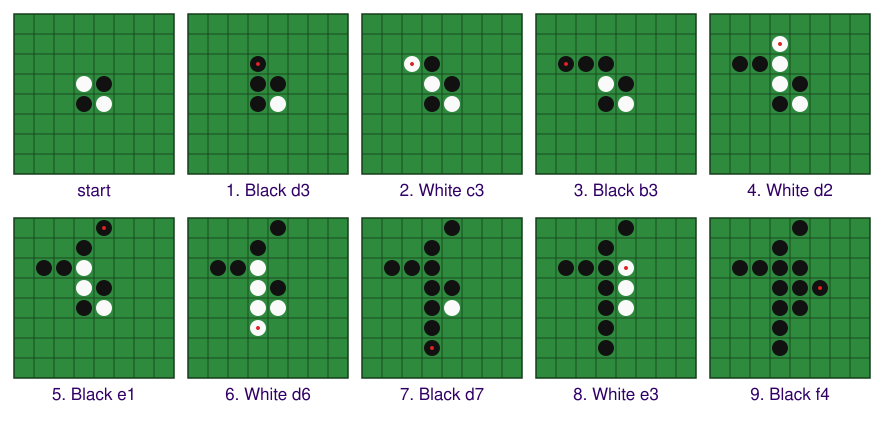

# Reversi Kickoff: Applying the Method

> Software-engineering module. Companion reading for the lecture
> and for its walkthrough
> (`../demos/lecture-05-reversi-audit/demo-script-lecture-05.md`);
> self-contained. Launches Project 1 (`../project-1-reversi-brief.md`).

## Where we are: one method, four documents

Three lectures have built one method and applied it to two examples.
*Specifications, Realizations, Conformance* introduced specifications and their realizations, conformance, and
the three kinds of verifier (human, agent, algorithmic), on a note set.
*Specifying a Game* took tic-tac-toe from a sketch of its concept of operations —
what a system is for, who uses it, and what they can observe — to a family of
specifications, several kinds, each fixing what the others leave open, and
showed that an agent helps us discover them by audit. *Verifying a Game* showed that
a test suite is a specification a program can check, and that coverage tells
us which code the suite reaches, not whether its claims are right.
Conformance, throughout, is an invariant: it is kept while the system changes,
not checked once.

### Four documents, four questions

The method turns an idea into a verified program through four documents. They
are easy to blur, because each says something about the same game. What
separates them is the question each one answers, and who reads it:

- **The concept of operations sketch** (`CONOPS-sketch.md`) answers *what does
  the client want?* It is the client's idea in the client's own words: first
  person, informal, unreviewed, and incomplete. It may even contradict itself.
  The course's sketches are written into the concept-of-operations skeleton,
  so that an audit can point at a section; a real client more often hands you
  a paragraph or an email, and sorting it into the skeleton is then the first
  move. Either way, nobody builds from a sketch. It is the input to an audit,
  and its gaps are findings, not faults.
- **The concept of operations** (`CONOPS.md`) answers *what is the system for,
  and what does it do as its users experience it?* It is written from the
  sketch by audit and rulings: third person, implementation-free, every policy
  stated as a user would observe it, every mode shown in a scenario. It
  deliberately leaves open anything that would not change whether the client
  accepts the system — the exact wording of a message, how a square is typed,
  how the program is divided into parts. Its reader is the client, and it is
  checked by *validation*: is this the system that was wanted?
- **The specification** (`SPECS.md`) answers *exactly what must the program do,
  at every input, output, and interface?* It is derived from the concept of
  operations, never contradicts it, and closes every choice the concept of
  operations left open that two builds could make differently: which strings
  are valid input, the exact text the display prints, what the move function
  requires, returns, and changes, and what the tests must show. Some of it no
  user ever sees — the interface contract between the parts, and the
  verification obligations. It is one section per kind (rules of play, display
  format, input grammar, interaction flow, interface contract, example
  session, verification obligations). Its readers are the implementer and the
  test writer, and it is checked by *verification*: does this program conform?
  It says *what*, never *how*.

  The shortest way to tell them apart: a concept of operations is judged by
  asking the client, a specification by running a test.
- **A plan** (`plans/NNN-….md`) answers *how will this one build realize those
  clauses?* It names the modules and the steps, the clauses each step
  realizes, and how the result will be checked. It is approved before the build
  (DEV-9) and then kept as history. A plan is not a specification kind; it is a
  process document for one change, and the next change gets its own plan.

One rule of Reversi, followed through all four, shows the difference:

| Document | What it says about a player who cannot move |
|---|---|
| sketch | "If you have no square you can play, you forfeit your turn." It says nothing about both players being stuck. |
| concept of operations | What a player sees when the player to move has no legal move, and what happens when neither player can move — stated as a player observes it, never how the program decides. |
| specification | A numbered rule of play that a test can cite for the pass and for the early end, the exact message the display prints, and what the move function does when the game is already over. |
| plan | "Step 1: `make_move` realizes §4's pass and end clauses; verified by one test per clause." |

Each document fixes what the one before it left open, and each one must not
contradict the one above it. When a later document finds a silence in an
earlier one, the earlier one is amended first (DEV-2 (c)).

### Validation and verification

The two checks answer different questions:

- **Validation** asks *are we building the right thing?* It compares the work
  with what the client wanted, and it happens twice: on `CONOPS.md` before
  anything is built, and on the program once it runs. Most of the work can be
  an agent's. On the document, an agent reads each scenario back as a story,
  lists the situations no scenario covers, and flags every ruling that fills a
  gap the client never ruled on — then asks the client about each. On the
  program, an agent plays every scenario of `CONOPS.md` and reports, scenario
  by scenario, what happened and where it departs from the text. What the
  agent cannot supply is the decision: *yes, that is what I meant*, or *no, it
  should end when both players are stuck*. That decision belongs to the client
  — or to you, standing in for them — and it is the whole of the person's part.

  The decision cannot be replaced by tests, because a test needs its expected
  result written down, and what the client wanted is not fully written down
  anywhere. Some of it is tacit — clients often recognize what they wanted only
  when they see it — and some of it is a judgment, such as whether a message is
  clear. The moment you write an expectation down precisely enough to test, it
  has become a specification, checking against it is verification, and the
  validation question moves to the written expectation: is *that* what was
  wanted?

  Tests still carry validation forward. Each approved scenario can be recorded
  as a test — the example session, a fixture, a scripted play-through — so
  that the program cannot drift from an approval already given. And an agent
  trying to write such a test is itself a validation move: it forces the story
  to be played concretely, and a story that cannot be played is found then.
- **Verification** asks *are we building the thing right?* It compares the
  program with `SPECS.md`, clause by clause. Wherever it can be, it is
  mechanical: the test suite, the gate, and the fixtures run on every change,
  and each test cites the clause it checks. The few clauses a machine cannot
  decide — judgment clauses, such as whether a message is clear — are checked
  by a person or an agent reading them (VER-2).

A program can pass every test and still fail validation, when the specification
faithfully encodes the wrong thing — a rule that ends the game only on a full
board, say, when the client also meant two stuck players. That is why the
concept of operations is validated first, where a wrong decision costs one
amendment rather than a specification, a plan, the code, and the tests.

| | Validation | Verification |
|---|---|---|
| question | the right thing? | the thing right? |
| compared against | what the client wanted, through `CONOPS.md` | `SPECS.md`, clause by clause |
| by whom | agents do the work; the client, or you for them, decides | tests, the gate, and fixtures; a person or agent for judgment clauses |
| when | on `CONOPS.md` before building, and on the program when it runs | after every change (VER-3) |

### Project 1: Reversi, specification-first

Reversi is a two-player board game: players place discs of their own color,
and every line of the opponent's discs a move traps between two of yours flips
to your color. You can play a finished version at
<https://ase.santoslab.org/reversi/> — against the computer at four strengths,
or against another person. It has more than Project 1 asks for (a clock, a
browser page, hover previews); yours is a text-based game. Play a few games
before you read the sketch.

Project 1 takes that game through the whole chain:

- **You get** the client's sketch, `CLAUDE.md`, `process/`, and the gate's
  configuration. No specification, no code, no tests.
- **You build** a text-based Reversi by the same chain as tic-tac-toe:
  `CONOPS.md`, then `SPECS.md`, then a plan and the engine, the computer
  opponent, and the command line, then a test suite with the gate at 100%
  branch coverage, then the fixtures and their loader, and a one-page report.
- **The decisions are yours.** Everything the sketch leaves open is found,
  ruled on, recorded, and stated in the right document.
- **The evidence is the history**: two elicitation transcripts, amendments
  committed before the code that depends on them, every plan before its
  build, and `BACKLOG.md` current.
- **Due Thursday, October 8, 11:55 pm.** Project 1 is complete when every
  required element is present and honest.

Every move in those lectures is a rule in `process/`, and the rules are the
same for a note set, for tic-tac-toe, and for the game you receive today.
Recall the specification-family table of *Specifying a Game*. With what each
kind's audit demands and how its realization is checked, it becomes the
checklist for Project 1:

| Kind | Its audit demands | Verified by |
|---|---|---|
| concept of operations | observable by a user; implementation-free; every policy in a scenario (AUDCON-1 to AUDCON-8) | validation — agents play the scenarios, the client decides |
| rules of play | every end condition, and which wins when two coincide; the turn after an accepted and a rejected move; the initial state (AUD-8) | unit tests; fixtures |
| display format | byte-exact; examples of the start, mid-game, and the end; every glyph and spacing (AUD-9) | golden-string tests |
| input grammar | one entry: every string a prompt accepts or rejects; whitespace, case, length (AUD-10) | each form fed to a prompt |
| interaction flow | the sequence: every menu and prompt, where each option leads, every exit, the state after each (AUD-11) | scripted sessions through each path |
| interface contract | each operation's parameters, pre- and postcondition, and behavior outside them — after the game is over, say (AUD-12) | unit tests; a type checker where used |
| example session | consistent, character for character, with display, grammar, and flow (AUD-13) | an end-to-end scripted run |
| verification obligations | every clause mapped to an obligation, and back (AUD-14) | reading the suite against §9 (VER-8) |

Two rows are easy to confuse. The input grammar is about *one entry*: whether
`d3`, `D3`, ` d3 `, or `d9` is accepted at a prompt, and what a rejection does.
The interaction flow is about *the sequence*: which prompt comes after which,
where each menu option leads, and how the program is left. The grammar is the
language of a single prompt; the flow is the path through the prompts.

The course's catalog of specification kinds (`../../specification-kinds.md`)
gives these columns for every kind the course uses, including the test suite
and the fixtures that steps 4 and 5 add. The brief's §4 is organized by these
kinds. Two of its names are not kinds: *computer opponent* is a subject that
spans three of them — an actor in the concept of operations, a section of the
interface contract, and a verification obligation — and *initial state*, in
the comparison table below, is a clause of the rules of play (AUD-8).

The brief's §2 is the method as seven steps, and this lecture reads them in
order. At each step it opens the artifact the *reference* produced — the
finished tic-tac-toe game of *Specifying a Game* and *Verifying a Game*, in
`../demos/lecture-03-game-demo/reference/` — so that you know what finished
looks like before you start. "The reference" below always means that
tic-tac-toe game.

| Step | Produces | Rule | Ends with |
|---|---|---|---|
| **0** start | the starter, committed | read everything before acting (DEV-1) | `project 1 start: conops sketch and process` |
| **1** sketch → ConOps | `CONOPS.md` 1.0; the elicitation transcript | audit the sketch; rule on every gap before writing (DEV-8, AUDCON) | `conops: 0.1 sketch -> 1.0` |
| **2** ConOps → `SPECS.md` | `SPECS.md` 1.0.0; the second transcript | audit `CONOPS.md`; rule on every open decision (DEV-8, AUD-8 to AUD-14) | `specs: 1.0.0` |
| **3** `SPECS.md` → plan → build | `plans/001-…`; the engine, the opponent, the entry point | audit `SPECS.md` itself; no code without an approved plan (DEV-8, DEV-9) | `plan: engine, opponent, CLI (DEV-9)`; `engine: …` |
| **4** the suite as a build; the gate | `plans/002-…`; `tests/`; the gate green | every test cites its clause; 100% branch coverage (VER-4 to VER-8) | `plan: test suite per SPECS 9 (DEV-9)`; `tests: …` |
| **5** fixtures: the file, then the loader | `fixtures/`; `plans/003-…`; the loader | the file is never edited to pass (VER-7, DEV-9) | `fixtures: scenarios.json and README (VER-7)`; `plan: fixture loader (DEV-9)`; `fixtures: loader (VER-7)` |
| **6** close | `PROJECT-1-REPORT.md`; the `CLAUDE.md` commands | coverage is not conformance (VER-8, VER-2) | `project 1: report` |

Each of steps 1 to 3 opens with an audit of the document the step before it
produced: the sketch, then the concept of operations, then the specification
itself.

Step 0 is not a lecture topic. It is a copy of the starter, a `git init`, a
virtual environment, one commit, and a reading of every governing and process
document in full — DEV-1 applies to you as well as to the agent. Do it
tonight. Notice, when you read `process/verification.md`, that it is at
version 1.3 with VER-5 through VER-8 already in it: the amendment *Verifying a Game*
performed before writing any test has been applied for you.

## Step 1 — the sketch to a concept of operations

### Reading the sketch

Read the Reversi sketch as a player would, asking of each sentence what it
lets you do and what it leaves you to guess. That is the reading of
*validation*: does the document describe the system that was wanted, and
where does it not? Knowing the game makes that harder, not easier. Once you
have played Reversi, you fill the gaps from memory without noticing them — the
opening position, who moves first, what happens when you cannot move — so read
the sketch asking what *it* says, not what the game you played does.

The sketch already has the concept of operations' nine numbered sections. That
is a convenience of the course, not something to expect from a client: its
author wrote the idea into our skeleton so that the audit can cite
"§4.2, second bullet" instead of "somewhere in the email". What makes it a
sketch is not its shape but its state. It says so itself — "Version: 0.1
(sketch). Status: my general idea, written down in one sitting; not reviewed;
nothing built" — and it is written in the first person, with questions and
TBDs left in: "Where I have not decided something I have written a question
or 'TBD' rather than guessing."

Section 1.2 gives the game in a paragraph: an 8-by-8 board; discs that are
black on one side and white on the other; a board that "starts with a few discs
already in the middle, the way the real game does"; a move places a disc so
that one or more of the other player's discs are trapped in a straight line
between the new disc and one already on the board, and the trapped discs flip;
the aim is to end with more discs of your color. Squares are typed "like `d3`
on a chessboard." Section 4.2 gives the rules a player would see, and ends
with a question the client has not decided: "should the program show me where
I am allowed to play, or make me work it out?" The one scenario, §5.1, ends
"When the board fills up the program counts — 40 to 24, I win," and adds
"(Probably need a two-player walkthrough too.)"

Here is what §4.2 states, what it implies, and what it leaves out:

| §4.2 bullet | States | Implies | Leaves out |
|---|---|---|---|
| 1 | two colors; players alternate; one disc per turn, on an empty square | an opening position exists — "a few discs already in the middle" (§1.2) | who moves first? which discs, where? |
| 2 | a move must trap at least one disc, in a straight line — across, down, or diagonally | a move can trap in more than one direction — "everything trapped flips" | does every trapped line flip, or one? |
| 3 | a player with no square to play forfeits the turn | the other player moves next | is the forfeit announced? what if both players are stuck? |
| 4 | when the board is full, the discs are counted; more wins | the count is shown at the end (§5.1) | what if the counts are equal? can the game end before the board is full? |

One item in the table is more than a gap. The sketch says the game ends when
the board is full, and it says a player with no move forfeits the turn. Each
statement is true of Reversi. Together they are incomplete: if both players
are stuck with empty squares left, the sketch does not say what happens, and a
program built from it would either loop forever or invent an answer.

If you have not played much Reversi, that case may sound impossible. It is
not, and it can come early. The clearest example is a *wipeout*, where one
color disappears from the board. One such game takes only nine
moves — `d3 c3 b3 d2 e1 d6 d7 e3 f4` — and leaves every disc on the board black
(the red dot marks each move):



White has no disc to trap with, and Black has no white disc to trap, so
neither can move, with 51 squares still empty. Later in a game the same thing
happens more quietly: the last empty squares can sit where no line of
alternating discs reaches them, so neither player can play there. An audit for
consistency — is the document consistent with itself? (AUD-2) — finds it by
reading the two bullets side by side. Note that this is the same kind of finding as
tic-tac-toe's post-game options, which were stated two different ways in two
sections, and it is the reason our development rule DEV-8 requires the audit
before anything is planned.

**Important**: if the sketch does not say it, it is a gap — record it and rule
on it, even when you know the answer and it seems obvious. The convergence rule
(below) says how such gaps are resolved; it does not say they can be skipped.

### The audit, on your starter

Step 1 of the brief begins with the audit of the sketch. The prompt is word for
word the one *Specifying a Game* typed on the tic-tac-toe sketch — it names no
game — and the one the brief prints for step 1:

> Read `CONOPS-sketch.md` and the process documents. I want a `CONOPS.md` 1.0
> that realizes this sketch as a full-skeleton concept of operations. Before
> proposing anything, run the audits in `process/conops-audit.md` and
> `process/spec-audit.md` on the sketch (DEV-8) and report the gap list per
> RPT-1 — numbered, each with your recommended resolution. Then stop and wait
> for my rulings.

You type it on your own starter. The list comes back longer than the one you
wrote from §4.2, in a different order, with some items you found and it did
not. The Reversi gap list and its rulings are your work; what the lecture shows
is their form, on tic-tac-toe, where *Specifying a Game* made them:

| Gap | Ruling | Found by | Goes in |
|---|---|---|---|
| "five in a row" — does six win? | five **or more** wins | ambiguous (AUD-1) | the concept of operations, §4.2 |
| a win on the last empty square — win or draw? | the win takes precedence | incomplete (AUD-4) | the concept of operations, §4.2 |
| after a game: "play again or start menu" (§4.3) vs "play again or quit" (§5.1) | three options: play again, main menu, quit | inconsistent (AUD-2) | §4.3 and §5.1, made to agree |
| quitting in the middle of a game | **deferred** to `BACKLOG.md` (DEV-6) | incomplete (AUD-4) | — |

Each ruling says what was decided, why it was a gap, and which document it
belongs in: a rule a player observes goes into the concept of operations
(AUDCON-2). A deferral is a decision not to decide yet, taken on purpose when
nothing at this stage depends on it. Following our development rule DEV-6, it is
written to `BACKLOG.md` with the question, where it arose, and the options —
recorded where the next reader will find it, not guessed.

From a ruling to an amendment, the prompt is:

> Propose the amendment for item N per RPT-3 — document, clause, old text, new
> text, rationale citing the gap-list item, the version bump, the changelog
> entry — and wait for approval.

Three points about it:

- **A ruling is not yet a change.** It becomes one as an amendment proposal:
  the exact edit, to the exact clause — the document, the clause, the old text,
  the new text, the version bump, the changelog entry. *N* is an item of your
  own gap list.
- **The agent proposes; you approve.** The agent marks the proposal *awaiting
  approval* and waits: nothing in a governing document changes until you
  approve (DEV-3). An agent that starts rewriting `CONOPS.md` before approval
  has skipped that step, and is stopped.
- **Every change traces back to a finding.** The rationale cites the gap-list
  item, and the changelog records it. From any sentence of `CONOPS.md` you can
  follow the changelog to the amendment, the ruling, and the gap it closed.

From there to `CONOPS.md` 1.0 — the remaining rulings, the amendments, the
rewrite in the third person, five scenarios, the glossary, the audit run again
— is the rest of step 1, and the brief's step 1 lists what the audit must find
in this sketch and what the rewrite must fix.

### What a finished concept of operations looks like — tic-tac-toe's

The brief names `reference/CONOPS.md` — the finished tic-tac-toe concept of
operations from *Specifying a Game* — as the model for step 1, and three
things in it are worth reading before you write yours. Its §4.2 is the rules
of tic-tac-toe as a player observes them — a policy is a sentence about what
the player sees happen, never about how the program does it (AUDCON-1,
AUDCON-2). Its §4.3 lists the *modes* — the distinct ways the program runs:
the main menu, solo play, two-player play, the turn loop, and the post-game
choice. Its §5 has four scenarios — solo play to a win, a two-player game, a
tie, and recovery from an invalid entry — and between them every mode and
every policy appears at least once. That is what AUDCON-3 requires: not one
scenario for each, but none left out of all of them; and for
Reversi that means five scenarios at least, because a pass and a game that
ends before the board is full are policies tic-tac-toe did not have. And the
document carries a version, a status, and a changelog (AUDCON-6) — "Version:
1.0", "Status: normative; maintained", and a changelog recording every
amendment. Yours needs all three. Step 1 ends with
`conops: 0.1 sketch -> 1.0` and the export of the session to
`transcripts/01-conops-elicitation.md`. The gap list, your rulings, and the
amendments are the evidence that the document was elicited, not typed.

### The convergence rule: where the sketch is silent

The brief states the rule in one paragraph, and it decides how every gap in
your list is resolved. **Where the sketch is silent, the client's intent is
standard Reversi.**

This does not let you skip a question. A specification that leaves a standard
rule implicit fails the completeness check (AUD-4); the job is to find every
place the sketch leaves a decision open, look up what standard Reversi does
there, record the ruling, and state it in the right document. The rule exists so that everyone builds the same
game — standard Reversi — while the elicitation stays real.

The rulings that are genuinely yours are listed in the brief's §4: the glyphs
for the two colors and for an empty square; whether and how legal-move hints
are shown; whether the count is shown during play; the notation's edge cases
(case, whitespace, `d9`, `i3`); the post-game options; in solo play, which
color you have and whether it alternates on a rematch; the error wording; the
shape of the interface; the module split. Feedback on them looks at three things:
the ruling is recorded, it is applied consistently, and it is stated in the
right document — the concept of operations for what a player observes,
`SPECS.md` for the rest. Which way you decided is not what the feedback is about.

## Step 2 — the concept of operations to the specification family

Step 2 is the same moves with a new target. Its prompt is word for word the one
*Specifying a Game* typed on tic-tac-toe to derive the specification, and it
names no game:

> Read `CONOPS.md` and the process documents. Derive `SPECS.md` 1.0.0 from it:
> one section per kind — board and coordinates; rules of play; display format,
> byte-exact; input grammar; interaction flow; interface contract with
> preconditions and postconditions; an example session; verification
> obligations. Before writing, run the audit (DEV-8) and list every decision
> the concept of operations leaves open, grouped by the kind of specification
> that must settle it, per RPT-1 with a recommendation each. Wait for my
> rulings.

The kinds and their order are pre-picked, as they were in the demo, so that
every submission has the same shape; the course catalog is the menu they were
picked from. The list the agent returns will be long — the brief's §4 is the
floor for what it must contain — and every item gets a ruling. One item that
is not a decision: the coverage policy. It is already in
`process/verification.md`, and §9 of your `SPECS.md` lists obligations — what
the tests must claim, traced to the clauses they verify (AUD-14) — not policy.

### What Reversi demands that tic-tac-toe did not

The game has the same shape as tic-tac-toe — a grid, two players, an ASCII
board, moves, a terminal condition — and every kind of specification gets
harder in a way that shows what that kind is for:

| Kind | Tic-tac-toe had | Reversi forces |
|---|---|---|
| rules of play | one cell written; a win is a line that exists | a move changes many cells — in how many directions, and which ones? What happens when one player cannot move, and when neither can? Who wins, and can it tie? |
| initial state | an empty board | the four-disc opening — a completeness trap |
| display format | the grid, `.` for empty | the same grid, plus a real decision: hints, and when |
| input grammar | `[1-9][1-9]` | `[a-h][1-8]` — a letter-to-index mapping; is `A3` accepted? |
| interface contract | `make_move → bool` | what does a move report back, and what does it change? How does a caller know a square is legal before trying it? What can a caller ask about the game in progress? |
| verification obligations | §9 | the same categories, on a harder engine; the policy in `process/verification.md` unchanged |
| computer opponent | a random legal move | the same; "most flips" is the natural next strategy |
| fixtures | moves to an expected winner | moves to expected flips and a count; a scenario with a pass; a game that ends before the board is full |

Each row is a question your `SPECS.md` must answer, and the answers are yours
to find, rule on, and state. The interface contract is where the difference is
largest: in tic-tac-toe a move changed one cell, and in Reversi one move
changes many at once, so what a move reports back — and what a test of a move
can check — has to be decided.

### What a finished specification looks like — tic-tac-toe's

Four sections of `reference/SPECS.md`, the finished tic-tac-toe specification
from *Specifying a Game*, one point each:

- **§4, the win condition.** Rules of play as numbered clauses — §4.1, §4.2,
  §4.3 — so that a test can cite one (AUD-5). Your rules of play will have
  more clauses, one for each rule your rulings settle.
- **§5.1, `game.py`: `make_move`.** An operation with a precondition, a postcondition,
  and behavior outside the precondition — including, since version 1.2.0,
  after the game is over (AUD-12). Its postcondition changes one cell. In
  Reversi one move changes many; what your postcondition says about them, and
  what a test of a move can then check, is yours to decide.
- **§7.2, the board format.** Byte-exact, with an empty board and a mid-game
  board as examples (AUD-9). "Looks like the example" is a finding. Yours adds
  the decision the audit deferred: whether hints are shown, and how.
- **§9.5, the required coverage categories.** Obligations, not policy. The
  policy — the target, the pragma, citation discipline, fixtures — is in
  `process/verification.md` and is not yours to weaken. Read §9.5 against the
  Reversi rules and notice how much carries over; that is the point.

Step 2 ends with `specs: 1.0.0` and a second transcript,
`transcripts/02-specs-elicitation.md`.

## Step 3 — `SPECS.md` to a plan to a build

### A silence in an earlier step propagates down — tic-tac-toe

The brief's step 3 has three moves in a fixed order: audit `SPECS.md` itself,
then plan, then build. The reason for the order is in the history of the
tic-tac-toe reference, and *Verifying a Game* read it. Its `SPECS.md` 1.1.0 was silent
on what happens when a move arrives after the game is over: it listed two
reasons `make_move` returns `False` and stopped there. The engine plan came
next, and its `make_move` step says it realizes "each rejection case §5.1
lists" — which it does, faithfully, and there were two. The plan did not
introduce the gap, and no amount of care in writing the plan could have
closed it, because the plan's job is to realize the specification and the
specification did not say. The engine accepted a move after the game was over, exactly as the plan
described. The suite could not catch it either: §9.5, the section that says
what the tests must claim, listed three failure cases for `make_move` at
1.1.0, and the test plan lists the same three, because it realizes §9.5. So no
test claimed the missing clause.

Five artifacts in a row — specification, engine plan, engine, verification
obligations, test plan — and not one of them at fault. Each faithfully
realizes the one before it, and that is exactly the problem: downstream
fidelity cannot recover information that was never in the specification.
That is why the audit (DEV-8) runs against the specification before any plan
is written, and not after the code exists. Then 1.2.0 records the ruling, and
the engine change and the test citing the new clause follow it in the
history — amendment first, realization after, which is DEV-2 (c). In the demo
you will see the six commands that read this history off the reference; your
report will contain one trace of the same shape through your own artifacts.

The first move of step 3, then, is the audit that would have caught the
silence: `process/spec-audit.md` run on `SPECS.md` itself — AUD-1 to AUD-7,
and AUD-8 to AUD-14 section by section — before any plan exists. If it finds
gaps, you rule, the amendment is committed, and the audit runs again.

### Step 3 in three prompts: audit, plan, build

Step 3 is three prompts, in order. The first audits the specification you just
wrote, before any plan exists — the move that, run on tic-tac-toe's 1.1.0,
would have found the silence above:

> Read `SPECS.md` and the process documents. Before any plan, run the audit in
> `process/spec-audit.md` on `SPECS.md` (DEV-8) — AUD-1 through AUD-7, and
> AUD-8 through AUD-14 section by section — and report the gap list per RPT-1.
> Then stop and wait for my rulings.

If it finds gaps, you rule, amend, commit the amendment, and audit again. Then
the build, which *Specifying a Game* showed is asked for in two prompts. The
first asks for the plan and nothing else:

> Read `SPECS.md` and the process documents. Propose a plan for the engine, the
> computer opponent, and the command-line interface — the modules `SPECS.md` §2
> names — citing for each step the clauses it realizes, and wait for my
> approval.

You read the plan and rule on it. Only then does the second prompt ask for the
build:

> Approve the plan. Commit it under `plans/` as
> `plan: engine, opponent, CLI (DEV-9)`. Then build the modules per the approved
> plan, report per RPT-5 with the clauses each module realizes, and commit as
> `engine: game, opponent, and CLI per SPECS 1.0.0`.

Two things about the second prompt. The plan is committed before the first
implementing commit, which is what DEV-9 requires: an approved plan is an
artifact of the repository, readable later by anyone asking why the code has
the shape it has, not an exchange that disappears with the session. And the
prompt says nothing about how to build anything — no module structure, no
algorithm, no naming. The plan says that, and the plan cites the contract
clause by clause; anything added here would be a fourth source of truth
competing with three that are already written down.

The model is `reference/plans/001-engine-opponent-cli.md`. Its step 1 cites a
clause per bullet; its preface says that where the contract does not say, the
plan does not say either, and a question it cannot settle from the contract
goes to `BACKLOG.md`; and its closing section, *Verification at the end of
this build*, names the only verifier available before a suite exists — a
person playing one game in each mode against §8 — and the RPT-5 note says so
(VER-1). The module split is yours if your `SPECS.md` §2 says so; the
reference's — a pure engine with no input or output, the strategies as static
methods, all input and output in the entry point — is the default.

## Step 4 — the test suite as a build, and the gate

The process set in your starter is already the set *Verifying a Game* ended with. VER-5 through
VER-8 are in `process/verification.md` 1.3, and RPT-5 at 1.3 reports clause
coverage: the amendment *Verifying a Game* performed before writing any test — for
the same reason a specification precedes its realization — has been applied
for you, and its changelog entry says so.

The suite is a build, so DEV-9 applies to it. The prompt is the one *Verifying a Game*
used, and it names no game:

> Read `SPECS.md` and the process documents. Propose a plan for the test suite
> under `tests/`, one file per source module, that claims every obligation in
> `SPECS.md` §9: for each step, the obligations it claims and the clauses each
> test will cite (VER-6). Wait for my approval. Then commit the plan under
> `plans/` as `plan: test suite per SPECS 9 (DEV-9)`, write the suite, run the
> gate (VER-4), and report per RPT-5, including which obligations are claimed
> by at least one test and which are not (VER-8). Commit the suite as
> `tests: suite per SPECS 9 (VER-4 green)`.

The model plan is `reference/plans/002-test-suite.md`. Its step 0 is the
harness — `tests/__init__.py` and a `tests/conftest.py` that puts the
repository root on `sys.path`; yours is smaller only in that `pytest.ini` and
`requirements-dev.txt` are shipped in the starter — and its step 1 reads beside
`SPECS.md` §9.5: the
obligations can be checked off against the plan's bullets before a single
test exists, which is what "every obligation claimed by at least one test"
looks like in advance.

Two tests of the reference are worth reading for their form. In
`tests/test_game.py`, `test_make_move_rejected_after_game_over` carries the
docstring "SPECS §5.1: a move after the game is over returns False and changes
nothing." The board is set up by direct assignment, and the behavior under
test goes through `make_move`; that is VER-6's discipline — setup by
assignment, behavior through the public operation. It is also the test that
follows the 1.2.0 amendment in the history. In `tests/test_main.py`,
`test_prompt_human_rejects_invalid_forms` carries "SPECS §6.2: every invalid
move form is rejected and re-prompted" and is parametrized over the eight
forms §6.2 lists: one clause, many realizations, one test. Yours enumerates
the forms your grammar rejects — `d9`, `i3`, and whatever else it rules out
(whether `D3` or ` d3 ` is accepted is your decision) — in the order your
grammar lists them. An occupied square or a square that flips nothing is
well-formed: the rules of play reject it, and its test cites that clause.

The gate is the command in your `CLAUDE.md`:

```sh
pytest --cov=. --cov-branch --cov-report=term-missing --cov-fail-under=100
```

It must exit 0 (VER-4), and the only `# pragma: no cover` in the repository is
on the entry point's `if __name__ == "__main__":` guard (VER-5). The starter
ships the gate's configuration — `.coveragerc` measures every module in the
repository root, whatever your module split, and excludes the tests and the
virtual environment — and neither it nor `pytest.ini` is edited to weaken the
gate. The completion note carries two coverage lines, and they answer
different questions: the gate's line reports branch coverage, a property of
the pair (tests, code); the clause-coverage line reports which of §9's
obligations are claimed by at least one test, a property of the pair (tests,
specification). That is VER-8, and *Verifying a Game*'s three sabotage steps showed a
case where each line was informative and the other was not. The brief
recommends, without requiring, that you repeat the first of those steps on
your own suite. In *Verifying a Game* it was the overline test: deleted, the
gate stayed green at 100%, because other tests still reached every branch of
the win check — yet no test claimed §4.1's overline clause any more. Do the
same: delete the one test that claims some clause, run the gate, watch it stay
green, restore the test. Then write the verdict in that lecture's form, one
sentence on what the gate established and what it did not — for example, "The
gate established that every branch is reached by some test; it did not
establish that §4.1's overline clause is claimed by any test." It is the
shortest route to the second item of your report.

### Three kinds of change, and the amendment first

From step 3 on, every commit touches a realization, and every such commit is
one of the three kinds DEV-2 names; the history has to show which. A
**repair** (a) follows a report and a ruling, and the specification does not
change. A **conformance-preserving change** (b) changes nothing specified, and
the commit message says so. A **change of specified behavior** (c) commits its
amendment first. Implementation will find something your specification did not
settle — what a move returns after the game is over, what happens when both
players pass, whether an entry with trailing whitespace is accepted — and at
least one such amendment is expected in Project 1. The amendment (RPT-3;
approved, DEV-3; version bump and changelog entry) is committed before the
code that depends on the ruling, and the audit runs again on the amended
document (DEV-8). A question you cannot settle goes to `BACKLOG.md` (DEV-6).

## Step 5 — fixtures: the file first, then its loader

**Fixtures** are whole-game scenarios written as data, in
`fixtures/scenarios.json`: the moves played, then what must follow — the
squares each move flips, the counts, whose turn it is, whether the game is
over. They are not tests. Tests are code written against your engine's own
functions and change when your code does; a fixture names nothing in your code,
is checked against `SPECS.md` by hand, and is never edited to make a run pass
(VER-7). It is a small, executable restatement of the rules of play, and a
*loader* — one short test — runs every scenario in the file against your
engine.

The fixture shape is fixed by the brief's §3.1 so that the file stays
independent of your code: squares in the notation your
grammar defines; the literal `"pass"` for a forced pass; colors named `black`
and `white` regardless of the glyphs your display uses; and, for each move,
the set of squares it flips.

```json
{
  "name": "black-opens-d3",
  "moves": ["d3"],
  "flips": [["d4"]],
  "expected": {"to_move": "white", "black": 4, "white": 1, "over": false}
}
```

Step 5 has two halves, and the order is the point. The **file** comes first:
`fixtures/scenarios.json` with at least the eight kinds of scenario the
brief's §3.3 lists — an opening move with its flips; a move that flips in more
than one direction; a rejected move that flips nothing; a rejected entry that
is not a square; a scenario containing a pass; a game that ends before the
board is full; a full-board game with its final count; a tie — and
`fixtures/README.md` with the three sections the reference's has: the rules
the fixtures assume, citing your clauses; the loader contract; the known blind
spots. Every expectation is checked against your `SPECS.md` by hand. The pass
and early-end scenarios are hard to construct by hand. You may generate them
with your engine, but you must verify them against your specification on
paper before trusting them, and say how in the report. Recall from *Verifying a Game*
why: an engine cannot be the oracle for its own fixtures. The file is
committed before any loader exists.

The **loader** comes second, and it is a build: a plan under `plans/`, your
approval, `tests/test_fixtures.py`, the gate, the RPT-5 note, the commit. In
the reference, `tests/test_fixtures.py` is two parametrized functions —
`test_game_scenario` and `test_rejection_scenario` — holding no expectations of
their own; the expectations live in the file. A scenario that fails is a
finding about the pair (fixture, specification): an RPT-1 gap and a DEV-4
ruling, never an edit to make it pass (VER-7). A ruling may change the file;
if it does, the README says why.

Read three things in the reference. A scenario's name cites the clause it
exercises — `x-wins-row-overline` is §4.1 as moves. `fixtures/README.md`'s
*Known blind spots* declares what the file does not cover, and a blind spot
declared is part of the contract, not a defect. `plans/003-fixture-loader.md`
separates the file, installed as given, from the loader built for it, and its
*What this plan does not cover* says so. Your step 5 ends in three commits:
`fixtures: scenarios.json and README (VER-7)`, then
`plan: fixture loader (DEV-9)`, then `fixtures: loader (VER-7)`.

## Step 6 — the report, and what the checklist asks

`PROJECT-1-REPORT.md` is one page with four items. First, the amendment or
amendments implementation forced, and for one of them the trace in the form
of the five artifacts above: the clause as it stood, the plan step that
realized it, the code, the §9 obligation, the test plan or the test — and, at
each artifact, whether the silence was still there — with the step of the
brief, and the rule, under which your process caught it. Second, one thing
100% branch coverage did not tell you about conformance (VER-8). Third, how
the pass and early-end fixtures were constructed and checked by hand. Fourth,
what remains for a human or an agent verifier: the judgment clauses of your
specification (VER-2), and anything you could not verify by reading. The
report's ancestor is RPT-5; the reference has no report, and this one is
yours. Then `CLAUDE.md`'s Commands section is updated — "once it exists" goes;
your entry point is named if it is not `main.py` — and `BACKLOG.md` is brought
current.

Nothing in the brief's checklist is new. Each required element is a rule you
have watched applied, and the table says where.

| Required element | Step | Rule | Where it was shown |
|---|---|---|---|
| the starter as shipped in the initial commit; `CLAUDE.md` and `process/` unchanged except the Commands section and recorded amendments | 0 | DEV-1, DEV-3 | *Verifying a Game* |
| `CONOPS.md` 1.0 — version, status, changelog; third person; implementation-free; kept sections filled; five scenarios; glossary | 1 | AUDCON-1 to AUDCON-8 | *Specifying a Game* |
| `SPECS.md` 1.0.0 or later — eight sections, every clause numbered, examples byte-exact, §9 as obligations traced to clauses; changelog | 2 | AUD-5, AUD-8 to AUD-14 | *Specifying a Game* |
| every decision in the brief's §4 stated in one of the two documents | 1–2 | AUD-4 | *Specifying a Game* |
| `transcripts/01-conops-elicitation.md` and `transcripts/02-specs-elicitation.md` — two RPT-1 lists, the rulings, the RPT-3 amendments | 1–2 | RPT-1, RPT-3, DEV-4 | *Specifications, Realizations, Conformance*; *Specifying a Game* |
| history: `conops:` before any `SPECS.md` work; `specs: 1.0.0` before any plan; every plan before its build | 1–3 | DEV-2, DEV-7, DEV-9 | *Specifying a Game* |
| `plans/001-…` approved; engine, opponent, and CLI per `SPECS.md`; the game runs | 3 | DEV-9 | *Specifying a Game* |
| `plans/002-…` approved; every test cites its clause; every §9 obligation claimed; the gate green at 100% branch with the single pragma; RPT-5's two coverage lines | 4 | VER-4, VER-5, VER-6, VER-8 | *Verifying a Game* |
| `fixtures/scenarios.json` in the §3.1 shape with the eight kinds, and `fixtures/README.md`, committed before `plans/003-…` and the loader | 5 | VER-7 | *Verifying a Game* |
| at least one amendment committed before the code that depends on it; every realization commit identifiable as (a), (b), or (c); `BACKLOG.md` current | 3–5 | DEV-2, DEV-3, DEV-6 | *Verifying a Game* |
| `PROJECT-1-REPORT.md` — the four items, one five-artifact trace | 6 | VER-8, VER-2, RPT-5 | *Verifying a Game* |
| `CLAUDE.md` Commands say how to run the game and the tests | 6 | — | — |

## Logistics

- **The process set is adopted, not authored.** `process/` in your starter is
  the set *Verifying a Game* ended with, identical to the tic-tac-toe reference's. A rule changes only by an
  amendment with a changelog entry (DEV-3). A change that weakens a rule —
  the coverage target, the pragma policy, the fixture rule — is returned. The
  gate's configuration — `.coveragerc`, `pytest.ini`, `requirements-dev.txt` —
  is adopted the same way; it measures every module in the repository root,
  so your module split needs no change to it.
- **Dates.** Project 1 is due Thursday, October 8, at 11:55 pm. Project 0 is
  still due Thursday, October 1.
- **Where to ask.** A question the repository can answer is answered by
  reading it (our development rule DEV-10). A question it cannot answer goes
  to `BACKLOG.md` or to the course channel — and a question about the rules of
  Reversi is answered by the convergence rule.

## Questions to think about

1. Which rulings in your gap list are yours to make, and which are the
   client's? Where does the brief draw that line, and why there rather than
   somewhere else?
2. Step 5 requires a scenario containing a pass. Before you trust a scenario
   your own engine generated, what do you check it against, and how — and what
   does VER-7 say about the fixture file afterwards?
3. The after-game-over silence passed through five artifacts of the tic-tac-toe
   reference.
   At which step of the brief, and under which rule, would your Project 1 have
   caught it?
