<!-- _class: lead -->

# Specifications, Realizations, and Conformance

**Agentic Software Engineering — Software-Engineering Module, Lecture 01**
Meeting 1 of 6 · runs part 1 of the note-set demo · launches **Exercise 1**

---

## The one idea

A specification and a realization are two artifacts. **Conformance** is a relation between them; **verification** is the activity that checks it.

When the check fails, one side or the other is changed, the check is run again, and the decision — which side moved, and why — is recorded.

<!-- 0–4 min. No demo yet. ls the demo repository: one specification, a CLAUDE.md, a process/ folder, no notes. -->

---

## The example: a set of study notes

One markdown file per article you read. Two questions:

- How should a note be formatted?
- Who checks that it is?

The first answer is a document that is not a note: a **specification**, `note-format-spec.md`. The second answer is this lecture.

At the start the repository holds the specification (version 0.1, draft), a short `CLAUDE.md`, and three process documents. No notes.

<!-- 0–4 min. Why the example is small: six rules on one screen; every concept can be pointed at in a file. Project 0 is the same thing at the student's scale. -->

---

## The format specification, version 0.1

| Rule | Requirement (condensed) |
|---|---|
| R1 | YAML front-matter block; the opening `---` is line 1 |
| R2 | exactly two fields: `title`, `created` (ISO-8601) |
| R3 | the body begins with a level-1 heading |
| R4 | exactly one level-1 heading |
| R5 | no skipped heading levels |
| R6 | `index.md` links every note exactly once; every link resolves |

RFC 2119 keywords; numbered rules, so that any report can cite one.

<!-- 4–14 min. Keep this on screen while defining the four terms. Note "Version: 0.1 (draft)". -->

---

## Four terms

- **Specification (S)** — states, above the level of the artifact it governs, what the developer intends; fixes what matters and leaves the rest free
- **Realization (R)** — an artifact built to satisfy S; *implementation* when R is code; a note or a document can also be one
- **Conformance** — the relation that holds when R satisfies every property stated in S; a yes-or-no question about the pair
- **Verification** — the activity of *trying* to confirm that R conforms to S; the result is evidence, and we need to know what it is evidence of

One S, many R: every conformant note is a different realization of the same rules.

---

## The arrangement

---

## The loader, and the process documents

`CLAUDE.md` names one governing document and three process documents, and states two rules: read everything before acting; change nothing without approval.

| Document | Says | Loaded |
|---|---|---|
| `process/spec-audit.md` (AUD) | how a specification's quality is assessed | when asked |
| `process/reporting.md` (RPT) | the forms a report takes | always |
| `process/verification.md` (VER) | how conformance is checked, and by what | always |

<!-- 4–14 min. Rules are numbered AUD-1, RPT-2, VER-1, so that reports can cite process rules the way they cite R-numbers. -->

---

## Evaluating a specification: five properties, as an audit

| Property | Rule | The test |
|---|---|---|
| Unambiguous | AUD-1 | could two careful readers decide a clause differently? |
| Internally consistent | AUD-2 | do two clauses that constrain the same thing state their relationship? |
| Externally consistent | AUD-3 | across documents: one vocabulary; nothing one document requires that another's artifact cannot satisfy |
| Complete for its level | AUD-4 | the walkthrough: perform each operation on paper; what did you invent? |
| Traceable | AUD-5 | can a report, a test, a later document cite this clause — still, after the next change? |

AUD-6: search within a document, between documents, and between a document and executing it. AUD-7: the output is a numbered gap list (RPT-1); then stop and wait for rulings.

<!-- 14–20 min. The properties are not advice; they are a procedure in a file, cited by number. Run when the developer asks, before any plan, after any amendment. -->

---

<!-- _class: standout -->

## The audit

Before anything realizes the specification, the specification is examined.

<!-- 20–34 min begins. Demo Segment 2. Plan mode. -->

---

## The audit prompt

> Read `note-format-spec.md` and the process documents. Run the audit in `process/spec-audit.md` on the specification and report per RPT-1: number every finding, place it, quote the text, categorize it, and give a recommended resolution. Include the walkthrough that AUD-4 asks for: write one conformant note on paper, step by step, and say what you had to invent. State which of the three places in AUD-6 you searched. Then stop and wait for my rulings.

The prompt says which document and which audit. What the audit is, and what its report looks like, is in the files.

<!-- Room writes its own list for two minutes before the agent's appears; compare. Seeded findings, for your eyes: the scope sentence against R6 (index.md cannot satisfy R1); R2 against R3 (no rule that title and H1 agree); the filename the walkthrough must invent. -->

---

## Three findings, three rulings

| Finding | Rule | Ruling | Amendment |
|---|---|---|---|
| the scope sentence covers every markdown file; R6 names `index.md`, which cannot satisfy R1 | AUD-2 | `index.md` is not a note | scope statement: R1–R5 govern `notes/`; R6 alone governs the index |
| R2 requires `title`; R3 requires an H1; nothing says they agree | AUD-2 | they are equal; the field is authoritative | R3 extended |
| R6 links to note files; no rule says what a note's filename is | AUD-4 | derive it from the title | new R7: the slug of the title |

Amendments proposed per RPT-3 — old text, new text, rationale, version, changelog — approved, applied: version 0.1 → 1.0.0. The specification moved before any realization existed.

<!-- git diff HEAD~1 -- note-format-spec.md; git log --oneline. If a finding is missed: one nudge each, in the script. -->

---

## When conformance fails: change S or change R

A failed check reports a fact about the pair (S, R). It does not say which side is wrong. A person decides; the decision is recorded — in the changelog when S moves, in the commit message when R moves.

<!-- 34–40 min. S can be missing a rule, or two rules can conflict, or a clause can fail to say what was meant. Two ways to find defects in S: realistic examples; analysis — which is what the audit is. -->

---

<!-- _class: standout -->

## The verification gate

A note written carelessly, in another editor, with nothing checking it.

<!-- 40–52 min. Demo Segment 3: mkdir notes; paste the careless note as notes/royce-1970-waterfall-paper.md (the filename follows R7); write index.md by hand; "check and report per RPT-2; change nothing". -->

---

## A conformance report (RPT-2)

**Verifier:** agent (model, date). **Specification:** `note-format-spec.md` 1.0.0. **Checked:** R1–R7. **Not checked:** none.

| In the file | Rule | Repair |
|---|---|---|
| `created: Sept 11, 2026` | R2 (since 0.1) | `2026-09-11` |
| H1 `The Waterfall Paper`; `title: Royce 1970 Waterfall Paper` | R3 (amended an hour ago) | heading rewritten; the field is authoritative |
| a second H1, `# My take` | R4 | demoted to `##` |
| `####` directly after `##` | R5 | demoted to `###` |

**Verdict:** nonconformant. Repairs proposed; none applied.

<!-- The R3 finding exists only because of the audit. Against 0.1 a report would have accepted the heading, and it would have been right — for 0.1. That is why a report says which version it checked against. -->

---

## Report before repair, then the gate

- RPT-4: nothing changes until the report has been read and a ruling given
- The ruling: the specification is right; the note is wrong
- The repair; the re-check passes; the commit names the operation

The passing re-check is what "done" means: the task was to make the check pass, not to edit the file.

In the audit, S moved with no R present. Here, R moved with S held still. Both end with conformance re-established.

---

## Three kinds of verifier

| | Human | Agent | Algorithmic |
|---|---|---|---|
| Cost per check | minutes of attention | tokens | milliseconds |
| Same result on repeat | not guaranteed | not guaranteed | yes |
| Decides mechanical clauses | yes | yes | yes |
| Decides judgment clauses | yes | yes | **no** |
| Composable into a gate | no | with effort | yes, via the exit code |

VER-1. Because every rule has an identifier, the three are comparable: all three cite R2–R5 on the same note.

<!-- 52–64 min. Demo Segment 4: the agent writes check_notes.py (R1–R5, R7 per note; --all adds R6; exit 0/1/2; docstring states version and clauses). Run --all. Sabotage the date; exit 1; restore; exit 0. -->

---

## Verifiers

---

## Mechanical clauses, judgment clauses — and the verifier as a realization

- **VER-2.** A clause is *mechanical* when a program can decide it from the file alone, *judgment* when it needs a reader. Every clause of 1.0.0 is mechanical. A program decides what it can; the rest is named, never assumed covered.
- `check_notes.py` is itself a realization of the specification. If it implements a rule wrongly, its results are wrong in a way its output does not show.
- Who verifies the verifier: read it against the rules; test it on inputs with known violations; compare it with another verifier.

---

## Six ways a verification result can be invalid

1. Checked against the wrong **version** of S — a 1.0.0 verifier on 2.0.0 notes: a false pass
2. The verifier **mis-implements** a clause; it is a realization too
3. Checked from **memory** rather than from the document (the loader's first rule)
4. **Clauses not decided**: a pass says nothing about clauses the verifier does not decide
5. **Attention**: the human is the verifier for everything no process checks
6. A **defective S**: before the amendments, no `index.md` could conform

Verification is not proof. It is evidence within a scope — which verifier, which version, which clauses — and RPT-2 requires the scope to be stated.

---

## What the process documents did today

| Document | Used | For |
|---|---|---|
| AUD | once, when asked, before anything was built | the gap list |
| RPT | throughout | a gap list (RPT-1), two conformance reports (RPT-2), an amendment proposal (RPT-3), report-before-repair (RPT-4) |
| VER | throughout | three kinds of verifier (VER-1); mechanical and judgment clauses (VER-2) |

Not yet present: operations on the set, a statement of what the set is *for*, the rule that conformance is an invariant while the set changes. Lecture 02.

<!-- 64–70 min. -->

---

## Exercise 1, and Project 0

**Exercise 1** — run the audit and verification segments yourself; write one note carelessly; check it with all three kinds of verifier; report with RPT-2 scope lines; explain one disagreement; say which side should have moved and how each verifier could have been wrong. Due before Lecture 03.

**Project 0** — the same structure at your scale: your PKB specification is this specification grown up; its checklist is R1–R7 grown up; the stretch-goal validator is `check_notes.py` grown up. Assigned at Lecture 02.

<!-- 70–72 min. -->

---

## Questions to think about

1. Name a property that specification 1.0.0 leaves unconstrained. Should it stay that way? If not, write the rule and say which kind of verifier decides it.
2. For the R3 finding, defend moving S instead of R. What would it cost?
3. A compiler's type checker is an algorithmic verifier. Which failure modes apply, and who verifies that verifier?

---

## Before next meeting

- Read Royce (1970) and Meyer (1992); see `reading-list.md`. Meyer's precondition and postcondition are the form the next lecture gives to an operation.
- Read the Lecture 02 handout: the draft concept of operations and the three process documents Lecture 02 adds.
- Exercise 1 is due before Lecture 03; Project 0 is assigned at Lecture 02.

**Next meeting:** what the set is for; operations with contracts; the specification as an invariant while the set changes.
