<!-- _class: lead -->

# Specifications, Realizations, and Conformance

**Agentic Software Engineering — Software-Engineering Module, Lecture 1**
Meeting 1 of 6 · runs the note-set demo · launches **Exercise 1**

---

## The one idea

A specification and a realization are two artifacts. **Conformance** is a relation between them; **verification** is the activity that checks it.

When the check fails, you change one side or the other, re-check, and record which side moved and why.

<!-- 0–4 min. Demo Segment 0 runs here: ls the repo (two specs, CLAUDE.md, no notes); the one-way description of spec-driven development and why it does not work in practice; promise evidence for five claims. Hook: at least one thing in these drafts is wrong. -->

---

## Example: a set of agent-maintained notes

A folder of study notes: one Markdown file per article you read. Two questions arise:

- How should a note be formatted? Is there a standard to follow?
- What are the steps for adding or removing a note?

The answers are written in files that are not notes but **specifications**: a **format specification** (rules every note follows) and a **concept of operations** (what the system is for; the operations a user applies to the note set).

At t=0 the repository holds those two specifications, a `CLAUDE.md` of eight working rules for the agent, and no notes. It is a simplified version of the Project 0 PKB.

<!-- 4–12 min. This block replaces Segment 1's tour. One user, no sharing; the agent performs the structural operations (add blank, add with content, remove); every note is expected to conform at all times. -->

---

## The format specification, version 0.1

| Rule | Requirement (condensed) |
|---|---|
| R1 | YAML front-matter block; the opening `---` is line 1 |
| R2 | exactly two fields: `title`, `created` (ISO-8601) |
| R3 | the body begins with a level-1 heading |
| R4 | exactly one level-1 heading |
| R5 | no skipped heading levels |
| R6 | `index.md` links every note exactly once; every link resolves |

RFC 2119 keywords, and numbered rules so that any conformance report can cite them.

<!-- Keep this on screen while defining the terms. Note "Version: 0.1 (draft)". Show CLAUDE.md rules 2 and 4 and say when each will matter. -->

---

## Four terms

- **Specification (S)** — states, above the level of the artifact it governs, what the developer intends; fixes what matters when building the system and leaves the rest free
- **Realization (R)** — an artifact built to satisfy S; *implementation* when R is code; a note or a document can also be one
- **Conformance** — the relation that holds when R satisfies every property stated in S
- **Verification** — the activity of *trying* to confirm that R conforms to S; we want it to be trustworthy, so we need to know how it can go wrong

The participants (S, R) · the desired relation (conformance) · the act of checking it (verification)

---

## The arrangement

Every file in `notes/` realizes the format specification. One S has many R: every conformant note is a distinct realization of the same rules.

---

<!-- _class: standout -->

## These drafts contain at least one defect.

Planning is where we find it.

<!-- 12–24 min. Demo Segment 2: plan mode; the gap-finding prompt; the agent's numbered issue list; resolve with the three scripted decisions; amendments as a numbered list; approve; git diff HEAD~1 -- note-format-spec.md; git log. Seeded gaps, for your eyes: A (is index.md a note? it cannot satisfy R1/R2), B (H1 vs title), D (no filename rule). -->

---

## When conformance fails: change S or change R

A failed check reports a fact about the pair (S, R). It does not say which side is wrong: R may break a rule, or S may state the developer's intent incorrectly.

<!-- 24–30 min. The temptation is to treat S as the ideal truth because the developer wrote it. S can be missing a rule, or two of its rules can conflict. -->

---

## Is the specification right?

Two ways to look for defects in S:

- build realistic examples that exercise every rule
- analyze S for incompleteness and logical inconsistency

A person, an agent, or a tool can do either. It is hard: only the developer knows the intent, and people tire. In practice it is a brainstorming activity over scenarios and possible realizations.

Because S drives the development and summarizes intent, every change to S is recorded: a version number and a changelog entry with the rationale.

---

## Segment 2 changed S

| Defect found in planning | Amendment |
|---|---|
| Is `index.md` a note? It cannot satisfy R1 or R2 | scope statement: `index.md` is not a note; R6 alone governs it |
| No rule says the H1 must equal `title` | R3 extended: they are equal; the field is authoritative |
| No rule derives a filename from a title | new R7: filename = slug of the title |

Version 0.1 → 1.0.0; the agent wrote the changelog entry. A person decided each amendment; the agent proposed and waited (`CLAUDE.md` rules 2 and 4). Later a coordinating agent may share this role; for now the human developer is the authority.

<!-- Segment 3 compressed: cat note-set-operations.md after the scaffold; three specifications now govern the repository, each abstracting something different. 30–36 min, Segment 4 live: add blank; add with content (paste no-silver-bullet-content.md); the add/remove pair only if ahead. ls notes/; git log. R6 held through every operation. -->

---

<!-- _class: standout -->

## The verification gate

A note written carelessly, in another editor, with no process watching.

<!-- 36–46 min. Demo Segment 5: paste the nonconformant Royce note over the blank one; "check it and report before fixing anything"; four findings; then "repair, re-check, finish per the working rules". -->

---

## Segment 5 changed R

| In the file | Rule | Repair |
|---|---|---|
| `created: Sept 11, 2026` | R2 | `2026-09-11` |
| H1 `The Waterfall Paper` vs `title: Royce 1970 Waterfall Paper` | R3 (as amended) | heading rewritten; the field is authoritative |
| a second H1, `# My take` | R4 | demoted to `##` |
| `##` followed directly by `####` | R5 | demoted to `###` |

The passing re-check is the completion condition. Segment 2 moved S with R still; Segment 5 moved R with S still. Both end in conformance.

---

## Three ways to check the same note

| | Person | Agent | Program (`check_notes.py`) |
|---|---|---|---|
| Cost per check | minutes | tokens | milliseconds |
| Same result on repeat | not guaranteed | not guaranteed | yes |
| Mechanical rules | yes | yes | yes |
| Judgment clauses | yes | yes | **no** |
| Usable as a gate | no | with effort | yes: exit 0 / 1 / 2 |

Each is a *checker*. Rule IDs make them comparable: all three cite R2–R5 on the same note. A program decides what it can and marks the rest for a person or agent.

<!-- 46–56 min. Segment 6 from rehearsal captures: the checker's --all run; the sabotage (created: Sept 2026) and exit 1; the restore and exit 0. Then the six failure modes. -->

---

## Checkers: person, agent, program

The operations document records which rules the script decides and which clauses remain for judgment.

---

## Six ways a verification result can be wrong

1. Checked against the wrong **version** of S (checker at 1.0.0, spec at 2.0.0: a false pass)
2. The checker **misinterprets or mis-implements** the check; it is itself a realization of S
3. Checked from **memory** rather than from the document (working rule 1)
4. **Coverage**: a pass says nothing about clauses the checker does not decide
5. **Attention**: the person is the checker for everything no process checks
6. A **defective S**: before the amendments, no `index.md` could conform

A result is evidence with a scope: the checker, the spec version, the clauses checked.

<!-- 56–62 min. Segment 7 from captures: R8 and the amended R6; version 2.0.0; the migration commit; summaries written by the agent; the ops document's table now splits R8. A 1.0.0 checker would have passed the old notes: failure mode 1. -->

---

## Five claims about specifications

One-way spec-driven development (write S, hand it to an agent, receive R) does not work in practice.

| Claim | Evidence from the demo |
|---|---|
| A continuously maintained document of intent | intent changes or was wrong, so its evolution is managed: 0.1 → 1.0.0 → 2.0.0, changelogs, deferred questions |
| An abstraction of the realization | R1–R8 describe every conformant note and none in particular: a readable summary of the system |
| Conformance: an invariant while both sides change | a check after every operation; S moved (Segments 2, 7); R moved (Segment 5) |
| Typically several specifications, mutually consistent | ConOps, format spec, operations document; the `index.md` gap was fixed in two |
| Information flows both ways | planning added R7 and updated R3; the checker program tightened R2; one requirement changed four artifacts |

<!-- 62–68 min. -->

---

## Not one-way

Planning, checking, and a new requirement each sent information back into the specification.

---

## A planning prompt in six parts

1. **Read** the named specification files in full
2. **State the target**: which artifacts, which operations, documented where
3. **Find gaps in the specs before planning**: a numbered list of every ambiguity, omission, and inconsistency (within a document, between documents, between a document and executing it); the agent stops and asks you to resolve them
4. **Amend with approval**: amendments as a numbered list; wait
5. **Plan**: once the specs are debugged, ask for a plan; review and approve it
6. **Realize with a verification gate**: after each change, check the affected artifacts against S and report, citing rule IDs; work continues only if the check passes

Part 3 saves time and tokens: a few hundred tokens of questions for defects found before any artifact exists.

<!-- 68–72 min. -->

---

## What goes in the prompt, what goes in `CLAUDE.md`

| Per task (the prompt) | Every operation (`CLAUDE.md`) |
|---|---|
| which specifications, which target | read the specifications first |
| the gap list, the amendments, the plan | never modify a specification without approval |
| what "done" means for this step | report violations before repairing; quote the rule |
| | end each operation with a named commit |

The demo's `CLAUDE.md` has eight rules and does not change during the demo. Today's specifications were human drafts; later lectures have the agent write them.

---

## Exercise 1, and Project 0

**Exercise 1** — run Segments 2–5 yourself; write one note carelessly; check it with all three checkers; report the findings by checker, one disagreement or coverage gap, and which side should have moved. Due before Lecture 03. Deliberately small.

**Project 0** — the same structure at your scale: your PKB specification is these three documents grown up; its conformance checklist is R1–R8 grown up; the stretch-goal validator is `check_notes.py` grown up.

---

## Questions to think about

1. Name a property that specification 2.0.0 leaves unconstrained. Should it stay that way? If not, write the rule and name the checker.
2. For the R3 finding, defend moving S instead of R. What would it cost?
3. A compiler's type checker is an algorithmic checker. Which failure modes apply, and who verifies that verifier?

---

## Before next meeting

- Read Royce (1970) and Meyer (1992); see `reading-list.md`
- Exercise 1 is due before Lecture 03; Project 0 continues

**Next meeting:** the ConOps and the operations document as further expressions of intent; building specifications with the agent.
