<!-- _class: lead -->

# Verifying a Game: Tests as Executable Specification

**Agentic Software Engineering — Software-Engineering Module, Lecture 04**
Meeting 4 of 6 · runs part 2 of the game demo · Exercise 2 due

---

## Where we are: an implementation, not yet verified

At `t3`: a concept of operations, a family of specifications, a plan, three modules — verified by playing one move each way. A human verifier with a scope of two moves, recorded nowhere.

The three kinds of verifier, on code:

- **human** — reads the code against the specification, clause by clause
- **agent** — asked to check and report (RPT-2)
- **algorithmic** — a test suite under a runner, a coverage tool, a type checker where the language has one

The question of Lecture 01, asked of a test suite: what does its result establish, and who verifies it?

<!-- 0–6 min. -->

---

## Extending the process documents before writing tests

At `t3`, `verification.md` has VER-1 to VER-4: the kinds of verifier, mechanical versus judgment clauses, when verification runs, the gate. Nothing about coverage, how a test is written, fixtures, or how coverage is reported.

**Demo, Segment 1:** an amendment proposal (RPT-3) — VER-5 to VER-8; RPT-5 extended; the process map; the loader — approved, applied, committed with changelog entries (DEV-3).

A process document changes by the mechanism it prescribes for a specification, and for the same reason a specification precedes its realization: the rules the suite must follow are in force before the suite exists.

<!-- Show the pre-written proposal for thirty seconds; copy the four files; git diff --stat; commit. -->

---

## Tests as executable specifications — VER-6

- **Every test cites its clause.** `"""SPECS §4.1: overlines (6+) count as a win."""` — AUD-5 applied to tests.
- **Tighter, never looser.** The specification is the floor. A test that accepts what a clause forbids passes a nonconforming engine.
- **Direct assignment for setup only.** Nine marks placed by assignment, one call to `check_winner`: setup. The final move of the precedence test goes through `make_move`: the claim is about a move.
- **A test that cannot fail is not a test.** The 3-by-3 suite's seeded-generator test re-asserted its own setup; an audit removed it.
- **One file per source module**, under `tests/`.

The question that sorts setup from behavior: *what does this test claim?*

<!-- 6–20 min. -->

---

## Three tests, read aloud

```python
def test_check_winner_overline_counts():
    """SPECS §4.1: overlines (6+) count as a win."""
    g = Game()
    for c in range(9):
        g.board[3][c] = 'X'          # setup: direct assignment (VER-6)
    assert g.check_winner() == 'X'   # the claim
    assert g.winner == 'X'           # tighter than the clause; never looser
```

- `test_check_winner_winner_over_tie_precedence` — cites §4.3; a tied board with one cell opened; the final move through `make_move`; the winner is `X`, not `tie`.
- `test_random_move_always_returns_valid_position_over_many_calls` — cites §5.2; a hundred partly filled boards; the claim is membership in `available_moves()` — the obligation §9 states, a property, not a distribution.

<!-- The docstring of the third says why an empty board would prove nothing. -->

---

## One clause, many realizations; §9 is obligations

```python
@pytest.mark.parametrize("bad_input", ["", "5", "555", "05", "50", "a5", "5a", "  "])
def test_prompt_human_rejects_invalid_forms(monkeypatch, capsys, bad_input):
    """SPECS §6.2: every invalid move form is rejected and re-prompted."""
```

§6.2 enumerates the rejected forms; the test enumerates the same forms. Reading one against the other is an audit of the test.

`SPECS.md` §9 lists what the tests must **claim** (AUD-14): every direction; an overline; the tie; precedence; every rejected form; every menu branch; the board in three states; the opponent's move among the available moves.

The suite realizes §9. Its completion note (RPT-5, 1.3) has two coverage lines: the gate's figure, and **which obligations are claimed by at least one test and which are not** (VER-8).

<!-- The suite is a DEV-9 build: plan, approval, suite, gate, note, commit. Shown from t4. -->

---

<!-- _class: standout -->

## Running the gate, then breaking things on purpose

Three edits. After each, one sentence: what the gate established, and what it did not.

<!-- 20–38 min. Demo Segment 3. -->

---

## The gate — VER-4, VER-5

```
pytest --cov=. --cov-branch --cov-report=term-missing --cov-fail-under=100
```

```
Name             Stmts   Miss Branch BrPart  Cover   Missing
computer_ai.py       5      0      0      0   100%
game.py             61      0     36      0   100%
main.py             89      0     26      0   100%
TOTAL              155      0     62      0   100%
Required test coverage of 100% reached.
```

- Branch, not line: an `if` in `make_move` *runs* whenever the function runs; its rejection branch is *covered* only when some test rejects.
- One `# pragma: no cover`, on the `__main__` guard. Any other unreachable branch: an amendment to `verification.md` first, naming it and saying why.

<!-- Ask the room before step 1: which single test could be deleted with the figure unchanged, and why? -->

---

## Three steps

<style scoped>table { font-size: 19px; } p { font-size: 24px; }</style>

| Step | Edit | Gate | Established | Not established |
|---|---|---|---|---|
| 1 | delete `test_check_winner_overline_counts` | **green**, 100% | every branch of the engine is reached | that §4.1's overline clause is claimed by any test |
| 2 | up-right scan: `[r - i][c + i]` → `[r - i][c - i]` | **red**: the up-right test, and the tie test | the engine fails what the suite claims about §4.1 and §4.2 | where the fault is — a person read the assertion and ruled |
| 3 | five leading spaces in `render` **and** in the expected constants | **green**, 100% | the code does what the tests claim | that the tests claim what §7.2 says |

Step 2's second failure: the flipped index runs off the left edge, a negative index wraps to the right edge, and the scan reports a line not on the board — so a tied board reports a winner. The tie test caught it because it claims §4.2.

<!-- Step 2 ends with an RPT-2 report (verifier, version, clauses; two findings), a ruling, and a restore: a repair, DEV-2 (a). Verified against the reference 2026-09-22; a live suite's counts differ. -->

---

## Who verifies the verifier?

Step 3: `SPECS.md` §7.2 says "4 leading spaces." The board renders five. The test expects five. The gate is green.

- The suite is a realization of §7.2, and a realization can be nonconformant (VER-1).
- The gate cannot see it. A reader of §7.2 can — a person, or an agent asked to audit the suite against §9 and the clauses each test cites.
- That is the *verification obligations* row of the VER-2 table: partly algorithmic (the suite's presence per category); the rest, judgment.

Same answer as Lecture 01's `check_notes.py`: every result states which verifier, which version, which clauses (RPT-2).

---

## Why coverage is not conformance — VER-8



Branch coverage: a property of (tests, code). Clause coverage: a property of (tests, specification). Reported separately — the gate reports the first; the completion note reports the second against §9 and names what remains for a human or agent verifier.

<!-- 38–50 min. -->

---

## What a green gate leaves open

<style scoped>table { font-size: 19px; } p { font-size: 24px; }</style>

| Clauses | Algorithmic | Human or agent |
|---|---|---|
| board and coordinates; rules of play; win and tie | unit tests | — |
| display format | golden-string tests | — |
| input grammar; interaction flow | scripted-input tests | — |
| interface contract | unit tests; a type checker where used | — |
| example session | an end-to-end scripted run | — |
| verification obligations | partly — the suite's presence per category | that each obligation is actually claimed |
| `CONOPS.md` policies and scenarios | — | validation by playing each scenario |

RPT-2's scope lines on a test run: **verifier** — the suite at a named commit, algorithmic; **specification** — `SPECS.md` 1.0.0; **clauses checked** — those the suite cites. A green run without them is a number.

---

## Six ways a result is invalid, for code

<style scoped>table { font-size: 21px; }</style>

| Lecture 01 | For a test suite |
|---|---|
| a defective specification | a test written from an inconsistent clause verifies the inconsistency (DEV-8 first) |
| clauses not decided | obligations no test claims — step 1; the completion note's second line names them |
| the verifier mis-implements a clause | the wrong expected string — step 3 |
| checking from memory | a suite written from recollection of §7.2, not the file — DEV-1 |
| attention | the person who read step 2's failures and ruled |
| the wrong version of the specification | tests citing §4.1 as it stood before an amendment — VER-3 re-checks |

---

## Three kinds of change to a realization — DEV-2

- **(a) Repair** — the flipped scan restored. No specification change; a report and a ruling precede it.
- **(b) Conformance-preserving** — the 81-cell scan replaced by a check around the last move. Every test green; no amendment; the commit says no specified behavior changed.
- **(c) Change of specified behavior** — a move after the game is over. The reference's `SPECS.md` 1.1.0 was silent, its plan inherited the silence, and its engine accepted one; 1.2.0 adds the clause and records the ruling; the engine change and the test follow. Amendment, then realization.

In the demo's own repository the clause was ruled in Lecture 03. The question at `t4` is only whether a test claims it — the completion note answers.

**Important**: a general pattern. Before any change to code, ask which kind it is; the answer says what must happen first.

<!-- Demo Segment 4: grep the reference's SPECS.md, changelog, plans/001-engine-opponent-cli.md, game.py, tests. -->

---

<!-- _class: standout -->

## Fixtures: executable specifications that outlive the code

`fixtures/scenarios.json`

<!-- 50–62 min. Demo Segment 5, from t5. -->

---

## A fixture file and its loader

```json
{ "name": "x-wins-row-overline",
  "moves": [[1,1],[3,1],[1,2],[3,2],[1,3],[3,3],[1,4],[3,4],[1,6],[3,6],[1,5]],
  "expected_winner": "X" }
{ "name": "occupied-cell", "setup_moves": [[5,5]], "attempt": [5,5] }
```

```python
@pytest.mark.parametrize("s", SCENARIOS["games"], ids=lambda s: s["name"])
def test_game_scenario(s):
    """SPECS §4.1, §4.2, §5.1: every move accepted; no winner before the
    final move; the final winner equals expected_winner."""
```

Moves in, winner out; setup and attempt in, no change out. Nothing about Python. A loader in another language is the same two functions in that language.

---

## VER-7 — never edited to pass; blind spots are part of the contract

- An expectation that looks wrong is a finding about the pair (fixture, specification): a gap (RPT-1) for a ruling (DEV-4). The file does not move to make a test pass.
- The file states the rules it assumes and its blind spots. The reference's README names two: **no tie scenario** (hard to construct by hand); **no after-game-over rejection**. Each is verified by a unit test instead, and the README says so.
- The defect would be a blind spot the file does not admit.

The chain, end to end: concept of operations "five or more" → §4.1 "overlines count" → §9 "at least one overline case" → a test citing §4.1 → `x-wins-row-overline`.

---

## Which kinds survive a port

From the course catalog's *survives a port?* column (`specification-kinds.md`): the concept of operations, the rules, the display format, the input grammar, the example session, and the fixtures survive a change of language unchanged; the interface contract and the tests are re-expressed.

A later lecture ports the engine. The fixture file is the third artifact both implementations answer to.

When two realizations of one specification both pass the same fixtures, the plain one becomes the specification for the clever one — the 81-cell scan is the oracle for the last-move check — and DEV-2 (b) is the rule the clever one is held to.

---

## What is new in the process documents

<style scoped>table { font-size: 22px; }</style>

| Rule | Says | Today |
|---|---|---|
| VER-5 | 100% branch; one pragma; unreachable branches recorded by amendment first | the gate |
| VER-6 | cite the clause; tighter never looser; setup only by assignment; no test that cannot fail | the three tests |
| VER-7 | fixtures never edited to pass; assumptions and blind spots stated | `scenarios.json` |
| VER-8 | branch coverage and clause coverage reported separately | steps 1 and 3 |
| RPT-5 (1.3) | the completion note reports clause coverage against §9 | the note |
| DEV-2 | three kinds of change; what the history shows for each | the flip, the last-move check, the after-game-over clause |

<!-- 62–72 min. -->

---

## Looking ahead: what Reversi will demand

<style scoped>table { font-size: 22px; }</style>

| Kind | Reversi will have to say |
|---|---|
| concept of operations | a move flanks and flips; a player with no move passes; the game ends when neither can move |
| rules of play | the opening; who moves first; flips in eight directions; the pass; the end; the count |
| display format | whether legal moves are shown — a display decision, not a rule |
| input grammar | how a pass is entered, if at all |
| interaction flow | a forced pass announced; two passes end the game |
| interface contract | flips as a postcondition of a move; what a move returns when it flips nothing |
| example session | one game with at least one pass |
| verification obligations | a pass scenario and an early-end scenario among the fixtures |

Lecture 05 is the walkthrough. Lecture 06 is MCP.

---

## Questions to think about

1. After the overline test is deleted the gate is green. Which sentences of §4.1 does some remaining test still claim, and which does none?
2. The fixtures have no tie scenario, on purpose. A defect in the specification, the realization, or the verifier? What does VER-7 say the file owes you instead?
3. Classify under DEV-2: the last-move check; fixing tie-versus-win precedence; adding the after-game-over rejection to an engine whose specification was silent. Which needs an amendment first? What must each commit message say?

---

## Before next meeting

- Read the Project 1 brief in full, and the Reversi concept-of-operations sketch as a player — five minutes. Do not read the rules of Reversi elsewhere; Lecture 05 learns them from the sketch.
- Exercise 3 (optional) continues: the suite and the gate on your own `t3`.
