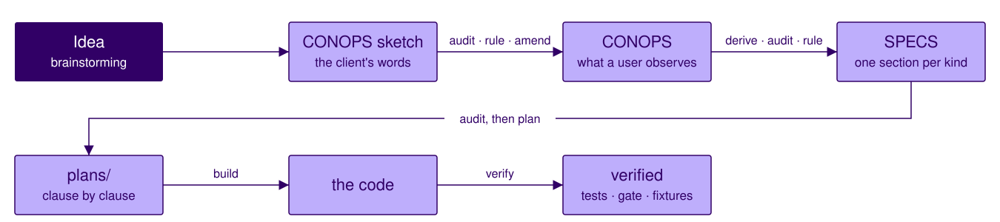
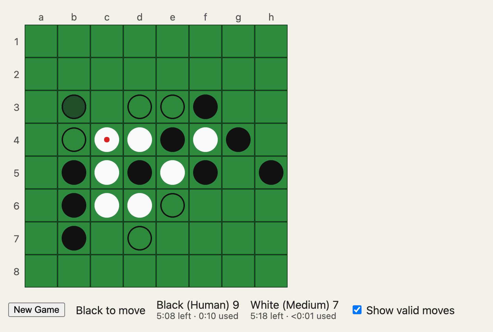
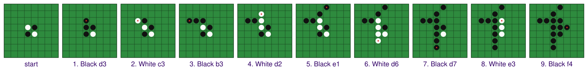

<!-- _class: lead -->

# Reversi Kickoff: Applying the Method

**Agentic Software Engineering — Software-Engineering Module**
Walks the Project 1 brief, step by step · launches Project 1

---

## Recap: from an idea to a verified program



At every arrow the agent proposes and you rule — *amend only with approval* (DEV-3). Unsettled questions go to `BACKLOG.md` — *defer explicitly* (DEV-6); a silence found downstream is amended first — *specification before realization* (DEV-2 (c)). *Specifying a Game* walked the top row and the build; *Verifying a Game*, the tests, the gate, and the fixtures. Project 1 runs this chain on Reversi.

<!-- Recap of the method as one chain. Name the lecture that showed each part; the rest of today walks the chain again, one step at a time, for Reversi. -->

---

## Reversi demo



Play it: **https://ase.santoslab.org/reversi/**

<!-- A minute of play, so the room knows the game before reading its sketch. It plays at four strengths (Random, Easy, Medium, Hard) or human against human. This build has more than Project 1 asks for (a clock, hover previews, a browser page); students build a terminal game. -->

---

## Project 1 — Reversi, specification-first

<style scoped>li { font-size: 25px; }</style>

- **You get:** the client's sketch, `CLAUDE.md`, `process/`, and the gate's configuration. No specification, no code, no tests.
- **You build:** a text-based Reversi, by the same chain as tic-tac-toe — `CONOPS.md` → `SPECS.md` → plan, engine, computer opponent, command line → test suite with the gate at 100% branch coverage → fixtures and their loader → a one-page report.
- **The decisions are yours:** everything the sketch leaves open — find it, rule on it, record the ruling, state it in the right document.
- **The evidence is the history:** two elicitation transcripts, amendments before the code that depends on them, every plan before its build, `BACKLOG.md` current.
- **Due Thursday, October 8, 11:55 pm.** Complete when every required element is present and honest.

<!-- The rest of today walks the brief's steps in order. -->

---

## What you will specify, and how each part is checked

<style scoped>table { font-size: 17px; } p { font-size: 24px; margin: 0.4em 0; }</style>

| Kind | Its audit demands | Verified by |
|---|---|---|
| concept of operations | observable by a user; implementation-free; every policy in a scenario (AUDCON-1 to 8) | validation — agents play the scenarios, the client decides |
| rules of play | every end condition, and which wins when two coincide; the turn after an accepted and a rejected move; the initial state (AUD-8) | unit tests; fixtures |
| display format | byte-exact; examples of the start, mid-game, and the end; every glyph and spacing (AUD-9) | golden-string tests |
| input grammar | one entry: every string a prompt accepts or rejects; whitespace, case, length (AUD-10) | each form fed to a prompt |
| interaction flow | the sequence: every menu and prompt, where each option leads, every exit, the state after each (AUD-11) | scripted sessions through each path |
| interface contract | each operation's parameters, pre- and postcondition, and behavior outside them — after the game is over, say (AUD-12) | unit tests; a type checker where used |
| example session | consistent, character for character, with display, grammar, and flow (AUD-13) | an end-to-end scripted run |
| verification obligations | every clause mapped to an obligation, and back (AUD-14) | reading the suite against §9 (VER-8) |

<!-- 0–6 min. The checklist for Project 1: Specifying a Game's table of kinds, with what each audit demands. Every kind the course uses, with these columns: specification-kinds.md. -->

---

## The brief's seven steps

<style scoped>table { font-size: 19px; }</style>

| Step | Produces | Rule | Ends with |
|---|---|---|---|
| **0** start | the starter, committed | read everything before acting (DEV-1) | `project 1 start: …` |
| **1** sketch → ConOps | `CONOPS.md` 1.0; transcript | audit the sketch; rule on every gap before writing (DEV-8, AUDCON) | `conops: 0.1 sketch -> 1.0` |
| **2** ConOps → `SPECS.md` | `SPECS.md` 1.0.0; transcript | audit `CONOPS.md`; rule on every open decision (DEV-8, AUD-8…14) | `specs: 1.0.0` |
| **3** `SPECS.md` → plan → build | `plans/001`; engine, opponent, CLI | audit `SPECS.md` itself; no code without an approved plan (DEV-8, DEV-9) | `plan: …`; `engine: …` |
| **4** the suite as a build; the gate | `plans/002`; `tests/`; gate green | every test cites its clause; 100% branch (VER-4…8) | `plan: …`; `tests: …` |
| **5** fixtures: file, then loader | `fixtures/`; `plans/003`; loader | the file is never edited to pass (VER-7, DEV-9) | `fixtures: …` ×2; `plan: …` |
| **6** close | `PROJECT-1-REPORT.md`; commands | coverage is not conformance (VER-8, VER-2) | `project 1: report` |

<!-- Today reads them in order, and opens the finished tic-tac-toe game's artifact at each. Nothing here is new; what is new is the game. Step 0 tonight: copy, git init, venv, one commit, read everything (DEV-1). -->

---

<!-- _class: standout -->

## Step 1 — the sketch to a concept of operations

You know the game. Read what the sketch says, not what the game does.

<!-- 6–18 min. Read §1.2 and §4.2 aloud; sort with the room; the tension; then the prompt and the form of rulings, on tic-tac-toe. -->

---

## The client's sketch — `CONOPS-sketch.md` (excerpts)

<style scoped>
.cols { display: grid; grid-template-columns: 1fr 1fr; gap: 28px; font-size: 16.5px; line-height: 1.35; }
.cols p, .cols li { margin: 0.25em 0; }
.cols ul { padding-left: 1.1em; margin: 0.2em 0; }
.cols h4 { font-size: 16.5px; margin: 0.5em 0 0.15em; color: #310066; }
</style>

<div class="cols"><div>

Version: 0.1 (sketch) · Status: *my general idea, written down in one sitting; not reviewed; nothing built.*

*Where I have not decided something I have written a question or "TBD" rather than guessing.*

#### §1.1 Identification
A text-based version of Reversi (some people know it as Othello) that you can play alone against the computer or with a friend at one keyboard.

#### §1.2 System Overview
Reversi is played on an 8-by-8 board … The board starts with a few discs already in the middle, the way the real game does. On your turn you put down a disc of your color so that one or more of the other player's discs are trapped in a straight line between your new disc and one you already have; the trapped discs flip over to your color. …
You say where you want to play by typing the square, like `d3` on a chessboard.

</div><div>

#### §4.2 Operational Policies and Constraints
- Two colors, black and white. Players take turns placing one disc of their color on an empty square.
- A move has to trap at least one of the other player's discs: in a straight line — across, down, or diagonally — … Everything trapped flips. If a square would trap nothing, you cannot play there.
- If you have no square you can play, you forfeit your turn.
- When the board is full, the discs are counted and whoever has more wins.

*Not decided yet: should the program show me where I am allowed to play, or make me work it out?*

#### §4.3 Modes · §5.1 Scenario · §7 Analysis
- When the game ends: show the count, then let you play again or go back to the start menu.
- … When the board fills up the program counts — 40 to 24, I win — and asks whether I want to play again. *(Probably need a two-player walkthrough too.)*
- Limitations: the computer plays randomly. No taking a move back.

</div></div>

<!-- Put the full file up in an editor if the room wants more. Point at the first-person voice, "TBD", the open question, and the two §4.2 bullets that the next slides pull apart. -->

---

## What §4.2 states, implies, and leaves out

<style scoped>table { font-size: 19px; } p { font-size: 22px; }</style>

| # | States | Implies | Leaves out |
|---|---|---|---|
| 1 | two colors; players alternate; one disc per turn, on an empty square | an opening position exists — "a few discs already in the middle" (§1.2) | who moves first? which discs, where? |
| 2 | a move must trap at least one disc, in a straight line — across, down, or diagonally | a move can trap in more than one direction — "everything trapped flips" | does every trapped line flip, or one? |
| 3 | a player with no square to play forfeits the turn | the other player moves next | is the forfeit announced? what if both players are stuck? |
| 4 | when the board is full, the discs are counted; more wins | the count is shown at the end (§5.1) | what if the counts are equal? can the game end before the board is full? |

**Important**: you know the game, so you will fill gaps from memory without noticing. If the sketch does not say it, it is a gap — record it and rule on it, even when you know the answer.

<!-- Say: the sketch comes in our skeleton only so the audit can point at "§4.2, second bullet". A real client hands you a paragraph or an email; sorting it into the skeleton is then your first move. What makes this a sketch is its state — first person, unreviewed, TBDs, one tension — not its shape. -->

---

## The tension

> "If you have no square you can play, you forfeit your turn."
> "When the board is full, the discs are counted and whoever has more wins."

Each is true of Reversi. Together they are incomplete: what if **both** players are stuck while squares are still empty? It happens — an example wipeout in nine moves:



Every disc is black; neither can move, with 51 squares empty. The sketch does not say what happens. Reading the two bullets side by side finds it: the document is not consistent with itself (AUD-2) — the same reason the audit runs before any plan (DEV-8).

<!-- Ask: "Both players are stuck with squares still empty. Can that happen? What does the program do?" The strip is the shortest game that ends with empty squares (a known result: nine moves); later in real games it happens more quietly, when the last empty squares sit where no line of alternating discs reaches them. Same kind of finding as tic-tac-toe's post-game options. Then three minutes for the room's own list. -->

---

## The prompt — step 1, as the brief prints it

> Read `CONOPS-sketch.md` and the process documents. I want a `CONOPS.md` 1.0 that realizes this sketch as a full-skeleton concept of operations. Before proposing anything, run the audits in `process/conops-audit.md` and `process/spec-audit.md` on the sketch (DEV-8) and report the gap list per RPT-1 — numbered, each with your recommended resolution. Then stop and wait for my rulings.

Word for word the prompt *Specifying a Game* typed on tic-tac-toe: it names no game. You type it on your own starter. The list you get back will be longer than yours, ordered differently, and will miss some of what you found.

<!-- The same words as the tic-tac-toe demo. The Reversi gap list is the student's to produce and rule on; nothing from it is shown here. -->

---

## What rulings and a deferral look like — tic-tac-toe

<style scoped>table { font-size: 21px; }</style>

| Gap | Ruling | Found by | Goes in |
|---|---|---|---|
| "five in a row" — does six win? | five **or more** wins | ambiguous (AUD-1) | the concept of operations, §4.2 |
| a win on the last empty square — win or draw? | the win takes precedence | incomplete (AUD-4) | the concept of operations, §4.2 |
| after a game: "play again or start menu" (§4.3) vs "play again or quit" (§5.1) | three options: play again, main menu, quit | inconsistent (AUD-2) | §4.3 and §5.1, made to agree |
| quitting in the middle of a game | **deferred** to `BACKLOG.md` (DEV-6) | incomplete (AUD-4) | — |

Each ruling says what was decided and which document it goes in. A deferral is a decision not to decide yet, recorded where the next reader finds it — not a guess. On Reversi, the rulings are yours.

<!-- From Specifying a Game's round 1. Students will make the Reversi equivalents; the tension on the previous slides is the one Reversi finding shown in class. -->

---

## From a ruling to an amendment

> Propose the amendment for item N per RPT-3 — document, clause, old text, new text, rationale citing the gap-list item, the version bump, the changelog entry — and wait for approval.

- **A ruling is not yet a change.** It becomes one as an amendment proposal: the exact edit, to the exact clause. *N* is an item of your own gap list.
- **The agent proposes; you approve.** It marks the proposal *awaiting approval* and waits: nothing in a governing document changes until you approve (DEV-3).
- **Every change traces back to a finding.** The rationale cites the gap-list item and the changelog records it — from any sentence of `CONOPS.md`, back to the finding that produced it.

Then the rest of step 1: the rewrite to `CONOPS.md` 1.0, and the audit run again.

<!-- If the agent starts writing CONOPS.md before approval, stop it: it skipped approval before amending (DEV-3). -->

---

## What a finished `CONOPS.md` looks like — tic-tac-toe's

- **§4.2** — a policy as a player observes it; never how the program does it (AUDCON-1, AUDCON-2)
- **§5.1–§5.4** — scenarios. Every mode (§4.3: main menu, solo, two-player, in-game turn loop, post-game) and every policy (§4.2: each rule a player observes) appears in at least one (AUDCON-3). Reversi: five at least — a pass and an early end are policies tic-tac-toe did not have
- **Version, status, changelog** (AUDCON-6) — "Version: 1.0", "Status: normative; maintained", and a changelog of every amendment. Yours needs all three

Ends with `conops: 0.1 sketch -> 1.0`, and the session exported to `transcripts/01-conops-elicitation.md` — the evidence that the document was elicited, not typed.

The file: [`demos/lecture-03-game-demo/reference/CONOPS.md`](https://github.com/santoslab/agentic-software-engineering-public/blob/main/module-software-engineering/demos/lecture-03-game-demo/reference/CONOPS.md)

<!-- Open demos/lecture-03-game-demo/reference/CONOPS.md at §4.2, then §5.4. -->

---

## The convergence rule: where the sketch is silent

**Where the sketch is silent, the client's intent is standard Reversi.**

- It does not let you skip a question: find every silence, look up the standard rule, record the ruling, state it in the right document. A standard rule left implicit fails completeness (AUD-4).
- It exists so that everyone builds the same game — standard Reversi — while the elicitation stays real.

**Yours to decide** (brief §4): glyphs; hints; the count during play; notation edge cases; post-game options; solo-play sides and alternation; error wording; interface shape; module split. Feedback looks at whether each is recorded, consistent, and stated in the right document — not at which way you decided.

---

<!-- _class: standout -->

## Step 2 — the concept of operations to `SPECS.md`

Same moves, new target.

<!-- 18–28 min. Demo Segment 3. -->

---

## The prompt — step 2, as the brief prints it

> Read `CONOPS.md` and the process documents. Derive `SPECS.md` 1.0.0 from it: one section per kind — board and coordinates; rules of play; display format, byte-exact; input grammar; interaction flow; interface contract with preconditions and postconditions; an example session; verification obligations. Before writing, run the audit (DEV-8) and list every decision the concept of operations leaves open, grouped by the kind of specification that must settle it, per RPT-1 with a recommendation each. Wait for my rulings.

Word for word the prompt *Specifying a Game* typed on tic-tac-toe: it names no game. The kinds are pre-picked; the catalog is the menu. The brief's §4 is the floor for the list. Every item gets a ruling. Then `specs: 1.0.0`, and a second transcript.

---

## What Reversi demands that tic-tac-toe did not

<style scoped>table { font-size: 19px; } p { font-size: 23px; }</style>

| Kind | Tic-tac-toe had | Reversi forces |
|---|---|---|
| rules of play | one cell written; a win is a line | a move changes many cells — in how many directions? What happens when one player cannot move, and when neither can? Who wins; can it tie? |
| initial state | an empty board | the four-disc opening — a completeness trap |
| display format | the grid, `.` for empty | the grid, plus a real decision: hints, and when |
| input grammar | `[1-9][1-9]` | `[a-h][1-8]` — a letter-to-index mapping; is `A3` accepted? |
| interface contract | `make_move → bool` | what does a move report back? How does a caller know a square is legal before trying it? |
| verification obligations | §9 | the same categories, harder engine; the policy unchanged |
| fixtures | moves → winner | moves → flips and a count; a scenario with a pass; an early end |

Each row is a question your `SPECS.md` must answer. The largest is the interface contract, where one move changes many cells at once.

---

## What a finished `SPECS.md` looks like — tic-tac-toe's

- **§4 Win Condition** — the rules of play as numbered clauses (§4.1–§4.3), so a test can cite one (AUD-5). Reversi: more clauses, one per rule
- **§5.1 `game.py`: `make_move`** — precondition, postcondition, behavior outside the precondition, including after the game is over (the interface contract, AUD-12; arrived at 1.2.0). Reversi: what does the postcondition say when one move changes many cells?
- **§7.2** — byte-exact, two examples (the display format, AUD-9). Reversi: plus the hints decision
- **§9.5** — obligations, not policy. The policy — the gate, coverage, test discipline, fixtures (VER-4 to VER-8) — is not yours to weaken. Read it against Reversi and see how much carries over

The file: [`demos/lecture-03-game-demo/reference/SPECS.md`](https://github.com/santoslab/agentic-software-engineering-public/blob/main/module-software-engineering/demos/lecture-03-game-demo/reference/SPECS.md)

<!-- Open each in demos/lecture-03-game-demo/reference/SPECS.md; the Changelog for §5.1's history. -->

---

<!-- _class: standout -->

## Step 3 — `SPECS.md` → plan → build

Audit the specification first, then plan, then build. The reason for the order is in tic-tac-toe's history.

<!-- 28–40 min. Demo Segment 4: the six commands, live. -->

---

## A silence in an earlier step propagates down — tic-tac-toe

<style scoped>li { font-size: 24px; }</style>

1. **`SPECS.md` 1.1.0 §5.1** — two reasons `make_move` returns `False`. Nothing about a move after the game is over.
2. **`plans/001`**, the `make_move` step — realizes "each rejection case §5.1 lists". Faithfully. There were two.
3. **`game.py`** — accepted a move after the game was over, exactly as the plan described.
4. **§9.5** at 1.1.0 — three failure obligations for `make_move`.
5. **`plans/002`** — realizes those three. No test claimed the missing clause.

Not one of them at fault. Each faithful to the one before it — and *downstream fidelity cannot recover information that was never in the specification.*

Which is why the audit precedes the plan (DEV-8). Then 1.2.0 records the ruling; the engine change and the citing test follow — amendment first, realization after (DEV-2 (c)).

<!-- The six greps of the demo script's Segment 4, in reference/. -->

---

## Step 3 in three prompts: audit, plan, build

<style scoped>blockquote { font-size: 20px; } p, strong { font-size: 22px; } blockquote p { margin: 0.2em 0; }</style>

**First — audit the specification (DEV-8):**
> Read `SPECS.md` and the process documents. Before any plan, run the audit in `process/spec-audit.md` on `SPECS.md` (DEV-8) — AUD-1 through AUD-7, and AUD-8 through AUD-14 section by section — and report the gap list per RPT-1. Then stop and wait for my rulings.

**Second — the plan and nothing else (DEV-9):**
> Read `SPECS.md` and the process documents. Propose a plan for the engine, the computer opponent, and the command-line interface — the modules `SPECS.md` §2 names — citing for each step the clauses it realizes, and wait for my approval.

**Third — approve, commit, build, report, commit:**
> Approve the plan. Commit it under `plans/` as `plan: engine, opponent, CLI (DEV-9)`. Then build the modules per the approved plan, report per RPT-5 with the clauses each module realizes, and commit as `engine: game, opponent, and CLI per SPECS 1.0.0`.

The third says nothing about *how*. The plan says that, clause by clause.

---

## The plan as an artifact — tic-tac-toe's `plans/001`

- **Step 1** — a clause per bullet; the `make_move` bullet is the one that inherited the silence
- **The preface** — "where the contract does not say, this plan does not say either"; a question the contract cannot settle goes to `BACKLOG.md`
- ***Verification at the end of this build*** — a human, one game per mode against §8, and the completion note (RPT-5) says so; a person is the verifier (VER-1). There is no suite yet

The module split is yours if your `SPECS.md` §2 says so; tic-tac-toe's — a pure engine, strategies as static methods, all I/O in the entry point — is the default.

<!-- Open plans/001 step 1; find the make_move bullet; then the Verification section. -->

---

<!-- _class: standout -->

## Step 4 — the suite is a build; the gate

Your `process/` already has the test rules *Verifying a Game* added (VER-5 to VER-8): that amendment is done for you.

<!-- 40–52 min. Demo Segment 5. -->

---

## The test-suite prompt, and a test plan beside §9.5 — tic-tac-toe

> Read `SPECS.md` and the process documents. Propose a plan for the test suite under `tests/`, one file per source module, that claims every obligation in `SPECS.md` §9: for each step, the obligations it claims and the clauses each test will cite (VER-6). Wait for my approval. Then commit the plan under `plans/` as `plan: test suite per SPECS 9 (DEV-9)`, write the suite, run the gate (VER-4), and report per RPT-5, including which obligations are claimed by at least one test and which are not (VER-8). Commit the suite as `tests: suite per SPECS 9 (VER-4 green)`.

Tic-tac-toe's `plans/002`, step 1, read beside its `SPECS.md` §9.5: every obligation checked off before a test exists. Its step 0, setting up the test harness, is smaller for you — `pytest.ini` and `requirements-dev.txt` are in your starter.

<!-- Open plans/002 step 1 next to SPECS.md §9.5. -->

---

## A test that cites its clause — tic-tac-toe

<style scoped>pre { font-size: 20px; }</style>

```python
def test_make_move_rejected_after_game_over():
    """SPECS §5.1: a move after the game is over returns False and changes nothing."""
```

Setup by direct assignment; behavior through `make_move` (test discipline, VER-6). The test that follows the 1.2.0 amendment.

```python
def test_prompt_human_rejects_invalid_forms(monkeypatch, capsys, bad_input):
    """SPECS §6.2: every invalid move form is rejected and re-prompted."""
```

One clause, eight forms, parametrized. **Reversi:** one case for each form your grammar rejects — `d9`, `i3`, and whatever else it rules out — in the order your grammar lists them. An occupied square or one that flips nothing is well-formed: the rules of play reject it, and its test cites that clause.

<!-- Open tests/test_game.py at line 111, tests/test_main.py at line 70. -->

---

## The gate and the two coverage lines (VER-4, VER-5)

```sh
pytest --cov=. --cov-branch --cov-report=term-missing --cov-fail-under=100
grep -n 'pragma' *.py
```

Exit 0; one pragma, on the `__main__` guard. The starter ships `.coveragerc` with `source = .` — every module in the root, whatever your split — and `pytest.ini`; neither is edited to weaken the gate.

**The completion note (RPT-5) carries two lines, because coverage is not conformance (VER-8):** branch coverage — a property of (tests, code); clause coverage — which §9 obligations at least one test claims — a property of (tests, specification). Different questions. *Verifying a Game*'s three sabotage steps: each line informative once, uninformative once.

Recommended, as *Verifying a Game* did on tic-tac-toe: delete the one test that claims some clause, run the gate — still green, 100% — and restore it. Then write one sentence: what the gate established, and what it did not. That is report item 2.

<!-- Run the gate in reference/, live: 99 passed, 100%. Then .coveragerc. -->

---

## Three kinds of change, from step 3 on (DEV-2)

<style scoped>table { font-size: 22px; }</style>

| Kind | What comes first | The history shows |
|---|---|---|
| **(a) repair** | a report (RPT-2) and a ruling (DEV-4) | no specification change |
| **(b) conformance-preserving** | nothing | the commit message says no specified behavior changed |
| **(c) change of specified behavior** | an amendment proposal (RPT-3), approved (DEV-3), version bump, changelog | amendment first, realization after; the audit run again (DEV-8) |

Implementation will find a silence — a move after the game is over; a pass after a pass; trailing whitespace. At least one (c) is expected. A question you cannot settle goes to `BACKLOG.md` (DEV-6).

---

<!-- _class: standout -->

## Step 5 — fixtures: the file first, then its loader

<!-- 52–62 min. Demo Segment 6. -->

---

## The fixture shape — brief §3.1 — and the eight kinds — §3.3

```json
{ "name": "black-opens-d3",
  "moves": ["d3"],
  "flips": [["d4"]],
  "expected": {"to_move": "white", "black": 4, "white": 1, "over": false} }
{ "name": "flips-nothing", "setup_moves": [], "attempt": "a1" }
```

- squares in your grammar's notation; the literal `"pass"` for a forced pass; colors `black` and `white` whatever your glyphs; for each move, the set it flips
- **at least:** an opening move with its flips · a multi-direction flip · a rejected move that flips nothing · a rejected non-square · **a pass** · **an early end** · a full board with its count · a tie
- a scenario's name cites its clause — tic-tac-toe's `x-wins-row-overline` is its §4.1 as moves

<!-- Open reference/fixtures/scenarios.json beside the brief's §3.1. -->

---

## The file first, the loader second

<style scoped>li, p { font-size: 24px; }</style>

- **The file** — `fixtures/scenarios.json` and `fixtures/README.md`: rules assumed, citing your clauses; the loader contract; **known blind spots**, declared and part of the contract. Every expectation checked against `SPECS.md` by hand. Committed before any loader exists.
- **The loader** — a build: plan, approval, `tests/test_fixtures.py`, gate, completion note (RPT-5), commit. Two parametrized functions, no expectations of their own.
- **Never edited to pass** (VER-7). A failing scenario is a finding about (fixture, specification): a gap in the gap list (RPT-1), and a person decides which side changes (DEV-4).
- The pass and early-end scenarios: engine-generated if you must; **verified against your specification by hand**, and the report says how. An engine is not the oracle for its own fixtures.

Three commits: `fixtures: scenarios.json and README (VER-7)` · `plan: fixture loader (DEV-9)` · `fixtures: loader (VER-7)`.

<!-- Open fixtures/README.md "Known blind spots", tests/test_fixtures.py, plans/003 "What this plan does not cover". -->

---

## Step 6 — the report

`PROJECT-1-REPORT.md`, one page, four items:

1. **The amendment(s) implementation forced** — one of them traced through five artifacts: the clause as it stood → the plan step → the code → the §9 obligation → the test plan or test. At which step, under which rule, your process caught it.
2. **One thing 100% branch coverage did not tell you** (VER-8).
3. **How the pass and early-end fixtures were constructed and checked** by hand.
4. **What remains for a human or agent verifier** — the judgment clauses (VER-2); what you could not verify by reading.

Then `CLAUDE.md`'s Commands — "once it exists" goes — and `BACKLOG.md` current. `project 1: report`.

<!-- 62–72 min. -->

---

## Required elements — all must be present

<style scoped>table { font-size: 15px; } h2 { margin-bottom: 0.3em; }</style>

| Step | Element | Rule |
|---|---|---|
| 0 | the starter as shipped in the initial commit; `CLAUDE.md`/`process/` unchanged except Commands and recorded amendments | amend only with approval (DEV-3) |
| 1 | `CONOPS.md` 1.0 — version, status, changelog; third person; implementation-free; sections filled; five scenarios; glossary | ConOps audit (AUDCON-1…8) |
| 2 | `SPECS.md` 1.0.0+ — eight sections; every clause numbered; byte-exact examples; §9 traced; changelog | traceable; per-kind audits (AUD-5, 8…14) |
| 1–2 | every §4 decision stated in one of the two documents; `transcripts/01-…`, `02-…`: two RPT-1 lists, rulings, RPT-3 amendments | complete (AUD-4); gap lists, amendments (RPT-1, 3) |
| 1–3 | history: `conops:` before `SPECS.md` work; `specs: 1.0.0` before any plan; every plan before its build | spec, then plan, then build (DEV-2, 7, 9) |
| 3 | `plans/001-…`; engine, opponent, CLI per `SPECS.md`; the game runs | plan, then build (DEV-9) |
| 4 | `plans/002-…`; every test cites; every §9 obligation claimed; gate green at 100% branch, one pragma; RPT-5's two lines | gate; tests cite clauses; coverage ≠ conformance (VER-4…6, 8) |
| 5 | `fixtures/scenarios.json` (§3.1 shape, §3.3 kinds) and `fixtures/README.md`, committed before `plans/003-…` and the loader | fixtures never edited to pass (VER-7) |
| 3–5 | ≥1 amendment committed before the code that depends on it; every realization commit (a)/(b)/(c); `BACKLOG.md` current | amend first; defer (DEV-2, 3, 6) |
| 6 | `PROJECT-1-REPORT.md` — four items, one five-artifact trace; `CLAUDE.md` Commands | coverage ≠ conformance (VER-8, 2) |

---

## Logistics

- **Adopted, not authored.** `process/` is the set *Verifying a Game* ended with, identical to tic-tac-toe's. The gate's configuration is the same policy; its `.coveragerc` has `source = .`, so it measures every module in the root. A rule changes only by amendment with a changelog entry (DEV-3); a change that weakens one is returned.
- **Due Thursday, October 8, 11:55 pm.** Project 0 is still due Thursday, October 1. Start Project 1 with step 0 tonight.
- **Where to ask.** The repository first (DEV-10); then `BACKLOG.md` or the course channel. A question about the rules of Reversi is answered by the convergence rule.

---

## Questions to think about

1. Which rulings in your gap list are yours, and which are the client's? Where does the brief draw the line, and why there?
2. Step 5 requires a scenario containing a pass. Before you trust one your own engine generated, what do you check it against, and how — and what does the fixture rule (VER-7) say about the file afterwards?
3. The after-game-over silence passed through five artifacts of tic-tac-toe's reference. At which step of the brief, and under which rule, would your Project 1 have caught it?
