<!-- _class: lead -->

# Agent Skills: Packaging a Method So an Agent Can Follow It

**Agentic Software Engineering — Software-Engineering Module**
Packages the method as a skill · assigns the skills exercise

<!--
Timing plan (75 min). LIVE = typed in class; ARTIFACT = shown from runs/ (slow or non-deterministic). Segments are in demo-script.md.
0–4 where we are, what a skill is · 4–10 neighbours, when (not) to · 10–17 grill-me, ponytail
17–23 using skills — LIVE Segment 1 · 23–33 how it works — ARTIFACT Segment 2 (+ optional live /context)
33–40 auto-invocation — ARTIFACT trigger table + LIVE Segment 3 · 40–43 locations/portability (Segment 3a, drop if late)
43–54 creating: conops v1 → v2 — ARTIFACT Segment 4 · 54–58 good skills, anti-patterns
58–67 evaluating — slides only (Segment 5) · 67–71 security, sharing, debugging, beyond coding · 71–75 exercise, before next meeting
The three closing questions are for students to think about; not graded, not discussed in class.
Pre-committed cuts if late: Segment 3a; ponytail's persistence slide (one sentence); the portability slide (point to the notes); the beyond-coding line.
-->

---

## Where we are: a prompt we keep typing

<style scoped>blockquote { font-size: 22px; } li, p { font-size: 25px; }</style>

The reference step 1 prompt:

> Read `CONOPS-sketch.md` and the process documents. I want a `CONOPS.md` 1.0 that realizes this sketch as a full-skeleton concept of operations. Before proposing anything, run the audits in `process/conops-audit.md` and `process/spec-audit.md` on the sketch (DEV-8) and report the gap list per RPT-1 — numbered, each with your recommended resolution. Then stop and wait for my rulings.

- **The same words, twice:** on tic-tac-toe earlier in the course, and on Reversi in Project 1 — it works on any sketch. Step 2's prompt is the same, for `SPECS.md`.
- **Most of the method is not in the prompt.** It is in the files it names: what the audits check, and what a gap list must contain.

Package the prompt and those files together, and you have a skill.

Today: what a skill is · how the harness loads one · when (not) to use one · how to write one · **how to tell whether it works**.

<!--
0–4 min.
Ask the room: who has typed this prompt more than once? That is the first test for a skill.
The last item is the one the course cares about: evaluation, the way Verifying a Game evaluated code.
-->

---

## What is an agent skill?

An **agent skill** is a folder of instructions that teaches an agent **how to do one kind of task**, which the agent loads **only when that task comes up**.

- **`SKILL.md`** — a `name`, a `description` of what it does and when to use it, then the procedure in plain Markdown
- **bundled files**, optional — templates, checklists, scripts the procedure points to
- **loaded on demand** — the agent sees every skill's description all the time; it reads the body only when a task matches, or when you type `/name`

A prompt you would otherwise retype, saved where the agent can find it — with its materials beside it.

<!-- The one-sentence definition first; the rest of the lecture unpacks each bullet: the folder (slide "What a skill is: a folder"), on-demand loading ("Three levels of loading"), and who triggers it ("Automatic invocation"). -->

---

## What a skill is: a folder

```markdown
---
name: conops-from-sketch
description: Turns a concept-of-operations sketch into a governed CONOPS.md
  by the audit-first method … Use only when the developer explicitly asks …
  Not for explaining what a ConOps is, summarizing a sketch, or editing …
---
# CONOPS from a sketch
…the procedure…
```

Our finished skill (v2 — next slide):

```
conops-from-sketch/
├── SKILL.md                 the procedure: three steps; after each, it waits for you
├── probes.md                questions to ask about any sketch
├── gap-report-template.md   the report's shape
├── checklist.md             fallback audit, only if the repo has none
└── agents/openai.yaml       Codex (OpenAI's agent): only you may start it
```

In the course's public repo: [`demos/lecture-06-skills/conops-from-sketch`](https://github.com/santoslab/agentic-software-engineering-public/tree/main/module-software-engineering/demos/lecture-06-skills/conops-from-sketch)

<!--
name = folder name, lowercase with hyphens. description = what it does and when to use it.
Everything else in the folder is bundled and referenced from the body by relative path.
This is the worked example we will come back to at minute 43.
-->

---

## Our running example: two versions of one skill

<style scoped>li { font-size: 25px; }</style>

Both turn a concept-of-operations sketch into `CONOPS.md`, on the tic-tac-toe starter.

- **v1, `conops` — the obvious skill.** One line of description (*"Helps with CONOPS documents."*); the body says to write the document and *fill any missing details with sensible defaults*. The model may start it on its own. [(download)](https://downgit.github.io/#/home?url=https://github.com/santoslab/agentic-software-engineering-public/tree/main/module-software-engineering/demos/lecture-06-skills/conops)
- **v2, `conops-from-sketch` — our method, packaged.** Audit the sketch, list the gaps, **stop** for your rulings; then write. Only you can start it. Its first draft (iter1) was tested and improved once; the second draft (iter2) is the final version. [(download)](https://downgit.github.io/#/home?url=https://github.com/santoslab/agentic-software-engineering-public/tree/main/module-software-engineering/demos/lecture-06-skills/conops-from-sketch)

Today's slides show how each was loaded and started, and how each did.

<!-- Introduced here so later slides can say v1 / v2 without explanation. Full text: "Version 1" and "Version 2" slides. -->

---

## A short history: from always-on instructions to skills

<style scoped>table { font-size: 21px; } p { font-size: 24px; }</style>

| | What | Who triggers it |
|---|---|---|
| custom instructions | one always-loaded file: `CLAUDE.md`, `AGENTS.md` | nobody — always there |
| saved prompts (slash commands) | a file whose text becomes your prompt when you type `/x` | the user |
| **Agent Skills** (Oct 2025) | a folder + a description the **model** reads | the user, **or the model** |
| open standard | [agentskills.io](https://agentskills.io): the same `SKILL.md` folder, read by many other agents | as above |

Commands have since merged into skills (Claude Code docs): a command file now works like a skill without a folder — the model can start it too.

**In short**: `CLAUDE.md` holds facts every session needs; a skill holds *how to do a thing*, recalled when the thing comes up.

<!--
Two things the skill added to the saved prompt: a folder of materials, and a description the model reads so it can choose the skill itself.
Docs quote: code.claude.com/docs/en/skills, fetched 2026-09-27. Launch: "Introducing Agent Skills", claude.com/blog/skills, October 16, 2025; its update note of December 18, 2025 publishes the open standard.
Declarative vs procedural memory is an analogy, not a mechanism.
-->

---

## Skills and their neighbours

<style scoped>table { font-size: 19px; }</style>

| Mechanism | Loaded | Triggered by | Use it for |
|---|---|---|---|
| `CLAUDE.md` / `AGENTS.md` | always | — | what every session needs |
| **skill** | description always; body on use | user (`/name`) or model | a recurring multi-step procedure with materials |
| subagent — a separate agent with its own context, given one task | when delegated to | model or user | work whose *intermediate* output would clutter the context |
| MCP server — a program that gives the agent new tools | tool descriptions at start | model, on a tool call | **capabilities** the agent lacks |
| hook — a script the harness runs on an event, e.g. before every tool call | on an event | **the harness, deterministically** | what must happen every time |
| plugin — an installable bundle of skills, hooks, and MCP servers | when installed | its parts | distributing a set of the above |

<!--
4–10 min. Read the "Use it for" column aloud, top to bottom.
The mistake people make most: a must-always rule written into a skill or CLAUDE.md, where a hook belongs.
-->

---

## Skill, `CLAUDE.md`, MCP, or hook?

- **Skill or `CLAUDE.md`?** Every session needs it: `CLAUDE.md`. Only some sessions, and more than a line: a skill. (A `CLAUDE.md` line pointing to a procedure file works too — the tic-tac-toe starter's audits work that way. The main gain of a skill is **structure**: each procedure in its own named folder, with its materials, instead of a growing `CLAUDE.md`. It also gets a name you can type and its own controls.)
- **Skill or MCP?** A skill says *how* to use the tools the agent has. MCP gives it a tool it lacks.
- **Skill or hook?** A skill is text the model reads: it **usually** follows it, not always. A hook is a program the harness runs. If it *must* happen, it is a hook, a permission rule, or a test.

<!--
Point at the course's own CLAUDE.md: it already works like a skill listing — a map, with the details loaded when needed.
The hook line sets up the key result at minute 35: a skill governs only the requests that invoke it.
-->

---

## When to write a skill — and when not

**Write one when all three hold:**

1. You do it **more than once** (typed it three times? candidate).
2. The model does **not already** do it the way you need.
3. It is **procedural and has materials** — steps, stops, a template, a checklist, a script.

**Don't:**

- a one-off request: just type a prompt
- something the model already does well ("summarize this file")
- a single fact: put it in `CLAUDE.md`
- something that must **always / never** happen: use a hook, a permission rule, or a test

<!--
Criterion 2 is where our method qualifies: by default the model fills gaps; we need it to ask.
-->

---

<!-- _class: standout -->

## Two skills in the wild

<style scoped>p { font-size: 28px; text-align: left; }</style>

Two popular open-source skills on GitHub:
grill-me (Matt Pocock, [`mattpocock/skills`](https://github.com/mattpocock/skills)) makes the agent **question you about your plan** before acting on it.
ponytail (Dietrich Gebert, [`DietrichGebert/ponytail`](https://github.com/DietrichGebert/ponytail)) makes the agent **write less code**.

<!-- 10–17 min. Source: research/skill-evolution.md. The mechanisms these stories mention (the Skill tool, disable-model-invocation, compaction) are explained at minute 23; say so. -->

---

## grill-me: how a two-sentence skill grew

<style scoped>table { font-size: 16px; } p { font-size: 21px; margin: 0.3em 0; } h2 { margin-bottom: 0.2em; }</style>

The first version, February 2026: *"Interview me relentlessly about every aspect of this plan until we reach a shared understanding. Walk down each branch of the design tree, resolving dependencies between decisions one-by-one."* Then, over six months:

| Change | Reason given |
|---|---|
| added a name and description, so the agent can find it | "add missing frontmatter" |
| "give your recommended answer"; "ask one question at a time" | none beyond restating the change |
| split into two skills: `grill-me`, which you type, and `grilling`, which the agent may start | "consolidated grilling and handoff skills" |
| renamed "Interview" to "**Grill**"; added "do not act on the plan until I confirm" | "grill" already means relentless questioning to the model |
| "look up **facts** yourself; ask me only for **decisions**" | before this, it answered its own questions |
| from one question at a time to **rounds** of several | "Same 13 questions land in ~3 rounds" — never measured |
| `grill-me`'s one line, from "Run `/grilling`" to "Call the Skill tool with 'grilling'" (Skill: the tool the model uses to load a skill) | "a higher hit rate" — never measured |

Only the facts/decisions change fixed a failure users actually reported: the skill answered its own questions instead of asking you. The rest cite no measurement. That fix is our own rule: the agent recommends, the developer decides.

<!--
The facts/decisions rewrite came from a bug: reused inside another skill, "explore the codebase instead" read as licence to answer its own questions.
Note how many changes cite no measurement. That is the thread for minute 58.
-->

---

## grill-me: what went wrong, and how its author knew

<style scoped>li, p, blockquote { font-size: 23px; }</style>

- **One question, or several?** In June the skill said to ask one at a time, because, it said, *"asking multiple questions at once is bewildering."* In July the author switched it to several at once, without measuring. A user then asked in a GitHub issue: *"Can we get the old grill-me back?"* A user caught the problem; no test did.
  - *Resolution:* rounds stayed. The docs now say how to opt out: add *"When grilling, ask one question at a time."* to your `CLAUDE.md`. The issue is still open.
- **"Call the Skill tool"** broke in two ways. Codex has no tool by that name. In Claude Code, the flag that keeps the model from starting `/grill-me` (`disable-model-invocation: true`) also made that line fail, with Claude Code's error: *"Skill grill-me cannot be used with Skill tool due to disable-model-invocation."*
  - *Resolution:* none yet. Both reports are open GitHub issues; the line is unchanged in today's version (next slide).

grill-me's author, in his guide to writing skills: *"There is no automated eval here; the check is a manual run …"*

We found **no tests** of grill-me — only use, popularity, and user issues.

<!--
Attribute the quote carefully: it is his general advice page, not a claim about grill-me.
Dates: the "bewildering" line 2026-06-17, the rounds change 2026-07-16.
-->


---

## grill-me today (`d81f3a1`): the part you type

<style scoped>pre { font-size: 20px; } p { font-size: 23px; }</style>

`skills/productivity/grill-me/SKILL.md`:

```markdown
---
name: grill-me
description: A relentless interview to sharpen a plan or design.
disable-model-invocation: true
---

Call the Skill tool with "grilling".
```

`disable-model-invocation: true`: only you can start it. `agents/openai.yaml` does the same for Codex:

```yaml
interface:
  display_name: "Grill Me"
  short_description: "Sharpen a plan through interview"
policy:
  allow_implicit_invocation: false
```

This file only hands off to the second skill, `grilling`, which holds the procedure — next slide.

<!-- github.com/mattpocock/skills, commit d81f3a1 (2026-09-29), fetched 2026-09-30. Re-fetch the morning of class if it matters. -->

---

## grill-me today (`d81f3a1`): `grilling`, the procedure, verbatim (one repeated example cut)

<style scoped>pre { font-size: 13.5px; line-height: 1.3; } h2 { margin-bottom: 0.2em; }</style>

````markdown
---
name: grilling
description: Grill the user relentlessly about a plan, decision, or idea. Use when the user wants to
  stress-test their thinking, or uses any 'grill' trigger phrases.
---

Interview the user relentlessly until you reach a shared understanding. Map this as a **design tree**: every
decision branches into the decisions that hang off it.

Work the tree in **rounds**. The **frontier** is every decision whose prerequisites are already settled: the
questions you can ask _now_ without guessing at answers you haven't heard yet. Ask the whole frontier in one
round: number each question and give your recommended answer. Then wait for the user's answers before the next round.

Format a round like so:

```
❓ **Q1** - **<question title>**: <question body, might be multiple paragraphs, including multiple choices>

➡️ <your recommended answer>
```

Each round the user answers reshapes the tree: settled decisions push the frontier outward and unblock questions
that depended on them. Recompute the frontier and ask the next round. A question whose answer depends on another
question still open in this round belongs to a _later_ round, not this one.

Finding _facts_ is your job, never the user's. When a frontier question needs a fact from the environment
(filesystem, tools, etc.), dispatch a sub-agent to find it; don't ask the user for anything you could look up
yourself. Don't block on it: a running exploration is an unsettled prerequisite, so only the questions downstream
of it wait for the sub-agent to report; ask the rest of the frontier now. The _decisions_ are the user's: put
each to them and wait.

The session is done when the frontier is empty: every branch of the design tree visited, nothing left silently
assumed. Do not act on it until the user confirms you have reached a shared understanding.
````

<!-- Same commit. The round format in the file shows Q1 and Q2; Q2 is cut here for space (it repeats Q1's shape). Everything else is verbatim, rewrapped. Point out: rounds, facts vs. decisions, the hard stop — each a row of the history table. -->

---

## ponytail: changes driven by measurement

<style scoped>li, p { font-size: 22px; }</style>

**Why:** agents over-build. Asked for a date picker, one installs a library, writes a wrapper and a stylesheet. ponytail's answer: `<input type="date">`.

ponytail tells the agent to write **the least code that works**; its skill opens *"You are a lazy senior developer. Lazy means efficient, not careless."* It ships as a **plugin**: the skill plus hooks and an MCP server.

- **An early version's rule, "say less", made the code short but the replies long** — essays to the user explaining what was skipped on purpose. The rule now reads: *"Code first. Then at most three short lines: what was skipped, when to add it."*
- **Description rewritten so the agent starts it when it should**: *"Use on ANY coding task … Do NOT use for non-coding requests."* On 12 test prompts (6 coding, 6 not), it started on 2 of 6 coding prompts before, **6 of 6** after, and on none of the others either time. (Numbers from the commit; the test harness is not published.)
- **A user, in a GitHub issue, called it "dangerously lazy"**: asked to fix a bug, it patched only the caller named in the report and left the same bug in the others. The skill now says: *"one guard in the shared function is a smaller diff than a guard in every caller"* — the right fix, argued as the lazier one. A plain "trace the flow end to end" had not worked.

Unlike grill-me, which asks first: *"Ship the lazy version and question it in the same response."*

<!--
The lesson of the first bullet: a quantified cap worked where an adjective did not.
Each skill is right for its job: grill-me stalls for the human; ponytail ships and asks in the same breath.
-->

---

## ponytail: what a skill alone cannot do

ponytail must hold on **every** coding turn. A skill applies only if the model starts it. After a long conversation is compacted (summarized to free space), Claude Code re-adds used skills only within a budget, so older ones can drop out — and other agents may not re-add them at all. So ponytail also uses hooks:

- when a session **starts, resumes, is cleared, or is compacted**: re-insert the rules
- on **every prompt you send**: save how strict ponytail is set to be — *lite* (suggest the lazier option), *full* (enforce it; the default), *ultra* (delete first) — in a file, not in the model's memory
- when a **subagent starts**: insert the rules there too, because rules added at session start never reach subagents

Hooks fire whatever the task: a research agent used to prepare this lecture got ponytail's coding rules, though it was not coding.

<!--
Cut to one sentence if running long.
Hooks are deterministic: the harness runs them whatever the model decides. That is why ponytail's persistence is in hooks, not prose.
-->

---

<!-- _class: standout -->

## Using skills

Where skills live, and how to start and list them

<!-- 17–23 min. LIVE: demo-script.md Segment 1 (write /cite-rule, invoke it). -->

---

## Where they live, how to invoke them

<style scoped>table { font-size: 20px; } ul { font-size: 24px; }</style>

| Location (Claude Code docs) | Scope | Invoked as |
|---|---|---|
| `~/.claude/skills/<name>/SKILL.md` | you, every project | `/<name>` |
| `.claude/skills/<name>/SKILL.md` | everyone who clones the repo | `/<name>` |
| `<subdir>/.claude/skills/…` | that part of a monorepo | `/<name>` |
| plugin `skills/<name>/SKILL.md` | whoever installs the plugin | `/<plugin>:<name>` |
| a system folder your administrator controls, e.g. `/etc/claude-code/.claude/skills/` | the whole organization | `/<name>` |

- Same name in two places: organization wins over personal, personal over project. Edits are picked up live.
- **Arguments**: in `/cite-rule AUD-2` (our demo skill), the body's `$ARGUMENTS` becomes `AUD-2` (`$0` is the first word). A body without `$ARGUMENTS` gets them appended at the end.
- **Listing**: type `/` for the menu, or ask *"What skills are available?"*

<!--
Table, precedence, live reload, and argument rules: Claude Code docs, code.claude.com/docs/en/skills, fetched 2026-09-27.
Then go to the live terminal (~/skills-demo) for Segment 1: create cite-rule, show it in the / menu, run /cite-rule AUD-2, ask "What skills are available?".
-->

---

<!-- _class: standout -->

## How it actually works

What the harness does, and the transcripts that show it

<!-- 23–33 min. ARTIFACT: demo-script.md Segment 2 (jq over runs/v1-trig-write.jsonl). Two kinds of evidence from here on: our transcripts (Claude Code 2.1.281), and the docs (fetched 2026-09-27). Say which is which. -->

---

## Three levels of loading



**Progressive disclosure**: name and description always; the body when used; bundled files only when the body sends the model to them.

<!--
Left to right: what is paid every turn, what is paid from invocation on, what is paid only if read.
The compaction box is from the documentation, not from our runs.
-->

---

## At session start: only names and descriptions

The first line of the log when Claude Code runs non-interactively (`claude -p`, JSON output):

```json
{"type":"system","subtype":"init","model":"claude-sonnet-5",
 "claude_code_version":"2.1.281",
 "skills":["conops","deep-research","design", … ,"run-skill-generator"],
 "slash_commands":["conops", … ,"clear","compact","context","init", …]}
```

- `conops` is our v1 skill; the rest come with Claude Code. The log shows only **names**; the descriptions go to the model but are not logged.
- Docs: each description is cut at **1,536 characters**. All descriptions together may use about **1% of the context window**; if there are more, Claude Code drops the descriptions of the skills you use least, keeping only their names — so the model can no longer match a task to them.

<!--
Transcript: runs/v1-trig-write.jsonl line 1. The skills field is observed; the headless docs describe init as reporting model, tools, MCP servers, plugins.
Budget numbers: docs, fetched 2026-09-27 — re-check the morning of class if the version changed.
-->

---

## On use: the body

Our v1 skill; the prompt *"Turn CONOPS-sketch.md into CONOPS.md"*, no `/conops` typed:

```json
{"type":"tool_use","name":"Skill","input":{"skill":"conops"}}
{"type":"tool_result","content":"Launching skill: conops"}
{"type":"user","isSynthetic":true,"message":{"content":[{"type":"text",
 "text":"Base directory for this skill: …/.claude/skills/conops\n\n
   Turn the CONOPS sketch into CONOPS.md. … Fill in any missing
   details with sensible defaults so the document is complete.\n"}]}}
```

The body arrives as **one message** the harness inserts as if from you (`isSynthetic`), with its folder's path, so it can point to its other files.

<!--
Transcript: runs/v1-trig-write.jsonl. The model chose the skill by calling a tool named Skill; the harness then injected the body as a synthetic user message.
When the user types /conops the same body is injected without the model choosing (our v2 runs: /conops-from-sketch as the whole -p prompt).
-->

---

## Bundled files: on demand, visible in the transcript

One run of our finished skill (v2), files it read, in order (`skill:` = the skill's folder):

```
CONOPS-sketch.md, process/README.md, process/conops-audit.md,
process/spec-audit.md, skill:…/probes.md, skill:…/gap-report-template.md
```

- The skill's files were opened **only when its instructions sent the agent there**, with the ordinary Read tool.
- v2's first draft (iter1): 2 of 3 runs also opened `checklist.md` — unneeded: the repo has its own audits.
- The second draft (iter2) added one sentence: *don't open the checklist when the repo has its own audit.* How it knows: the skill's first step says to look in the repo's `process/` folder for audit files — here `process/conops-audit.md` and `process/spec-audit.md`. They exist, so it uses them. Then **0 of 3** opened the checklist.

<!--
The Read calls show most loads. One Reversi run used cat through Bash instead — look for both when you read a transcript.
A bundled file you tell the model not to open costs nothing.
-->

---

## What a skill costs in context

<style scoped>table { font-size: 22px; } p { font-size: 24px; }</style>

| What | Paid when | How much |
|---|---|---|
| name + description | every turn, every session it is installed in | a few lines |
| body | from invocation, for the rest of the session | length of `SKILL.md` |
| bundled files | only when read | their length |

**Persistence** (Claude Code docs): the body *"stays there across later turns … Claude Code does not re-read the skill file"* — so write rules that hold all session, not "first do X" steps.

**Compaction** (Claude Code docs): used skills are re-added, up to **5,000 tokens** each and **25,000** in all, newest first; older ones may drop. If a skill drops out: start it again, or use hooks, as ponytail does.

<!--
Persistence and compaction figures: docs, fetched 2026-09-27. Our runs were short and never compacted.
Why this matters: long reference material belongs in a bundled file, not the body.
-->

---

## Running a shell command inside a skill (docs)

`` !`git log --oneline -5` `` in the body: **Claude Code itself** runs it when the skill starts and puts the output in its place. The model never sees the command, only the result.

- useful for current facts: the git branch, the files in `process/`
- it runs **on your machine**, **every time the skill starts** — read every one before installing a skill
- if your permission rules don't allow it, or it fails, the skill doesn't start
- to turn it off: `"disableSkillShellExecution": true` in your settings

<!--
From the docs, fetched 2026-09-27; our evaluation did not use ! commands. Segment 1's cite-rule skill uses one (!`ls process/`).
Optional LIVE: /context in the demo session, the Skills row.
-->

---

## The Claude Code extensions that matter most (docs)

| Field (Claude Code only) | Effect |
|---|---|
| `disable-model-invocation: true` | only you can start it, with `/name`; the model never sees its description |
| `user-invocable: false` | model only; hidden from the `/` menu |
| `allowed-tools` | the listed tools run without a permission prompt, **while the skill runs** |
| `context: fork` + `agent` | runs the skill in a subagent, **without the conversation history** |

<!--
All from the docs, fetched 2026-09-27. allowed-tools is also in the open standard, marked experimental.
Not on the slide (in the notes): model and effort (override for the rest of the turn); when_to_use (more trigger text); paths (file-scoped activation); argument-hint; disallowed-tools.
-->
---

<!-- _class: standout -->

## Automatic invocation, and how to prevent it

Does the agent start the skill when it should — and **not** when it shouldn't?

<!-- 33–40 min. ARTIFACT: EVAL.md "Trigger tests" (shown from the next slide), then LIVE demo-script.md Segment 3 (two prompts). -->

---

## Our trigger tests

<style scoped>table { font-size: 20px; }</style>

Each version alone in a fresh copy of the tic-tac-toe starter; no slash command.

| Prompt | v1 — *"Helps with CONOPS documents."* | v2 — `disable-model-invocation: true` |
|---|---|---|
| "What is a concept of operations?" | not started; no file read; a general answer, tied to this repo via `CLAUDE.md` | the same |
| "Summarize CONOPS-sketch.md" | not started; read the sketch | the same |
| "Turn CONOPS-sketch.md into CONOPS.md" | **started** — and wrote the file | **not started** — and **wrote the file anyway** |

Even v1's vague description started the skill on the one request that writes a file — and v1 says to fill gaps with "sensible defaults".

<!--
The first row also shows a neighbour at work: the always-loaded CLAUDE.md shaped an answer with no skill involved.
v2's name was in the init list; the transcript has no Skill call.
-->

---

<!-- _class: standout -->

## Blocking automatic start stops the skill, not the task

v2 was installed with `disable-model-invocation: true`, so the agent could not start it. Asked to turn the sketch into `CONOPS.md`, it did the job without the skill — resolved a contradiction itself, skipped several gaps, asked nothing — and summed up its work as:

**"mechanical, no new policy invented"**

<!-- runs/v2-trig-write.summary.md. A skill governs only the requests that invoke it. Must-never → hook, permission rule, or gate. This is the first closing question. -->

---

## Controlling when a skill starts, gentlest to strongest

<style scoped>li, p { font-size: 22px; }</style>

- **A tighter description** — what it is for *and not for*. Ours: *"Not for explaining what a ConOps is, summarizing a sketch, or editing an existing CONOPS.md."* Ponytail: *"Do NOT use for non-coding requests."*
- **Scoping** — a project skill in the one repo that uses the method, not a personal skill everywhere; or the `paths:` field, to offer it only when matching files are being worked on.
- **`disable-model-invocation: true`** — for skills with side effects: only you can start them.
- **Permission rules** in settings (docs) — deny one skill by name, e.g. `Skill(deploy)`; deny `Skill` to turn all skills off.

Watch for: `disable-model-invocation: true` also blocks **other skills** from calling this one through the Skill tool — the error grill-me hit.

The vendors disagree on the third control. Claude Code's docs: use it for workflows you start by hand. OpenAI's `skill-creator`: keep automatic start on, and ask for approval just before the risky step.

<!--
Then LIVE Segment 3 in ~/skills-demo: "What does AUD-2 say?" (should fire cite-rule) and "What is a concept of operations?" (should not). Seconds each.
If the first does not fire, that is the point: invocation is probabilistic; /cite-rule AUD-2 always works.
-->

---

## Where skills live across harnesses

<style scoped>ul { font-size: 24px; }</style>

```
v2/.claude/skills/conops-from-sketch/     the one copy (Claude Code)
v2/.agents/skills -> ../.claude/skills    a symlink: where other agents look
```

- **Skills:** many other harnesses read `.agents/skills/`; Claude Code reads nothing under `.agents/` — hence the symlink (ironic, since Anthropic published [agentskills.io](https://agentskills.io) as an open standard). **Check each tool's current docs.**
- **Memory:** Claude Code reads `AGENTS.md` only when there is **no** `CLAUDE.md`.
- **One file for both:** a `CLAUDE.md` whose one line is `@AGENTS.md` (an import), or a symlink; the import avoids the Windows problem below and leaves room for Claude-only lines.
- **Fields every agent understands** ([agentskills.io](https://agentskills.io/specification)'s six): `name`, `description` (required); `license`, `compatibility`, `metadata`, `allowed-tools`. The rest is Claude Code's — v2's `disable-model-invocation` included.
- **Windows**: symlinks need Developer Mode or admin rights; git may check them out as text files. Test, or copy.

<!--
40–43 min. Segment 3a: ls -l v2/.agents/ — drop if late.
Sources: agentskills.io specification; Claude Code skills and memory docs, fetched 2026-09-27. The Windows caveat is general knowledge; check before class.
-->

---

## One skill, four harnesses: who may start it?

<style scoped>table { font-size: 19px; } p { font-size: 22px; }</style>

| Harness | Finds v2 in | Keeps the model from starting it | You start it with |
|---|---|---|---|
| Claude Code | `.claude/skills/` | `disable-model-invocation: true` in `SKILL.md` | `/conops-from-sketch` |
| Codex | `.agents/skills/` | `policy: allow_implicit_invocation: false` in `agents/openai.yaml` | `$conops-from-sketch` |
| OpenCode (open-source agent) | `.claude/skills/` or `.agents/skills/` | nothing in the folder — `"permission": {"skill": {"conops-from-sketch": "ask"}}` in `opencode.json` | ask in chat |
| Grok (xAI) | `.claude/skills/`, `.agents/skills/`, or `.grok/skills/` | `disable-model-invocation: true` in `SKILL.md` — the same as Claude Code | `/conops-from-sketch` |

Codex and OpenCode ignore Claude Code's setting; Grok honors it (per its docs). Our test, one run each, *"Turn CONOPS-sketch.md into CONOPS.md"*: Codex without `openai.yaml` **started v2 on its own**; with it, did not.

The standard makes one folder **load** in every agent; **who may start it** is still set per agent.

<!--
Sources: Codex skills docs (learn.chatgpt.com/docs/build-skills), OpenCode skills docs (opencode.ai/docs/skills), fetched 2026-09-30. Codex test: runs/codex-invocation/{A,B}.jsonl, codex-cli 0.159.2, read-only sandbox, fresh tic-tac-toe starter.
v2 now ships agents/openai.yaml; SKILL.md and the bundled files are unchanged, so the evaluation still holds.
-->

---

<!-- _class: standout -->

## Creating a skill: the worked example

Read a sketch, list its gaps, **stop** for rulings
Evaluated on the tic-tac-toe starter, against the 14 gaps we found in its sketch earlier in the course

<!-- 43–54 min. ARTIFACT: demo-script.md Segment 4 — v1-naive/, v2/, runs/*.summary.md, iterations/iter1-to-iter2.diff. -->

---

## Version 1: the obvious skill

```markdown
---
name: conops
description: Helps with CONOPS documents.
---

Turn the CONOPS sketch into CONOPS.md. Use the standard ConOps sections and
write it professionally. Fill in any missing details with sensible defaults so
the document is complete.
```

Read it as a specification: it never says *when* to use it, or when to stop. "The standard ConOps sections" names no sections, and v1 has no template. The runs still wrote nine numbered sections — copied from the sketch, which already uses them, and from the repo's `process/conops-audit.md`, which lists them. And **"sensible defaults" is a policy** — the opposite of our method, where the developer rules on every gap.

<!--
Ask the room before the next slide: what will this do on a sketch with fourteen gaps?
-->

---

## Version 1: what it did (3 runs)

- **Never stopped to ask you.** Every run wrote a finished `CONOPS.md`, deciding nearly all 14 gaps itself: that five or more in a row wins; that five in a row made on the board's last square is a win, not a draw; it silently kept one of two conflicting lists of after-game options.
- Read `process/` and listed the gaps — then answered them itself instead of asking.
- **Invented a rule** (in one run): *A mark, once placed, cannot be retracted; there is no "undo."* The sketch says nothing of it; an *example* in the repo's audit rules mentions "no taking a move back", and the run took it as a rule of this game.
- Put "which side is the human?" in the backlog (the list of open questions) — and in the same run answered it in `CONOPS.md`: *"the player is assigned X and moves first"*.

**The body of a skill is policy.** "Sensible defaults" is a policy of inventing facts.

<style scoped>ul { font-size: 24px; }</style>

<!--
Sources: runs/v1-run1.summary.md (the "applied directly" line, gap 1), runs/v1-run2/CONOPS.md:83, runs/v1-run1/CONOPS.md.
The repository's own process documents pulled v1 halfway toward the method; the skill's "sensible defaults" pulled it the rest of the way back.
-->

---

## Version 2: the skill, abridged

<style scoped>pre { font-size: 14.5px; line-height: 1.3; } p { font-size: 20px; margin: 0.2em 0; } h2 { margin-bottom: 0.2em; }</style>

````markdown
---
name: conops-from-sketch
description: >-
  Turns a concept-of-operations sketch (e.g. CONOPS-sketch.md) into a governed CONOPS.md 1.0 by the
  audit-first method: audit the sketch, report a numbered gap list, wait for the developer's rulings,
  propose amendments, wait for approval, then write and re-audit. Use only when the developer explicitly
  asks to turn a sketch into a CONOPS. Not for explaining what a ConOps is, summarizing a sketch, or
  editing an existing CONOPS.md.
argument-hint: "[path to sketch, default CONOPS-sketch.md]"
disable-model-invocation: true
allowed-tools: Read Grep Glob
---
# CONOPS from a sketch
… a guess written into it is not a small error — it becomes a requirement nobody decided. The whole
point of this skill is that **the developer decides every open question; you find them.** …
## Phase 1 — Audit the sketch, report, stop
… Then work through [probes.md](probes.md) … Report the gap list in the form
[gap-report-template.md](gap-report-template.md) gives … 4. **Stop.** End by asking for rulings.
Do not write or edit any file.  …  A recommendation is not a ruling. …
## Phase 2 — Record rulings, propose amendments, stop
## Phase 3 — Write CONOPS.md 1.0, re-audit, report
… If writing a section forces a decision nobody ruled on, stop and ask; do not smooth it over. …
````

84 lines in full; "…" marks cuts. Full text: [`demos/lecture-06-skills/conops-from-sketch`](https://github.com/santoslab/agentic-software-engineering-public/tree/main/module-software-engineering/demos/lecture-06-skills/conops-from-sketch)

<!-- v2/.claude/skills/conops-from-sketch/SKILL.md, identical to iterations/iter2. Point at: the description's "Use only when … Not for …"; the reason sentence; the stop at the end of each phase. -->

---

## Version 2: the method, packaged

- **Description** says when to use it, and when not. **`disable-model-invocation: true`**: only the developer starts it. **`allowed-tools: Read Grep Glob`** (read-only).
- **Three steps, each ending with the agent waiting**: (1) audit the sketch and report the gaps; (2) apply your rulings; (3) write `CONOPS.md` and audit it again.
- **Rules come with reasons**, e.g. *"a guess written into it … becomes a requirement nobody decided."*
- **The repo's own audits come first**; `checklist.md` is used only if it has none.
- **Probes** (`probes.md`), questions to ask about any sketch: Are counts and limits exact? Who acts first, including on a repeat? Does a list that appears twice match?

<!--
Open v2/.claude/skills/conops-from-sketch/SKILL.md and probes.md (Segment 4, step 4).
A probe is a question with no default answer. None contains a tic-tac-toe answer.
-->

---

## Version 2: what it did (3 runs)

- stopped for rulings: **3 of 3** (v1: 0 of 3)
- files written: **none** (v1: 3 of 3)
- invented rules: **none** (v1: in every run)

The agent's final message in one run:

> **Rulings needed on 1–16.** Reply per number: accept the recommendation, give another ruling, or defer to the backlog.

<!--
runs/v2-iter2-run1.summary.md, last lines (Segment 4, step 5).
Compare with v1's three finished documents. Same model, same repository; only the skill differs.
-->

---

<!-- _class: standout -->

## v2's stops are the feature

<style scoped>p { font-size: 29px; }</style>

v2 did not write a better `CONOPS.md` than v1 — in these runs it wrote none yet.
Its value: the document **waits for the developer, who decides every gap.**

<!-- One sentence, then move on. -->

---

## Iterating on v2: what the first draft (iter1) missed

<style scoped>p, li { font-size: 24px; }</style>

10 of the 14 gaps are **hinted** — not by the skill, but by the starter repo: an example in its `process/` rule files (9) or the sketch itself (1) points at them, so they are easy to ask. Only the other 4, **unhinted**, test the skill.

- *Hinted:* does six in a row also win? — an example in `process/spec-audit.md` is about exactly that ("ambiguous about six").
- *Unhinted:* the sketch lists the after-game options twice, differently — nothing in the repo points at it.

iter1 asked every hinted gap, but the 4 unhinted ones only **6 of 12** times (4 gaps × 3 runs; a partial question counts ½).

The sketch asks whether, in solo play, who goes first changes on a rematch — asked in every run. The unhinted follow-up — does that choice survive a return to the main menu? — missed **3 of 3**.

The tempting fix: *"ask whether that choice survives a return to the menu."*
That copies a test answer into the skill; the test then measures nothing.

<!--
iterations/iter1-to-iter2.diff (Segment 4, step 6). Full asks only, iter1 was 4 of 12.
Ask the room what they would change before showing the next slide.
-->

---

## Fixing iter1: better questions, not answers

Better **questions** in `probes.md` — worded for any sketch, but shaped by a game (turns, rounds, menus); both test sketches were board games:

- *Who acts first, as a grid.* Where there are turns, roles, or sides: one row per mode, one column per entry point (first time, a repeat, after going back to a menu). Every empty cell is a gap.
- *State carried across repeats.* A score, a setting, an alternation — what resets it?
- *Say it twice.* A list given in two sections: compare the options word for word.
- *Terminal states.* An end state the author doubts is **its own gap**; one question per gap.

Result: unhinted gaps asked rose from 6 to **11 of 12**, for about $0.02 more per run.

<!--
Also in the diff: three phrases copied from the sketch were removed from the probes (overfitting).
Runs quote the new probes back: "grid cells: two-player × repeat, two-player × back-to-menu … are all unaddressed".
-->
---

## What makes a skill good — checked against vendor guidance

<style scoped>ul { font-size: 19.5px; } p { font-size: 18px; } h2 { font-size: 32px; }</style>

- **A description that says when and when not** — the model reads it every turn to decide whether to start the skill. *(Anthropic, OpenAI. Anthropic's `skill-creator` adds: Claude often fails to start a skill that would help, so list many situations where it applies)*
- **Only text you would sign** — the model follows every sentence, including the filler. *(Anthropic, OpenAI: assume the model is capable; cut what it already knows; xAI: "if a statement is not required … remove it")*
- **Match the instructions to the risk** — exact steps where a wrong move costs; room to choose elsewhere. *(Anthropic, OpenAI)*
- **Stops where a human decides** — name the stop, what to hand over, what not to do yet. *(OpenAI: a stop in proportion to the risk)*
- **Reasons with the rules** — "do X, because Y" helps the model with cases you didn't list. *(Anthropic's `skill-creator`: "explain the why")*
- **Concrete over adjectival** — "Say less" did not stop the essays; "at most three short lines" did. *(Anthropic: concrete examples)*
- **Short body, details in bundled files** — the body uses context for the rest of the session. *(Anthropic, OpenAI)*
- **Deference to the repository** — its rules first; yours as a fallback. *(OpenAI; xAI: "one home per fact")*

Guidance: [Anthropic, *Skill authoring best practices*](https://platform.claude.com/docs/en/agents-and-tools/agent-skills/best-practices) and the `skill-creator` skill ([`anthropics/skills`](https://github.com/anthropics/skills/tree/main/skills/skill-creator); a Claude Code plugin) · [OpenAI, *Build skills*](https://learn.chatgpt.com/docs/build-skills) and Codex's built-in `skill-creator` · xAI: Grok's bundled `skill-design-principles`.

<!--
54–58 min. Each line has an example from today: v2's description; v1's "sensible defaults"; v2's phases; v2's "a guess … becomes a requirement"; ponytail's cap; checklist.md; the repo's AUD/AUDCON.
-->

---

## Skill anti-patterns

<style scoped>li { font-size: 22px; }</style>

- a vague description *(v1: "Helps with CONOPS documents."; Anthropic's bad example: "Helps with documents")*
- "sensible defaults", or any licence to fill gaps *(v1 invented rules in every run; Anthropic, OpenAI: match freedom to risk — here a guess becomes a requirement)*
- the answer key in the skill *(the tempting fix for the side-switching gap; OpenAI, xAI: fix the class of problem, not the one instance)*
- a rule that must always hold, written as text — use a hook, permission rule, or test *(v2 installed, `CONOPS.md` written anyway; Claude Code docs: "use hooks to enforce behavior")*
- a bundled copy of rules the repo already has *(iter1 opened its own checklist; xAI: "one home per fact")*
- one harness's tool names in a "portable" skill *(grill-me's "Call the Skill tool" broke on Codex; OpenAI: name a tool only if the target environment has it)*

<!-- Each is the mirror of a line on the previous slide. -->

---

## Compliance is probabilistic; templates shape behavior

One run of v2's second draft (iter2) never asked: if the move that fills the board's last square also makes five in a row, is that a win or a draw? The gap-report template has an **"Implies"** heading (what the sketch implies); the run wrote the answer there instead:

> *"a win is checked before a full board is called a draw"*

A correct inference — and a decision taken without asking.

- A skill **raises the probability** of the behavior; it does not guarantee it.
- On a new sketch it had never seen (shown later), it did the same with a different gap.
- **Every heading in a template tells the model where an answer may go.** Proposed fix (structural): anything implied is *also* a numbered gap.

<!--
runs/v2-iter2-run1.summary.md line 15. The template was meant to orient the reader; the model used "Implies" as a place to settle things.
-->

---

<!-- _class: standout -->

## Evaluating a skill

A skill is a program whose interpreter is a model.
Test it like any program: expected results written first, repeated runs, and cases it was not tuned on.

<!-- 58–67 min. Slides only (demo-script.md Segment 5): do not open EVAL.md on screen. -->

---

## How we evaluated our skill

<style scoped>ul, p { font-size: 21.5px; }</style>

- **An answer key written before reading any run** — the 14 gaps we found in the tic-tac-toe sketch earlier in the course.
- **Check the key itself** — **after the first runs** we found 10 of the 14 gaps hinted by the repo. Only the other 4 test the skill.
- **Score each gap**: asked = 1, partly asked = ½, missed = 0; separately, note when the agent deferred it or decided it without asking.
- **Repeated runs, clean setup** — 3 per version, a fresh starter copy each time, run non-interactively, full log kept, project settings only (the instructor's personal `CLAUDE.md` still loaded; the runs quoted it).
- **Trigger tests** — does it start on three prompts with no slash command? Plus one run that is only `/name`.

Claude Code's docs agree: *"Seeing a skill trigger tells you Claude found it, not that it did what you intended."*

Anthropic: build the evaluations first, and test on every model you plan to use — we tested one. OpenAI: check behavior, not wording, and never give the tester the answer. (xAI's guidance has no evaluation advice.)

<!--
Be honest about the Hinted in column: it was not pre-registered; the runs kept citing the hints, which is how it was found.
The docs quote: Claude Code skills page, fetched 2026-09-27; it recommends a baseline with the skill disabled, in a fresh session.
-->

---

## Results on tic-tac-toe, the sketch it was tuned on

<style scoped>table { font-size: 22px; }</style>

| | v1 (naive) | v2, draft 1 | v2, draft 2 |
|---|---|---|---|
| stopped for rulings | 0 / 3 | 3 / 3 | 3 / 3 |
| file written before rulings | 3 / 3 | 0 / 3 | 0 / 3 |
| invented rules | every run | none | none |
| unhinted gaps asked (of 12; ½ = partly) | 0 | 6 | **11** |
| hinted gaps asked (10 gaps × 3 runs) | none; decided or left open | 30 of 30 | 29 of 30 |
| mean cost per run (v2 stopped early; v1 finished) | $0.60 | $0.32 | $0.34 |

Then: **stop iterating on this sketch.** With 3 runs, 1 miss in 12 could be chance; tuning further on the same runs would be **fitting the test**, not improving the skill.

<!--
The one hinted miss is the "Implies" run from the compliance slide.
The costs are not one-for-one: v2 stopped after phase 1; v1 had already finished, wrongly.
-->

---

## Held out: Reversi, a sketch it had never seen

<style scoped>table { font-size: 21px; } p { font-size: 23px; }</style>

The final skill, unchanged (file hashes recorded), on a Reversi sketch, scored against a key written before any run.

| | tic-tac-toe (tuned on) | Reversi (held out) |
|---|---|---|
| unhinted gaps asked | 11 / 12 (92%) | new types of gap (8 × 3 runs): 13 / 24 (**54%**) |
| gaps of a type tic-tac-toe had (3 × 3 runs) | — | 6.5 / 9 (72%) |
| hinted gaps asked | 29 / 30 | 16 / 18 |
| stopped for rulings, no file written | 3 / 3 | **3 / 3** |
| silently decided | 1 | **2** (both in one run) |

**The stops generalized; the coverage did not.** The questions it missed were of kinds its probes never ask: how something is shown on screen; whether a rule means *every* case or just one; what happens next after an event; what the sketch never mentions at all.

<!--
Do not name the Reversi gaps aloud: the held-out sketch is nearly the students' Project 1 sketch, and step 1 is finding these gaps. Specifics are in EVAL.md (instructor only).
Next probes must be measured on a third sketch; Reversi is now tuning data. Never show the sketch itself.
-->

---

## Three skills, three kinds of evidence

<style scoped>table { font-size: 20px; }</style>

| Question | grill-me | ponytail | our conops skill |
|---|---|---|---|
| What was measured? | nothing systematic | lines of code, cost, speed, safety on tricky input, when it starts | asked vs. decided, stops, writes, inventions, when it starts |
| Compared with what? | the author's use | no skill, a rival skill, a one-line prompt after a critic's suggestion ("Follow YAGNI principles…") | a key fixed first; a held-out sketch |
| What went wrong, and who found it? | regressions in the skill — found by users, in GitHub issues | flaws in its own evaluation: an inflated headline number (found by a critic) and a baseline that secretly ran ponytail (found by the author) — next slide | v1 invents rules; v2 scored 92% on its tuning sketch, 54% on a new one — found by our evaluation |

<!--
Popularity and evidence are uncorrelated here: the most popular skill has the least evidence.
-->

---

## ponytail's own evaluation, in public

- **First headline: "80–94% less code"**, from single prompts. Its benchmark README now says: *"Read this number honestly … it counts prose, not just code, and overstates the win."*
- **First run in real agent sessions: only ~4%.** Wrong the other way: ponytail's session-start hook fired in every test condition. The author's benchmark write-up: *"the baseline was secretly running ponytail"*; *"we nearly published it."*
- **Fixed** (each condition loads only its own plugin): about **54%** less code on average, 0–94% per task.
- **What skill text could not fix**: in one benchmark task, OpenAI models kept validating email with the wrong library function. The author tried eight different rewrites of the skill (one compared over 100 runs); none did better than the current skill, so none was released — *"Nothing was shipped."*

<!--
Evaluate the grader before the skill: two of ponytail's biggest "findings" were instrument bugs.
Our harness hit a sibling of the contamination bug: --setting-sources project removed plugins but not the global CLAUDE.md.
-->

---

## Three levels of evidence that a skill works

1. **Anecdote and adoption** — the author's own use, stars, installs. People like it; not that it works.
2. **Measurement on the cases you tuned on** — necessary, optimistic. Our **92%**, on the tic-tac-toe sketch.
3. **Measurement on held-out cases, with the measuring checked** — a key fixed first, a fair comparison (e.g. no skill at all), a clean setup, a case never seen. Our **54%** of new kinds of gap, on the new Reversi sketch — the one to believe.

**But scoring only which key questions got asked rewards asking everything** — a skill that asks 200 questions covers the key too (a grill-me user, in a GitHub issue: *"Codex just asked me 200 questions"*). Also check **behavior** (did it stop? write? invent?) and **quality** (were the questions worth asking?).

<!--
Tools that automate levels 2–3 (docs): the skill-creator plugin, claude plugin eval. Neither replaces a key written before looking.
Recall caveats: the key is one author's incomplete list (valid extras look like noise); one run is noise (unchanged iter2: 3 / 4.5 / 5.5 of 8 new-kind gaps); matching is judgment. Behavior first (stopped? wrote? invented?), then precision (trivial or already-settled questions). We did not measure precision; gap lists grew ~3 items iter1 → iter2. The exercise measures all three.
-->

---

## Installing others' skills: security and trust

A skill is **instructions your agent will follow**, files it will read, and maybe scripts it will run. Installing one is closer to installing a package.

- **Updates** — a skill can change when its source updates. Install a fixed version; read changes before updating.
- **Hidden instructions in bundled files** — your agent reads them with your permissions.
- **`` !`command` ``** — runs on your machine, as you, before the model sees anything.
- **`allowed-tools`** (docs) — those tools run without asking, even in a folder you have never marked as trusted.
- **Read before installing.** Minutes of reading; nothing else tells you what it does.

<!--
67–71 min. Anthropic's advice for skills in its API: use them "only from trusted sources"; otherwise "thoroughly audit it before use".
-->

---

## Debugging a skill

1. *Loaded?* The `/` menu, or the skills list at session start. A malformed header still loads, but with no description, so the agent never picks it. Check with `claude plugin validate <folder>` (checks each skill's front matter and files; v2 passes) or `claude --debug` (a detailed log of what loaded, and why not).
2. *Started?* Look for a `Skill` tool call in the log. None? Check whether `disable-model-invocation: true` is set.
3. *Did what it says?* Read the transcript: which files it opened (Read calls, or `cat`), when, what at each stop.
4. *Aborted?* A `` !`command` `` line that your permission rules block, or that fails, stops the whole skill from starting (docs).

<!--
Question 3 is how we found the checklist.md waste. Question 4 is the one Segment 1's cite-rule can hit if its allowed-tools line is wrong.
-->

---

## Sharing skills, and skills beyond coding

**Sharing** — commit `.claude/skills/`; for wider audiences a **plugin** (with any hooks and MCP servers it needs), shared through a **marketplace** (a plugin catalog) and installed with `/plugin`. Ponytail ships as a plugin; grill-me as a plugin and through a command-line installer (`npx skills add`).

**Beyond coding** — pre-built document skills (PowerPoint, Excel, Word, PDF) in the Claude apps and API; grill-me's author, on his blog, uses it *"for figuring out what course to build next"*.

<!-- Cut the second paragraph if late. -->

---

## The exercise: create the counterpart skill

Build a skill that reads tic-tac-toe's reference `CONOPS.md`, finds what `SPECS.md` must still decide, reports a numbered gap list with a recommendation each, then **stops**. Evaluate it:

- answer key: the gaps we found in tic-tac-toe's `CONOPS.md` earlier in the course (gaps 15–22 in that lecture's notes), **committed before your first run**
- four trigger tests: one where the skill should start, three where it shouldn't; ≥ 3 scored runs per version
- improve the skill's questions, never add answers; say why you stopped iterating
- reflection: *what would you need before trusting it beyond tic-tac-toe?*

**Due Tuesday, October 13, 11:55 pm. Feedback** — a short note on design, your evaluation, how it behaves when re-run, how it generalizes, your reflection. Full instructions: [`exercises/exercise-03-a-skill-for-specs-from-conops.md`](https://github.com/santoslab/agentic-software-engineering-public/blob/main/module-software-engineering/exercises/exercise-03-a-skill-for-specs-from-conops.md) · [starter (download)](https://downgit.github.io/#/home?url=https://github.com/santoslab/agentic-software-engineering-public/tree/main/module-software-engineering/student-materials/specs-skill-starter)

<!--
71–75 min. The reflection question is the Reversi result, turned on their own skill.
-->

---

## Questions to think about

Not graded, not handed in.


1. With v2 installed but not started, the agent wrote `CONOPS.md` in one go and called it "mechanical, no new policy invented". What would you add to the **repository** — not the skill — so `CONOPS.md` cannot be written before the gap list is ruled on?
2. Our skill scored 92% on the sketch it was tuned on, 54% on new kinds of gap in a new one. Which do you report — and what would you need before measuring it again on another sketch?
3. grill-me's author justified asking several questions at once, in the change's changelog entry: *"Same 13 questions land in ~3 rounds instead of 13."* Design the smallest evaluation that would have tested it before it shipped: what is the answer key, what do you compare against, and how would you notice it getting worse?

<!-- Not graded; not discussed in class. Open the next meeting with question 1 if there is time. -->
