# Lecture 5 Notes — Anatomy of a Coding Agent: Harness Primitives

> Agentic Software Engineering · Week 3, first meeting
>
> **The one idea:** effective coding agents depend on engineering around the model:
> what it sees, how it acts, the boundaries on those actions, and what survives afterward.

## Lecture Purpose

We've had two weeks of introductory material:
 - How an LLM works, how to turn an LLM into a ChatBot, how to turn a ChatBot into a coding agent.  In this, we discussed that a "harness" is the code that surrounds an LLM to turn it into either a ChatBot or a coding agent.  For a coding agent, one important role of the harness was to actually implement tool calls that an LLM requests for carrying out tasks on your code base.
 - basics of Claude Code

This lecture "circles back around" and moves the introductory material onto a more rigorous footing by introducing architectural building blocks for coding agent implementations (our source material uses the term "primitives" instead of building blocks -- we will use these terms interchangeably in this lecture).  These building blocks represent concepts that a coding agent harness needs to implement.  

Identifying distinct harness resposibilities as building blocks is a good pedagoical tool -- it is enables us to understand (and even build) a harness in bite-sized chunks.  It also clarifies for us the distinct roles that are played by the code that you may see in a harness. 

We'll introduce these building blocks and tie the lectures from the last two weeks together by discussing how the concepts are realized in both the toy coding agent and in Claude Code.

## 1. A model, a runtime, and a harness

Let's recall the distinction between the model (LLM) and the coding agent harness.

Suppose you ask an LLM to fix a failing test in your codebase that calculates discounts on shopping prices
(this is a scenario that you will address with your toy agent in Exercise 04).  
Recall that the model just takes as input a text string and produces an output text string.

The model knows Python and common discount calculations (because that was part of its general training), 
but it does not know the contents of *your* `discount.py`. Someone must supply that information. If it proposes an edit, someone must perform it. If you close the agent (e.g., Claude) halfway through, something must preserve the work. These responsibilities belong to the system around the model called the "harness".

This lecture follows the first six primitives in The Carbon Layer's
[*Harness Engineering Masterclass*](https://www.youtube.com/watch?v=mQfTdNVCOB0),
through **Durable state**. The [local summary of primitives (harness building blocks)](../../carbon-layer/harness-architecture-primitives.md)
and [transcript](../../carbon-layer/harness-engineering-masterclass-transcript.md)
provide the source material for this lecture.   Note: because the area of harness engineering is so new, there is not a generally accepted approach for categorizing harness features.  However, 
the categorization providing by the Carbon Layer material is the best that we have seen.
It also has the advantage that it is backed up by a complete implementation of a harness in Python (step-by-step, matching the introduction of the primitives in the YouTube video) on [github](https://github.com/thecarbonlayer/carbon).

 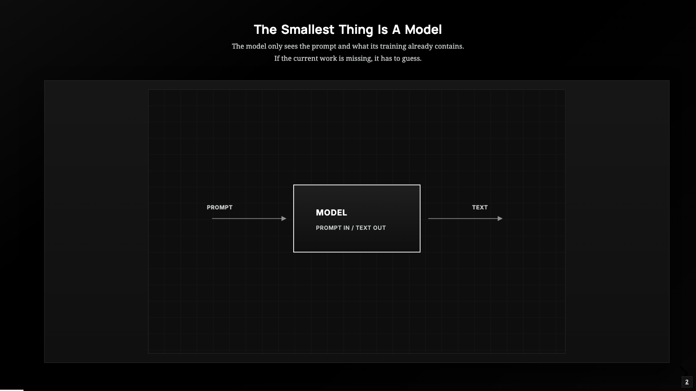

*Source: The Carbon Layer, [1:01](https://youtu.be/mQfTdNVCOB0?t=61).*

The model operates on the input supplied to a call, using what it learned during
training. That input can include instructions, conversation history, file contents,
and tool descriptions.  Putting together that input in an effective way is the job of the harness.Once the model does its work, the output can contain ordinary text or structured requests
for tools. The model does not directly execute the Python functions or shell
commands that those requests name. Missing project information can lead it to guess;
good harness design gives it ways to obtain evidence or ask for clarification.

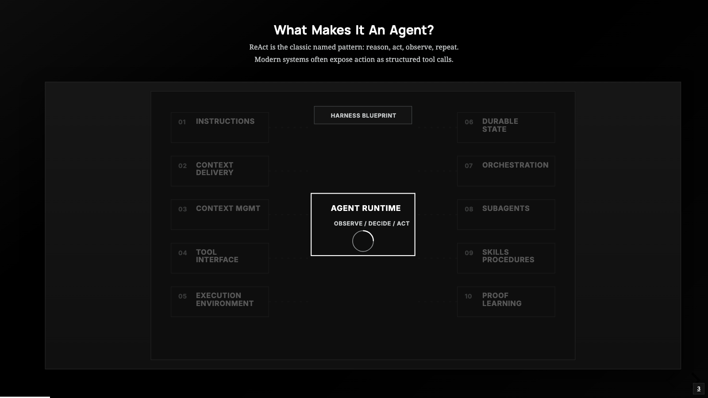

*Source: The Carbon Layer, [2:39](https://youtu.be/mQfTdNVCOB0?t=159).*

There is a special part of the harness that The Carbon Layer refers to as "the runtime".
In essense, the runtime is the part of the harness that manages the tools calls and the reporting 
of the tool call results back to the model.

The runtime repeats a cycle: give the model the current context, receive a decision,
execute any permitted tool requests, and return observations for another decision.
Part of your suggested reading in previous lectures included the paper by Yao et al. that 
first proposed this approach and named this cycle (*ReAct*).  
The ReAct pattern gives us a name for this interleaving of reasoning and action.
The visible record contains requests and results; it is not a complete account of
the model's internal reasoning.

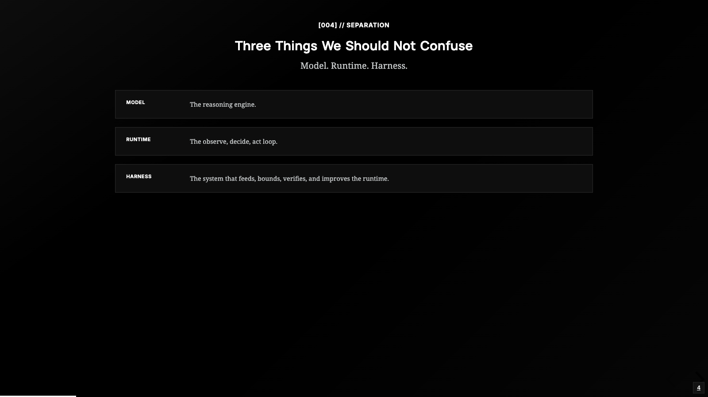

*Source: The Carbon Layer, [3:30](https://youtu.be/mQfTdNVCOB0?t=210).*

In this vocabulary, the **model** produces decisions and responses; the **runtime**
drives the repeated interaction; the **harness** supplies context, tools, boundaries,
and continuity around it. In actual code, these responsibilities need not be separate
modules. Exercise 4 puts much of the harness and runtime into one Python file.

### How to use the toy-agent exercise

[Exercise 4](../exercises/exercise-04-toy-agent.md) starts with a chat bot and supplies
code that students add in stages. You are expected to understand and assemble that
code, experiment with it, and complete the indicated portions. You are not expected
to invent a coding agent unaided. For each addition, ask: **What could the program do
before? What can it do now? Which lines caused that change?**

Our excerpts come from the exercise and its
[starter](../exercises/exercise-04-starter/toy_agent.py); comments may be omitted and
lines wrapped for presentation. The exercise uses OpenCode Zen with the **Chat
Completions** message format. Claude Code illustrates the same architectural ideas,
but its implementation and API details differ. In particular, the toy uses
`tool_calls` and `role: "tool"` messages, not Anthropic's `tool_use` blocks.

The example that we use throughout this lecture is Exercise 4's three-file "micro task" checkout project: `cart.py`, `discount.py`, and `test_checkout.py`. Students ask the agent to find and fix the
discount bug while preserving the tests. Because the toy agent only supports limited tool use concepts, students run `pytest` themselves (manually).

## 2. Instructions — establish how the agent should work

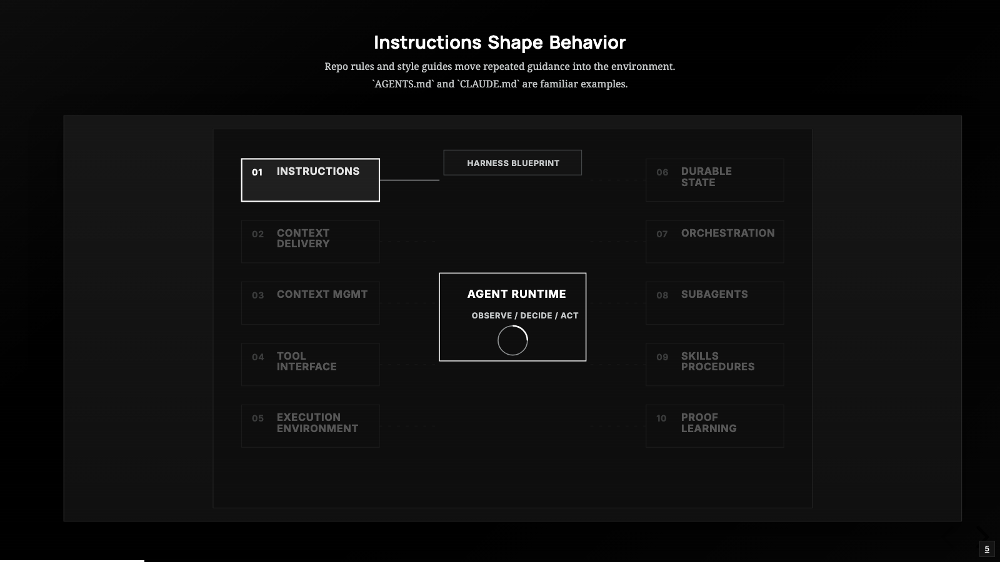

*Source: The Carbon Layer, [3:45](https://youtu.be/mQfTdNVCOB0?t=225).*

**Primitive Definition**  Context supplied to the model that indicates (a) general goals and character for the agent -- who the agent is, what work it does, its tone, constraints, and coding rules, and (b) project-specific information and guidelines.  This is context that the model needs to know on every turn to be effective, but we don't want the developer to have to manually enter each time.   So the harness provides a way of setting instructions for the agent and for allowing the developer to set their own instructions (globally, and/or per-project).   The instructions include the system prompt (which the developer can't see or modify) as well as files like `CLAUDE.md` which the developer can write to add their own global and per-project instructions.  "Instructions" establish recurring expectations so the user does not need to restate them every turn.  

**Why we need this primitive.** A request to fix a bug leaves many choices open:
what the architecture of the project looks like, the primary technologies and tools used in the project, preferences for documenting tests and summarizing test results, etc. 

**In Claude Code.** In Claude Code, Claude's "system prompt" (which we cannot see directly) are "Instructions" in the Carbon Layer Categorization.   The most visible notion of "Instructions" are Claude's `CLAUDE.me` files, which provide project guideance.  
Project guidance can live in `CLAUDE.md` and rules under
`.claude/rules/`. Claude Code loads applicable guidance into context. These files
can specify conventions and test commands, but their text is guidance rather than
an access-control mechanism (i.e., if you want to make sure that Claude Code doesn't look at other projects, or doesn't use certain tools, you need to use Claude Code's permissions and sandboxing features). Other harnesses use names such as `AGENTS.md`; Claude
Code does not automatically treat `AGENTS.md` as `CLAUDE.md` without an import or
other setup. Take time to look through [Claude Code's memory and instructions documentation](https://code.claude.com/docs/en/memory).

**In the toy: "Instructions" are present, with dramatically simplified.** Step 2 provides this prompt skeleton:

```python
SYSTEM = """You are ...

Follow these rules while working.
- Always read a file before you write or edit it.
- ...
"""
```

The starter makes it the first conversation message:

```python
messages = [{"role": "system", "content": SYSTEM}]
```

The harness sends that message along with the rest of the history. Changing
`SYSTEM` changes the instructions the model receives when the program starts a new
conversation. It does not change which Python functions exist or which paths they
can access. The exercise's stylistic experiments make this distinction easy to
observe: a pirate voice changes responses, not filesystem permissions.

**Before → after.** The generic assistant receives general purpose (not task-specific) operating guidance. Ask students to identify an instruction whose effect they could observe in a log.
One run may not exhibit a behavioral difference; instructions influence a model's
choices rather than guaranteeing a particular tool sequence.

**Limit and possible extension.** The toy does not discover or automatically load
repository instruction files. A future version could read a project instruction
file (e.g., an `AGENTS.md` in the sandbox) at startup and incorporate it into the initial context. 

The following motivates the need for our next harness primitive.

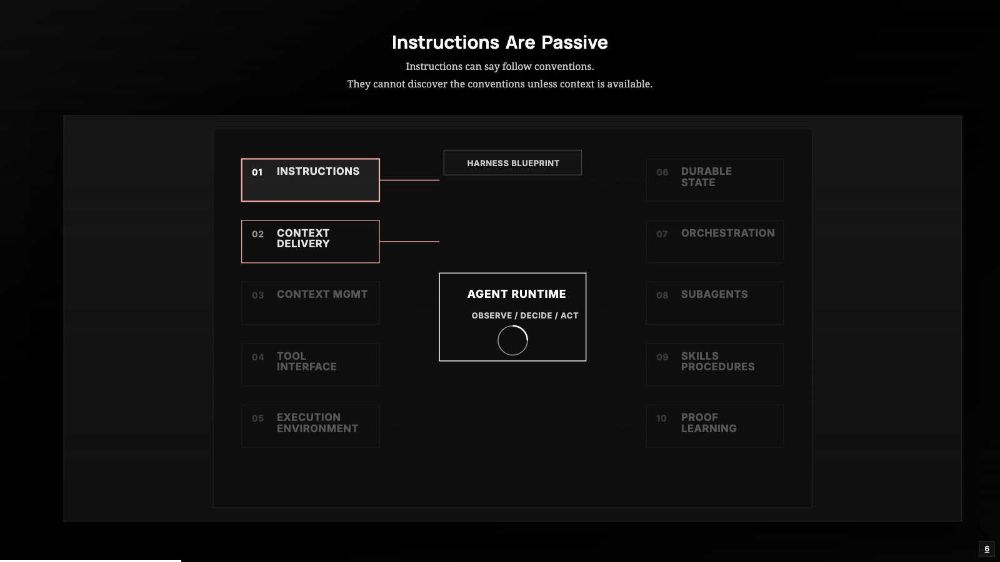

*Source: The Carbon Layer, [5:17](https://youtu.be/mQfTdNVCOB0?t=317).*

An instruction to follow the project's discount policy cannot reveal that policy.
The model needs the actual requirements and code: **context delivery**.

## 3. Context delivery — bring the actual task into view

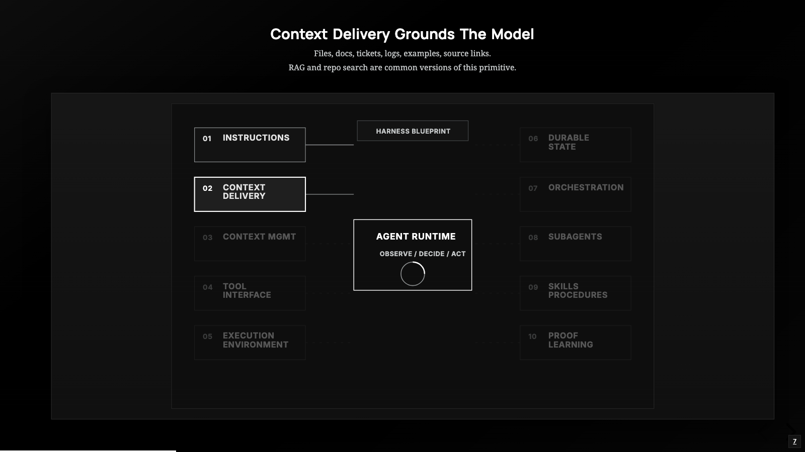

*Source: The Carbon Layer, [6:15](https://youtu.be/mQfTdNVCOB0?t=375).*

**Primitive Definition.** 
This primitive is a bit harder to understand.  The general idea is that a harness has the task of assembling the input to the model from a variety of sources.  That is to say, "Context delivery" answers how information reaches the model.   But we can't really understand the intracies of all that this might involve until later.  The concept that we use to illustrate this at present is a bit subtle because what it accomplishes is closely related to a `Read file` tool call -- which is addressed in a later primitive.  The idea that we use to illustrate this concept here is that we can, as we are prompting or giving instructions, force the contents of a file into the context.  In Claude Code, this is done with the `@` mechanism (e.g., `@filename.ext`).  This is technically not a tool call.  It's more like an "include" that the harnass processes on our behalf to insert the contents of `filename.ext` into the context.  Thus, the harness is "delivering context", not just from our prompt or from the "Instructions" (system prompt, `CLAUDE.md`) but from another mechanism, controlled by us.  That pushes the content of `filename.ext` into the context.  Later on we will see that of course we can mention mention `filename.ext` as we discuss with Claude, and it will likely initially a tool call to read the file.  The distincition is subtle, with the `@` mechanism, we are forcing (pushing) the content into the context based on a decision we make.  With the tool call, the model is "pulling" the content into the context based on a decision it makes.

**Why we need this primitive.** Imagine, that we have not added the concept of tool calls yet.  That means that the only material that gets delivered in the context comes from the "Instructions" or what we type in the conversation.  Before this primitive, if we want the model to understand the contents of a particular file, we would have to type or paste the contents of the file into the dialog.  With this example of "Context Delivery", we are providing extra ways for developer to build appropriate context via an "include" mechanism.

**In Claude Code.** A prompt can explicitly include a file with an `@` reference,
such as `Explain @discount.py alongside @test_checkout.py`. The harness can also
deliver information through file-reading and search tools, or command output.
Referencing a directory supplies a listing, not every file's contents. See
[file and directory references](https://code.claude.com/docs/en/common-workflows#reference-files-and-directories).

**Why this is a primitive**
The harness must define a delivery policy: which marker syntax counts as a reference, how injected blocks are labeled, where they appear relative to the question, and how large they may be. The `@` syntax is a convention selected by Claude Code.


**Limit and possible extension.** The toy has no special `@file` handling or repository
search. Future delivery could expand explicit file references after applying the
same path checks, or add a focused search tool. A bounded test-running tool could
return failures directly, but executing code introduces the environment concerns
in section 6.

"Context Delivery" answers how information reaches the model.  Our next primitive is motivated by the fact that, with a large repository or a long session, we also need to choose how much information (and what information) belongs in the context at the present time.

## 4. Context management — keep the current input useful

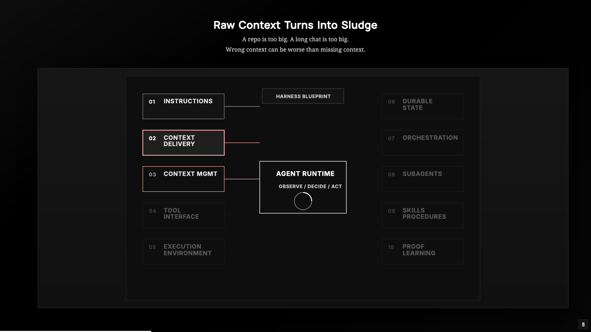

*Source: The Carbon Layer, [7:02](https://youtu.be/mQfTdNVCOB0?t=422).*

**Why we need this primitive.** The model's context window is finite, so at some point (especially for a large project) it is going to fill up.  What should we do at that point?  Possible answers might include: clear the entire context, replace current full context with a summary (but then what determines would we keep in the summary?).   Even when we don't have a full context file, there are other issues that impact performance and cost.  Reading an entire session context to find 
one failure spends context on irrelevant lines. Keeping an earlier, incorrect hypothesis in
every model request can also distract the model from newer evidence. Even material that
fits within the context window is not necessarily useful for the next decision.

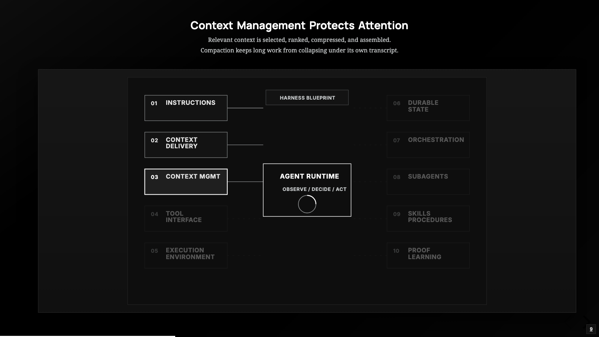

*Source: The Carbon Layer, [8:14](https://youtu.be/mQfTdNVCOB0?t=494).*

Context management chooses what enters the current request: retrieve relevant
material, rank candidate results, bound outputs, summarize older exchanges, and
assemble an input that retains the current task and constraints. Retrieval-augmented
generation (RAG) is one approach to finding external material for a request; it is
not required for every agent. Compaction replaces detail with a shorter account and
can lose information. Prompt caching, also mentioned in the source taxonomy, can
reduce repeated processing costs; it does not itself remove irrelevant content or
make the context window larger.

**In Claude Code.** `/context` reports context usage, and `/compact` requests
compaction; the harness also compacts automatically as needed. The purpose is to
make room for continued work. A summary can omit details, so a resumed line of
reasoning may require reading the source again. See
[how Claude Code manages context](https://code.claude.com/docs/en/how-claude-code-works#the-context-window).

**In the toy: simple accumulation, with no compaction or context budget.** After Step
5, the request includes this payload fragment:

```python
json={"model": MODEL, "messages": messages, "tools": tools},
```

Step 6 keeps appending assistant messages and tool results. The next request sends
the growing list, plus tool schemas. For a small checkout project, this may work
well. For a large log or repeated file reads, the toy has no policy for reducing
what it resends. A file read is also a snapshot: an old result does not update when
the file on disk changes.

**Before → after.** Compare a request before reading `discount.py` with one after
reading it. The extra result helps. Now imagine reading a huge unrelated log: the
same append mechanism admits that too. Our appoach to accumulating context in the toy agent
delivers context without judging its value.

Step 7's `MAX_TURNS` counts model calls during one user interaction. It prevents
an endless tool loop but does not bound the size of a single response from a file
tool, nor the history accumulated over multiple user interactions. It is also not
a complete monetary budget: cost depends on the model and the tokens processed.

**Limit and possible extension.** Include a command similar to `\compact` or a more automated context-preparation step before `call_zen`: preserve standing instructions and the current task, limit large tool outputs with explicit truncation notices, and summarize older completed exchanges.
Keep a tool request and its required results together; arbitrary message deletion
can leave an invalid conversation. Summaries should preserve unresolved questions
and point back to files that can be reread. This is an extension idea, not additional
Exercise 4 work. Lecture 6 develops the cost and context tradeoffs further.

Useful context supports a decision. To change the checkout code, the model still
needs a structured way to request an action: a **tool interface**.

## 5. Tool interfaces — turn requests into operations and feedback

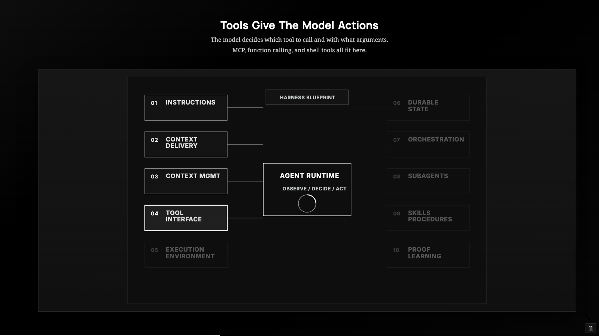

*Source: The Carbon Layer, [10:46](https://youtu.be/mQfTdNVCOB0?t=646).*

**Why we need this primitive.** 
Up to this point in our addition of primitives, the agent can hold a conversation, obey an instruction layer, and answer questions about files the harness injects with `@path` — but everything it produces is still prose. The primitive of "Tool Interfaces" closes the loop that makes it an agent: the model returns structured tool calls, the harness executes them, appends each result to the conversation, and calls the model again until it produces a final answer.   With the addition of the tool call primitive, we improve the agent from a "talker" to a "do-er".

To express this in terms of our toy agent's micro tasks, having the model reply “Change the discount calculation” does not edit a file. A tool interface names an operation, describes when and how to
use it, and specifies its arguments. The runtime interprets the model's request,
calls an implementation, and delivers the result. These are separate events that
we can inspect when something fails.

With this primitive, we need to start considering what are referred to as "harness guardrails" -- which are things that we build into the harness to control unwanted actions by the model.  In particular, the first types of guardrails that we need to address are: an approval gate that fails closed for boundary-crossing tools (i.e., disallow tool calls that violate our permissions unless their use is explicitly confirmed by the user), and developing a minimal sandbox (general area of your file system that agents are allowed to touch) so `bash` never runs on your host shell.


**In Claude Code.** Built-in tools support file operations, search, and shell
execution. An edit tool changes a file; Bash can run a test command and return
output. MCP can expose additional tools through connected servers; it is an
interface mechanism, not a grant of unlimited authority. See
[Claude Code's tools](https://code.claude.com/docs/en/how-claude-code-works#tools)
and [MCP connections](https://code.claude.com/docs/en/mcp).

It is important to remember that, in the world of harness engineering,  a "tool" is a function plus a schema — e.g., a plain Python callable function paired with a JSON-schema contract that names it, describes it, and types its parameters. The tool specifications live in a registry.  Every registered tool is presented to the model in a protocol the model is trained on and obeys.
The harness uses the registry to carry out the following jobs: call the specific tool function for each a tool call request coming from the model (which parsing the JSON tool arguments written by the model into parameters than can be passed to the tool function), and return the string that is output by the tool back into the context.

**In the toy agent: presenting the available tools to the model.** 
Step 5 in the toy agent exercise supplies the declaration below. This is Python
data describing the tool in the format sent to the API:

```python
READ_FILE_SCHEMA = {
    "type": "function",
    "function": {
        "name": "read_file",
        "description": "Get the full contents of a file",
        "parameters": {
            "type": "object",
            "properties": {
                "file_name": {
                    "type": "string",
                    "description": "The path of the file to read",
                },
            },
            "required": ["file_name"],
        },
    },
}
```

The name identifies the tool call function; the description helps the model decide when to use 
it; `parameters` describes the nature of the parameters that need to get sent with the tool call.
The model will use this schema to produce JSON-formatted paramters, which the harnass will parse and turn into actual parameters for a tool call function.

The following shows how the tool registry in our toy agent works if we only have a "read file" tool.  

```python
TOOLS_DICTIONARY = {"read_file": read_file}
TOOLS_SCHEMA = [READ_FILE_SCHEMA]
```

Note that the `TOOLS_SCHEMA` is sent to the model as data -- it tells the model what tools are available, what the identifier is for each tool (e.g., "read_file"), what each tool does, and how to format a call to a tool as JSON.   `TOOLS_DICTIONARY` stays in our harness.  It tells the harness what tool function to call (e.g., the Python function named `read_file`) when presented with the string identifier for the tool (e.g., `"read_file"`) that came from the model.

### Follow one request all the way around the loop

Step 6 moves model calls into `agentic_loop`. Here is its opening, with comments
omitted. This is the intermediate version; Step 7 adds the required turn cap.

```python
def agentic_loop(messages: list) -> None:
    while True:
        message = call_zen(messages, TOOLS_SCHEMA)
        messages.append(message)
        if message.get("content"):
            print(message["content"])

        tool_calls = message.get("tool_calls")
        if not tool_calls:
            break
```

Appending the response keeps the assistant's request in history. Printing ordinary
content is independent of handling tool calls: a response can contain tool requests
even when there is no text to print. A response with no tool calls ends this inner
loop; the outer chat loop can then accept another user prompt. Stopping is not
evidence that the task was done correctly.

The following supplied code runs for each requested call:

```python
for tc in tool_calls:
    name = tc["function"]["name"]
    raw_arguments = tc["function"].get("arguments") or "{}"

    if name not in TOOLS_DICTIONARY:
        result = f"ERROR: unknown tool: {name} - available: {list(TOOLS_DICTIONARY)}"
    else:
        try:
            result = TOOLS_DICTIONARY[name](**json.loads(raw_arguments))
        except Exception as e:
            result = f"ERROR: {name} failed: {type(e).__name__}: {e}"
    messages.append({"role": "tool", "tool_call_id": tc["id"], "content": str(result)})
```

Imagine a request with ID `call_1`, name `read_file`, and arguments encoded as the
string `{"file_name":"discount.py"}`. `json.loads` turns that string into a Python
dictionary; `**` passes its entries as keyword arguments to `read_file`. The function
reads the permitted file. The harness appends its result with `tool_call_id` equal
to `call_1`. On the next iteration the model receives both its request and the
matching result, so it can decide what to do next.

An unknown tool gets an explicit result too. Malformed argument JSON, unexpected
keyword arguments, and exceptions from the function are turned into readable
errors by the `try`/`except`. This does not handle every possible failure of the
whole program: for example, an HTTP error in `call_zen` occurs elsewhere.

Four protocol details matter:

1. Keep the returned assistant message rather than rebuilding it from just `content`.
   Besides losing tool calls, rebuilding can omit fields required by some providers,
   such as `reasoning_content` for certain thinking models.
2. Supply a result for every requested call, including rejected or unknown tools.
   Otherwise the next API request can contain an incomplete tool exchange.
3. Match each result using `tool_call_id`, not its position in a list.
4. Give actionable feedback. “File not found” and an empty file should not look the
   same. Step 4's suggested error improvement adds the directory listing so the
   model has evidence for another choice.

**Before → after.** Step 5 can produce a tool request that nothing executes. Step 6
executes the request and returns the observation. Step 8 adds `list_files` and
`write_file` (or `edit_file`), enabling discovery and editing. Step 9's verbose mode
prints tool names, arguments, and results so students can inspect this transition.
It does not print every API payload or expose all internal reasoning.

**Limit and possible extension.** The base toy has filesystem tools, not Bash or MCP.  Adding these would be an interesting addition.

## 6. Execution environments — enforce the boundaries of action

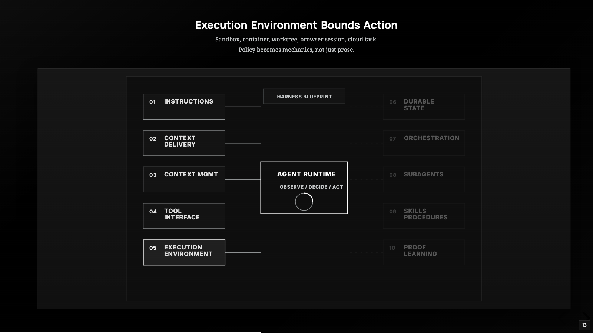

*Source: The Carbon Layer, [12:20](https://youtu.be/mQfTdNVCOB0?t=739).*

**Why we need this primitive.** A valid `write_file` request could still name a file
outside the exercise project. The harness must decide where tools run and what
they may read, write, or contact. This is different from asking the model to be
careful: restrictions must hold even when it requests the wrong thing.

**In Claude Code.** The working directory (the file you launch Claude Code in) 
establishes project context. Permission
controls determine whether a tool call is allowed or needs approval. When configured,
the sandboxed Bash tool applies operating-system restrictions to filesystem and
network access for commands and child processes. Permissions and sandboxing serve
different roles.  In advanced use of agents, 
putting code in a Git worktree separates working files but does
not itself restrict a process's access to the rest of the machine. See
[sandboxing and permissions](https://code.claude.com/docs/en/sandboxing#how-sandboxing-relates-to-permissions-and-permission-modes).

**In the toy: partial, through application-level path checks.** Step 3 in the toy agent exercise supplies this complete helper and setup, shown without its comments:

```python
from pathlib import Path

SANDBOX_DIR = (Path(__file__).resolve().parent / "sandbox").resolve()
SANDBOX_DIR.mkdir(parents=True, exist_ok=True)

def resolve_in_sandbox(file_name: str) -> Path:
    resolved = (SANDBOX_DIR / file_name).resolve()
    if not resolved.is_relative_to(SANDBOX_DIR):
        raise ValueError(f"path escapes the sandbox: {file_name}")
    return resolved
```

Read it in order. The `__file__` is a special Python identifier for the currently running file
and `.resolve` turns that into a proper path.  The code says that a simple notion of sandbox
(a directory named "sandbox" that is a sub-directory of the running python agent) will be used to bound the execution of tool calls.  `mkdir` creates the
directory if necessary. Joining the root and the requested name constructs a
candidate path; it does not by itself confine access. `resolve()` normalizes the
path, including `..` and existing symlinks. `is_relative_to` checks path containment,
not whether two strings happen to start alike. A path outside the sandbox causes a
`ValueError`; an allowed path is returned to the caller.

Step 4 of the exercise uses the helper before reading, and Step 8's write skeleton uses it before
writing. The dispatcher turns a rejected path into an error result. The restriction
is enforced by Python even if the model asks to ignore its instructions.

**Before → after.** Adding Step 3 creates the sandbox and defines a check, but a
helper that nobody calls constrains nothing.   To fix this, we code every file operation 
to go through `resolve_in_sandbox` function.  For example, a request 
for `../../secrets.txt` is rejected before file I/O. A request for
`discount.py` resolves inside the sandbox and may proceed. A permitted path can
still fail for ordinary reasons, such as a missing file.

**Limit and possible extension.** This helper checks the paths passed to these
filesystem functions. It does not isolate the Python process, restrict network
access, remove credentials, or safely confine arbitrary executed code. It is also
not a hardened defense against concurrent filesystem changes between checking and
using a path. Adding a shell or test runner expands the boundary: even `pytest`
executes project code. A future version would need restricted process execution,
filesystem/network policy, controlled credentials, timeouts, and appropriate
approval decisions. A command allowlist alone does not supply all of that.

To motive our next primitive, what happens if our agent gets interrupted?  Our instructions and other information does not record what the agent got accomplished (and perhaps what is yet to be done).  we would like the ability to continue an interrupted task: that calls for **durable state**.

## 7. Durable state — preserve progress beyond current attention

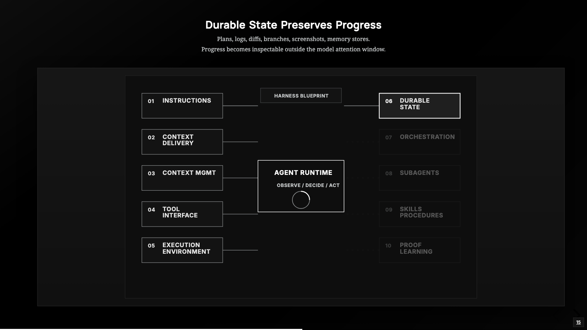

*Source: The Carbon Layer, [14:16](https://youtu.be/mQfTdNVCOB0?t=856).*

**Why we need this primitive.** An agent might edit `discount.py`, record a hypothesis,
and then stop before testing. To continue later, it needs access to the changed
file and an account of what remains uncertain. Progress stored outside the active
conversation can survive process exit and be inspected by another person or agent.
Examples include source files, plans, diffs, test logs, saved sessions, and memory
notes. Persistence does not make a claim correct: a note saying “tests passed” is
only as good as the evidence behind it.

There is a subtle point in the description above that will only grow in importance as agentic software engineering improves over time:  We not only need durable state to enable the *same* agent to restart properly if interrupted, we need durable state to enable one agent to hand off to another (or when switching between different models in the same agent).

**In Claude Code.** Conversation history is saved locally and can be reopened with
`claude --continue` or `claude --resume`. This differs from starting a fresh session.
See [session persistence and resuming](https://code.claude.com/docs/en/how-claude-code-works#work-with-sessions).
`CLAUDE.md` and auto-memory notes provide persistent information for later sessions;
they serve a different purpose from replaying a whole conversation. See
[persistent instructions and auto memory](https://code.claude.com/docs/en/memory).
A plan file or Git diff also makes work inspectable outside the active context.

**In the toy: partial.** Step 8's provided write implementation actually changes a
file, and Part 2 has students copy verbose output and test results into log files.
Those artifacts survive an ordinary process exit. The in-memory conversation does
not: each startup executes the starter's initialization again.

```python
messages = [{"role": "system", "content": SYSTEM}]
```

There is no corresponding `load_session` call. The new process can reread the edited
file, but it has not automatically recovered the previous conversation or the
student's separately saved logs.

| State | Survives restarting the toy? | How would the model receive it? |
|---|---|---|
| `messages` list | No | Would require a new save/load mechanism |
| Hardcoded `SYSTEM` in the script | Yes | Inserted into messages at startup |
| Edited files in `sandbox/` | Yes | A new tool read delivers their current contents |
| Logs copied by the student | Yes | Supplied by the student; not automatically loaded |
| Next steps mentioned only in chat | No | Would need to be saved and later delivered |

**Before → after.** Ask what happens if the agent writes the fix and you then exit.
The edit remains. The new conversation has no record of why the edit was made or
whether the student ran the tests. This separates three ideas that are easy to
conflate: **storage**, **retrieval**, and **current context**.

**Limit and possible extension.** A future version could save the conversation and
task identifier after completed interactions, then load a selected session at
startup. A small task-summary file could record the goal, changes, evidence, and
unfinished work. Saving to a temporary file and replacing the prior save only when
complete would reduce the risk of a half-written session file.

Recovery needs an explicit boundary: saving only after an interaction does not
recover every mid-interaction crash. A tool might write a file and the process might
stop before recording its result. On recovery, inspect actual files and pending
operations before repeating effects. Saving a transcript is not a transaction
across the transcript and the filesystem.

The responsibilities now connect: durable state keeps a plan or log available;
context delivery brings it back; context management chooses the relevant portion.
That is why one file may participate in several primitives. State preserves work,
but does not decide when to retry or which step should execute next. The Carbon
Layer calls that next responsibility **orchestration**, beyond today's scope.

## 8. Connect the primitives and begin Exercise 4

The class reserves 15 minutes for Claude Code demonstrations. The scenario and
script will be developed separately. While watching, identify the evidence for
each responsibility: the instructions supplied, the information delivered, the
context retained, the tool action, its execution boundary, and any saved progress.

Use these questions to check your understanding:

1. The model suggests a generic discount fix without reading the project. What
   information is missing, and how could it enter the next request?
2. Every request contains a huge obsolete log. Which primitive should decide what
   to retain? Why does a 25-turn cap not solve this?
3. A file tool rejects `../../secrets.txt`. Which code enforces the boundary, and
   which code tells the model about the rejection?
4. The agent edits a file and exits. On restart, what survives, what is missing,
   and what would be needed to continue confidently?

For the checkout example, a single successful run may involve all six: operating
instructions; delivery of the tests and source; selection of relevant context;
tool requests to edit; path enforcement; and files/logs that persist. The toy's
limited context management and session persistence show where more engineering
could help. The diagnostic question is **which harness responsibility was missing
or inadequate**, alongside questions about model capability.

Exercise 4 is due at the start of week 4. Work through its additions manually,
following the exercise's restriction on coding-agent assistance. Predict the effect
of each supplied chunk, add it, run the suggested interaction, and explain what
changed. Complete the indicated prompt, tools, turn cap, and reflection portions.
Use verbose logs for both micro-tasks; run tests yourself and record the results.
The reflection asks for two Claude Code capabilities your toy lacks and where
you would add them. Future extensions discussed here are examples for reasoning,
not extra implementation requirements.

## Before next lecture

- Project 0 will be given at the end of the next lecture.

## Sources and attribution

The primitive sequence and the eleven reproduced slide images are from The Carbon
Layer, [*Harness Engineering Masterclass: Technical Deep Dive on how to build
Agentic Systems*](https://www.youtube.com/watch?v=mQfTdNVCOB0). Each image is linked
to the relevant moment above. These are third-party source images, not newly
authored course diagrams; see the repository's [licensing notes](../../LICENSING.md).
The later, dimmed primitives visible in the images are outside this lecture.

The local `ch-*.md` files discuss a separate, more extensive staged implementation of a Python coding agent.  They are not the implementation assigned in Exercise 4. Our toy-agent capability
claims and code excerpts are grounded in the exercise and its starter.  The Carbon Layer materials provide an excellent and more in-depth tour of the anatomy of a coding agent.

Claude Code examples use the official documentation linked in each section,
checked September 8, 2026. Product commands and configuration can change; the
architectural responsibilities provide the stable comparison.
