<!-- _class: lead -->

# Course Introduction + How LLMs Actually Work

**Agentic Software Engineering — Lecture 1**
Week 1 · Meeting 1 of 2

---

## The one idea

An LLM is a **stateless next-token predictor**.

Every agentic behavior you'll see this semester — planning, editing files, running tests, "remembering" your project — is engineered **on top of that one primitive**.

<!-- 0–10 min block: course intro. This slide frames the whole unit; return to it at the end. -->

---

<!-- _class: lead -->

# What this course is

---

## Engineering with agents — not prompting tricks

- You will build real software with an AI agent doing most of the typing
- Your job: **requirements, specifications, context, verification**
- Every claim comes with receipts: real transcripts, cost logs, and retrospectives from this course's own experiments

---

## The semester at a glance

<!-- _class: compact -->

| Weeks | Focus | What you will do |
|-------|-------|------------------|
| **1–3** | Foundations of LLMs and agents *(you are here)* | Four exercises, including a working agent in ~200 lines of Python |
| **4–7** | Foundations of agentic software engineering | Reorient core software-engineering practices; build Project 1 several ways |
| **8–10** | Mature agentic-development competencies | Learn hooks and subagents; begin team-based Project 2 |
| **11&#8209;14** | Long, autonomous agent runs | Design loops and workflow graphs; use issue tracking and context management at scale |
| **15** | Retrospectives and presentations | Explain what worked, what failed, and why |

Running underneath: **Project 0** — a personal knowledge base you design in week 2 and grow all semester.

---

## Logistics

- 2 × 75 minutes per week — **no exams**
- Weeks 1–3: four completion-based exercises
- Projects form the bulk of the grade
- **Claude Pro subscription needed by week 2**
- All handouts distributed as PDFs; starter repo link on the course page

---

## Assessments and grading

<!-- _class: compact -->

| Course work | Weight | Letter | Range |
|-------------|-------:|:------:|------:|
| Individual exercises + Project 0 | 30% | A | 90–100% |
| Individual Project 1 | 30% | B | 80–89% |
| Team Project 2 | 40% | C | 70–79% |
|  |  | D | 60–69% |
|  |  | F | below 60% |

There are **no exams**. Your engineering artifacts and process are part of what is assessed.

---

<!-- _class: standout -->

## Demo: a toy agent you will build

**Task** → model requests a tool → Python harness runs it → result becomes the next input → repeat

By the end of week 3, you will build this loop yourself in about 200 lines of Python.

---

<!-- _class: lead -->

# Tokens and prediction

---

## The one operation inside an LLM

Given a sequence of tokens, the model returns a **probability distribution** over the next token.

```text
tokens so far  →  LLM  →  probabilities for what comes next
```

Everything else — a paragraph, a function, a plan — is built by repeating that operation.

---

## Next-token prediction: step 1

Input so far:

```python
def add(a, b):
    return a
```

| Candidate next token | Probability |
|----------------------|------------:|
| ` +` | 0.91 |
| ` *` | 0.03 |
| ` if` | 0.02 |
| ` ,` | 0.01 |
| everything else | 0.03 |

*Probabilities are illustrative.*

---

## Step 2: the distribution sharpens

The system selects ` +`, appends it, and asks again:

```python
def add(a, b):
    return a +
```

| Candidate next token | Probability |
|----------------------|------------:|
| ` b` | 0.98 |
| ` 1` | 0.01 |
| everything else | 0.01 |

Almost nothing but `b` makes sense here.

---

## Step 3: the distribution opens again

After appending ` b`, the function is complete:

| Candidate next token | Probability |
|----------------------|------------:|
| *end of turn* | 0.55 |
| `\n\n` | 0.25 |
| `\ndef` | 0.08 |
| ` #` | 0.04 |
| everything else | 0.08 |

Now several continuations are plausible: stop, add whitespace, define another function, or comment.

---

<!-- _class: standout -->

## The model never “writes a function”

It answers **“what token comes next?”** over and over.

Some steps are nearly certain. Others are genuinely open — and open steps are where runs diverge.

---

## Tokens are not words

Text is split by a fixed **tokenizer** into subword units:

```text
The agent reads the file.
The ·  agent ·  reads ·  the ·  file · .

tokenization  →  token · ization
check_winner  →  check · _win · ner
```

Common prose is often close to word-by-word. Rare terms and identifiers split where no human would.

<!-- 15–30 min block. Live tokenizer demo goes here. -->

---

## Code spends tokens quickly

```python
def check_winner(self):
    for row in self.board:
```

These two lines are roughly **15 tokens**: keywords, name fragments, punctuation, newlines, and indentation all spend budget.

**Consequence:** code is token-expensive relative to its information content. In Lecture 6, that becomes real money.

*Exact splits vary by tokenizer; verify them in the demo rather than memorizing them.*

---

<!-- _class: standout -->

## Demo: the tokenizer playground

[Open the tokenizer playground](https://huggingface.co/spaces/Xenova/the-tokenizer-playground)

One English sentence. Then one Python function from a real game.

*Which costs more tokens per line of meaning?*

---

## Generation is autoregressive

**Autoregressive:** predict the next item from the previous items in the same sequence.

```
predict one token  →  append it  →  predict again  →  …
```

- The newly generated token becomes input to every later step
- No plan exists inside the operation — only *“given everything so far, what comes next?”*
- Repeated thousands of times per response
- Coherence is a **learned property**, not a separate planning mechanism

---

## Sampling: one open choice

Prompt: *“Write a function that reverses a string.”*

At the naming step, suppose the distribution is:

| Candidate | Probability |
|-----------|------------:|
| `reversed_str` | 0.45 |
| `result` | 0.30 |
| `out` | 0.15 |
| everything else | 0.10 |

The chosen name becomes context for every token that follows.

---

## One sample; two coherent implementations

<!-- _class: compact -->

```python
# Run 1                              # Run 2
def reverse(s):                      def reverse(s):
    reversed_str = ""                    result = []
    for ch in s:                         for ch in reversed(s):
        reversed_str = ch + reversed_str     result.append(ch)
    return reversed_str                  return "".join(result)
```

One early sample commits the runs to different names, loop shapes, and data structures.

Both are correct. Neither is **the** output.

---

## Temperature changes how sampling behaves

| Near 0 | Higher |
|--------|--------|
| Nearly greedy | Flatter probabilities |
| Steady and focused | More varied and creative |
| Useful for code, math, extraction | Useful when exploring alternatives |
| Still not perfectly reproducible | Greater risk of drift or implausible choices |

Temperature changes which plausible continuation is selected; it does not turn generation into a plan.

---

## The engineering consequence

The same prompt can produce a different function body tomorrow.

Therefore:

- Do not depend on remembering that one run worked
- Put intended behavior in a specification
- Put acceptance criteria in executable tests
- Re-run verification after every generated change

**“It worked when I ran it” is not reproducibility.**

---

<!-- _class: lead -->

# Transformers at 10,000 feet

---

## The machine, in four sentences

1. Each token becomes a high-dimensional vector (**embedding**)
2. **Attention**: every position looks at every other — a soft, learned key-value lookup
3. Dozens of stacked layers refine every token in the light of all the others
4. **Scale** turned a 2017 translation paper into everything we use today

*Vaswani et al., "Attention Is All You Need" (2017)*

---

## Embeddings: meaning as geometry

Each token becomes a point in a high-dimensional space:

```text
file  ≈  document                 file  ≠  banana
read  ≈  write  ≈  file
```

Distances and directions encode learned relationships. The model does not consult a dictionary; it computes with positions in this space.

[See the 3blue1brown discussion](https://www.3blue1brown.com/lessons/gpt/#tokens)

---

## Attention: who should I look at?

> The **function** returns `None` because **it** fails.

When processing `it`:

- `it` supplies a **query**: “Who is my referent?”
- Earlier tokens supply **keys**
- A strong match pulls the **value** carried by `function`

Meaning from `function` flows into the representation of `it`.

---

## Attention is soft — and useful for code

Illustrative weights for `it`:

```text
0.7 × function  +  0.2 × None  +  0.1 × everything else
```

Attention takes a weighted blend, not an exact hash-map lookup.

The same mechanism can complete:

```python
board[row - 1][col - 1]
```

by looking back at the nearby `row - 1` pattern and mirroring it for `col`.

---

## Filling in the depth — on your own

That was deliberately all we will say in class.

- **Required:** Karpathy, *Intro to Large Language Models* (1 hr)
- **Recommended:** 3Blue1Brown, transformer + attention chapters
- **Gap-fillers:** Karpathy *Deep Dive*; the 2017 paper; InstructGPT

Mixed ML backgrounds are expected. The gap-filler track exists for exactly this — use it this week.

---

<!-- _class: lead -->

# From predicting the internet to following instructions

---

Supervised Fine-Tuning Only:Best for well-defined tasks like translation, data extraction, or code generation where an absolute correct answer exists.Reinforcement Learning from Human Feedback:Best for open-ended assistants where style, safety, and subjective helpfulness matter more than a single correct response.

## Three training stages

1. **Pretraining** — predict the next token over an enormous corpus
   → a formidable text-completer
2. **Instruction tuning (SFT)** — curated instruction/response pairs
   → completes an instruction *with an answer* Helps for well-defined tasks like translation, data extraction, or code generation where an absolute correct answer exists.
3. **Preference training (RLHF)** — optimize toward human-preferred outputs
   → assistant behavior. Helps for open-ended assistants where style, safety, and subjective helpfulness matter more than a single correct response.

<!-- 45–55 min block. If running long, compress this to the slide and move on — never cut the statelessness block that follows. -->

---

## Base model versus instruction-tuned model

Instruction:

> Write a Python function that returns `True` if a number is prime.

**Base model:** may continue the surrounding *document*:

> Write a Python function that computes the greatest common divisor…

**Instruction-tuned model:** has learned that an instruction is followed by its answer:

```python
def is_prime(n): ...
```

---

## What instruction-tuning data looks like

| Instruction | Desired response pattern |
|-------------|--------------------------|
| Summarize this paragraph | One clean sentence |
| Write a Python primality function | Correct code plus a brief explanation |
| Explain `TypeError: 'NoneType'...` | Meaning, likely cause, and debugging path |

Tens of thousands of examples shift the likely continuation from **more document** to **useful answer**.

---

## Preference training: better, not uniquely correct

<!-- _class: compact -->

Prompt: *“My tests are failing. What should I do?”*

> **A:** “Debug your code.”<br>
> *True, but useless.*

> **B:** “Read the first failing assertion: what did it expect, and what did it get? Then check whether the test or code encodes the intended behavior…”<br>
> *Concrete and actionable.*

Human raters prefer B; training makes **B-shaped answers** more probable.

---

## Knowledge cutoff: tools supply what weights cannot

The trained model has not seen:

- Your private codebase
- This week’s library release
- Internal documentation behind your VPN
- The file you changed five minutes ago

A search, file-read, or documentation tool can retrieve those facts. The **tool result in context**, not the model’s weights, supplies the new knowledge.

---

## Hallucination: plausible is not the same as true

Task: *“Read `settings.json`.”*

A plausible-looking answer might contain:

```python
config = json.loads_file("settings.json")  # no such standard-library API
```

The real APIs are `json.load(file_object)` and `json.loads(text)`.

The invented call has exactly the shape an API *should* have. Only documentation, execution, static checks, or tests expose the difference.

---

## Two engineering facts fall out

**Knowledge cutoff.**
The model has never seen your codebase, this week's library release, or anything behind your VPN. Whatever it needs, *you* must bring into the conversation.

**Hallucination is a consequence of the objective.**
Every stage rewards *plausible* text. Where plausible and true diverge, the model confidently produces the plausible thing — an API that *should* exist.

---

<!-- _class: lead -->

# Context windows and statelessness

---

## The model has no memory

**None.**

Every API call is a pure function: tokens in → distribution out.

A two-hour "conversation" = the entire history **replayed into the model on every single call**. The model isn't remembering. It is *re-reading*.

---

## Replay creates the appearance of memory



The model begins every call with **zero hidden session state**. The harness rebuilds apparent memory by sending a larger input.

<!-- Diagram source: diagrams/context-replay.mmd. The probabilities and completions remain model behavior; the conversation state belongs to the harness. -->

---

## The context window

- The maximum tokens a single call can carry
- Hundreds of thousands of tokens on current models — sounds infinite, isn't
- Everything competes for it: conversation, files, tool output, instructions
- Providers bill **per token, per call** — replay has a price
  *(Lecture 6: real cost data from this course's experiments)*

---

## What competes for a coding agent's window?

| Context source | Example |
|----------------|---------|
| Standing instructions | “Run tests after edits” |
| Conversation | Your task and the agent’s plan |
| Files | Source, tests, specifications |
| Tool results | Search output, compiler errors, test logs |
| Generated work | Proposed patches and explanations |

What is **not** in this window does not exist to the model. What is present consumes capacity and is replayed.

---

<!-- _class: standout -->

## So where does a session's memory live?

In a list of messages, maintained by ordinary software **outside the model**.

That software is called a **harness** — and it is Lecture 2.

---

## Preview: the harness, whole


The "memory" is the messages list. The loop is the harness. In week 3, you build this.

<!-- 60 seconds max — this is Lecture 2's whole content in one picture; just point and move on. Diagram source: diagrams/agent-loop.mmd (Mermaid), pre-rendered to SVG by build.sh. -->

---

## Replayed context can also replay mistakes

Suppose an early message says:

> “This project uses `unittest`.” *(wrong — it uses `pytest`)*

Unless the harness or developer corrects, summarizes, or discards it, that wrong statement returns on every later call.

**Practical implication:** conversation history is program state. Humans and harnesses are responsible for its accuracy.

---

<!-- _class: lead -->

# Consequences

---

## Memorize this line

> An LLM is a **pure function** from a token sequence to a next-token distribution.

---

## Three consequences structure the course

1. **Context is everything.**
   The prompt is the entire program state. → Lectures 3 & 6
2. **Instructions are everything else.**
   Vague in, plausible-but-wrong out. → Lecture 4
3. **You must verify.**
   Plausible code compiles, reads well, and is wrong in ways only tests catch. → Lecture 6, and the whole semester

---

## One coding task; all three consequences

Task: *Apply a 10% discount when a subtotal is strictly greater than $100.*

1. **Provide context:** `discount.py`, its tests, and the pricing rules
2. **Specify the boundary:** `$100.00` is not discounted; `$100.01` is
3. **Verify:** test `$99.99`, `$100.00`, `$100.01`, rounding, and the full suite

The agent may type most of the code. The developer still owns the state, the decision, and the evidence.

---

## Questions to think about

1. If the model is stateless, where does a 2-hour session's "memory" live — and who is responsible for its accuracy?
2. Which of your Copilot/ChatGPT habits does next-token prediction explain?
3. Why might a model confidently invent an API that doesn't exist?

---

## Before next lecture

- **Required:** Karpathy, *Intro to Large Language Models*
- **Recommended:** 3Blue1Brown transformer series
- **Gap-fillers:** *Deep Dive into LLMs*; Vaswani et al. §1–2; InstructGPT
- **Logistics:** Claude Pro active before week 2

*Next: an agent is an LLM in a while-loop with tools.*
