<!-- _class: lead -->

# From LLM to Agent: the Loop, System Prompts, Tool Calls

**Agentic Software Engineering — Lecture 2**
Week 1 · Meeting 2 of 2

---

## The one idea

An agent is **an LLM in a while-loop with tools** — nothing more mystical than that.

The difference between ChatGPT and Claude Code is the **harness**, not the model.

<!-- 0–10 min: answer L1's cliffhanger, then the taxonomy. -->

---

## Answering last lecture's cliffhanger

Where does a two-hour session's "memory" live?

**In a messages list** — an ordinary array, maintained by ordinary software, replayed into the model on every call.

| Tool | The harness lets the model… |
|------|------------------------------|
| Chat app (ChatGPT, Claude.ai) | **answer** |
| Completion tool (Copilot) | **complete** |
| Agent (Claude Code, your toy) | **act** |

Same predictor underneath all three.

---

<!-- _class: lead -->

# The agent loop

---

## The entire architecture

```python
messages = [{"role": "user", "content": task}]
while True:
    response = model(system=SYSTEM_PROMPT, messages=messages, tools=TOOLS)
    messages.append(assistant_message(response))
    if response.stop_reason != "tool_use":
        break                                  # the model is done acting
    results = [execute(call) for call in response.tool_calls]
    messages.append(tool_results(results))     # results go back INTO context
```

You implement this, nearly verbatim, in Exercise 4.

<!-- 10–25 min block. Read it slowly; every phrase earns its keep this semester. -->

---

## The picture



---

## Message roles, mid-task

```
system:     You are a coding agent. Work only in the working directory. …
user:       "Fix the failing test in this project."
assistant:  [tool_use: list_dir(".")]
user:       [tool_result: "cart.py  discount.py  test_checkout.py"]
assistant:  [tool_use: read_file("test_checkout.py")]
user:       [tool_result: "def test_discount_applied…"]
```

- Tool results ride in **user**-role messages — the harness speaks for you
- The list **only grows** — and is re-sent whole, every call (L1's statelessness)

---

## Termination — and errors are just results

```
assistant:  [tool_use: read_file("game.py")]
user:       [tool_result: "ERROR: file not found: game.py —
             directory contains: cart.py, discount.py, test_checkout.py"]
assistant:  "No game.py here; the logic must be in discount.py."
            [tool_use: read_file("discount.py")]
```

- The loop ends when the model stops asking for tools
- Nobody wrote recovery logic — **the failure became part of the prompt**
- (Your agent also wants a hard turn cap. Unbounded autonomy is a bug.)

---

<!-- _class: lead -->

# Tool calling, mechanically

---

## A tool is three pieces of data

```json
{
  "name": "read_file",
  "description": "Read a file from the working directory and return its
                  contents as text. Use this before proposing any edit.",
  "input_schema": {
    "type": "object",
    "properties": {
      "path": {"type": "string", "description": "Path relative to the
               working directory"}
    },
    "required": ["path"]
  }
}
```

A name, an English description, a JSON schema. That's all.

<!-- 25–40 min block. -->

---

## The model emits a request…

```json
{
  "role": "assistant",
  "content": [
    {"type": "text", "text": "Let me look at the game logic first."},
    {"type": "tool_use", "id": "toolu_01A9...", "name": "read_file",
     "input": {"path": "game.py"}}
  ]
}
```

…and **the harness** — your code, not the model — executes it:

```json
{"role": "user", "content": [
  {"type": "tool_result", "tool_use_id": "toolu_01A9...",
   "content": "BOARD_SIZE = 9\nWIN_LENGTH = 5\n..."}]}
```

---

## Three observations that will matter to you personally

1. **The model never executes anything.** It emits a request; the harness decides. Every safety property lives on the harness side.
2. **The tool description is prompt text.** The model chooses tools by reading English. Misleading description, misleading tool use.
3. **The `id` matters.** Each `tool_result` answers a specific `tool_use` by id — pair them, don't zip them.

---

<!-- _class: lead -->

# System prompts

---

## Same model, different soul

The system prompt rides at the front of **every call**: identity, rules, conventions, boundaries.

Same request — *"add save/load to this game"* — two system prompts:

> **A:** "You are a meticulous code reviewer. Never modify files. Report risks as a numbered list with file:line references."
> → a list of design questions; changes nothing.

> **B:** "You are a rapid prototyper. Prefer working code now; mark every stub with TODO."
> → starts editing immediately; working-but-rough `save_game()`, two TODOs.

Neither is wrong. Different *tools*, same weights.

<!-- 40–50 min. Foreshadow: CLAUDE.md is user-space system prompting (L3). -->

---

<!-- _class: standout -->

## Demo: the toy agent, raw JSON visible

One tiny task. Watch the messages list grow, turn by turn,
until `stop_reason: "end_turn"`.

<!-- 50–62 min. The Ex. 4 artifact, shown 3 weeks early. Fallback: recorded run. -->

---

## What you just watched

- The request bodies got **longer every call** — file that away; it becomes money in Lecture 6
- **Nothing arrived by a hidden channel** — everything the model "knows" scrolled past in plain JSON

The context is the complete explanation of the behavior.
That's what makes agents *debuggable*.

---

<!-- _class: lead -->

# Workflows, agents, and lineage

---

## Anthropic's distinction (*Building Effective Agents*)

- **Workflows** — LLMs and tools orchestrated through *predefined code paths*. The developer writes the control flow.
- **Agents** — the LLM *dynamically directs its own process and tool use*. The loop decides.

Advice worth quoting: **use the simplest thing that works.**

---

## The same job, both ways

**Commit-message helper as a workflow:**
1. always run `git diff` → 2. always summarize → 3. always draft in team format
*The model fills blanks; the developer wrote the steps.*

**As an agent:** "write a commit message for the staged changes" + tools —
the *model* runs the diff, notices a failing pre-commit hook, reads its config, then writes.

More capable, less predictable, harder to bound.

<!-- 62–70 min. ReAct (Yao et al. 2023) as the academic root; Claude Code = agent with strong harness guardrails. Cut this slide's discussion if running long. -->

---

<!-- _class: standout -->

## Exercise 1 launches

Read a real 7-session transcript. **Grade the human** —
steering, vagueness, rework, and how two disciplines
announce themselves in the first prompt.

No installs. Due before Lecture 4.

<!-- 70–75 min. Show 60 seconds of the 3by3 transcript (Session 1) on screen. -->

---

## Questions to think about

1. What can a tool-calling loop do that fine-tuning never could?
2. Where should the harness refuse what the model asks? Name a tool call you'd never auto-approve.
3. Tool descriptions are English the model reads — what happens if one is subtly wrong, and who would notice?

---

## Before next lecture

- **Required:** Anthropic, *Building Effective Agents*
- **Required:** Anthropic API docs, *Tool use* (skim; depth comes with Ex. 4)
- **Recommended:** Yao et al., *ReAct*, §1–3
- **Logistics:** Claude Code installed and authenticated before Lecture 3
- **Exercise 1** due before Lecture 4

*Next: driving Claude Code deliberately.*
