<!-- _class: lead -->

# Context, Cost, Verification, and the Road Ahead

**Agentic Software Engineering — Lecture 6**
Week 3 · Meeting 2 of 2

---

## The one idea

You now know how agents work.

The rest of the semester is making their output **trustworthy at increasing scale** — and five principles are the rubric.

---

<!-- _class: lead -->

# Context economics

---

## A quiz your own loop makes answerable

**Turn 30 of a session — what gets sent to the model?**

Everything. Again. System prompt, all thirty turns, every file read, every tool result — re-transmitted, re-billed.

**Prompt caching** is the answer: the unchanged prefix is cached; replaying it costs a *cache-read* rate far below fresh input (cache *writes* cost a premium once; reads recoup it many times over).

<!-- 0–15 min. Quiz format works only if Ex. 4 is substantially done; else switch to walkthrough. -->

---

## Real data: one session's row

From the course's own experiment logs (`session-costs.csv`, first pass):

| InputTokens | OutputTokens | CacheWrite | CacheRead | EstCostUSD |
|------------:|-------------:|-----------:|----------:|-----------:|
| 19,326 | 29,903 | 607,136 | **3,676,823** | 6.48 |

Cache reads outnumber fresh input **~190 : 1**.

You can now explain that ratio in one sentence: *the conversation is replayed every call, and caching is what makes replay affordable.*

---

<!-- _class: standout -->

## Demo: the cost logs, sorted

Which sessions were expensive — and why?
Plus a live `/context` and `/cost` on a long session.

<!-- Spreadsheet with the CSVs; sort by cost descending; the expensive rows are the long never-cleared sessions. If students volunteer their Ex. 2 /cost output, use it — local data beats imported data. -->

---

<!-- _class: lead -->

# Managing the window

---

## Three controls, one decision

| Control | Keeps | Loses | Right when… |
|---------|-------|-------|-------------|
| `/compact` | the direction (summary) | verbatim detail | mid-task |
| `/clear` | CLAUDE.md only | everything else | next task unrelated |
| fresh session + artifacts | durable truth | the sick conversation | wrong beliefs resurfacing |

**Worked example:** 90 min in, ~60k tokens, ~40k of it dead exploration, fix half-applied →
`/compact` keeps "fixing the payment validator, tests 3 and 7 still red," sheds 40k of dead file reads.

<!-- 15–30 min. A summary of a sick session inherits the sickness — that's the fresh-session case. -->

---

## Context rot, in miniature

- **Turn 6:** agent asserts "this project's tests use unittest" *(wrong — it's pytest)*
- **Turn 9:** you correct it. All is well…
- **Turn 40:** …it writes a `unittest.TestCase` class.

Nothing malfunctioned. The window has **no edit history**: both statements replay forever, and attention stopped favoring the correction over the original, fluent, *wrong* sentence.

**Wrong statements don't get deleted; they get outvoted — until they aren't.**

The cure: move context out of the conversation, into artifacts. Treat the conversation as disposable.

---

<!-- _class: lead -->

# Verification and trust

---

## Pass 4: the $25–50 lesson

The autonomy experiment: epics in an issue tracker, one Opus session,
*"…started implementing and didn't stop until it was 100% done."*

Strong testing was enforced — the agent found its own bugs. And yet:

> *"The overall quality of the final product was **well below par**. Since I didn't verify the correct direction early on, it would require an expensive review to find and correct the organizational and stylistic choices Claude made."*

> *"I should have **interrupted the model as soon as it skipped a verification step** I intended."*

<!-- 30–45 min — the emotional core of the unit; never cut. -->

---

## Pass 5: the same project, checkpointed

Ten waves, each running a fixed cycle:

**Red** (tests first, from the ConOps) → **Green** → **coverage gate** (100% branch, enforced by the build) → **self-review** (code-review subagent) → **manual checklist** → **human checkoff** → commit

8–9 deliberate hours. Verdict: **8/10 — "best end product and best understanding so far."**

---

## The lesson — and the instruments

**Not** "autonomy bad." Pass 4's testing worked.
What failed was *direction*: nobody confirmed the shape while it was cheap to change.

> **Autonomy without embedded checkpoints outruns trust.**

The fixes are boring and **mechanical** — that's the point:
- a coverage gate that *fails the build* (the Java game: JaCoCo, 100% branch, stated as law in its CLAUDE.md)
- a review subagent over each diff
- a human checkoff between waves

Gates that depend on remembering to care get skipped — at production prices.

---

## A humbling limit

> *"I can only provide counsel on what I already know."*

The pass-5 operator hit techniques they didn't fully understand — and elicitation and verification got harder *exactly there*.

The agent doesn't relieve you of expertise. **It spends your expertise.**
What you don't understand, you cannot verify.

*(If there were ever an argument for your Project 0 knowledge base…)*

---

<!-- _class: lead -->

# The five principles — your semester rubric

---

## You have already practiced all five

| Principle | Weeks 1–3 practice |
|-----------|--------------------|
| Spec-Driven Development | PKB spec; Attempt 2; the Java port |
| The Cycle of Development | pass-5's wave cycle (pass 4 = its absence) |
| Project Context Management | improving Ex. 2's CLAUDE.md |
| Requirement Elicitation | grill-me, PKB kickoff |
| Verification | catching Claude wrong in Ex. 2; coverage gates |

From Project 1 on: retrospectives ask **where each principle was applied — or what happened where it wasn't.**

<!-- 45–58 min. Each principle in the handout answers what/how/why/when. -->

---

## Three kinds of memory

| | Lifetime | Scope | Cost profile |
|---|---|---|---|
| **Conversation** | one session | this task | replayed + re-billed every turn; rots |
| **CLAUDE.md** | the project | one repo | injected each session; cheap, durable |
| **Your PKB** | your career | every project | free to read, compounds |

One fact, three homes: *money must be `decimal`, never `float`* —
in a prompt (protects one session) · in CLAUDE.md (the finance tracker carries exactly this line) · in your PKB, generalized (every system you ever build).

**Choosing the right home for each fact = context engineering at a longer horizon.**

<!-- 58–65 min. Foldable into road-ahead if running long. -->

---

<!-- _class: lead -->

# The road ahead

---

## Week-11 you

The large project's milestone cycle — mechanical gates, two human checkpoints, and one familiar rule: **the todo list is the enforcement mechanism.** A skipped phase is a visible skipped checkbox.

That is pass 4's lesson, institutionalized.

<!-- 65–72 min. Use the self-contained milestone-cycle excerpt in the notes. Hooks/subagents ~W9, MCP ~W12. -->

---

## Questions to think about

1. Pass 4 was cheap per feature and disappointing overall. Where *exactly* did trust break — and which single checkpoint, inserted earliest, would have caught it?
2. Which of the five principles would you drop for a 50-line script? For a 50-KLOC app? (No right answer — argue the scaling.)
3. A hard-won fact just cost you an hour: *the test suite needs a fresh database per test.* Prompt, CLAUDE.md, or PKB note — and why?

---

## Before week 4

- Finish **Exercise 4** (due at the start of week 4)
- **Project 0 kickoff due now**
- No new reading. Rest.

**Next meeting: the Project 1 brief.**
A complete small build — all five principles, from the first prompt.
