<!-- _class: lead -->

# MCP: Giving the Agent New Tools

**Agentic Software Engineering — Lecture 14**
Week 7 · Meeting 2 of 2 · launches **Stage E** · everything due start of week 8

---

## The one idea

MCP turns your program into something an agent can act **with** —

and the tool docstring is an interface contract read by a machine that takes it **literally**.

---

## You built this once already

Exercise 4: you declared a tool schema, dispatched `tool_use`, returned `tool_result` — by hand.

**MCP is that loop with an extension socket.** A protocol lets any process offer tools to any host; the host launches your server, asks what it has, and adds the tools to the same table you once built manually.



<!-- 0-24 min with next slide. Nothing new at the model boundary. -->

---

## The vocabulary, sized honestly

- **Host** (Claude Code) · **client** · **server** (your process)
- Local servers speak **stdio** — a subprocess; no network, no cloud
- Servers offer **tools** (the 90% case), resources, prompts

Today you *build* a server. Week 12 (L23): you *adopt* strangers' servers. Week 12 (L24): what could go wrong with that.

Build first, so you know exactly what you are adopting.

---

## FastMCP: three mappings do all the work

```python
from mcp.server.fastmcp import FastMCP
mcp = FastMCP("dice")

@mcp.tool()
def roll(count: int = 1, sides: int = 6) -> str:
    """Roll dice and report each result and the total.
    ...
    Out-of-range arguments return an error message naming
    the limit; no exception is raised.
    """
```

1. The **decorator** registers the tool (naming = interface design)
2. The **type hints** become the schema (your Ex. 4 JSON, derived)
3. The **docstring** becomes the description the model reads

<!-- 24-40 min. -->

---

<!-- _class: standout -->

## The model cannot see your source.

The docstring is not documentation *about* the interface.

## It **is** the interface.

---

## Bad contract, good contract

```python
"""Gets stats for a player."""
```

Which player? What shape? What happens on unknown? → the model **guesses, confidently, in your user's face.**

```python
"""Look up one player's record in the game database.

Args:
    name: matched case-insensitively and exactly (no fuzzy matching).

Returns wins/losses/ties, then the five most recent games
(opponent, result, date), newest first.

If no player has that name, returns "No player named <name>." --
it does not raise, and it does not guess at near-matches.
"""
```

**Error behavior is part of the contract** — same reason it was a SPEC clause in week 4.

---

<!-- _class: standout -->

## Demo: build, register, watch it get called

then: edit one docstring sentence to *lie* —

and watch the model misuse the result **exactly as documented.**

<!-- 40-54 min. The model didn't get worse; the contract did. -->

---

## Narrow beats mighty

The tempting design: `run_sql(query)`. So capable! So wrong:

- A narrow tool is a **contract** you can state, test, keep. A raw-SQL tool's behavior is *your schema* — now a public interface you can never refactor
- **Blast radius belongs to the tool**: whatever the model is talked into (users, injected text — L24), it can only do what the tools can do. `get_leaderboard` leaks a leaderboard; `run_sql` drops one
- Narrow tools **compose**: "who improved most this month?" = chained stats calls

Design for a caller that is clever, literal-minded, and occasionally fooled. Because it is.

<!-- 54-64 min. -->

---

## Stage E checklist (from the brief)

- [ ] `get_leaderboard()` + `get_player_stats(name)` over the **real** Stage B DB
- [ ] Contract-quality docstrings (the graded artifact)
- [ ] Registered; **transcript of Claude using both tools**
- [ ] `README-mcp.md` — fresh-clone install, version pinned
- [ ] One BACKLOG.md entry: what this server grows next, and why not yet

Stretch: `search_pkb(query)` over your Project 0 bundle — your knowledge base becomes your agent's tool.

---

## End of the unit

**Everything due at the start of week 8:**
Stages A-E + the half-page five-principles retrospective.

Come to Lecture 15 having re-read **your own git history** — five weeks of your own process, on the record.

Next unit: we read process records the way engineers do — and then we build them for teams.

---

## Questions to think about

1. Trace one Stage E call through the Ex. 4 vocabulary — which process executes your Python, and which parts are unchanged from your toy agent?
2. Design `record_game(...)` — a *write* tool. What new clauses does its docstring owe? Would you ship it at all?
3. `search_pkb`: whole notes, or names + first lines? Argue from the context window and L06's economics.
